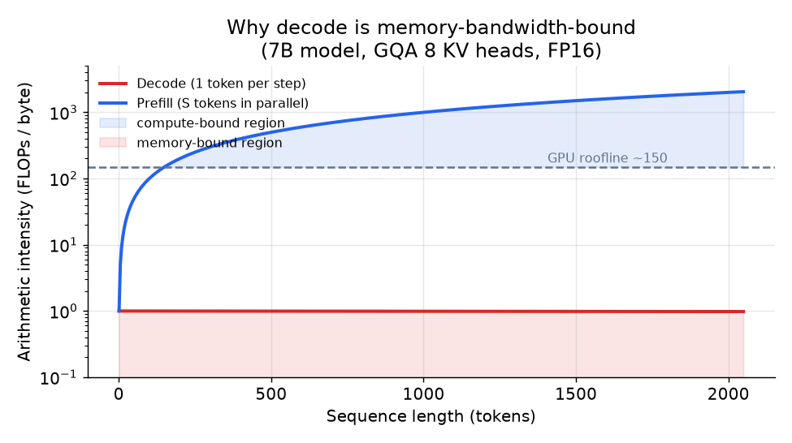

# 2. 成本模型

面试里把这一部分大声说出来。后面的设计都是在给它做注解。

## Prefill 对比 decode：两个问题，解法正好相反

服务一个 transformer 有两个阶段，它们贵的地方根本不一样。

**Prefill** 把整段 prompt 放进一次并行前向计算里处理。所有 prompt token 一起算，
同一次权重读取就摊到了全部 token 上。结果是算术强度很高：每从显存读一个字节，能做很多 FLOPs。
Prefill 是**受算力限制**的。它决定首 token 延迟，而且按 token 算相对便宜。

**Decode** 每一步只生成一个输出 token。每一步都要把整个模型和整个 KV cache 从 GPU 显存读一遍，
就为了吐出一个 token，再往 cache 里追加一对 key-value。做的活和读的字节之比小得可怜。
Decode 是**受显存带宽限制**的。它决定 token 间延迟，而且只要输出超过几个 token，成本就以它为主。

用算术把这件事落到实处。一个 FP16 的 7B 模型，一步 decode：

$$I_{\text{decode}} \approx \frac{2 N_{\text{active}}}{2 N_{\text{active}} + \text{kv-bytes}} \quad \text{FLOPs/byte}$$

```python
def decode_arithmetic_intensity(n_active, kv_bytes, bytes_per_param=2):
    # FLOPs = 2 per active param; bytes read = params (bytes_per_param each) + KV cache bytes
    flops = 2 * n_active
    bytes_read = bytes_per_param * n_active + kv_bytes
    return flops / bytes_read
# decode_arithmetic_intensity(7_000_000_000, 0) -> 1.0   (tiny cache: ~1 FLOP/byte, deeply memory-bound)
```

KV cache 很小的时候，$I_{\text{decode}} \approx 1$ FLOPs/byte。现代 GPU 大约要 150 FLOPs/byte
的显存带宽才能维持在受算力限制的区间。Decode 永远到不了那里，它一直待在受显存带宽限制的区域。
而 prefill 一次处理 $S$ 个 token：

$$I_{\text{prefill}} \approx S \cdot \frac{2 N_{\text{active}}}{2 N_{\text{active}}} = S \quad \text{FLOPs/byte}$$

```python
def prefill_arithmetic_intensity(seq_len):
    # prefill amortizes one weight read across seq_len tokens, so intensity scales with S
    return seq_len
# prefill_arithmetic_intensity(200) -> 200   (already past the ~150 FLOPs/byte roofline)
```

$S = 200$ 个 token 时算术强度就已经越过 roofline。到 $S = 4000$，prefill 已经是重度受算力限制了。



*Decode（红色）不管序列多长都远低于 GPU 的 roofline：它永远受显存带宽限制。
Prefill（蓝色）随 S 上升，越过虚线 roofline 进入受算力限制的区域。
图中假设 7B 模型、FP16、GQA（8 个 KV head）。示意图。*

## Cache 服务的那个注意力计算

Cache 的存在只因为一个运算。每一层把输入投影成 query、key、value，
让每个 query 和每个 key 打分，再对 value 做 softmax 加权求和。
因果掩码把未来位置的分数设成 $-\infty$，于是一个 token 只能看到自己和过去：

$$\text{Attention}(Q,K,V) = \text{softmax}\!\left(\frac{QK^{\top}}{\sqrt{d_{\text{head}}}} + M\right)V, \qquad M_{ij} = \begin{cases} 0 & j \le i \\ -\infty & j > i \end{cases}$$

```python
# x: (batch, seq, d_model);  n_head heads of size d_head = d_model / n_head
def causal_self_attention(x, Wq, Wk, Wv, Wo, n_head):
    B, S, _ = x.shape
    q, k, v = x @ Wq, x @ Wk, x @ Wv                 # each (B, S, d_model)
    q, k, v = [t.view(B, S, n_head, -1).transpose(1, 2) for t in (q, k, v)]  # (B, n_head, S, d_head)
    scores = (q @ k.transpose(-2, -1)) / k.shape[-1] ** 0.5   # (B, n_head, S, S)
    mask = torch.triu(torch.ones(S, S, dtype=bool), diagonal=1)
    scores = scores.masked_fill(mask, float("-inf"))          # block future positions
    out = scores.softmax(-1) @ v                              # (B, n_head, S, d_head)
    return out.transpose(1, 2).reshape(B, S, -1) @ Wo         # (B, S, d_model)
```

历史 token 的 `k` 和 `v` 在后面每一步都一模一样，重算就是纯浪费。把它们缓存起来，
每步注意力就从 $O(S^2)$ 的重算变成 $O(S)$ 的查表；缓存的张量正是上面这个 `k, v`，
这也就引出了接下来的体积公式。

## KV cache 是什么，为什么是它占大头

Transformer 逐个生成 token 时，必须对它见过的每一个 token 做注意力。
与其每一步都重算历史 token 的 key 和 value，不如存起来：存下来的这个张量就是 **KV cache**。
每生成一个 token，每一层就多一条记录，而且会话结束之前它只增不减。

体积公式值得背下来，因为它就是每一个长上下文显存问题的诊断书：

$$\text{kv-bytes} \approx 2 \cdot L \cdot S \cdot h_{\text{kv}} \cdot d_{\text{head}} \cdot b \cdot B$$

其中：

| 符号 | 含义 | 典型值 |
|---|---|---|
| $L$ | transformer 层数 | 32 |
| $S$ | 序列长度（prompt 加上目前为止的输出 token） | 32 000 |
| $h_{\text{kv}}$ | KV head 数 | 8（GQA）到 32（MHA） |
| $d_{\text{head}}$ | head 维度 | 128 |
| $b$ | 每个元素的字节数 | 2（FP16） |
| $B$ | batch 大小（一张 GPU 上的并发序列数） | 32 |

最前面的因子 2 是 K 和 V 各一份。

**算一个例子。** $L=32$，$S=100\,000$ 个 token，$h_{\text{kv}}=8$（GQA），
$d_{\text{head}}=128$，$b=2$（FP16），$B=1$ 条序列：

$$\text{kv-bytes} = 2 \times 32 \times 100\,000 \times 8 \times 128 \times 2 \approx 13.1 \text{ GB}$$

```python
def kv_cache_bytes(num_tokens, num_layers, num_kv_heads, head_dim, bytes_per_elem=2, batch=1):
    # 2 tensors (K and V) per layer, each num_kv_heads*head_dim elements per token
    return 2 * num_tokens * num_layers * num_kv_heads * head_dim * bytes_per_elem * batch
# kv_cache_bytes(100000, 32, 8, 128, 2) -> 13107200000   (about 13.1 GB for one 100k-token session)
```

一个 100k token 的会话，KV cache 就要 13 GB 以上。100 个并发会话就是 1.3 TB，远远超出任何单张 GPU。
而一个 7B 模型 FP16 的权重才 14 GB。**长上下文服务的硬约束是 cache，不是权重。**

所有杠杆都是冲着这个公式来的。要么缩小 $h_{\text{kv}}$（GQA，以及只留一个共享 KV head 的极端形态 MQA），
要么把整个 $h_{\text{kv}} \cdot d_{\text{head}}$ 项换成一个更小的 latent（MLA，multi-head latent attention），
要么缩小 $b$（KV 量化，每个缓存的数字用更少的位来存），
要么通过跨请求复用已缓存的工作来降低每个请求实际的 $S$（前缀缓存）。
