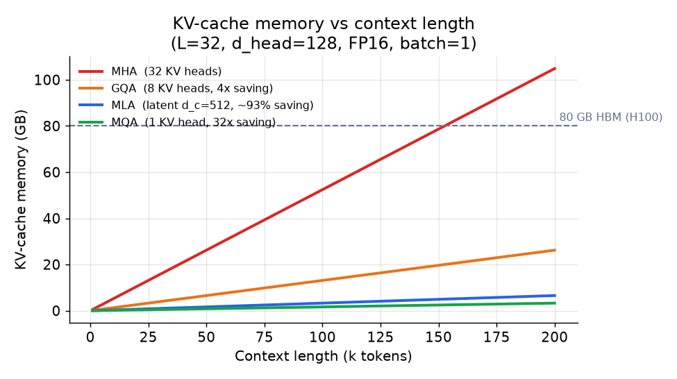
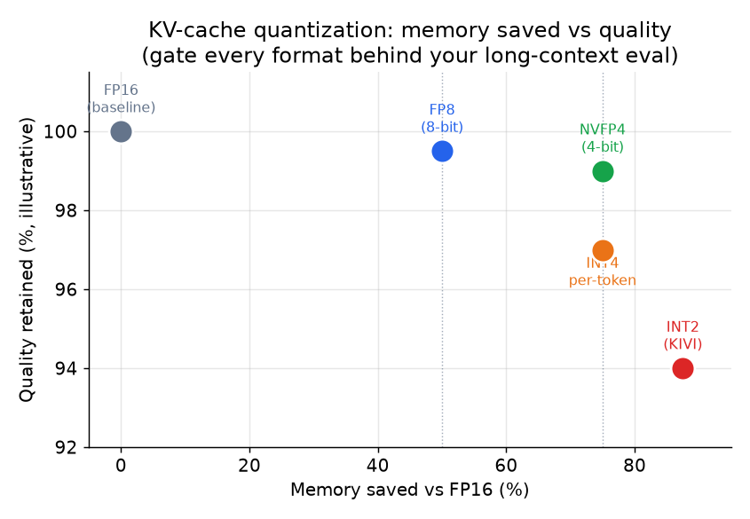

# 3. 把 cache 压小

有了成本模型，问题就变成：$\text{kv-bytes}$ 公式里我们去攻哪一项？
本节讲两大类：注意力架构的改动（训练时决定，攻 $h_{\text{kv}}$ 或者干脆把它换掉），
以及量化（服务时决定，攻 $b$）。

## 注意力架构这一类

本节四个变体都是训练时的选择。模型定了之后没法事后硬套上去
（GQA 是例外，可以从 MHA checkpoint 出发做 uptraining，花费大约是预训练成本的 5%）。

### 多头注意力（MHA）：基线

每个 query head 都有自己专属的 key head 和 value head。模型有 $h_q = 32$ 个 query head，
就有 $h_{kv} = 32$ 个 KV head。注意力模式最丰富，KV cache 也最大。其他几种都是拿它做参照来优化的。

### 分组查询注意力（GQA）：稳妥的默认选择

GQA 让 $g = h_q / h_{\text{kv}}$ 个 query head 组成一组，共用一个 KV head。
$h_q = 32$、$h_{\text{kv}} = 8$ 时，每 4 个 query head 读同一份 key 和 value：

$$r_{\text{GQA}} = \frac{h_{\text{kv}}}{h_q} = \frac{8}{32} = \frac{1}{4}$$

```python
def gqa_cache_ratio(h_kv, h_q):
    # cache shrinks in proportion to KV heads kept vs total query heads
    return h_kv / h_q
# gqa_cache_ratio(8, 32) -> 0.25   (GQA cache is one quarter of MHA)
```

KV cache 缩到 MHA 的四分之一，在大多数 benchmark 上质量损失可以忽略。
这就是为什么 Llama 3、Mistral、Gemma 和多数生产模型都默认用 GQA：
分组大小 $g = h_q / h_{\text{kv}}$ 是一个直接的"质量换显存"旋钮，
而且 GQA 能通过一小段 uptraining 从 MHA checkpoint 低成本转换过来（见 Ainslie 等人的 GQA 论文）。
别的都不做，也要做这一个。

落到实现上，GQA 就是 MHA，只不过 cache 里只放 $h_{kv}$ 个 head，
注意力计算时再把每个 head 复制到和 $h_q$ 个 query head 对齐（所以不会多存任何东西）：

```python
def gqa_attention(q, k, v):
    # q: (B, Hq, S, d);  k, v: (B, Hkv, S, d)  <- only Hkv heads live in the KV cache
    B, Hq, S, d = q.shape
    g = Hq // k.shape[1]                       # query heads sharing one KV head
    k = k.repeat_interleave(g, dim=1)          # expand Hkv -> Hq (a view, cache unchanged)
    v = v.repeat_interleave(g, dim=1)
    scores = (q @ k.transpose(-2, -1)) / d ** 0.5
    return scores.softmax(-1) @ v              # (B, Hq, S, d)
```

Cache 里存的 `k, v` 只有 `Hkv` 个 head，省下的就是这一块：`Hq=32`、`Hkv=8` 时，
存的张量是 MHA 的四分之一，`repeat_interleave` 在计算时临时展开，
只有那个短暂的展开视图占内存，cache 本身不变。

### 多查询注意力（MQA）：激进的一刀

MQA 是 GQA 走到极端：$h_{\text{kv}} = 1$，所有 query head 共用一个 KV head。
Cache 缩小 $h_q$ 倍，相比 MHA 常常是 32 倍。代价是可以测出来的质量下降，
尤其在需要细粒度上下文辨别的任务上。Character.AI 把 MQA 和其他技术叠着用，并且用评测把关。
只有在显存是硬墙、质量又有富余的时候，它才是一个合理的选择。

### 多头 latent 注意力（MLA）：DeepSeek-V2/V3 的架构

MLA 走的是另一条路。它不减少 KV head 的数量，而是把缓存的 key 和 value **整个换成**
每个 token 一个低秩的 **latent 向量**：

1. 每个 token 上，一个下投影把隐状态映射成一个小的 latent $c \in \mathbb{R}^{d_c}$
   （对 $h_{\text{kv}} \cdot d_{\text{head}} = 32 \times 128 = 4096$ 的模型，典型的 $d_c = 512$）。
2. 只缓存 $c$，不缓存完整的 KV 张量。
3. 算注意力时，一个上投影从 $c$ 重建出每个 head 的 key 和 value。

压缩比是：

$$r_{\text{MLA}} = \frac{d_c}{2 \cdot h_{\text{kv}} \cdot d_{\text{head}}}
  \approx \frac{512}{2 \times 32 \times 128} \approx 0.063 \quad (\approx 93\% \text{ smaller})$$

```python
def mla_compression_ratio(d_c, h_kv, head_dim):
    # cached latent of size d_c replaces the 2*h_kv*head_dim K and V elements per token
    return d_c / (2 * h_kv * head_dim)
# mla_compression_ratio(512, 32, 128) -> 0.0625   (about 94% smaller than MHA)
```

代价是每一步 decode 都要付一次小矩阵乘法来展开 latent。实践中这点开销相对省下的显存带宽很小。

**值得点名的 RoPE 细节。** 旋转位置编码（RoPE）是按位置施加到 key 上的。
但缓存的 latent 是不带位置的（它是下投影后的隐状态，还没展开成 key），
所以 RoPE 没法在缓存之前施加。DeepSeek 的解法是把 head 维度拆成两部分：
一个带 RoPE 的子维度按正常方式计算，另一个 latent 压缩的子维度走下投影/上投影。
两部分再拼回完整的 head。大多数随手画的 DeepSeek-V3 示意图要么悄悄跳过这一点，要么画错；
把它讲对是真正有深度的信号。

### 把几个变体放在一起看



*一个 32 层、FP16、$d_{\text{head}} = 128$、batch 为 1 的模型，KV cache 占用随上下文长度增长的情况。
MHA（红色）远不到 200k token 就填满一张 80 GB 的 H100。8 个 head 的 GQA（橙色）只用它的四分之一。
MLA 的 latent（蓝色）大约是 MHA 的 6%。单 head 的 MQA（绿色）cache 最小，但质量风险最高。示意图。*

**什么时候用哪种注意力变体。**

| 选它 | 什么时候 | 什么时候别选 |
|---|---|---|
| MHA | 质量压倒一切、上下文短、cache 不是瓶颈 | 四个里 cache 最大；长上下文或高并发服务时跳过 |
| GQA（Llama 3、Mistral） | 想要一个在大多数模型规模下都稳妥的默认选择：接近 MHA 的质量，cache 小 4 到 8 倍，uptraining 便宜 | cache 比例在训练时就定死；显存真成了墙就换 MLA |
| MQA | 并发和成本目标极端，每层只留一个 KV head 可以接受 | 质量风险是真的；上线前先在自己的评测上验证 |
| MLA（DeepSeek-V2/V3） | 训练在自己手里，而且 KV cache 是长上下文的硬约束 | 训练时改动，还要加 RoPE 拆 head 的修补；不是服务时能外挂的 |

**出处。** MHA 是 Transformer（Google，2017）最初的多头注意力；MQA（Google，2019）把它坍缩成一个共享 KV head；
GQA（Google，2023）是折中方案，现在是多数开源模型的默认；MLA（DeepSeek，2024）把 KV 压缩成一个共享的低秩 latent。
MLA 需要的 RoPE 拆 head 细节来自 RoPE（Su 等人，2021）。

## 量化的 KV cache：服务时的杠杆

如果服务的是一个没法重训的模型，量化 KV cache 就是唯一还能动的架构杠杆。
存下来的 key 和 value 用更少的位表示；注意力在反量化之后以更高精度计算。

显存节省是：

$$r_{\text{quant}} = \frac{b_{\text{low}}}{b_{\text{high}}} \quad \Rightarrow \quad
  \frac{4}{8} = \frac{1}{2} \Rightarrow 2\times \text{ context, batch, or concurrency (FP8 to NVFP4)}$$

```python
def quant_memory_ratio(bits_low, bits_high):
    # cache memory scales linearly with bits stored per element
    return bits_low / bits_high
# quant_memory_ratio(4, 8) -> 0.5   (FP8 to NVFP4: half the memory, 2x the context)
```



*常见 KV 格式的显存节省（横轴）与质量保留（纵轴）。FP8 把显存砍半，质量几乎不掉。
NVFP4（NVIDIA 的 4 位格式）在此基础上再省 2 倍，标准 benchmark 上损失不到 1%。
INT2（KIVI 方案）显存节省逼近 88%，但需要小心的 per-channel key 缩放，
再加一个全精度的近期 token 窗口来控制退化。每一种格式都要用自己的长上下文评测把关。示意图。*

**实践要点。** Key 往往比 value 更敏感；对两者做非对称量化，或者给 key 比 value 更多的位宽，
能追回大部分质量差距。给最近的 token（模型注意力最集中的那部分）保留一个全精度窗口，
能降低检索类任务上的误差。NVIDIA 的 NVFP4 在注意力矩阵乘之前先反量化到 FP8，
既保住精度，又比 FP8 cache 再省一半显存。

**为什么 key 比 value 更难量化（机制）。** 这个不对称不是江湖传说，它来自两个张量的结构。
Key 向量里有少数几个 channel（固定的 embedding 维度），几乎在每个 token 上幅值都很大，
这种离群 channel 模式是单个 per-tensor 或 per-token 缩放没法表示的，除非把正常 channel 压扁到只剩几个量化等级。
Value 没有这种固定的大幅值 channel。KIVI（Liu 等人，2024）的答案是 key 按 channel 量化
（每个 embedding 维度一个缩放，离群 channel 就有了自己的范围），value 按 token 量化（每个 token 一个缩放）；
这就是为什么把两个张量一视同仁的朴素对称方案会丢精度，而 per-channel 处理 key 能把它追回来。
RoPE 会放大这个效应：它按位置旋转 key 的 channel，序列变长时离群能量会在 channel 之间移动，
这也是为什么给近期 token 留一个全精度窗口，比把同样的位预算花在别处更能保住检索能力。

**什么时候用哪种量化。**

| 选它 | 什么时候 | 什么时候别选 |
|---|---|---|
| FP8 KV（Character.AI，原生） | 训练流水线原生 FP8；零事后成本 | 训练后做 FP8 PTQ 需要 per-channel 缩放和定制 kernel |
| NVFP4（NVIDIA TensorRT-LLM） | 长上下文显存是墙，而且已经过了长上下文评测 | 质量余量很薄；"不到 1% 的损失"取决于 benchmark |
| INT4 per-token（Hugging Face） | 模型固定没法重训；显存预算紧 | 凭感觉上线；先在自己的数据上测困惑度和检索 |
| INT2（KIVI） | 显存预算极端激进；研究场景 | per-channel key 缩放加全精度窗口，增加服务复杂度 |

**出处。** 和上面的注意力变体不同，这些是服务时的格式，不是架构改动。NVFP4 随 TensorRT-LLM（NVIDIA）发布；
FP8 KV、INT4 per-token 和 INT2（KIVI）在文中分别归到 Character.AI、Hugging Face 和 KIVI 方案。

## KV cache 淘汰与稀疏化：留下（或者只看）更少的 token

架构（GQA/MLA）和量化压的是*每个 token* 的成本。第三根杠杆压的是真正要紧的 token 的*数量*，
利用的是注意力本身是稀疏的这个事实：大多数步骤上，大多数历史 token 拿到的注意力权重几乎为零。

- **StreamingLLM（attention sink）** 只保留最前面几个 token（softmax 会把大量权重倾倒到这里，
  所以叫"attention sink"）加一个近期的局部窗口，中间的丢掉。它让模型在有限的 cache 下无限流式生成，
  但被丢掉的中间部分是真的忘了（Xiao 等人，MIT，2023，[arXiv:2309.17453](https://arxiv.org/abs/2309.17453)）。
- **H2O（heavy hitter）** 按累计注意力淘汰：在固定预算下，留下到目前为止拿到最多注意力的 token（"heavy hitter"）
  加上近期 token（Zhang 等人，2023，[arXiv:2306.14048](https://arxiv.org/abs/2306.14048)）。
- **SnapKV** 在生成开始前，看 prompt 末尾一个观察窗口里的注意力，决定留下哪些 prompt token，
  一次性把 prompt 的 KV 压缩掉（Li 等人，2024，[arXiv:2404.14469](https://arxiv.org/abs/2404.14469)）。
- **Quest（query 感知稀疏）** 完全不淘汰：cache 全留，但每一步只按 query 对页面摘要的打分加载 top-k 相关的页，
  什么都不丢，计算量却降下来了（Tang 等人，2024，[arXiv:2406.10774](https://arxiv.org/abs/2406.10774)）。

面试里最关键的区分：**淘汰是有损的**（StreamingLLM、H2O、SnapKV 会丢 token，
后面再问到被丢掉的 token 就答不上来），而 **query 感知稀疏**（Quest）什么都留着，只是跳过不读，
用显存换精确。Cache 真的放不下、而且负载能容忍忘掉旧上下文时，用淘汰；
必须保持精确、但 decode 又受带宽限制时，用稀疏加载。
