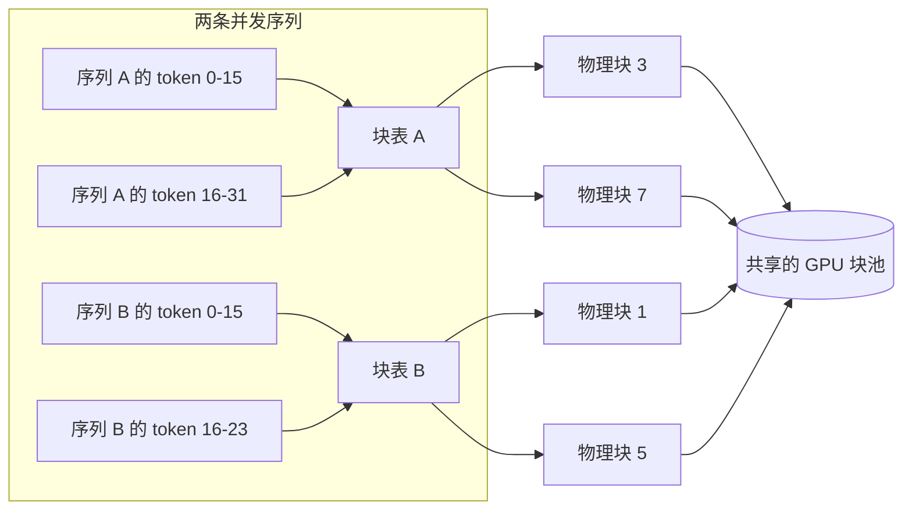
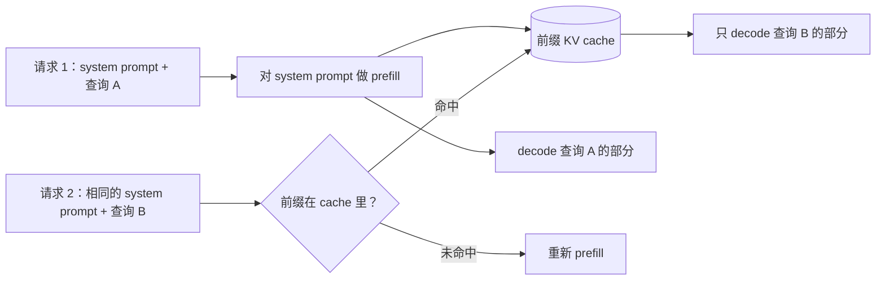

# 4. 分页与共享

缩小每条 KV 记录解决的是问题的一个维度：单个 token 的成本。
下一个维度是碎片和复用：怎么在同样的显存里塞进更多序列，
以及怎么避免跨请求为相同的前缀重复算 cache。

## PagedAttention：给 KV cache 上虚拟内存

在朴素的推理系统里，每条序列的 KV cache 是请求到达时预留的一整块连续 buffer。
这会产生两种浪费。第一，序列可能用不满整块空间（内部碎片：buffer 尾巴空着）。
第二，释放后的 buffer 留下的空洞装不下别的尺寸（外部碎片）。
在长度参差不齐的混合负载下，碎片能浪费掉 20% 到 40% 的 GPU 显存。

```python
def internal_fragmentation(num_tokens, block_size):
    # fraction of the last block that sits empty when the cache is stored in fixed blocks
    slots = ((num_tokens + block_size - 1) // block_size) * block_size
    return (slots - num_tokens) / slots
# internal_fragmentation(70, 16) -> 0.125   (5 blocks = 80 slots hold 70 tokens, 12.5% wasted)
```

**PagedAttention**（vLLM 的核心想法）的解法，是像操作系统管理虚拟内存那样来管理 KV cache：

- Cache 被切成固定大小的**块**（比如每块 16 或 32 个 token）。
- 每条序列有一张**块表**，把逻辑 token 位置映射到散落在 GPU 显存任何位置的物理块。
- 内容相同的序列共享块；分叉时用带引用计数的写时复制来处理。
- 序列结束时，它的块一个个归还给块池，不留下没法用的空洞。



**这张图怎么读。** 这套流程借的是操作系统虚拟内存的招。每条序列的 token 被分成固定大小的逻辑块
（比如每块 16 个 token）。序列拿到的不是一块连续 buffer，而是一张**块表**，
一个把它的逻辑块编号映射到共享 GPU 池中某个**物理块**的数组，
跟操作系统页表把虚拟页映射到物理页帧一模一样。
序列需要新块时，从池里随便抓一个空闲的物理块（不必挨着上一块），
所以池子永远不会碎：分配按块、按需进行，释放一条序列就是把它的块还回池里。
需要改的是注意力 kernel：它在计算注意力时要读块表，把散落各处的 K 和 V 块收集起来，
而不是假设有一段连续内存。两条序列的块表甚至可以指向**同一个**物理块，
这正是共享的 prompt 前缀（下一节）只存一份、反复复用的方式。

结果是：和 FasterTransformer 那种连续分配相比，同样延迟下吞吐提高 2 到 4 倍，
因为同样的 GPU 显存能装下更多并发序列。PagedAttention **不会**让单个请求变快；
它提高的是总并发和 token 吞吐。汇报时要用整个集群的每秒 token 数，而不是单请求延迟。

## 前缀缓存：重复的前缀跳过 prefill

在一个 system prompt 固定为 4k 的 RAG 系统里，每个请求一开始都要为这 4000 个 token 重建同一份 KV cache。
这是纯粹的浪费。**前缀缓存**（也叫 prompt caching）把一个已完成前缀的 KV 块序列存下来，
在共享同一前缀的请求之间复用。匹配上的 token 完全跳过 prefill 阶段；
模型直接跳到每个请求独有部分的 decode。



**它怎么工作。** 第一个请求对它的 system prompt 做 prefill，decode 完之后不丢弃那些 key 和 value，
而是以 token 序列为键存进前缀 KV cache。第二个请求带着同一份 system prompt 到来时，
先查一下这个前缀是否已经缓存。命中的话，共享 token 那部分昂贵的 prefill 整个跳过，
decode 直接从缓存状态开始，只需要算查询 B 独有的后缀。未命中就退回从头 prefill，
成本和没有缓存时一样。整个收益建立在共享前缀逐字节完全一致上，
所以这个分支是硬性的命中或未命中，而不是部分匹配。

收益取决于负载。Databricks 在 30% 命中率下测到每副本输入 token 吞吐提高 2.5 倍、P50 延迟降低 3 倍。
Anthropic 报告在缓存的上下文很大时，成本最多降 90%、延迟最多降 85%。

**精确前缀匹配**是关键约束。前缀里任何位置有一个 token 不同，从那个 token 开始就完全未命中。
这意味着：永远把稳定的内容（system prompt、共享文档）放在 prompt 的最前面，
放在任何随请求变化的内容之前。常见的错误是把用户相关的变量放得太靠前，
结果每个请求都命不中缓存。

多轮对话里，前缀缓存可以逐轮施加：每一轮交流都延长前缀，并且可以缓存起来供下一轮用。
Character.AI 用一棵以对话前缀为键的滚动哈希 LRU 树实现了这一点，整个集群的命中率约 95%。

## RadixAttention：分叉树的前缀缓存

当多个请求共享的不只是一个固定前缀，而是一棵**分叉的**前缀树
（带很多示例的 few-shot prompt，或者一个基础上下文扇出成许多并行子任务的 agent 工作流），
扁平的前缀缓存只能匹配一条链。基数树能抓住完整的分叉结构。

**RadixAttention**（SGLang）把 KV 块池组织成一棵基数树，每条边是一段 token 序列，每个节点是一个缓存的 KV 块。
新请求沿着树往下走，跟着匹配它 token 的边，在第一个不匹配处分出一条新边。
显存压力下用 LRU 淘汰，保住最近访问过的路径。跨请求的缓存共享自动发生，用户 API 一点不用改。

## 对比：前缀缓存与 KV cache 淘汰

两种技术都让 KV cache 变便宜，也经常被同一句话描述（"我们在 cache 里少放点东西"），所以容易混。
但机制方向正相反：前缀缓存是避免重算模型还会用到的记录，
淘汰是把记录扔掉，接受模型再也读不到它们。

| 维度 | 前缀缓存 | KV cache 淘汰（StreamingLLM、H2O、SnapKV） |
|---|---|---|
| 共同目标 | 降低每个请求的 KV cache 成本 | 降低每个请求的 KV cache 成本 |
| 去掉的是什么 | 已缓存 token 上多余的 prefill 计算 | 被判定为不重要的 token 的存储记录 |
| 对模型输出的影响 | 无；复用的块和重算的结果逐位相同，所以是无损的 | 有损；后面问到被淘汰的 token 就答不上来 |
| 靠什么赢 | 跨请求的冗余：共享的 system prompt、文档或对话历史 | 注意力的稀疏性：多数旧 token 的权重接近零 |
| 失败模式 | 流量全是唯一内容，cache 永远命不中，白白付记账开销 | 负载问到被丢掉的中间部分，质量悄悄下降 |
| 显存行为 | 显存可能增长（缓存的前缀会留着等复用） | 显存从构造上就是有界的 |

这个差别在需要决定显存压力下怎么办时会改变设计：
召回要求严格的负载（在一篇长文档上做检索）可以用前缀缓存，但绝不能用淘汰；
而一个只需要近期上下文的无限流式对话，可以用淘汰来封顶显存，把前缀缓存当成上面可选的加速器。

**什么时候用哪种分页或共享技术。**

| 选它 | 什么时候 | 什么时候别选 |
|---|---|---|
| PagedAttention（vLLM、TGI、SGLang） | 碎片是硬约束；请求长度差别很大 | 块间接寻址多一次查表；要把它融进注意力 kernel |
| 前缀缓存（vLLM、Databricks、Anthropic） | 一大段固定的 system prompt 或文档在请求间重复 | 每个请求的上下文都不一样；cache 永远命不中 |
| RadixAttention（SGLang） | 请求共享分叉的前缀：few-shot、agent 树、并行链 | 前缀太分散会让缓存收益归零；流量高度多样时 LRU 会抖动 |
| 逐轮对话缓存（Character.AI 滚动哈希） | 长对话产品，轮次复用很重；100 轮以上的历史 | 短暂或一次性的对话，复用很低 |

**出处。** PagedAttention 源自 vLLM（UC Berkeley，2023），它把操作系统式的块分页带进了 KV cache；
RadixAttention 是 SGLang 对它的前缀树推广；前缀缓存和 Character.AI 的滚动哈希方案已在上文随文标注。
