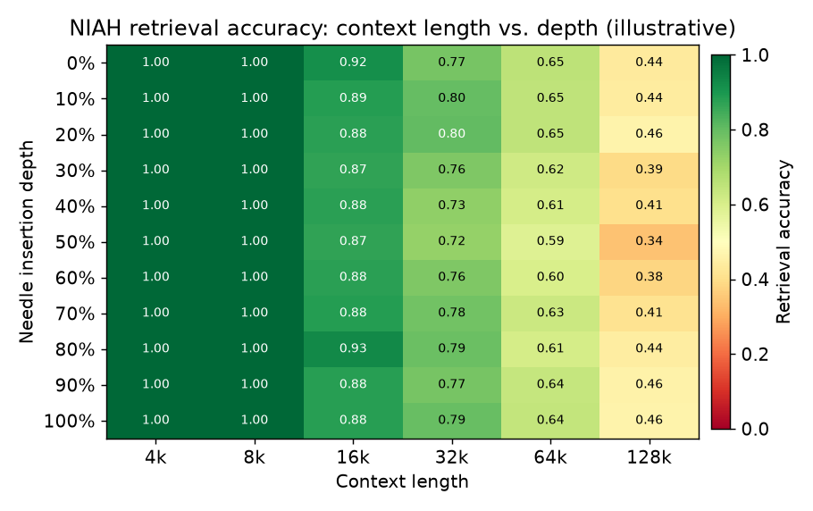

# 5. 长上下文

服务 128k token 不只是显存问题。注意力机制本身得能在这么长的范围上正确地做注意力。
大多数基座模型训练时用的序列，比它们上线后要服务的上下文短得多。
本节讲各团队怎么在不从头重训的前提下把这个范围扩出去。

## 位置信息是怎么进入注意力的

自注意力本身对排列是不变的：把 token 打乱，$QK^{\top}$ 的分数不变。
位置必须额外注入，主流有三种方案。值得了解，因为长上下文扩展全都在围绕第三种做文章：

| 方案 | 机制 | 能超出训练长度吗？ |
|---|---|---|
| 可学习的绝对位置（GPT-2） | 每个位置编号一个可训练向量，加到 token embedding 上 | 不能，训练时没见过的编号没有对应向量 |
| 正弦位置编码（原版 transformer） | 位置在几何级频率上的固定 sin/cos，加到 embedding 上 | 很差，数值有定义，但外推不可靠 |
| RoPE（旋转位置编码，多数现代基座） | 把 $Q$ 和 $K$ 旋转一个与位置成正比的角度，点积只依赖相对偏移 | 能，通过频率缩放，下文的 PI 和 YaRN 做的就是这个 |

RoPE 是重点。它把 query 和 key 向量的每个二维切片在位置 $m$ 处旋转 $m\theta_i$ 的角度，
各维度的频率是 $\theta_i = 10000^{-2i/d}$。位置 $m$ 的 query 和位置 $n$ 的 key 分别被旋转了
$m\theta_i$ 和 $n\theta_i$，所以它们的点积只依赖相对偏移 $m - n$。
正是这个相对性质，让我们可以重新缩放位置编号（后面几节），把更长的上下文塞进模型已经理解的角度范围里。

## 为什么位置编码在长上下文下会失效

Transformer 注意力之所以感知位置，要么是因为 key 和 query 在点积前按一个与位置相关的角度旋转（RoPE），
要么是因为注意力 logits 上加了一个位置偏置（ALiBi）。
不管哪种，模型学到的是"第 500 个位置的 token"意味着什么，而这种学习锚定在训练分布上。
让模型去推理"第 100 000 个位置的 token"，它就处在分布之外了。困惑度飙升，对早期上下文的召回崩掉。

## 位置插值：最简单的修法

**位置插值**（PI，Meta，2023）把更长的上下文重新映射回原来的训练位置，做法是缩放所有位置编号：

$$\text{pos}_{\text{scaled}} = \text{pos} \times \frac{L_{\text{train}}}{L_{\text{target}}}$$

128k 上下文里第 65 536 个位置的 token，会被当成 8k 训练模型里第 4 096 个位置。
模型永远见不到超出范围的位置编号。代价是相邻的 token 被压到了一起，短程的有效分辨率下降，
依赖精确局部定位的任务可能会受损。

插值之后，一小段微调（在长序列上 1 000 到 10 000 个梯度步）就足以恢复质量。
不微调，这个方法也仍然好过朴素外推。

## YaRN：更好的长上下文扩展

**YaRN**（Yet another RoPE extensioN，Mistral，2023）在普通位置插值之上做了改进，
施加**随频率变化的缩放**：编码细粒度局部位置的高频 RoPE 维度不压缩，
编码全局位置的低频维度才做插值。另有一个温度参数重新缩放注意力 logits，
防止 softmax 分布在超长范围上坍缩。

实践中 YaRN 能把上下文扩 8 到 16 倍，质量曲线比普通 PI 更细腻：短程任务掉得更少，长程召回提升更多。
Mistral-7B-v0.2 从 8k 扩到 32k 用的就是它，社区里不少模型扩展也用它把 Llama 推过 128k。

## 滑动窗口注意力：拿召回换固定的 cache

**滑动窗口注意力**把每个 token 的注意力限制在最近的 $W$ 个 token 上，而不是整条序列。
每层的 KV cache 随 $W$ 增长而不是随 $S$ 增长，所以不管上下文多长，显存都是有界的。

经典的取舍：落到窗口外的 token 就丢了。对很多生成任务这没问题（下一个 token 主要取决于近期上下文），
但对文档检索或问答就是错的，因为答案可能在文档的任何地方。

Mistral 7B 在大多数层用 4 096 token 的滑动窗口，在网络深处配几个全注意力层。
这种混合以很低的成本提供了长程连通性。

**Attention sink（StreamingLLM，MIT/Meta，2023）** 把这个想法又推进一步：保留一个小的近期 token 窗口，
再加上最前面几个"sink" token（位置 0 到 3），模型的注意力权重会不成比例地落在这几个 token 上，
即使它们的内容并不直接相关。把 sink 固定住，配一个近期 token 的滑动窗口，
模型就能在固定的 KV 预算下流式生成到数百万 token。坑在于：上下文的中间部分是真的没了，从里面检索会失败。

## 分块 prefill：长 prompt 的 prefill 不 OOM

即使模型在架构上能处理 128k token，GPU 在 prefill 阶段也得为这全部 128k 个 token 算出 KV cache。
batch 大的时候一次算完可能超出 HBM 容量。**分块 prefill** 把 prompt 切成块（比如每块 4k token）顺序处理，
每块的 KV 输出作为下一块的输入复用。prefill 期间的显存占用被限制在块大小上，而不是整个上下文。

代价是：本来可以一次并行算完的事，分块 prefill 把它串行化了，所以首 token 延迟更长。
既要高并发（偏向分块以限制峰值显存）又要低首 token 延迟（偏向一次算完）的系统，
会按自己的流量结构调块大小。SGLang 和 vLLM 都暴露了这个旋钮。

## 评估位置扩展

两个指标能确认一种扩展技术带来的是真实的召回，而不只是恢复了困惑度。

**困惑度**（PPL）是每 token 平均负对数似然的指数：

$$\text{PPL} = \exp\!\left(-\frac{1}{N}\sum_{i=1}^{N}\log p(x_i \mid x_{\lt i})\right)$$

输入：目标上下文长度上的一段留出 token 序列。超过原始训练长度后 PPL 飙升，是位置扩展失败的第一个信号。
PPL 在训练期间是一个快速的连续信号，但会饱和：模型可以恢复正常的 PPL，却仍然从长上下文中间检索不出事实。
训练稳定性用 PPL 把关；能不能上生产用检索召回把关。

**NIAH 召回**（大海捞针）是在测试网格的每个（上下文长度，插入深度）格子上，
植入的事实被正确检索出来的比例。输入：一篇很长的填充文档，在固定位置插入一条已知事实，让模型把它复述出来。
过了 PPL 却过不了 NIAH，是浅层位置扩展之后的标准失败模式：局部的下一 token 预测没问题，
但对远处位置的注意力是坏的。召回要按长度和深度画成二维热力图；
中段凹陷（深度 50% 附近召回最差）是信息量最大的信号，也是平均分会藏起来的那个。
多针、变量追踪和聚合类任务用 RULER，它能把有效上下文长度和配置的上下文长度区分开
（继续预训练一章有讲）。

*NIAH 怎么读：每个格子是把"针"植入填充文档该深度比例处、在该上下文长度下检索的准确率。
绿色接近完美召回；红色接近零。能看到两种失败模式：向右（长上下文）召回下降，
以及中段深度处的凹陷，因为落在远处中间位置上的注意力权重最低。单个平均分会把这两个效应都藏起来。示意图。*

**什么时候用哪种长上下文技术。**

| 选它 | 什么时候 | 什么时候别选 |
|---|---|---|
| 位置插值加微调 | 在现有 checkpoint 上扩 2 到 4 倍上下文，且能跑一小段微调 | 朴素外推，基本不管用或者完全不管用 |
| YaRN | 扩 4 到 16 倍，质量曲线比普通 PI 更好；多数开源模型分支都有 | 微调配方更重；需要免训练直接替换时跳过 |
| 滑动窗口注意力（Mistral、Databricks MixAttention） | 无限长或超长序列，丢掉上下文中间部分可以接受 | 需要整篇文档召回的问答或检索任务 |
| Attention sink（StreamingLLM） | 真正流式、永不结束的对话；显存不能增长 | 任何需要召回最近窗口之外内容的任务 |
| 分块 prefill（SGLang、vLLM） | 超长 prompt，在目标 batch 大小下一次性 prefill 会 OOM | 短 prompt，分块只会增加延迟开销而没有收益 |

**出处。** 这些扩展都建立在 RoPE（Su 等人，2021）之上：位置插值来自 Meta（2023），
通过重新缩放 RoPE 频率来适配现有 checkpoint；YaRN（2023）细化了逐频率的缩放策略。
ALiBi（Press 等人，2022）是另一条线性偏置的路线，不重训就能外推。
分块 prefill（SGLang、vLLM）是调度技术，不是位置方法。
