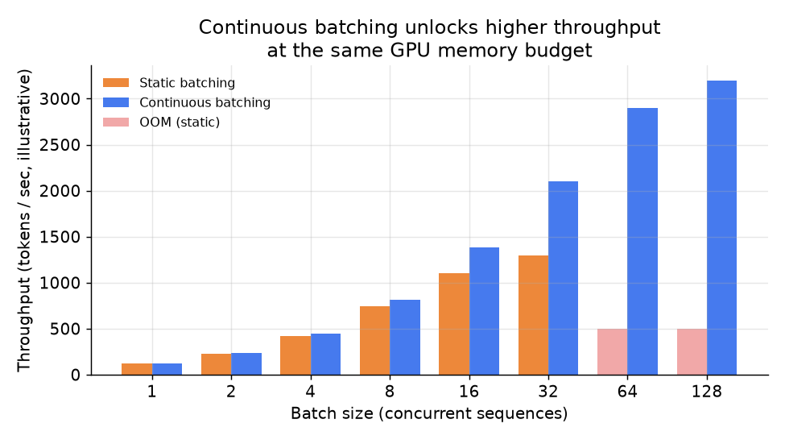

# 6. 服务与扩展

前面几节是从单条记录的层面上打 KV cache 的主意：把每条记录压小、把 cache 分页、跨请求复用。
这一节讲系统层面的决策，它们决定了一个 GPU 节点到底能扛住多少请求，以及下一个瓶颈会出现在哪。

## 连续批处理：吞吐上的第一笔收益

朴素的服务循环里，batch 攒一次就固定了，GPU 要等这一批里所有请求都跑完才开始下一批。
长请求把短请求堵住，batch 里长短不齐的时候 GPU 利用率直接塌掉。

**连续批处理**（也叫 in-flight batching）把这个约束拿掉了。
服务端维护一个还在跑的 decode 步骤池，每走一个 token 步，跑完的请求退出，
新请求在 token 粒度上插进来。每一个 GPU 步都把所有活跃序列往前推一个 token，
跟各个请求什么时候到没关系。在混合负载下，这一项相比静态批处理常常能把吞吐翻一到两倍。

代价是：KV cache 现在得同时装下所有活跃序列，于是显存变成了真正的约束。
这也正是 PagedAttention（让 cache 紧凑）、KV 量化（把每条记录压小）、
GQA（一开始就少存几条）存在的理由。

*静态批处理（橙色）与连续批处理（蓝色）的吞吐曲线示意。静态批处理在中等 batch 大小上就撞上 OOM 墙（红色柱），
因为每个请求都要求一整块连续分配，把所有并发序列的完整 KV cache 都装下。
连续批处理配上分页显存，可用区间明显往右扩了一大截。*

## 投机解码：把昂贵的 decode 步骤减少

decode 之所以贵，恰恰是因为每一步只出一个 token：一次穿过全部参数的完整前向，
外加一次完整的 cache 读取。**投机解码**（speculative decoding，也叫 assisted generation）把这件事重新组织了一下：

1. 一个小而便宜的 **draft 模型**用 $k$ 个串行步骤提出一段 $k$ 个 token 的草稿（因为 draft 模型很小，这几步很快）。
2. 大的 **target 模型**在一次并行前向里验证全部 $k$ 个候选 token（跟 prefill 类似，只不过跑的是 $k$ 个 token 而不是整条 prompt）。
3. 接受最长的那一段正确前缀，剩下的丢掉，然后重复这个过程。

只要 draft 模型和 target 模型经常意见一致，一次昂贵的 target 模型步骤就能换来好几个被接受的 token。
净效果是：产出同样多的内容，走昂贵 decode 循环的次数更少了。

收益高低取决于 draft 的准确率。在结构化输出上（代码、模板、格式固定的回复）接受率可以非常高；
在开放式创作文本上会掉得很厉害。投机解码最划算的场景是中低 batch 大小、target GPU 还没跑满的时候；
batch 非常大时，draft 模型那点额外算力只会增加开销，并不能解开显存这个结。

## 瓶颈以及怎么诊断

| 瓶颈 | 最先看到的现象 | 根因 | 修法 |
|---|---|---|---|
| 高负载下 OOM | 请求排队，显存打满 | 并发的长会话的 KV cache 超过了 HBM | 限制并发序列数；把 cache 分页；量化 KV；缩短序列长度 |
| token 间延迟高 | p99 decode 延迟超预算 | decode 受显存带宽限制，cache 随 S 增长 | 压小 cache（GQA、MLA、量化）；减小活跃 batch；淘汰陈旧会话的 KV |
| 首 token 延迟高 | 用户等第一个 token 等很久 | 长 prompt 的 prefill 慢；前缀缓存没命中 | 前缀缓存；分块 prefill；prefill 受算力限制时加大并行度 |
| 吞吐在很小的 batch 上就到顶 | GPU 没喂饱，并发请求很少 | 静态批处理；被长序列堵住 | 换成连续批处理 |
| 量化之后质量下降 | 困惑度或检索评测变差 | 这个任务上 KV 量化的位数给得太低 | 提高位数；保留一段全精度窗口；key 的量化比 value 保守一些 |
| 集群里单节点前缀缓存不命中 | 规模上去之后命中率低于预期 | 前缀缓存是按节点存的；请求没有被路由到持有其前缀的那个节点 | 缓存感知路由（llm-d 的做法）；分布式前缀缓存 |

其中两行值得展开说。"高负载下 OOM"和"吞吐到顶"是分页这件事的一体两面：
分页这个修法（PagedAttention，来自 UC Berkeley 的 vLLM，2023）让我们能把碎片控制住，
连续批处理（来自 Orca，OSDI 2022）才敢把活跃 batch 往上推而不至于翻进 OOM。
实践中这两根杠杆是一起上的。"token 间延迟高"那一行则是最容易被误诊成算力问题的：
decode 受显存带宽限制，是因为每一步都要把整个 KV cache 重读一遍，
所以修法全都是压小 cache（GQA，Google 2023；或者 MLA，DeepSeek 2024）或者淘汰 cache，
而不是加 FLOPs。这里把 batch 调大只对吞吐有用，对单 token 延迟没用，
这也是为什么这两行要往不同的旋钮上拧。

## 实现和训练上的坑

上面那张瓶颈表诊断的是一个节点在哪里饱和；下面这些则是实现层面的错误，
它们往往远在触及 roofline 之前就让 KV cache 出问题，而且多数表现为正确性 bug，不只是性能问题。

| 问题 | 症状 | 修法 |
|---|---|---|
| 并发下 KV 涨爆显存 | 连续批处理放进来的序列超过 HBM 能装下的量，请求在 decode 中途被抢占 | 限制并发序列数，把 cache 分页，给每个请求设 KV 预算上限，量化 KV |
| 连续分配导致碎片 | 远没到理论容量就 OOM，同时大片 HBM 被预留却没用上 | 基于块的分配（PagedAttention），让序列按固定页增长，而不是一次连续预留 |
| 前缀缓存跨越信任边界共享 | 一段缓存的前缀被匹配给了不该看到它的请求（不同租户或不同 system prompt） | 前缀缓存按租户和 prompt 哈希建键；绝不跨认证或信任边界共享块 |
| 淘汰了活跃会话 | 一个正在进行的对话丢了 cache，只能重新 prefill，首 token 延迟飙升 | 按最近访问时间淘汰（LRU），保护在途序列，只回收真正闲置的会话 |
| KV 量化位数给得太低 | 开了 KV 量化之后长上下文或检索评测退化 | 提高位数，key 的量化比 value 保守一些，保留一段全精度的近期窗口，改动要过评测门禁 |
| GQA/MQA 头数对不上 | 服务引擎加载了错的 n_kv，输出乱码或者直接加载报错 | 让 n_kv_heads 和训练好的 checkpoint 对上；GQA/MQA 是训练期的选择，不是服务端的开关 |
| 滑动窗口把需要的 token 淘汰掉了 | 模型忘掉前面的上下文，长文档上表现变差 | 按任务定窗口大小，保留 attention sink token，不要把窗口压到任务需要的量以下 |
| 集群里按节点存的前缀缓存 | 规模一上去命中率崩了，因为请求没被路由到持有其前缀的节点 | 做缓存感知路由，让请求落到有它前缀的那个节点上；或者上分布式前缀缓存 |

贯穿这些坑的一条线是：cache 是共享的可变状态，所以这里面大部分问题问的是
"谁被允许复用某个块"和"显存吃紧时保哪条序列"，而不只是体积本身。
