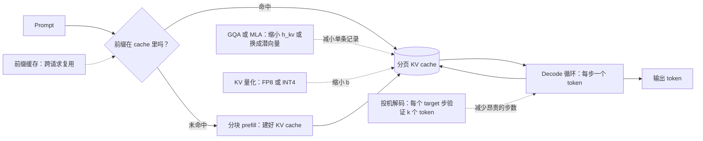

# 9. 小结

## 一页回顾

- **长上下文下吃显存的是 KV cache，不是模型权重。** 一个 32 层 GQA 模型上、FP16、
  单条 100k token 的会话，cache 就要 13 GB 以上。同一个模型的权重是 14 GB。
  并发 100 条会话时权重还是 14 GB，cache 却是 1.3 TB。这个公式要背下来：
  $\text{kv-bytes} \approx 2 \cdot L \cdot S \cdot h_{\text{kv}} \cdot d_{\text{head}} \cdot b \cdot B$。

- **decode 受显存带宽限制，prefill 受算力限制。** 每一步 decode 都要把整个模型加整个 cache
  读一遍，才吐出一个 token（大约 1 FLOPs/byte，远在 GPU 的 roofline 之下）。
  prefill 是一次处理 $S$ 个 token，共享同一次权重读取（约 $S$ FLOPs/byte）。
  该拉哪根杠杆取决于哪个阶段是墙，先 profile。

- **压小每条记录：要么靠架构（训练期），要么靠量化（服务期）。** GQA 是安全的默认值：
  质量接近 MHA，cache 缩 4 到 8 倍，uptraining 成本很低。
  MLA（DeepSeek-V2/V3）用潜向量替掉 K/V，压得更狠（约 93%），
  但需要在训练时就把 RoPE 分头的修正烙进去。
  KV 量化（FP8、NVFP4、INT4）是给重训不了的模型准备的外挂选项，
  上线前一定要用自己的长上下文评测把关。

- **用分页消灭碎片，用前缀缓存消灭重复的 prefill。** PagedAttention（vLLM）
  像操作系统的虚拟内存一样管理 KV 块，在同等显存下把并发翻一到两倍。
  前缀缓存对任何重复出现的前缀（system prompt、共享文档）跳过 prefill，
  这是 RAG 聊天机器人上首 token 延迟的最大一笔收益。
  到了集群规模，还得配缓存感知路由才能守住命中率。

- **长上下文要的不只是显存，还有位置扩展。** 朴素的 RoPE 外推超出训练长度就废了。
  YaRN 只要很少的微调就能扩 4 到 16 倍。滑动窗口注意力把每层的 KV 显存框住，
  代价是丢掉文档中段的召回。选哪个，看任务是需要整篇文档检索，还是能接受按窗口访问。

- **吞吐由连续批处理和投机解码决定。** 连续批处理是必做的第一步；
  静态批处理既浪费 GPU 时间又更早 OOM。投机解码在中低 batch、输出结构化的场景下
  能把有效 token 吞吐翻上去；到了 GPU 已经跑满的大 batch，它只会增加开销。

## 整个系统一页看完

## 自测

答案是折叠的。每题先自己答一遍再展开。

1. 一个 7B 的 GQA 模型（8 个 KV 头，$d_{\text{head}} = 128$，32 层，FP16），
   序列长到多少时，单条会话的 KV cache 会超过模型权重的体积？把算式写出来。

   

答案

   大约在 **107k token**，刚好越过第 [2](02-the-cost-model.md) 节那个算例。
   把体积公式里的 $S$ 和 $B$ 去掉，就得到每个 token 的成本：
   $2 \cdot L \cdot h_{\text{kv}} \cdot d_{\text{head}} \cdot b
   = 2 \times 32 \times 8 \times 128 \times 2 = 131\,072$ 字节，也就是每 token 128 KB。
   一个 7B 模型 FP16 的权重是 $7 \times 10^9 \times 2 = 14$ GB。相除：
   $14 \times 10^9 / 131\,072 \approx 106\,800$ 个 token。第 [2](02-the-cost-model.md) 节
   在 100k token 上算的是同一笔账，得到 13.1 GB 的 cache 对 14 GB 的权重，刚好差一点到交叉点。
   具体是多少个 token 并不那么重要，重要的是它怎么缩放：不管服务多少条会话，权重都还是 14 GB，
   而 cache 要乘以 $B$，所以 100 条并发的 100k 会话就是 1.3 TB 的 cache 对同样 14 GB 的权重。

   

2. GQA 减的是 $h_{\text{kv}}$，MLA 是把缓存的 K/V 换成潜向量。
   为什么 MLA 能拿到更高的压缩比？为了让它和 RoPE 兼容，训练期必须做哪件不一样的事？

   

答案

   MLA 压得更狠，是因为它把逐头的 K 和 V 张量整个从 cache 里拿掉了，而不是共享它们，
   所以它的比例**和头数无关**。GQA 受头数限制：
   $r_{\text{GQA}} = h_{\text{kv}} / h_q = 8/32 = 1/4$，
   连 $h_{\text{kv}} = 1$ 的 MQA 也只到 $1/32$。
   MLA 每个 token 只缓存一个低秩潜向量，得到
   $r_{\text{MLA}} = d_c / (2 \cdot h_{\text{kv}} \cdot d_{\text{head}}) \approx 512 / (2 \times 32 \times 128) \approx 0.063$，
   比 MHA 小约 93%，因为省下来的量取决于潜向量宽度 $d_c$，而不是有多少个头来读它。
   训练期的差别是那个**解耦 RoPE 头**：RoPE 用一个跟位置相关的角度旋转 key，
   但缓存的潜向量是不带位置信息的；在压缩之前旋转，就把旋转烙进了存下来的潜向量里，
   上投影便再也没法被吸收进 query 投影，而这正是 MLA 便宜的诀窍。
   在上投影之后旋转也好不到哪去，因为那样每一步 decode 都得把重建出来的每个头重新旋转一遍，
   省下的全没了。DeepSeek 的解法是把每个头拆成一个大的潜向量压缩部分，
   加一个小的、直接缓存的携带 RoPE 的部分，再把两者拼回去。
   这个拆分必须在训练时就烙进去，这也是为什么 MLA 是训练期的架构改动，
   而不是服务期的外挂（第 [3](03-shrinking-the-cache.md) 节和第 [8](08-interview-qa.md) 节）。

   

3. 前缀缓存对匹配上的前缀跳过 prefill。在哪一种 prompt 结构下缓存会永远不命中，怎么修？

   

答案

   当一个每请求都不同的变量坐在 prompt 的最开头、排在稳定内容前面时，缓存永远不命中。
   前缀缓存是**精确前缀匹配**：只要有一个 token 不同，从那个 token 往后就全部不命中，
   所以放在位置 0 的用户名、会话 ID、时间戳或者检索到的片段，会让每一个请求都缓存失效，
   哪怕紧随其后的那 4k system prompt 在全机队都是一模一样的。
   修法是改 prompt 的排布，不是改引擎：把所有稳定内容放在最前面、在请求之间逐字节相同，
   把每个用户各不相同的变量全部挪到后面。第 [4](04-paged-and-shared.md) 节把这个列为常见错误，
   第 [10](10-putting-it-together.md) 节把它写成了首 token 预算的一条规则。
   这件事值得在调别的任何东西之前先查一遍，因为在这个场景里，
   那段共享的 4k prompt 是首 token 延迟上最大的一根杠杆，
   而 Databricks 实测在仅 30% 命中率下就拿到了 2.5 倍的输入 token 吞吐和三分之一的 P50 延迟。

   

4. PagedAttention 提升吞吐，却不改变单请求的 decode 延迟。解释为什么，并说说什么情况下这份吞吐收益会消失。

   

答案

   PagedAttention 打的是**碎片**，不是每一步的工作量。每一步 decode 依然要把整个模型
   加上这条序列的整个 cache 读一遍才吐一个 token，所以单个请求推进的速度分毫不变，
   而且块表那层间接寻址其实还给注意力 kernel 加了一点开销。
   吞吐上去是另一个原因：decode 受显存带宽限制，而那次固定的权重读取是被 batch 里
   所有活跃序列共享的，所以往同一块 HBM 里多塞 2 到 4 倍的序列，就意味着每次权重读取产出更多 token。
   汇报收益要用全机队每秒 token 数，绝不能用单请求的 decode 延迟
   （第 [4](04-paged-and-shared.md) 节和第 [8](08-interview-qa.md) 节）。
   只要碎片本来就不是那个约束，这份收益就消失：单卡上跑单条序列，
   或者长度整齐划一、连续缓冲区本来就排得很紧的负载，根本没有那 20% 到 40% 的浪费可回收。
   一旦你压根不再受显存限制，它同样消失，因为分页能做的只是多放进几条序列；
   如果并发已经被别的东西卡住了，那多出来的块记账就是纯粹的成本。

   

5. 有人要你把一个 8k 上下文的 Llama 模型以很低的微调成本扩到 128k，
   同时还需要整篇文档的召回（不能是窗口式的）。你选哪种长上下文扩展技术，它需要什么样的微调配方？

   

答案

   选 **YaRN**。目标是扩 16 倍（8k 到 128k），正好压在 YaRN 那 4 到 16 倍区间的上沿；
   而且跟滑动窗口注意力或 attention sink 不同，它保留了完整的 cache，
   文档中段的内容依然能被注意到，这恰恰是"整篇文档召回"这个要求所需要的。
   机制上 YaRN 施加的是**随频率变化的缩放**：编码精细局部位置的高频 RoPE 维度不压缩，
   编码全局位置的低频维度才做插值，另加一个温度项重新缩放注意力 logits，
   免得 softmax 在长距离上被压平。配方是在长序列上做一小段微调，
   比普通位置插值那 1 000 到 10 000 个梯度步要重一些，但远远够不上预训练的成本。
   普通 PI 更便宜，但它本质上是个 2 到 4 倍的工具，拉这么长会损失更多短程分辨率；
   滑动窗口加 sink 能把显存框住，可它是真的会忘掉中间那段，从里面检索就会失败。
   结果要用**NIAH 召回**在长度乘深度的网格上把关，而不是困惑度，
   因为困惑度会恢复正常，中段深度的检索却仍然静悄悄地是坏的
   （第 [5](05-long-context.md) 节；第 [10](10-putting-it-together.md) 节做的也是同一个选择）。

   

6. 一个工程师提议把 KV cache 从 FP16 量化到 INT2，好在显存里多塞 8 倍的会话。
   上线之前你会问哪些问题？你坚持一定要跑的那一个评测是什么？

   

答案

   8 倍这笔账没算错（$b$ 从 2 字节掉到 2 bit），但 INT2 是整张量化表里最激进的一行，
   所以要问的是：一路走到这里，中间跳过了什么。
   第一：**无损的那些杠杆**用尽了吗？GQA 或 MLA、分页、前缀缓存都能在不扰动任何一个存下来的数值的
   前提下把账单压下来，第 [10](10-putting-it-together.md) 节说的是先花这几行。
   第二：这是不是 KIVI 那套方案，**key 按通道缩放、value 按 token 缩放**，
   再配一段全精度的近期 token 窗口？key 里有单个逐张量缩放表示不了的离群通道，
   而且 key 的误差要穿过 softmax，可能翻转哪些 token 胜出，所以 key 的量化必须比 value 保守。
   第三：这个负载需要整篇文档的召回吗？服务栈真的有这个格式的 kernel 吗？
   坚持要跑的那个评测是在目标上下文长度、用你自己的数据、在长度乘深度网格上的**大海捞针召回**。
   困惑度在这里是个陷阱：它可以看起来完全正常，而中段深度的检索已经退化了，
   第 [3](03-shrinking-the-cache.md) 节和第 [5](05-long-context.md) 节都说过，
   能不能上生产要用检索召回把关，而不是 PPL。

   

## 延伸阅读

- 收官那一节：[完整的方案](10-putting-it-together.md)，本章的每一个选择都在那里为这个场景拍板一次，
  按节点显存算清尺寸，再在另外两组约束下重搭一遍，最后压缩成一个可运行的单文件 KV cache 模型。
- 包含全部数学、对比图和案例研究的密集参考资料：
  [../../topics/02-long-context-and-kv-cache.md](../../topics/02-long-context-and-kv-cache.md)。
- 逐家公司的拆解（vLLM、Character.AI、DeepSeek、Google GQA、NVIDIA、Databricks、
  StreamingLLM）：原始素材在
  [../../tools/teardowns/02.md](../../tools/teardowns/02.md)。
- 带数学推导和象限图的横向对比：
  [../../tools/comparisons/02.md](../../tools/comparisons/02.md)。
- 去 [Model Zoo](https://github.com/neurarch-ai/awesome-llm-model-zoo)
  （[画廊](https://neurarch-ai.github.io/awesome-llm-model-zoo)）里实时追踪真实的模型维度。
  由 [Neurarch](https://www.neurarch.com) 打造。
