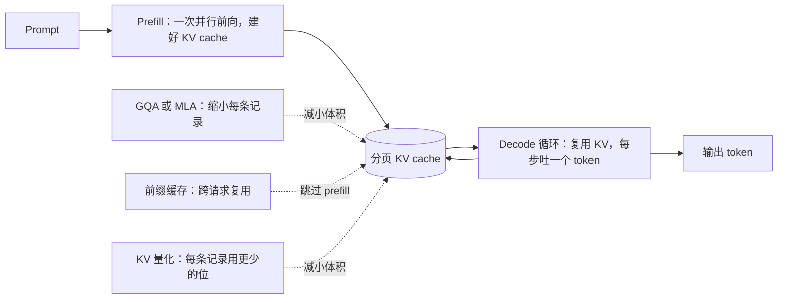

# 长上下文推理与 KV Cache

> 本章是英文原版的中文译本，原文见 [book/kv-cache/](../../book/kv-cache/)。译文和原文同步维护，发现问题请提 issue。

> **写法说明。** 本章是一篇以教学为先、写成书的样子的长上下文 LLM 推理深度讲解。
> 它借用了 Aminian 和 Xu 的 *Machine Learning System Design Interview*
> 的行文脉络（面试官对话、先讲成本模型再讲杠杆的固定顺序、一个想法配一张图），
> 但没有照搬其版式。在此基础上保留了本仓库自己加的东西：真实的生产案例、
> 每组方法一张"什么时候用哪个"的表、可交互的架构图、带推导的 KaTeX 公式，
> 以及面试问答。每一节一个文件，避免单个文件过长。

面试官很少会直接说"讲讲 KV cache"。他们会说：**"我们的 GPU 账单一直在涨，
高负载下 p99 延迟也很差。给我讲讲 LLM 推理到底贵在哪，以及怎么在不伤质量的前提下把成本降下来。"**
这个问题只有一个正确的切入点：KV cache。把成本模型想清楚，后面每一个设计决策都会自然跟着出来。

## 各节内容

1. [澄清需求](01-clarifying-requirements.md)：一段对话，把问题的范围定下来。
2. [成本模型](02-the-cost-model.md)：prefill 对比 decode，为什么 decode 受显存带宽限制，KV cache 的计算公式。
3. [把 cache 压小](03-shrinking-the-cache.md)：MHA、GQA、MQA、MLA，以及量化的 KV。
4. [分页与共享](04-paged-and-shared.md)：PagedAttention、前缀缓存、RadixAttention。
5. [长上下文](05-long-context.md)：位置插值、YaRN、滑动窗口、分块 prefill。
6. [服务与扩展](06-serving-and-scaling.md)：连续批处理、投机解码、瓶颈在哪。
7. [真实团队在生产环境里怎么做](07-how-teams-do-it-in-production.md)：点名公司、分歧对比表、一手资料链接。
8. [面试问答](08-interview-qa.md)：常考的、有坑的，以及常被答错的。
9. [小结](09-summary.md)：一页回顾、mermaid 图、自测题、延伸阅读。
10. [把它们拼起来：完整的方案](10-putting-it-together.md)：一套默认技术栈，把本章场景从头到尾搭一遍并算清显存和延迟，同一个系统在三组不同约束下的变化，以及一个最小的可运行 KV cache。

## 整个系统一页看完

第一次读请按顺序读，各节是层层递进的。
每一节都从面试官真正会问的那个问题开头，然后回答它。

## 配套章节

KV 量化只是一整套工具箱里的一根杠杆。[模型压缩](../model-compression/)
一章讲剩下的部分（权重量化和离群值问题、剪枝的几种形态、蒸馏），而对本章更有用的是，
它给出了这些手段的施加顺序：先从架构上减 KV，再分页，再量化 cache，
最后才去牺牲模型能看到的内容。
