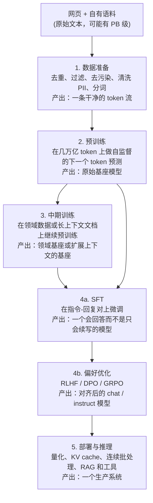
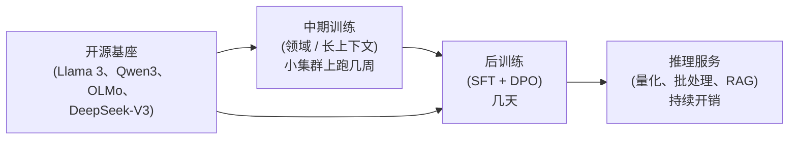

# 2. 五个阶段

用 LLM 做东西分五个明确的阶段。每个阶段的输入不同、输出不同、主要开销不同、
失败方式也不同。把它们混在一起，是浪费预算和搞砸面试最快的方式。

## 逐个阶段看



## 每个阶段一句话说清它的活

| 阶段 | 输入 | 输出 | 主要开销 | 典型失败 |
|---|---|---|---|---|
| 1. 数据准备 | 原始网页加自有文本 | 干净的、分好词的 token 流 | 流水线工程、存储 | 没做去污染，评估集泄漏 |
| 2. 预训练 | token 流 | 原始基座模型 | 算力（GPU 集群、数周） | 算力预算用得过少或过多（违反 Chinchilla，也就是算力最优的"模型规模对 token 数"规则） |
| 3. [中期训练](../mid-training/03-the-mid-training-phase.md) | 现有基座加一份重新加权的混合数据（领域、精选、合成、长文档） | 领域基座、质量升级后的基座或长上下文基座 | 算力（预训练的一小部分） | 不掺通用数据导致灾难性遗忘；污染借着精选 QA 数据混进来 |
| 4. 后训练 | 基座加（指令，回复）对和偏好数据 | 对齐后的 instruct 模型 | 数据质量、标注成本 | 松开 KL 缰绳后出现 reward hacking 或对齐税 |
| 5. 部署 | 对齐后的模型 | 生产推理服务系统 | 持续的 GPU 开销、工程 | KV cache OOM、延迟爆炸、没有 RAG 就产生幻觉 |

## 大多数团队实际从哪里进场

几乎没有产品团队会跑阶段 2。那是实验室级别的资本投入。大多数团队是在"基座模型"
这个节点进入上面的图的：下载一个开源权重的 checkpoint（训练好的模型权重快照，
这里指 Llama 3、DeepSeek-V3、OLMo、Qwen3），然后从那里开始迭代。

昂贵又稀少的那个阶段（预训练）在上游，而且是共享的。产品团队真正拥有并反复迭代的
那些阶段（中期训练、后训练、推理服务）在下游，相比之下便宜得多。



## 关于评估的一点说明

每个阶段的指标都不一样，用错指标是经典错误：

- **预训练：** 留出集上的困惑度（perplexity，衡量模型对没见过的文本有多"意外"，越低
  越好）或 bits-per-byte，再加上零样本 / 少样本的 benchmark 套件（MMLU、HellaSwag、
  GSM8K）。困惑度跟踪的是训练目标而不是有用程度；bits-per-byte 与分词器无关，所以
  可以跨模型比较。困惑度就是平均下一个 token 损失的指数：

```python
import numpy as np
def perplexity(token_nll):
    # token_nll: per-token negative log-likelihoods (natural log) on held-out text
    return np.exp(np.mean(token_nll))
# perplexity(np.array([0.5, 1.0, 2.0, 1.5])) -> 3.4903...  (avg NLL 1.25 -> exp)
```
- **中期训练：** 领域专用的 benchmark（法律、医疗、代码），再加上完整的通用评估套件
  来抓遗忘。
- **后训练：** 人类偏好胜率和 LLM-as-judge 分数（Chatbot Arena 那种），指令遵循和
  安全套件，任务专用评估（代码 pass@k、数学准确率）。
- **推理服务：** 延迟（p50 / p95 的首 token 延迟和 token 间延迟）、吞吐（每 GPU 每秒
  token 数）、每百万 token 成本，外加一项质量检查，确认压缩没有让模型退步。

先说清指标，再提改进方案。真正的目标是偏好胜率，嘴上却说"提高困惑度"，这是一个
危险信号。
