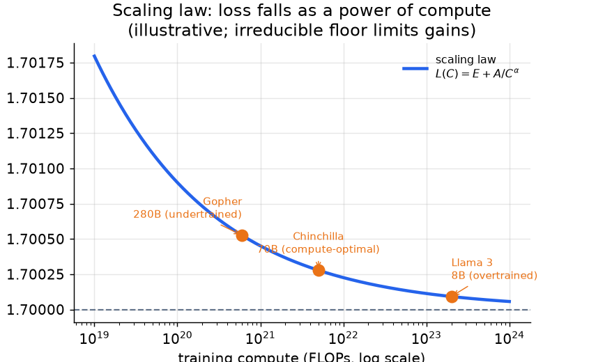
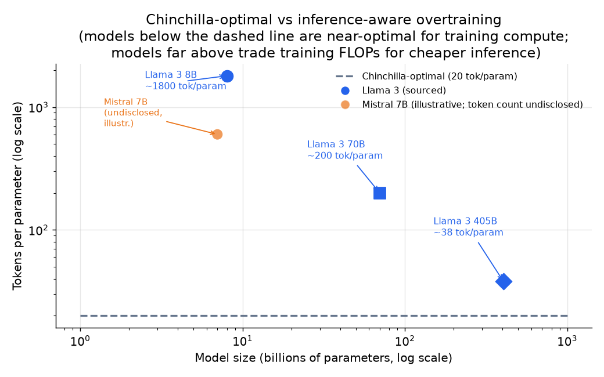

# 3. 预训练与 scaling

预训练就是在几万亿 token 上做自监督的下一个 token 预测。架构不是有意思的问题；
有意思的问题是**模型多大**、**数据多少**，而这个答案在 Chinchilla 之后发生了实质
性的变化。

## 算力预算公式

训练算力可以用一个简单的表达式来估。模型有 $N$ 个参数、训练 $D$ 个 token，
总浮点运算量为：

$$C \approx 6 N D$$

系数 6 的来历：前向传播（每个权重一次乘加，算 2 FLOPs），反向传播（大约是前向的
两倍），再加上参数更新。这是一个白板上的合理性检查，不是合同，但足够用来估算：
一个 7B 模型在 1400 亿 token 上训练，大约要花 $6 \times 7 \times 10^9 \times
1.4 \times 10^{11} \approx 5.9 \times 10^{21}$ FLOPs。

```python
def training_flops(num_params, num_tokens):
    # standard estimate: ~6 FLOPs per parameter per token (fwd + bwd + update)
    return 6 * num_params * num_tokens
# training_flops(7e9, 1.4e11) -> 5.88e+21   (7B params on 140B tokens)
```

## Scaling law

损失随模型规模和训练 token 数各自服从幂律：

$$L(N, D) = E + \frac{A}{N^{\alpha}} + \frac{B}{D^{\beta}}$$

其中 $E$ 是数据本身不可约减的熵下限，Chinchilla 的拟合里 $\alpha, \beta
\approx 0.3$。两个结构性的要点：

- 单靠 $N$ 或者单靠 $D$ 都决定不了损失，两者都重要。
- 收益是递减的；下限 $E$ 靠规模降不下去。

```python
def scaling_law_loss(N, D, E=1.69, A=406.4, B=410.7, alpha=0.34, beta=0.28):
    # Chinchilla power-law fit: irreducible floor E plus size and data terms
    return E + A / N**alpha + B / D**beta
# scaling_law_loss(7e9, 1.4e11) -> 2.1835...   (7B params, 140B tokens)
```



*损失随训练算力按幂律下降，渐近逼近一条由数据熵决定的不可约减下限。Chinchilla 之前
的模型（Gopher）训练不足：一个 280B 模型在同样的算力下输给 70B 的 Chinchilla。
Llama 3 8B 刻意使用了远超算力最优的 token 数，因为推理经济学主导了它的全生命周期
成本。示意图。*

## Chinchilla 最优：训练侧的答案

给定算力预算 $C$，同时选择 $N$ 和 $D$ 来最小化损失。Chinchilla 的结论是，算力最优
的 token 数大约为：

$$D^{\ast} \approx 20 \, N^{\ast}$$

```python
def chinchilla_optimal(C):
    # C: training compute budget in FLOPs; uses C = 6*N*D and D = 20*N
    N = (C / 120) ** 0.5   # params: substituting D=20N into 6ND gives C = 120*N^2
    D = 20 * N             # tokens: about 20 per parameter at the optimum
    return N, D
# chinchilla_optimal(5.9e21) -> (~7.0e9, ~1.4e11): a 7B model wants ~140B tokens
```

也就是说，token 数和参数量要一起放大，每个参数大约 20 个 token。一个 7B 模型
要达到算力最优，大约需要 1400 亿 token。Chinchilla 之前那一代模型（Gopher、GPT-3）
严重训练不足：一个 280B 模型只在 3000 亿 token 上训练，大部分参数预算都浪费了，
因为数据先耗尽了。

## 面向推理的转向：Llama 为什么过度训练

Chinchilla 最优的含义是：给定损失，最小化**训练**算力。但如果训练完的模型要被
服务几十亿次，目标就变了：要最小化的是（训练加推理）的全生命周期成本，而不只是
训练。

一个小模型服务十亿次，比一个大模型服务同样多的次数便宜，哪怕小模型为了达到同等
质量多吃了不少 token。所以人们会故意把小模型训练到远超算力最优点。这就是为什么
Llama 3 8B 用了大约 15 万亿 token（每个参数约 1800 个 token），而算力最优本来是
1600 亿 token（每个参数 20 个）。



*虚线是每个参数 20 个 token，也就是训练侧的 Chinchilla 最优。Llama 3 8B（约 1800
token / 参数）远在其上，用额外的训练 FLOPs 换来了规模化推理时永久更低的成本。
Mistral 7B 作为过度训练的示意点画出；它的 token 数没有公开。Llama 3 405B（约 38
token / 参数，来自大约 15.6T token）更接近 Chinchilla 最优：一个服务起来这么贵的
模型，再继续过度训练是不划算的。*

## 什么时候用哪种做法

| 选择 | 什么时候 | 而不是 |
|---|---|---|
| 算力最优的预训练（Chinchilla 比例） | 为研究性实验或原型最小化训练算力 | 过度训练，它只有在规模化服务时才回本 |
| 面向推理的过度训练（Llama 3 8B） | 要服务几十亿 token，推理的长期成本占主导 | 算力最优的规模选择，最后留下一个又大又贵的模型要服务 |
| 在开源基座上做中期训练（大多数产品团队） | 算力预算有限，而开源基座已经覆盖了所需能力 | 需要实验室级资源的从零预训练 |
| 从零预训练 | 任何开源基座里都没有的全新能力（新语言、新模态、前沿突破） | 本来做适应就够了 |

**每种做法的工具。** 集群规模的从零预训练和算力最优预训练跑在 Megatron-LM（NVIDIA）、
GPT-NeoX（EleutherAI）和 DeepSpeed（Microsoft）ZeRO 上，后者负责分布式分片；nanotron
和 litGPT 是更轻量的训练器。面向推理的过度训练用的是同一套训练器，只是远远跑过
Chinchilla 的 token 比例。在开源基座上做中期训练（继续预训练或上下文扩展）是常见的
产品路径，用 Hugging Face Transformers 和 Accelerate 在下载好的 checkpoint 上跑，
需要的基础设施只是前者的一小部分。以上任何一种做法的数据整理和去污染，都依赖
datasets 和 tokenizers 库加上去重工具。

**出处。** 算力最优的 token 对参数比例来自 Chinchilla（DeepMind，2022），它修正了
最早的 scaling law（OpenAI，2020）给出的幂律取舍；"推理占主导时就超过最优比例继续
训练"的逻辑，是那个结论在实践中的反转。分布式训练工具可以追溯到 Megatron-LM
（NVIDIA）的张量并行和流水线并行（把一个模型拆到多张 GPU 上，前者在一层的张量
内部拆，后者跨层拆），以及 ZeRO（Microsoft），由 DeepSpeed 实现。

**举个例子。** 一个领域 LLM 团队需要一个精通某个专业语料的模型，但没有实验室级
算力。由于开源基座已经覆盖了通用语言能力，缺的只是领域词汇，他们选择在该基座上
做中期训练，而不是从零预训练：后者需要他们没有的资源，而且大部分工作只是在重新
学一遍基座已经会的东西。如果他们要立的是一个将被服务几十亿次的模型，那就会把
面向推理的过度训练推到远超每参数 20 token 的比例，用额外的训练 FLOPs 换永久更
便宜的服务成本，而不是停在算力最优点。只有当某项能力（比如一种新语言或新模态）
在所有开源基座里都确实不存在时，从零预训练才对得起它的花费。

## 规模化之后真正要紧的架构选择

decoder-only transformer 是默认选项；真正要紧的差异在于：

- **注意力变体。** 多头注意力（MHA）质量最好，但 KV cache 也最大。分组查询注意力
  （GQA，Llama 3 和 Mistral 在用）把 KV cache 缩小 $n_{\text{heads}} / n_{\text{kv}}$
  倍，质量损失很小；任何打算规模化服务的模型都应该默认用它。多查询注意力（MQA）
  走得更远（Character.AI），质量代价也更大。
- **位置编码。** RoPE（Llama、Mistral、Qwen3 在用）把位置以旋转的形式注入，让
  query 和 key 的点积只依赖相对偏移。它比学出来的绝对位置更容易泛化到更长的
  上下文，也是中期训练里做上下文扩展的必要条件。
- **混合专家（MoE）。** 把稠密 MLP 换成 $E$ 个专家加一个路由器，每个 token 被送到
  top-$k$ 个专家。总参数量增长，而每个 token 的 FLOPs 保持不变。DeepSeek-V3 和
  Mixtral 用它在很小的每 token 算力预算下拿到很大的参数量（从而更好的质量）。
  风险是负载不均衡：辅助的均衡损失（或者 DeepSeek-V3 基于偏置的做法）就是用来
  防止所有 token 都被路由到同一个专家的。

> **实际看一遍架构。** 预训练优化的结构单元是 decoder block：RMSNorm、因果自注意力
> （MHA / GQA）和一个前馈层（MLP / SwiGLU），堆叠 $n_{\text{layers}}$ 层。可以在
> [Model Zoo](https://github.com/neurarch-ai/awesome-llm-model-zoo) 里看一个经典
> 基座（GPT-2 small）和一个现代生产基座（Llama 3 8B）。亲眼看到 GQA 在哪里替换了
> MHA、MoE 在哪里替换了稠密 MLP，成本的论证就变得具体了。
