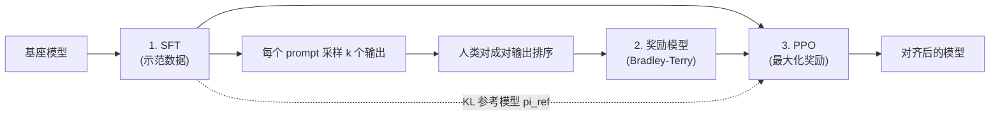
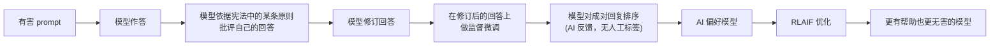

# 4. 后训练

基座模型只会续写文本；它不会遵循指令，不会聊天，也不会拒绝有害请求。后训练
分两步把这些补上：先用监督微调（SFT）教模型回答问题，再用偏好优化教它人类更喜欢
哪个回答。一共四种方法，能针对任务说出正确的那一种，是区分背答案和真懂的分水岭。

## 第 1 步：监督微调（SFT）

在精选的（指令，回复）对上微调基座模型。损失函数把 prompt 部分的 token 遮掉，
只在补全部分上最小化交叉熵：

$$\mathcal{L}_{\text{SFT}} = -\sum_{t \in \text{completion}} \log \pi_{\theta}(y_t \mid y_{\lt t},\, x)$$

```python
import numpy as np
def sft_loss(probs_completion):
    # mean negative log-likelihood over completion tokens only (prompt is masked out)
    return -np.mean(np.log(probs_completion))
# sft_loss(np.array([0.5, 0.9, 0.3])) -> 0.6674...   (model probs for gold tokens)
```

几万条样本的质量和多样性，胜过单纯堆数量。SFT 教的是格式、指令遵循、工具调用
语法和基本的拒绝。它教不了模型在两个都正确的回答里人类更偏好哪一个；那是偏好
优化的活。

## 第 2a 步：带奖励模型的 RLHF（PPO）

经典配方（InstructGPT）。RLHF（基于人类反馈的强化学习）先用人类对模型输出的排序，
在 Bradley-Terry 目标下训练一个奖励模型：

$$\mathcal{L}_{\text{RM}} = -\mathbb{E}_{(x,\, y_w,\, y_l)}\Big[\log \sigma\big(r_{\phi}(x, y_w) - r_{\phi}(x, y_l)\big)\Big]$$

```python
import numpy as np
def rm_loss(r_chosen, r_rejected):
    # Bradley-Terry: push the chosen reward above the rejected one via a sigmoid
    return -np.mean(np.log(1 / (1 + np.exp(-(r_chosen - r_rejected)))))
# rm_loss(np.array([2.0]), np.array([1.0])) -> 0.3133   (chosen wins by 1 logit)
```

其中 $y_w$ 是被偏好（选中）的输出，$y_l$ 是被拒绝的输出。然后用 PPO（近端策略
优化，负责更新模型的那个 RL 算法）优化策略，并对 SFT 参考模型加一个 KL 惩罚
（一根缰绳，衡量新策略离参考模型跑了多远），防止策略漂移或者 reward hacking：

$$\max_{\theta}\ \mathbb{E}_{x \sim \mathcal{D},\, y \sim \pi_{\theta}}\big[r_{\phi}(x, y)\big] - \beta\, \text{KL}\!\left(\pi_{\theta}(\cdot \mid x) \,\|\, \pi_{\text{ref}}(\cdot \mid x)\right)$$

KL 项通常被折进每个 token 的奖励里：

$$r_t = r_{\phi}(x, y) - \beta \left(\log \pi_{\theta}(y_t \mid \cdot) - \log \pi_{\text{ref}}(y_t \mid \cdot)\right)$$

```python
def kl_penalized_reward(r, logp_policy, logp_ref, beta=0.1):
    # sequence reward minus a per-token KL penalty back to the frozen reference
    return r - beta * (logp_policy - logp_ref)
# kl_penalized_reward(1.0, -0.5, -0.7, beta=0.1) -> 0.98   (small drift, small penalty)
```



**它是怎么跑的。** 整条流水线从一个 SFT checkpoint 出发，分三个编号的阶段。先在示范数据上微调基座模型，得到一个会回答而不是只会续写的 SFT 策略。然后这个策略对每个 prompt 采样 k 个输出，人类对成对输出排序，这些排序在 Bradley-Terry 目标下训练出一个奖励模型，让一个标量奖励可以代替人工标签。第三阶段用 PPO 优化策略以最大化奖励模型的打分，同时把同一个 SFT checkpoint 钉住，作为 KL 惩罚的冻结参考分布 pi_ref，也就是图里那条回到 PPO 的虚线。这根 KL 缰绳让策略在追逐奖励时不会漂到 reward hacking 出来的、偏离分布的文本上，产出就是对齐后的模型。

## 第 2b 步：DPO（直接偏好优化）

DPO 去掉了奖励模型和 RL 循环。RLHF 的最优策略有闭式解：
$\pi^{\ast}(y \mid x) \propto \pi_{\text{ref}}(y \mid x)\,\exp(r(x,y)/\beta)$。
把它代回 Bradley-Terry，就得到一个直接作用在偏好对上的普通分类损失，不需要奖励
模型：

$$\mathcal{L}_{\text{DPO}} = -\mathbb{E}_{(x,\, y_w,\, y_l)}\!\left[\log \sigma\!\left(\beta \log \frac{\pi_{\theta}(y_w \mid x)}{\pi_{\text{ref}}(y_w \mid x)} - \beta \log \frac{\pi_{\theta}(y_l \mid x)}{\pi_{\text{ref}}(y_l \mid x)}\right)\right]$$

```python
import numpy as np
def dpo_loss(lp_pol_w, lp_ref_w, lp_pol_l, lp_ref_l, beta=0.1):
    # inputs are log-probs; margin is the chosen log-ratio minus the rejected log-ratio
    margin = beta * ((lp_pol_w - lp_ref_w) - (lp_pol_l - lp_ref_l))
    return -np.log(1 / (1 + np.exp(-margin)))
# dpo_loss(-0.2, -0.5, -1.0, -0.6, beta=0.1) -> 0.6587...   (chosen favored over rejected)
```

参考模型 $\pi_{\text{ref}}$ 仍然是必需的（它是隐式奖励的基线），$\beta$ 也仍然是
KL 温度。DPO 没有去掉 KL 缰绳，只是把它吸收进了损失函数。这是关于 DPO 最常见
的带坑追问，能说出这一点是很强的信号。

Meta 给 Llama 3 用的是 SFT 加拒绝采样加 DPO。这套配方稳定，不需要在线的 PPO
训练循环。

**DPO 的边界情况：似然位移（likelihood displacement）。** DPO 的损失只推动选中回复
与被拒回复之间对数比的*间隔*，并不锚定选中回复的绝对概率。一个有文献记录的失败
模式是：训练过程中被偏好回复的对数概率在下降，只是被拒回复降得更快，于是间隔在
变好，模型却*更不*可能生成它被教导要偏好的那个回答。这叫似然位移（Razin et al.,
2024）；当从选中回复上流失的概率质量落到第三个、非预期的输出上时，它可能把一个
做过安全调优的模型推向那些偏好对本来要压制的行为。实践中的防护是：在 DPO 损失
旁边保留一个 SFT 项（或者用加了选中回复似然锚点的变体），并且在训练中监控选中
回复的绝对对数概率，而不是只信间隔。这个回答比泛泛的"DPO 仍然有 KL 缰绳"更
锋利，因为它点出了一种缰绳没松、目标函数却依然把质量推向错误方向的情况。

## 第 2c 步：RLAIF 与 Constitutional AI（Anthropic）

把大部分人工的有害性标签换成 AI 依据一份成文宪法（大约 75 条原则）给出的反馈。
模型在一个监督阶段里批评并修订自己的输出；在这些比较上训练出的 AI 偏好模型
驱动一次 RLAIF（基于 AI 反馈的强化学习，用模型裁判代替人工标签）优化。结果比
单纯的 RLHF 更有帮助也更无害，而人工标签少得多。瓶颈从标注员转移到宪法设计上，
后者是一份可审计的产物。



## 第 2d 步：GRPO 与可验证奖励（DeepSeek-R1）

对于奖励可以核对的任务（数学、代码、形式逻辑），把偏好模型换成基于规则的验证器。
GRPO（Group Relative Policy Optimization）对每个 prompt 采样一组 $G$ 个输出，用组内
归一化的奖励作为优势函数，去掉了价值网络 / critic 网络，显存开销比 PPO 少一半：

$$\hat{A}_i = \frac{r_i - \text{mean}(r_1, \dots, r_G)}{\text{std}(r_1, \dots, r_G)}$$

DeepSeek-R1-Zero 证明了思维链、自我反思和自我纠错可以从带可验证奖励的纯 RL 里
涌现出来，几乎或完全不需要 SFT。优化时 KL 惩罚仍然作为正则项加上。

## 什么时候用哪种

| 方法 | 需要奖励模型？ | 需要在线 RL 采样？ | 成本 / 稳定性 | 适用场景 |
|---|---|---|---|---|
| SFT | 不需要 | 不需要 | 最便宜，非常稳定 | 教格式、指令遵循、基本的拒绝 |
| RLHF（PPO） | 需要 | 需要 | 昂贵，难调 | 想要一个可复用的奖励模型，以及业界最高的对齐上限 |
| DPO | 不需要（隐式） | 不需要（离线偏好对） | 便宜，稳定 | 大多数团队的默认偏好方法；需要成对的偏好数据集 |
| RLAIF / CAI | AI 标注器 | 不需要 | 中等，可扩展 | 在提升无害性的同时削减人工标注成本；需要一份设计良好的宪法 |
| GRPO | 不需要（规则验证器） | 需要 | 中等，无 critic | 数学、代码，或任何有检查器能给出对 / 错二元奖励的领域 |

**每种方法的工具。** SFT、DPO 和 GRPO 都可以在 Hugging Face TRL 上跑，分别对应
SFTTrainer、DPOTrainer 和 GRPOTrainer，通常搭配 PEFT 来做 LoRA 或 QLoRA adapter。
完整的 RLHF PPO 由 TRL 的 PPOTrainer 以及专门的 RLHF 框架（如 OpenRLHF 和 NVIDIA 的
NeMo-Aligner）支持，它们都依赖 DeepSpeed（Microsoft）来分片 PPO 循环里同时驻留的
多个模型。RLAIF 和 Constitutional 风格的流水线复用同样的偏好训练器，只是把人工
标注员换成给偏好数据集供料的 AI 裁判。带可验证奖励的 GRPO 把 GRPOTrainer 和你
自己写的规则检查器配在一起，比如一个单元测试运行器或者数学判分器。

**出处。** RLHF 因 InstructGPT（OpenAI，2022）而在指令调优中流行起来；DPO（Stanford，
2023）把同样的偏好目标改写成一个闭式损失，不需要单独的奖励模型和在线采样；GRPO
（DeepSeek，2024）引入了配合可验证奖励使用的、无 critic 的组相对变体。这些训练器
依赖的 LoRA 和 QLoRA adapter 来自 LoRA（Microsoft，2021）和 QLoRA（University of
Washington，2023）；DeepSpeed 的分片属于 ZeRO（Microsoft）这一脉。

**举个例子。** 一个领域 LLM 团队先跑 SFT 来教指令遵循和拒绝，这是最便宜也最稳定
的一步，确认没问题之后才碰偏好调优。接着他们需要模型在两个都说得通的回答里偏好
更安全的那个，于是选 DPO 而不是完整的 RLHF PPO，因为他们手上已经有成对的偏好
数据，也想避开在线 RL 循环和单独的奖励模型。结果人工标注成了成本瓶颈，所以在
无害性这个维度上他们改用 RLAIF 风格的流程，由 AI 裁判依据一份成文宪法给比较打分，
减少了标签量，训练器还是同一个离线的。只有在代码生成这一块，因为检查器能给出
对或错的二元奖励，他们才升级到 GRPO，规则验证器让偏好模型完全不再需要。

## KL 缰绳：为什么它没得商量

每一种偏好方法都把策略拴在参考模型附近，要么是显式的 KL 项（PPO、GRPO），要么是
DPO 里隐式的 $\beta$ 项。把它去掉，模型就会 reward hacking：变得啰嗦、谄媚、重复，
或者错得理直气壮。能力本来就在基座模型里，后训练只是把它引出来并加以引导。
松开缰绳，信号就崩了。在面试里点出这一点，是真正理解对齐的最强标志。
