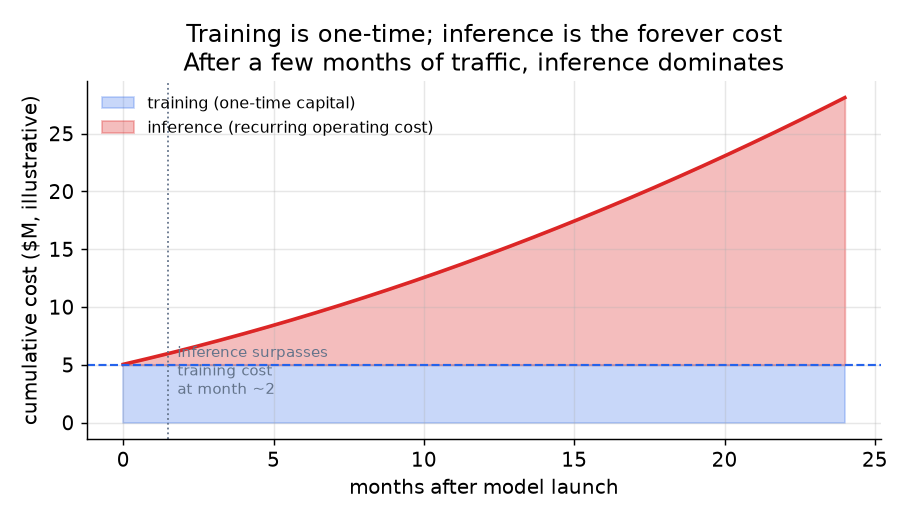
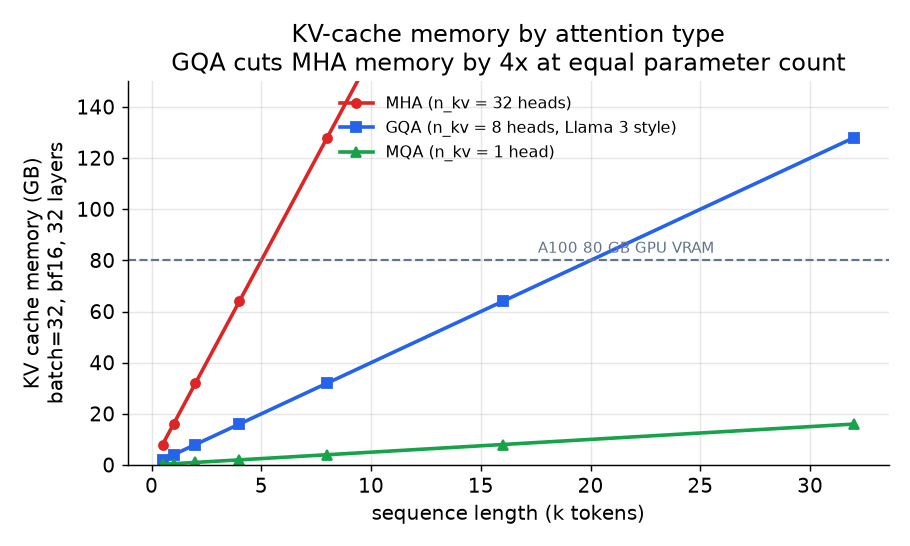

# 5. 推理经济学

训练是一次性付清的资本开销。推理是永远在跑的运营开销，产品的单位经济能不能
成立，真正取决于这里。对任何有实际流量的模型来说，全生命周期的推理总开销
几个月内就会超过训练成本。

*训练是一大笔一次性付款。推理则随流量持续累积。对一个用户负载中等的模型，
累计推理成本大约两个月就超过训练成本，之后无限增长。数字仅为示意；交叉点
具体在哪里取决于流量和模型规模。*

## 为什么 decode 受显存带宽限制

LLM 推理分成两个阶段，瓶颈完全不同：

- **Prefill。** prompt 的 token 并行处理（相当于对整个 prompt 一次做完前向传播）。
  这一阶段受算力限制：大量乘加运算，GPU 利用率高。
- **Decode。** token 一个一个生成。每生成一个新 token 都要对全部模型权重做一次
  完整的前向传播，还要把整个 KV cache 读一遍。算术强度（每搬运一个字节能做多少
  FLOPs）很低；GPU 大部分时间在等显存带宽，而不是在算。

batch 为 1 时，每个 token 的 decode 延迟可以近似为：

$$t_{\text{decode}} \approx \frac{N \cdot p_{\text{bytes}}}{\text{BW}_{\text{HBM}}}$$

其中 $N$ 是参数量，$p_{\text{bytes}}$ 是每个参数占的字节数。一个 FP16 的 70B 模型
（$p_{\text{bytes}} = 2$）跑在 HBM 带宽 2 TB/s 的 A100 上，batch 为 1 时每个 token
大约要 $\frac{70 \times 10^9 \times 2}{2 \times 10^{12}} = 70\,\text{ms}$。这就是
那堵墙：不是 FLOPs，是字节。

**批处理是白送的吞吐。** batch 为 1 时，为了吐出一个 token 要付出读一遍全部权重的
代价。batch 为 $b$ 时，同一次读取被 $b$ 个 token 分摊，算术强度被推向受算力限制
的区间。问题在于 KV cache 会随 batch 大小和序列长度增长，所以显存一满，吞吐的
收益就到头了。

## KV cache：瓶颈在它，不在 FLOPs

自回归 decode 会把每个过去 token 的 key 和 value 缓存起来，永远不重算。缓存大小为：

$$M_{\text{kv}} = 2 \cdot b \cdot L \cdot n_{\text{layers}} \cdot n_{\text{kv}} \cdot d_{\text{head}} \cdot p_{\text{bytes}}$$

系数 2 是 K 和 V。$n_{\text{kv}}$ 是 key / value 头的数量，这一个数字就是服务侧的
杠杆：GQA（Llama 3、Mistral）把它缩小 $n_{\text{heads}} / n_{\text{kv}}$ 倍，用
一小部分缓存拿到同样的质量。

*MHA（n_kv = 32）、GQA（n_kv = 8，Llama 3 风格）和 MQA（n_kv = 1）在不同序列长度下
的 KV cache 显存占用，batch=32，bf16，32 层。32K token 时 GQA 能塞进 A100 的 80 GB，
而 MHA 需要 4 倍的显存。这就是为什么每个生产级基座都用 GQA 而不是 MHA。按
Llama-3-8B 风格的配置作示意。*

## 撬动显存墙的三根杠杆

**PagedAttention（vLLM）。** 朴素的服务方式给每条序列的 KV cache 预留连续内存，
内部碎片会浪费掉 60% 到 80%。PagedAttention 把 KV cache 存在不连续的固定大小
块里（就像操作系统的虚拟内存分页），通过块表查找，浪费降到接近零，还允许
共享前缀的请求之间共享缓存。配合连续批处理，vLLM 在不改模型的前提下把吞吐
提高到朴素服务的最多 24 倍。

**投机解码（speculative decoding）。** 用一个便宜的小模型起草 $k$ 个 token，再让大
模型在一次前向传播里把它们全部验证。接受率为 $\alpha$ 时，目标模型每一步期望
接受的 token 数为：

$$\mathbb{E}[\text{accepted}] = \frac{1 - \alpha^{k+1}}{1 - \alpha}$$

这把好几步受显存限制的 decode 合成了一步，在草稿模型准的 prompt 上能明显降低
延迟。

**量化。** 用一个仿射映射把权重和激活从 FP16 / BF16 映射到更低精度：

$$x_q = \text{round}\!\left(\frac{x}{s}\right) + z, \qquad s = \frac{x_{\max} - x_{\min}}{2^{n} - 1}$$

FP16 到 INT8 把权重显存减半，decode 吞吐大约翻倍；INT4 再减半。一个 70B 模型
FP16 是 140 GB；INT8 降到 70 GB；INT4 降到 35 GB。决定你租多少张 GPU 的是这个
数字，不是 FLOPs。KV cache 也要量化，不只是权重（Character.AI 两个都量化）。
每一步压缩都必须有评估把关；INT8 几乎无损，INT4 需要严格的质量检查。

## 什么时候用哪种

| 技术 | 什么时候用 | 而不是 |
|---|---|---|
| 分组查询注意力（GQA） | 训练或微调一个要规模化服务的模型；从源头缩小 KV cache | MHA，它浪费显存并限制 batch 大小 |
| PagedAttention（vLLM） | 通用的变长请求服务 | 按序列连续分配 KV，把显存搞碎 |
| 连续批处理 | 请求速率有波动、回复长度不一 | 静态批处理，一个 batch 跑完之前 GPU 会空转 |
| Prompt / 前缀缓存 | 每次调用都带同一个系统 prompt（Character.AI、API 服务商） | 每个请求都把同样的前缀 KV 重算一遍 |
| 投机解码 | 低延迟的单用户路径，且有一个好的草稿模型 | 纯 decode，每个 token 都要一次完整前向传播 |
| INT8 量化 | 想降成本，质量退化几乎为零 | 推理成本已是业务约束时还用 FP16 服务 |
| INT4 量化 | INT8 下模型仍然塞不进 GPU，并且有评估把关 | INT8，质量退化时恢复起来更便宜 |
| 蒸馏成更小的模型 | 模型本身对成本或延迟目标来说太大，不只是精度问题 | 对一个过大的模型做量化，只能解决一部分问题 |

**每种技术的工具。** GQA 是内置在 Hugging Face Transformers 架构里的建模选择，
不是服务侧的开关。PagedAttention、连续批处理、前缀缓存和投机解码都在 vLLM 里
自带，TensorRT-LLM（NVIDIA）和 SGLang 提供同样的服务杠杆（SGLang 的 RadixAttention
是前缀缓存的一种变体）。权重和 KV cache 量化来自 GPTQ、AWQ 和 bitsandbytes，在
vLLM 和 TensorRT-LLM 里以开关形式暴露，CPU 和边缘端则通过 llama.cpp 用 GGUF。
蒸馏成更小的学生模型是训练期的一步，跑在 Hugging Face Transformers 和 TRL 上，
不属于服务库。

**出处。** GQA（Google，2023）是源头级的 KV 缩减；PagedAttention 来自 vLLM（UC
Berkeley，2023）；连续（迭代级）批处理来自 Orca（OSDI 2022）；投机解码来自 Google
和 DeepMind（2023）。权重量化器是 GPTQ（2022）和 AWQ（MIT，2023）。

**举个例子。** 一个对话产品在共享系统 prompt 后面服务一个 70B 模型。第一步是选
一个已经自带 GQA 的基座，从源头缩小 KV cache，而不是交 MHA 的显存税。服务层
用 vLLM 拿到 PagedAttention 和连续批处理，因为请求长度不一，静态分配会把显存
搞碎、让 GPU 空转；同时打开前缀缓存，公共的系统 prompt 就不用每次重算。当推理
成本成为最紧的约束时，他们先上 INT8 量化，因为质量几乎不退化；只有模型仍然
放不下时，才在评估把关下降到 INT4。如果不管什么精度模型对延迟目标来说都太大，
那就蒸馏成一个更小的学生模型，而不是继续量化，因为量化只能部分解决尺寸问题。
对低延迟的单用户路径，再加上用便宜草稿模型的投机解码。
