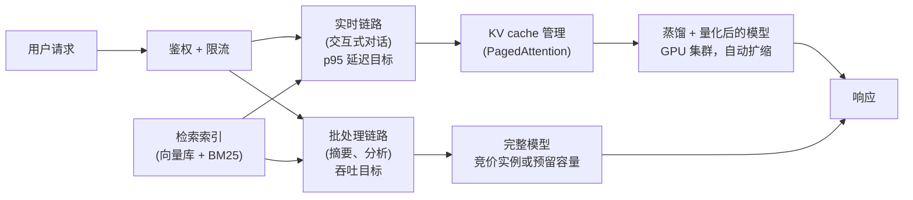
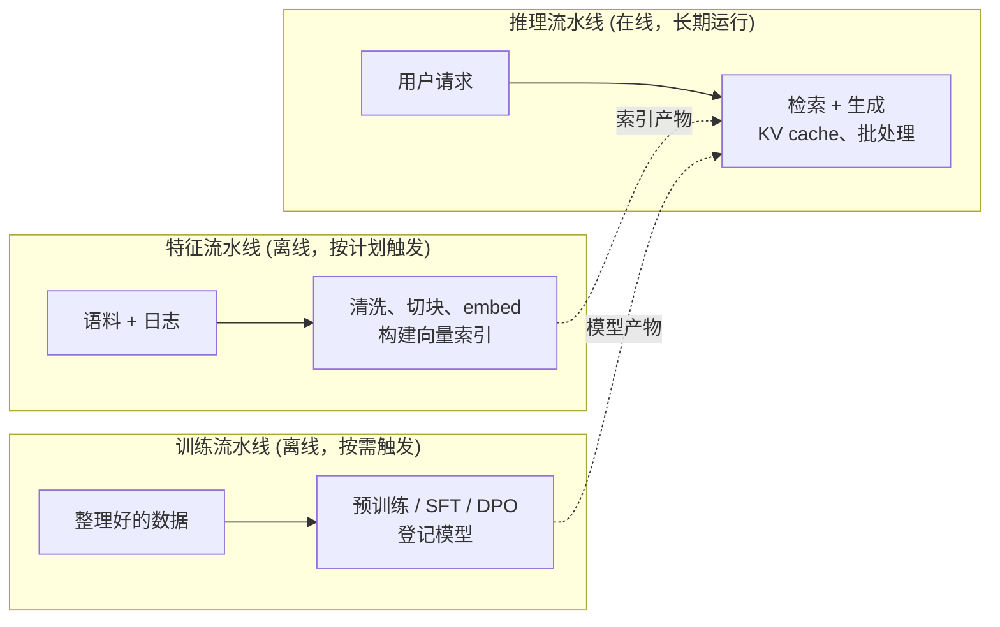

# 6. 服务与扩展

## RAG 还是微调：最容易搞混的一个决策

在设计服务栈之前，先把产品层面最常犯的那个错误厘清：明明该用 RAG，却伸手去
微调；或者反过来。

**微调教的是行为。** 它改变模型怎么写、怎么排版、怎么推理、怎么拒答。它没法
可靠地教事实，因为事实会被烤进权重里：不重新训练就更新不了，模型还可能记错、
直接编出来。

**RAG 教的是事实。** 推理时把相关段落检索出来放进上下文。两秒钟前刚进上下文
窗口的事实，模型不会拿去幻觉；而且它还能给出出处，光靠权重的微调做不到这点。

两者是可以叠加的，大多数生产系统都同时用：行为交给微调（语气、格式、领域词汇、
拒答风格），事实交给检索（商品目录、判例法、当下的新闻）。把这两件事搞混，是
LLM 产品里最常见的一个错误。

| 问题是 | 用 | 因为 |
|---|---|---|
| 模型不按我们的引用格式写 | 微调（SFT / DPO） | 风格是行为，不是事实；权重存它很省 |
| 模型引用的判例法已经过时 | 在一个新鲜索引上做 RAG | 法律会变；烤进权重会带来过期风险和幻觉风险 |
| 模型把太多无害请求拒掉了 | 后训练（SFT + DPO） | 拒答行为是学出来的；调拒答就能改它 |
| 模型不知道我们的内部 API | RAG 或者 function calling | 内部 API 变得很勤；微调跟不上 |
| 模型不遵守我们的输出 JSON schema | SFT | schema 是一种格式 / 行为，稳定到可以教会 |
| 模型编造公司相关的事实 | 带 grounding 和引用的 RAG | 事实会变；带引用的检索是可以核验的那条路 |

## 对照着看：RAG 和微调作为两种知识注入机制

上面那张表按症状告诉你该选哪个。这一张解释的是：两者的卖点明明一模一样（"让
模型懂我们的东西"），行为为什么差这么多。它们都在注入基座模型没有的知识，但
一个把知识存成可检索的 token，另一个把知识溶进权重里。

| 维度 | RAG | 微调 |
|---|---|---|
| 共同目标 | 让模型用上预训练时没见过的知识 | 让模型用上预训练时没见过的知识 |
| 知识存在哪 | 外部索引；推理时以 prompt token 的形式进入模型 | 模型权重；训练时分散到各个参数里 |
| 更新一条事实的代价 | 把改动的文档重新 embed、重新建索引；模型不动 | 一次新的训练、一轮评估、一次重新部署 |
| 出处 | 能指向检索到的那段原文；引用是结构性的 | 没有；模型分不清一条存下来的事实和一次看起来合理的插值 |
| 每次查询的成本 | 检索延迟，加上每一个请求都变长的 prompt | 边际成本为零；知识已经摊进前向传播里 |
| 知识容量 | 语料可以无限大，但每次查询只有塞进上下文窗口的那部分能用 | 受模型容量限制，但学到的东西每次查询都在 |
| 失败方式 | 检索没命中：模型在缺关键事实的情况下照样作答 | 过期：模型自信地说出它训练时那个版本的事实 |

这个差别会在更新频率的边界上改变整个设计：一旦知识变化的速度超过了你重训加
重新部署的节奏，权重在结构上就永远是过期的，检索成了唯一跟得上的机制。

## 服务架构

服务侧的设计把流量分成两种形态：

交互式负载和批处理负载的瓶颈正好相反。交互流量要的是低首 token 延迟：用蒸馏
过或量化过的小模型、连续批处理、prompt 缓存。批处理流量要的是高吞吐：在竞价
容量上跑全精度模型，配大的静态 batch。把两者分开，才不会让一个批处理任务把
交互用户堵住。

## FTI 分解：五个阶段，三条你真正在运维的流水线

五个阶段说的是*要造出什么*。生产环境里你实际在跑的，是三条长期存在的流水线，
也就是《LLM Engineer's Handbook》里的 **FTI 分解**（feature / training /
inference）。把它们各自命名，是让生命周期图变成一套可运维架构的关键一步：

三条流水线之间只通过产物通信（**向量索引**和**模型注册表**），所以它们能各自
独立扩容和部署：语料变了，特征流水线重新 embed；重训信号来了，训练流水线启动；
推理流水线则一直在服务。这就是为什么"加个 RAG"和"重训模型"是两条不同的流水线，
而不是对服务链路的两次改动；也是为什么数据和权重在后面翻天覆地，服务链路仍然
是个稳定的接口。

## 瓶颈与对策

| 瓶颈 | 最先看到的迹象 | 对策 | 代价 |
|---|---|---|---|
| KV cache 把显存吃满 | 峰值流量下 OOM，或者被迫调小 batch | PagedAttention（vLLM），训练期就上 GQA/MQA | 工程复杂度上升；GQA 需要重新训练基座 |
| 单用户的 decode 延迟太高 | p95 首 token 延迟超预算 | 换更小或量化后的模型；投机解码；共享 prompt 用前缀缓存 | 有轻微的质量退化风险；每一步压缩都要评估把关 |
| 私有事实或新鲜事实上出现幻觉 | 用户反馈信息过时或者是编的 | 带 grounding 的 RAG；不要靠重训来补事实缺口 | 检索延迟；索引新鲜度的 SLA |
| 规模上来后每 token 成本太高 | 推理预算超过营收阈值 | INT8/INT4 量化；蒸馏成更小的模型；用连续批处理摊薄权重读取 | 质量退化；蒸馏本身的训练成本 |
| 量化之后模型行为变差 | 压缩后评估分数下降 | 在完整评估集上把关，INT4 退化就退回 INT8 | 服务成本高于原定的量化目标 |
| 对抗性用户面前对齐漂移 | 越狱在规模上开始成功 | 输入 / 输出过滤；定期做后训练刷新；持续红队 | 对无害输入产生误拒 |
| RAG 索引两次更新之间的过期事实流到用户 | 用户收到过时的答案 | 给索引定新鲜度 SLA；加上"最后更新时间"的引用；兜底回答"我不知道" | 索引基础设施变多；索引慢时每次查询延迟更高 |

前几行背后有两个细节。"KV cache 把显存吃满"那一格，把一个服务期的杠杆和一个
事后换不上的训练期杠杆放在了一起：PagedAttention（来自 vLLM，UC Berkeley，2023）
在任何模型上都能把碎片浪费收回来，但同一格里的 GQA/MQA 缩减必须在训练时烤进
基座（GQA 来自 Google 2023，MQA 来自 Google 2019），所以那是下一个模型的决策，
不是热修。"每 token 成本"那一行把连续批处理（来自 Orca，OSDI 2022）和量化并列，
是因为它们攻的是不同的项：批处理把固定的权重读取摊到更多并发 token 上，量化
则减少每一步要读的字节数，两者叠加是相乘的。投机解码（Google 和 DeepMind，2023）
只出现在延迟那一行，不在成本那一行，因为它是拿额外算力换单用户延迟，本身并不
降低每 token 成本。

## 按场景看服务形态

| 场景 | 模型规模 | 精度 | KV 变体 | 批处理 | RAG |
|---|---|---|---|---|---|
| 交互式法律助手（500 并发） | 7-13B | INT8 | GQA | 连续批处理 | 要，判例法索引 |
| 代码补全（低延迟） | 7B 蒸馏 | INT4 + 评估把关 | GQA / MQA | 连续批处理 + 投机解码 | 不要 |
| 夜间批量摘要 | 70B | BF16 | GQA | 大的静态 batch | 需要 grounding 的话就要 |
| 20k+ QPS 的对话机器人（Character.AI 那种） | 自研小模型 | INT8 + KV INT8 | MQA | 连续批处理 + 跨轮前缀缓存 | 不要（人设在权重里） |

## 实现与训练中的坑

生命周期能不能回本，取决于三条流水线是否始终解耦，以及每个阶段是否清楚自己
能修什么、不能修什么。下面这些失败横跨训练和服务，多数都是某个阶段伸手去够了
错误的杠杆。

| 问题 | 症状 | 对策 |
|---|---|---|
| 靠微调补事实缺口 | 事实烤进权重，很快过期，模型还自信地把它们说出来 | 事实用 RAG，行为用微调；两者是叠加关系，不是替代关系 |
| 两次重建之间 RAG 索引过期 | 检索确实有依据，用户拿到的答案却是旧的 | 给索引定新鲜度 SLA，在特征流水线里按计划重新 embed，加上最后更新时间的引用 |
| 训练和服务的 chat 模板不一致 | 上线的模型把对话轮次解析错了，或者直接无视系统 prompt | 钉死那份 chat 模板，训练和服务两边的格式做到逐字节一致 |
| 为了成本目标量化，却不设把关 | INT4 卡住了预算，质量却悄悄退化 | 每一步压缩都在完整评估集上把关，INT4 退化就退回 INT8 |
| 把重训耦合进服务链路 | 换个模型变成一次高风险的服务部署，也没法独立扩容 | 特征、训练、推理保持为三条独立流水线，只通过产物（索引、模型注册表）通信 |
| 交互流量和批处理流量共用一个池子 | 一个长批处理任务把交互用户堵住，首 token 延迟飙升 | 把实时链路和批处理链路拆到各自的容量上，用相反的批处理策略 |
| GQA/MQA 决定得太晚 | 基座已经用 MHA 训好了，不再训一次就削不掉 KV cache | 训练时就选好 GQA/MQA，那是下一个模型的决策，不是服务侧的热修 |
| 全量微调导致灾难性遗忘 | 微调后的模型丢掉了原本具备的通用能力 | 优先用 LoRA 而不是全量微调，混入一部分通用数据，把学习率调低 |

贯穿始终的一条线：对策要匹配阶段。事实归检索，行为归微调，KV cache 的形状归
训练，而每一步压缩都只有过了评估把关才配留下。
