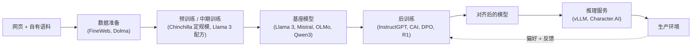

# 7. 真实团队在生产环境里怎么做

每一个真实系统，都是同一副生命周期骨架上的某一段或某几段：数据清洗并分词，
一次预训练或中期训练产出基座模型，后训练把它对齐，再由一套服务栈包起来推上
生产，反馈从末端绕回来。真正有差别的是：一个团队负责哪个阶段，以及那个阶段
最主要的成本或风险是什么。

## 设计在哪里分岔

| 系统 | 负责的阶段 | 方法 | 关键杠杆 | 什么时候管用 | 要当心的 | 影响的指标 |
|---|---|---|---|---|---|---|
| Hugging Face FineWeb | 数据准备 | 把 96 份 Common Crawl 快照过滤加去重，压成 15T token | 学出来的质量分类器（FineWeb-Edu） | 想要一份能压过既有公开数据集的开放预训练数据 | 只留下很小一部分；去污染是关键 | 每 token 带来的下游 benchmark 提升 |
| Ai2 Dolma / OLMo | 数据准备 + 开放基座 | 3T token 的开放语料，全程有文档 | 端到端可复现 | 研究数据整理；需要一个真正开放的基座 | 开放数据意味着法律和安全上的长期承诺 | 语料质量、可复现性 |
| Google DeepMind Chinchilla | 预训练 | 算力最优的 scaling 研究（400 多个模型） | 每个参数大约配 20 个 token | 算力预算固定，要定模型规模 | 对训练最优，对推理不是 | 固定算力下的 loss |
| Meta Llama 3 | 完整生命周期 | 数据 + 规模 + SFT + 拒绝采样 + DPO | 分阶段扩展上下文；后训练做得朴素 | 想要一个强的开放基座外加 instruct 模型 | 405B 的预训练是实验室量级 | benchmark 套件、人类胜率 |
| Mistral 7B | 预训练 + 服务 | GQA + 滑动窗口注意力 | 长上下文下 KV cache 很小 | 在小模型上做高效推理 | 7B 在难任务上有天花板 | tokens/秒、每 FLOP 的质量 |
| OpenAI InstructGPT | 后训练 | RLHF：奖励模型 + 带 KL 约束的 PPO | 把人类偏好当作奖励信号 | 让基座模型学会遵循指令 | 没有 KL 缰绳就会奖励作弊 | 偏好胜率 |
| Anthropic Constitutional AI | 后训练 | 对着一份成文宪法做 RLAIF | 用 AI 反馈取代人工标注 | 不靠大批标注员也能把对齐做上规模 | 宪法怎么写成了新的瓶颈 | 无害性 + 有用性 |
| DeepSeek-R1 | 后训练（推理能力） | 纯 RL 加规则奖励（GRPO） | 可验证的奖励，SFT 极少 | 有检查器的数学 / 代码 / 推理任务 | 只在能验证的地方给奖励 | AIME、MATH、代码 benchmark |
| vLLM | 服务 | PagedAttention + 连续批处理 | 把 KV cache 当操作系统的分页来管 | 要高吞吐、低成本的服务 | 工程复杂度 | 吞吐（最高是朴素服务的 24 倍）、每 token 成本 |
| Character.AI | 服务 | INT8 + MQA + 跨轮前缀 KV cache | 多层次地激进削减 KV | 用很低的成本扛 20k+ QPS 的对话 | 质量和量化之间的取舍 | 每次查询成本、tokens/秒 |

## 共用的那条流水线

放到生命周期这个框架下，上面这些其实是同一副骨架的不同阶段。数据配方定下
能力上限；后训练决定模型能不能用、安不安全；服务决定单位经济算不算得过来。
一个完整的面试回答，会把问题精确地放到某一个阶段上，然后就那个阶段最主要的
成本展开推理。

## 这些系统（一手资料）

- **Hugging Face** [FineWeb: decanting the web for the finest text data at scale](https://huggingface.co/spaces/HuggingFaceFW/blogpost-fineweb-v1)：从 96 份 Common Crawl 快照里得到的 15T token 开放预训练集，过滤和去重的配方都有文档和消融实验。*（数据配方）*

- **Ai2** [Dolma: an Open Corpus of Three Trillion Tokens for Language Model Pretraining Research](https://arxiv.org/abs/2402.00159)：一份完全开放的 3T token 语料和配套工具，也是开放基座模型 OLMo 背后的数据。*（数据配方）*

- **Google DeepMind** [Training Compute-Optimal Large Language Models (Chinchilla)](https://arxiv.org/abs/2203.15556)：400 多个模型说明，模型规模和 token 数应当一起放大，大约每个参数配 20 个 token；等算力下，70B 的 Chinchilla 打过 280B 的 Gopher。*（训练决策）*

- **Meta** [The Llama 3 Herd of Models](https://ai.meta.com/research/publications/the-llama-3-herd-of-models/)：一份端到端的开放配方，数据整理很讲究，上下文分阶段扩展，后训练是 SFT 加拒绝采样再加 DPO。*（完整生命周期）*

- **Mistral** [Mistral 7B](https://mistral.ai/news/announcing-mistral-7b/)：分组查询注意力配上滑动窗口注意力，把 KV cache 缩小，让一个 7B 模型能便宜地服务长上下文，并且打过更大的模型。*（架构 + 服务）*

- **OpenAI** [Aligning language models to follow instructions (InstructGPT)](https://openai.com/index/instruction-following/)：用奖励模型加带 KL 惩罚的 PPO 做 RLHF，在指令遵循上，1.3B 的模型比 175B 的 GPT-3 更受偏好。*（后训练）*

- **Anthropic** [Constitutional AI: Harmlessness from AI Feedback](https://www.anthropic.com/research/constitutional-ai-harmlessness-from-ai-feedback)：对着一份简短的成文宪法做 RLAIF，取代了大部分人工的有害性标注，比朴素 RLHF 既更有用也更无害。*（后训练）*

- **DeepSeek** [DeepSeek-R1: Incentivizing Reasoning Capability in LLMs via Reinforcement Learning](https://arxiv.org/abs/2501.12948)：纯 RL 加规则奖励（GRPO），在几乎不做 SFT 的情况下长出了思维链和自我纠错。*（后训练，推理能力）*

- **vLLM** [Easy, Fast, and Cheap LLM Serving with PagedAttention](https://blog.vllm.ai/2023/06/20/vllm.html)：像操作系统的虚拟内存那样给 KV cache 分页，再加上连续批处理，吞吐最高做到朴素服务的 24 倍。*（服务）*

- **Character.AI** [Optimizing AI Inference at Character.AI](https://blog.character.ai/optimizing-ai-inference-at-character-ai-2/)：INT8、多查询注意力，以及一棵树状的跨轮 KV cache，用极小的成本扛住每秒 2 万多次查询。*（服务）*

> **Model Zoo。** 上面这些关键模型都有验证过的架构图可以直接看：
> [Llama 3 8B](https://www.neurarch.com/?import=https://raw.githubusercontent.com/neurarch-ai/awesome-llm-model-zoo/main/architectures/llama3-8b/model.json)、
> [Mistral 7B](https://www.neurarch.com/?import=https://raw.githubusercontent.com/neurarch-ai/awesome-llm-model-zoo/main/architectures/mistral-7b/model.json)、
> [DeepSeek-V3](https://www.neurarch.com/?import=https://raw.githubusercontent.com/neurarch-ai/awesome-llm-model-zoo/main/architectures/deepseek-v3/model.json)、
> [OLMo 7B](https://www.neurarch.com/?import=https://raw.githubusercontent.com/neurarch-ai/awesome-llm-model-zoo/main/architectures/olmo-7b/model.json)。
> 每一张图都在真实维度下做过端到端的形状检查。完整索引：
> [github.com/neurarch-ai/awesome-llm-model-zoo](https://github.com/neurarch-ai/awesome-llm-model-zoo)。
