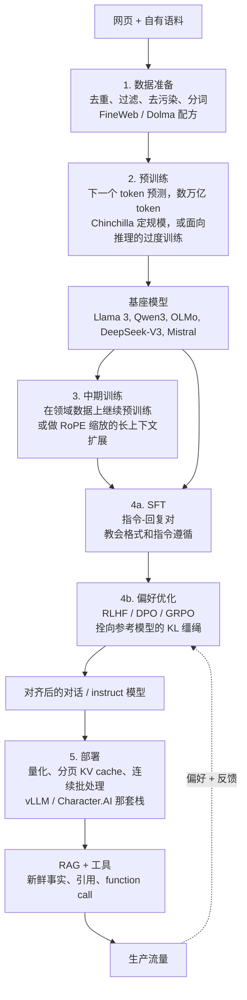

# 9. 小结

## 一页回顾

- **先把五个阶段说出名字，再谈规模。** 数据准备、预训练、中期训练、后训练、
  部署。多数产品团队是从基座模型切进去的；前两个阶段在上游，而且是共享的。
- **几乎不会是从零预训练。** 对产品团队来说，正确答案几乎永远是：拿一个开放
  基座（Llama 3、Qwen3、OLMo）在自有领域数据上做中期训练，再后训练让它遵循
  指令。
- **数据质量就是能力上限。** 模型质量被数据卡住的时候，离被架构卡住还早得很。
  去重、质量过滤、以及针对评估集的去污染都没得商量。一个不附去污染说明的
  benchmark 数字毫无意义。
- **Chinchilla 最优是给训练用的，不是给服务用的。** 算力最优的经验法则（大约
  每个参数配 20 个 token）最小化的是训练算力。如果你要大规模服务，就该有意
  越过那个点，把一个更小的模型过度训练（Llama 3 8B 大约是每参数 1800 个 token），
  让推理永远便宜。
- **后训练有四种方法，把它们串在一起的是那根 KL 缰绳。** SFT 教格式，DPO 是
  便宜又稳的偏好默认选项，需要可复用奖励模型时上 RLHF（PPO），奖励可验证时
  （数学、代码）上 GRPO。每一种方法都需要一根拴在参考策略上的 KL 缰绳。撒手
  模型就会奖励作弊。
- **持续花钱的是推理，不是训练。** decode 受显存带宽限制。卡住吞吐的是 KV
  cache，不是 FLOPs。可用的杠杆是分页 KV（vLLM）、GQA、连续批处理、前缀缓存、
  投机解码和量化。每一步压缩都要有评估把关。
- **事实靠 RAG，行为靠微调。** 两者是叠加的。把它们搞混是最常见的产品错误。
- **安全是量出来的，不是宣称出来的。** 把攻击成功率、误拒率、越狱鲁棒性作为
  发布门槛来跟踪。默认对抗性绕过是持续发生的。

## 一页看懂生命周期

## 自测

答案是折叠起来的。每题先自己想一遍再打开。

1. 面试官说"给我们这个领域做一个 LLM"。你问的第一个问题是什么，答案最可能
   指向哪个阶段？

   

答案

   问 **公司今天从现成 API 拿不到的能力是什么**，这等同于在问：到底是什么缺口
   值得自己拥有权重。第 [1](01-clarifying-requirements.md) 节的对话就是从这个
   问题开的头，而答案指向的是阶段，不是模型。在本章那个场景里，缺口是敏感法律
   文书的数据驻留要求，加上领域术语和引用格式，这个组合指向的是**在开放基座上
   做中期训练再加后训练**，也就是阶段 3 和 4，不是从零预训练。同一节的经验法则
   表还映射了其他常见说法："照我们的风格指南写"只需要后训练，"我们要 200K
   上下文"是作为上下文扩展的中期训练，只有"给一门新语言做一个新的基础模型"才
   真的属于阶段 2。谈规模之前先说清楚问题属于哪个阶段，因为明明中期训练就能
   解决却张口"我们要预训练"，是挂掉面试最快的方式。

   

2. 一个团队用 280B token 训了一个 70B 模型。Chinchilla 说大约每个参数配 20 个
   token。他们算力最优吗，该不该补救？

   

答案

   不最优，而且是严重训练不足：280B token 配 70B 参数是每参数 4 个 token，比
   大约 20 的 Chinchilla 比例**低了大概五倍**，和 Gopher 犯的是同一种错（280B
   模型只训了 300B token）。按第 [3](03-pretraining-and-scaling.md) 节里的算术
   自己算一遍：他们的预算是 $C \approx 6ND \approx 1.2 \times 10^{23}$ FLOPs，
   把 $D = 20N$ 代进 $C = 120N^2$ 得到 $N = \sqrt{C/120} \approx 31$B 参数配
   大约 630B token，这才是同样这笔钱下算力最优的分法。所以在等算力下，一个约
   31B 的模型本会赢过他们的 70B，正是"70B 打赢 280B Gopher"那个 Chinchilla
   结论。要不要补救取决于你在优化哪份成本，而补救办法通常不是"接着往这个 70B
   里灌 token"：如果这个模型要大规模服务，70B 的 decode 会一直很贵，面向推理
   的做法是训一个**更小、并且有意越过自身最优点过度训练**的模型，就像 Llama 3
   8B 那样（大约每参数 1800 个 token）。只有当训练算力才是那份卡死的成本、而且
   非要这个参数量不可时，把原来那次训练继续跑下去才说得通。

   

3. DPO 既没有奖励模型也没有 RL 循环，为什么还要一个参考模型和一个 $\beta$ 参数？

   

答案

   因为 **DPO 是把 KL 缰绳吸收进了 loss 里，而不是把它去掉了**。RLHF 的最优策略
   有闭式解 $\pi^{\ast}(y \mid x) \propto \pi_{\text{ref}}(y \mid x)\exp(r(x,y)/\beta)$，
   把它代回 Bradley-Terry 目标，正是这一步把偏好学习变成了一个普通的分类 loss，
   于是参考模型作为隐式奖励的基准，活在 $\log(\pi_{\theta} / \pi_{\text{ref}})$
   这个对数比里。没有这个锚，策略就没有可比对的东西，会漂到退化解上去。$\beta$
   就是 PPO 里那个 KL 温度：$\beta$ 小，策略可以离参考模型很远（优化更狠，漂移
   风险更大）；$\beta$ 大，就把它拉在附近。能把这一点讲出来，是 DPO 追问上最强
   的信号（第 [4](04-post-training.md) 和第 [8](08-interview-qa.md) 节）；再往前
   一步是**似然位移**（likelihood displacement）：缰绳还拴着，但只看间隔的目标
   仍然允许被选回复的绝对对数概率往下掉，所以要直接盯着那个对数概率，而不是
   信那个间隔。

   

4. 后训练跑完了，MMLU 比基座模型掉了 4 分。发生了什么，你怎么诊断？

   

答案

   这就是**对齐税**：在优化格式和偏好的过程中，通用能力退化了。常见原因有三个：
   全量微调且没有混通用回放数据（灾难性遗忘）；KL 缰绳太松，策略漂离了基座
   分布；或者根本是评估本身的假象，不是真的退化。诊断方法是对流水线做二分：把
   基座、只做过 SFT 的 checkpoint、以及偏好优化之后的 checkpoint 在同一套评估上
   都跑一遍，在动手改任何东西之前先把退化定位到某一个阶段。然后先查最便宜的
   那个解释，也就是**训练和服务之间的 chat 模板漂移**（第
   [6](06-serving-and-scaling.md) 节），因为轮次格式解析错了，在评测框架上看
   起来跟能力退化一模一样。如果退化是真的，而且落在偏好优化这一段，就去看
   实测的 KL 和参考模型差多少，把 $\beta$ 调大；如果落在 SFT 或中期训练这一段，
   第 [6](06-serving-and-scaling.md) 节的对策就适用：优先用 LoRA 而不是全量微调、
   混回一部分通用数据、把学习率调低。最后，把这 4 分和后训练本该改善的东西
   放一起掂量：第 [2](02-the-five-stages.md) 节说得很清楚，每个阶段有各自的
   指标，而后训练的指标是偏好胜率，不是 MMLU。

   

5. 你的服务成本是每月 \$2M，现在要砍一半。按你会采用的顺序说三个杠杆，以及
   每个的风险。

   

答案

   按"质量代价最低的先上"来排，因为 decode 受显存带宽限制，账单跟着每 token
   搬运的字节数走。**第一，INT8 量化**（权重，还有 KV cache，Character.AI 就是
   两个都量化）：它把每 token 读的字节数减半，decode 吞吐大约翻倍，把一个 70B
   模型从 140 GB 压到 70 GB，因而直接减少 GPU 数量。风险是轻微的质量退化，所以
   要有评估把关，不过第 [5](05-inference-economics.md) 节说 INT8 基本无损。
   **第二，把服务栈修对**：用 vLLM，开 PagedAttention、连续批处理，以及共享系统
   prompt 的前缀缓存，这能把朴素连续 KV 分配浪费掉的那 60% 到 80% 显存收回来，
   并且在完全不动模型的前提下把吞吐做到朴素服务的最高 24 倍。这里的风险是工程
   复杂度，不是质量；第 [6](06-serving-and-scaling.md) 节还补了一句：把交互链路
   和批处理链路拆开，才不会让一个长批处理任务把交互的 p95 顶上去。**第三，把
   模型本身变小**：在硬性评估把关下上 INT4，或者蒸馏成更小的学生模型。它排在
   最后，是因为这是唯一直接拿答案质量去换的杠杆，而且蒸馏还要额外付一次训练的
   钱。

   

6. 有人说"我们把所有内部文档拿去微调模型就行了"。请给出微调是正确答案、而不是
   RAG 的确切条件，并解释为什么两者常常是叠加使用的。

   

答案

   **行为靠微调，事实靠检索。** 当缺口在于模型怎么写、怎么排版、怎么推理、怎么
   拒答（引用格式、输出 JSON schema、语气、工具调用语法、拒答策略），而且这个
   行为稳定到值得烤进权重时，微调是对的。当缺口在于事实时，RAG 是对的，具体说
   是第 [6](06-serving-and-scaling.md) 节里三个条件中的任意一个：知识会变、答案
   必须给出处、语料大于模型容量。决定性的边界是更新频率：一旦知识变化的速度超过
   你重训加重新部署的节奏，权重在结构上就永远是过期的，检索是唯一跟得上的机制。
   另外注意"我们所有的内部文档"是原始文本，不是指令对，所以从机制上说它是一份
   中期训练语料，不是 SFT 数据（第 [8](08-interview-qa.md) 节），而中期训练改变
   的是模型知道什么，照样给不出出处。两者之所以叠加，是因为它们的失败方式不同
   且互补：检索会漏掉一条它根本没找到的事实，权重会自信地说出它背下来的那个
   过期版本，所以生产系统都是风格靠微调、事实靠检索，本章那个法律场景的方案
   正是这么做的。

   

## 延伸阅读

- 本章的收官实践：[把它们拼起来：完整的方案](10-putting-it-together.md)，本章
  的每一个选择都在那里为这个场景一次性拍板、算清成本、在另外两组约束下重搭
  一遍，并压缩成一个可运行的单文件算力最优规划器。
- 包含全部推导、案例研究和数学的完整参考：
  [../../topics/13-llm-lifecycle.md](../../topics/13-llm-lifecycle.md)
- 后训练深入（SFT、LoRA、奖励建模、PPO、DPO、GRPO）：
  [../../topics/05-post-training-pipeline.md](../../topics/05-post-training-pipeline.md)
- 数据整理与预训练（FineWeb、Dolma、Chinchilla、MoE）：
  [../../topics/14-data-curation-and-pretraining.md](../../topics/14-data-curation-and-pretraining.md)
- 继续预训练与长上下文适配（RoPE 缩放、YaRN）：
  [../../topics/15-continued-pretraining-and-long-context.md](../../topics/15-continued-pretraining-and-long-context.md)
- KV cache 与长上下文服务：
  [../../topics/02-long-context-and-kv-cache.md](../../topics/02-long-context-and-kv-cache.md)
- 大规模推理服务（PagedAttention、投机解码、批处理）：
  [../../topics/04-inference-serving-at-scale.md](../../topics/04-inference-serving-at-scale.md)
- Model Zoo（Llama 3、DeepSeek-V3、OLMo、Mistral、Qwen3、GPT-2 的验证过的架构图）：
  [github.com/neurarch-ai/awesome-llm-model-zoo](https://github.com/neurarch-ai/awesome-llm-model-zoo)
