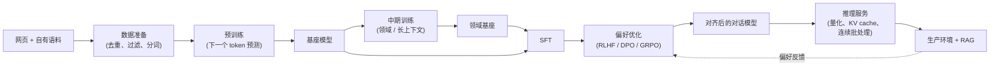

# LLM 的生命周期

> 本章是英文原版的中文译本，原文见 [book/llm-lifecycle/](../../book/llm-lifecycle/)。译文和原文同步维护，发现问题请提 issue。

面试官很少会直接说"设计一个 LLM"。他们会说：**"公司想为某个领域做一个自己的
语言模型。从数据到上线，把整个构建过程讲一遍：钱花在哪里，风险在哪里。"**

这里的坑是一上来就说"微调 GPT"或者"我们从头预训练一个 70B"。用 LLM 做东西
分五个明确的阶段，每个阶段有自己的数据、自己的算力形态、自己的失败方式和
自己的评估。真正的信号是：能把这几个阶段说出名字，把手头的问题放到正确的
阶段里（几乎从来不是从零预训练），然后把两项最大的开销讲明白：前端的
**数据质量**，以及后端**规模化之后的推理**。

## 各节内容

1. [澄清需求](01-clarifying-requirements.md)：一段对话，把真正的问题问清楚，它属于哪个阶段，以及放错阶段的后果。
2. [五个阶段](02-the-five-stages.md)：数据准备、预训练、中期训练、后训练、部署，每个阶段吃什么、产出什么。
3. [预训练与 scaling](03-pretraining-and-scaling.md)：算力最优的模型规模、Chinchilla、转向面向推理的过度训练，以及两者的公式。
4. [后训练](04-post-training.md)：SFT、RLHF、DPO、GRPO 四种方法，各自什么时候用，以及把它们拴在一起的那根 KL 缰绳。
5. [推理经济学](05-inference-economics.md)：为什么推理主导成本，KV cache 为什么是瓶颈，量化，以及关键取舍。
6. [服务与扩展](06-serving-and-scaling.md)：RAG 对比微调、服务架构，以及瓶颈表。
7. [真实团队在生产环境里怎么做](07-how-teams-do-it-in-production.md)：点名的公司、分歧在哪里，附一手资料链接。
8. [面试问答](08-interview-qa.md)：常问的、有坑的、常答错的问题，给出清楚的答案。
9. [小结](09-summary.md)：回顾、五阶段 mermaid 图、自测题和延伸阅读。
10. [把它们拼起来：完整的方案](10-putting-it-together.md)：一套默认技术栈，把场景从头到尾搭起来并算清算力和成本，同一个方案在三组不同约束下的样子，以及一个最小的可运行生命周期规划器。

## 一页看懂生命周期

第一次读请按顺序读，每一节都建立在前一节之上。每一节开头都是面试官真正会问的
那个问题，然后给出回答。
