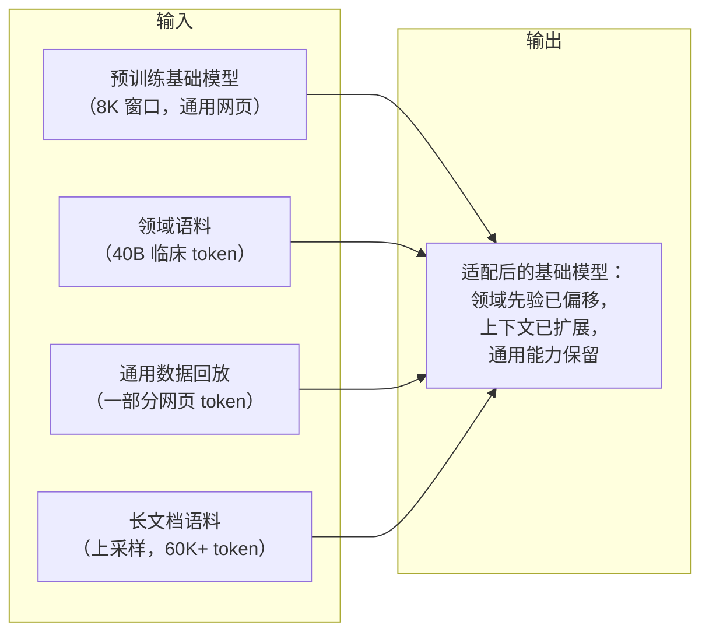

# 2. 两条轴线

上一节冒出来两个需求，看着相关，机制上却彼此独立。在伸手拿任何工具之前，
先把它们说清楚。

## 适配轴：领域知识

基础模型是在通用网页上训的。临床词汇、缩写、病历的书写风格、诊断推理，在
它的训练数据里占比都不够。领域适配的输入是一个基础模型加一大批领域内语料，
输出是一个先验已经向临床分布偏移、但没有忘掉网页数据教给它的通用推理的
基础模型。

目标函数不变：还是 next-token 的交叉熵。变的是语料、学习率调度和数据混合
比例。没有新的 loss，也没有新的架构。

**这条轴上的风险是灾难性遗忘。** 在通用网页上收敛过的优化器，如果拿不到任何
奖励那些极小值的梯度信号，就会把它们覆盖掉。通用 benchmark 悄悄往下掉，领域
benchmark 明显往上涨。解法是回放（replay）：在训练混合里保留一部分通用数据，
让旧的极小值始终处于梯度压力之下。

## 长度轴：上下文窗口

基础模型是按 8K token 预训练的。它的位置编码从没见过超出这个范围的位置对应
的角度。直接喂一篇 60K token 的文档不会自动生效：模型看到的是从没训过的
旋转角度，超出真实窗口之后就开始吐垃圾。把 config 里的
`max_position_embeddings` 改成 128000，除了改大一个数字之外什么都不会发生。

上下文扩展的输入是一个基础模型，加一套位置编码重缩放配方，再加一批真正的
长文档语料。输出是一个能在整个扩展后长度上连贯地做 attention 的基础模型。

**这条轴上的风险是短上下文回归。** 最简单的重缩放（均匀的位置插值）把所有
频率维度等比压缩，包括承载相邻 token 局部顺序的高频维度。扩展后的模型在
2K 的 prompt 上反而变差。之后每一种更好的方法（NTK-ABF、YaRN、LongRoPE）
都是在想办法保住这些高频维度，只重缩放那些承载长距离位置信息的低频维度。

## 整条流水线的输入和输出

## 为什么两条轴线相互独立

一个模型可以领域先验正确、上下文窗口却是坏的；也可以窗口很大、领域知识为零。
扩上下文教不会领域，领域微调也拉不长窗口。拿解决一个问题的工具去解另一个，
是浅层回答的典型破绽。

实践中这两轮往往顺序执行：先领域适配，再上下文扩展（Code Llama 的配方）；
或者在一个继续训练阶段里交错进行（Qwen2.5）。不管哪种，都要对每条轴线单独
推理，套上它自己的失败模式防护，用它自己的评估把关，然后才能宣布成功。

## 面试官在听什么

- 候选人能不能不用提示就说出两条轴线？
- 他们是否意识到，在领域数据上"接着训就行"得不到长上下文，"把最大位置调大
  就行"得不到领域知识？
- 他们会不会在被问之前就主动提到每条轴线的失败模式（遗忘 vs 短上下文回归）？

在回答的头两分钟里就点出两条轴线和各自的失败模式，说明候选人要么设计过这种
系统，要么认真想过这个问题的结构。
