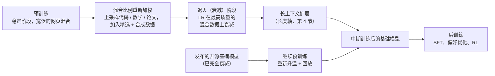
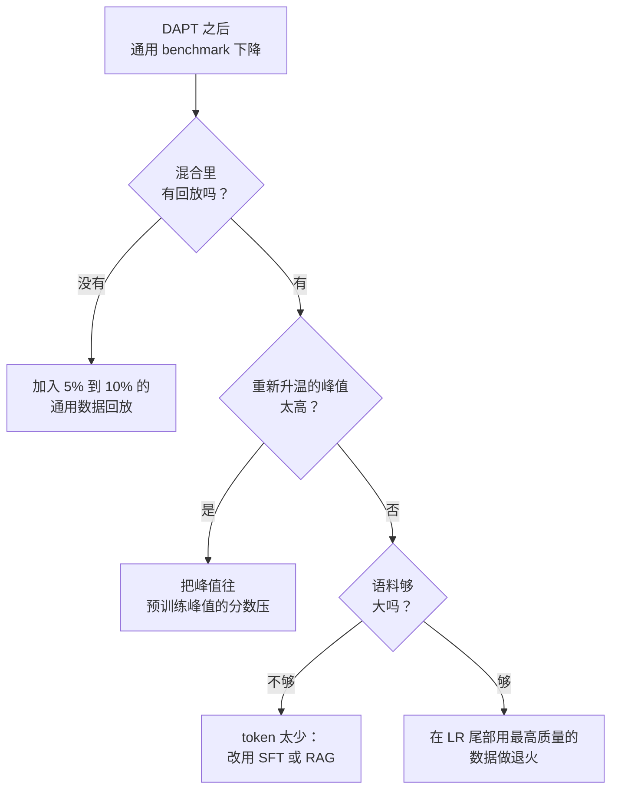

# 3. 中期训练阶段

## "中期训练"现在指什么

预训练和后训练之间的这个阶段，过去叫"继续预训练"，被当成一个可有可无的附加
项。现在它已经是一个有名字的阶段，有自己的预算、自己的数据、自己的评估：token
量介于预训练和后训练之间，花在改变数据分布而不是改变目标函数上，目标是领域
和语言扩展、长上下文扩展、用精选和合成数据做质量升级，以及为后训练做准备
（[A Survey on LLM Mid-Training](https://arxiv.org/abs/2510.23081)）。

做这件事的是两类截然不同的团队，面试里常常把它们混为一谈。

| | 实验室视角的中期训练 | 从业者视角的继续预训练 |
|---|---|---|
| 起点 | 自家的基础模型，训练进行到一半，优化器状态完好 | 别人发布的基础模型，学习率已经完全衰减 |
| 主要旋钮 | 数据混合比例及其调度 | 领域语料加一个回放比例 |
| 学习率 | 仍处于稳定阶段，衰减由你掌控 | 必须从底部重新升温，再重新衰减 |
| token 预算 | 几千亿，是整个训练里有分量的一段 | 几十亿，跟预训练比是四舍五入的误差 |
| 典型目标 | 能力播种、质量升级、长上下文、RL 就绪 | 领域先验、语域、词汇、更长的窗口 |
| 失败模式 | 一种混合比例抬高了一个评估，却悄悄拖累了另一个 | 通用能力的灾难性遗忘 |



本节剩下的部分先讲实验室视角的旋钮，因为它们解释了从业者配方为什么长成那个
样子；然后讲大多数产品团队真正在跑的 DAPT 机制。

## 数据混合比例是主旋钮

中期训练改变的是模型看到什么，不是它怎么学。一套混合比例就是一组按领域划分
的采样权重，而权重是一个有可测后果的设计决策：高价值的稀缺领域（代码、数学、
论文、目标语言）被上采样到远高于它们在网页上的自然频率，嘈杂的网页文本被
下采样，精选或合成数据按每个目标各自选定的比例进入。设这些权重可以不靠猜，
有学习式的方法：训一个小的代理模型，看它在哪些领域离参考模型最远，据此重新
加权（[DoReMi](https://arxiv.org/abs/2305.10429)）。

实际的难处在于，每个候选混合比例都跑一次完整训练是付不起的。答案是
**microanneal**：从稳定阶段取一个检查点，在候选混合比例上跑一小段衰减，把
评估指标的变化当作这套混合在大规模下效果的廉价估计。OLMo 2 把这套做法系统
化了，并且把中期训练的混合数据本身（Dolmino）作为独立于预训练语料的成果
发布出来（[2 OLMo 2 Furious](https://arxiv.org/abs/2501.00656)）。

同一个技巧反过来用，就是**数据质量探针**：当拿不准一个小型专门语料值不值得
加进去时，带上它退火一次，不带它再退火一次，比一比。Llama 3 正是这样用退火
实验来评判小型领域数据集的
（[The Llama 3 Herd of Models](https://arxiv.org/abs/2407.21783)）。这个视角
值得在面试里说出来：退火不只是一种训练调度，它还是你手上给一个数据集估值
最便宜的实验。

## 退火，以及调度为什么要有稳定阶段

余弦衰减把你绑死在一个终点上：调度是按总 token 数定义的，所以不能提前停，也
不能分叉。warmup-stable-decay 这一族解决了这个问题：训练的大部分时间学习率
保持恒定，只在最后衰减，这样稳定阶段的每一个点都是合法的分叉点，而且大部分
loss 的改善都集中在一段又短又便宜的衰减里
（[MiniCPM](https://arxiv.org/abs/2404.06395)）。

正是这个形状让中期训练成为一个可操作的工程过程：

- **分叉，不要重启。** 一个稳定阶段的检查点可以喂给很多次衰减运行（不同的
  混合比例、不同的上下文长度、不同的能力目标）。
- **把质量花在刀刃上。** 衰减阶段是模型每个 token 可塑性最强的时候，所以最好
  的数据应该放在这里，而不是均匀抹在整个训练里。
- **在尾部做平均。** 把衰减末尾附近的几个检查点做平均，是对最终基础模型一种
  标准的、几乎免费的方差削减。

## 能力注入与 RL 就绪

中期训练拿到独立预算的最新理由是：它决定了后训练到底能不能起作用。在中期
训练阶段引入推理风格的数据（长思维链轨迹、QA 格式的题目、经过验证的解答），
会改变之后强化学习还能加上多少：比较不同模型家族的工作发现，中期训练里高
质量的数学语料加上长 CoT 的 QA 数据，能显著抬高之后 RL 所能达到的天花板，而
不同基础模型家族在相同 RL 配方下的分化，可以追溯到它们在这个阶段看到了什么
（[OctoThinker](https://arxiv.org/abs/2506.20512)）。

有两个推论要明确说出来，因为都是常见的面试追问。第一，**在 SFT 之前放入指令
形态的数据是有意为之，不是后训练泄漏进了预训练**：预先混入适量的指令和 QA
格式，会让之后的 SFT 更便宜、更稳定。第二，**同一个做法也是 benchmark 污染
最容易溜进来的地方**，因为精选的 QA 和合成的推理数据从构造上就和 benchmark
题目长得像，所以去污染这一步也必须对中期训练的混合数据跑一遍，而不只是对
预训练语料（见[给模型做 Benchmark，第 4 节](../benchmark-eval/04-contamination-and-validity.md)）。

## 中期训练的评估：什么该动，什么时候动

这个阶段有自己的一套测量纪律，既不同于预训练的 loss 曲线，也不同于后训练的
偏好分数。

| 信号 | 反映的是 | 为什么属于这个阶段 |
|---|---|---|
| few-shot 能力 benchmark（代码、数学、领域） | 注入的能力 | 改混合比例就是为了买它 |
| 完整的通用评估套件，前后各跑一次 | 遗忘 | 抬高一条轴、压低另一条轴的混合是净亏损 |
| 长上下文检索与聚合（RULER 风格） | 长度轴 | 扩展通常在这个阶段做，所以也在这个阶段测 |
| 每个领域一个留出切片上的 loss | 某个领域权重有没有起作用 | 便宜、连续，而且在任何 benchmark 动之前就能看到 |
| 后训练探针（短 SFT 加一小轮 RL） | RL 就绪 | 唯一能抓住"基础模型看着没问题但对 RL 没反应"的信号 |

最后一行是大家最容易漏的。一个基础模型可以在所有静态 benchmark 上都很健康，
却仍然是强化学习的糟糕起点，而在投入后训练预算之前发现这一点的唯一办法，就是
跑一个小探针。

## 领域自适应预训练（DAPT）

领域自适应预训练保留自监督的 next-token 目标，换掉语料：不再喂宽泛的网页，
而是喂医学文本、法律文书、私有代码库或者某种专门语言，让基础模型的先验向
该领域的分布偏移。经典证据（Gururangan 等，"Don't Stop Pretraining"）表明，
第二阶段的领域内预训练在生物医学、计算机科学、新闻和评论四个领域都能提升
下游领域任务，而且任务自适应阶段还能在它之上再叠一层。

起效的最低规模是几十亿 token 的、相对干净的领域内文本。低于这个门槛，模型
会在小数据集上过拟合，忘掉的比学到的多。如果手上只有几万篇文档，改用检索
或者一轮小规模 SFT。

## 灾难性遗忘与回放

核心风险是灾难性遗忘：在一个窄领域上猛优化，模型的通用推理、指令遵循和领域
外的流畅度会悄悄退化。原本编码了广泛能力的权重漂移过去，去拟合新的分布。


*通用 benchmark 的跌幅（红色，左轴）在回放超过训练混合的大约 5% 之后急剧
下降。领域 benchmark 的增益（绿色）随回放增加只是温和回落。10% 的回放比例
是一个实用的平衡点。示意图；真实数字取决于领域和模型规模。*

**回放是首要防线。** 把一部分通用数据混回领域语料，让梯度永远不会彻底忘掉
旧目标。哪怕只回放百分之几的通用 token，也能大幅减少遗忘，而几乎不拖慢领域
上的进步（Mila，"Simple and Scalable Strategies to Continually Pre-train"）。
它起作用的原因：遗忘发生在优化器覆盖旧极小值的时候，因为当前 batch 里没有
任何东西奖励保留它们。交错放入通用数据，就让这些极小值一直处于梯度压力之下。

## 学习率的重新升温调度

基础模型结束预训练时，学习率已经衰减到接近零。有三种选择，只有一种行得通：

- **从衰减后的底部接着训。** 梯度太小，学不到新领域。训练停滞。
- **从原来的峰值接着训。** 扰动太大。收敛好的权重被冲垮，模型什么都忘了。
- **从底部重新升温到一个适中的峰值，再重新衰减。** 这才是正确做法。这个适中
  的峰值是原预训练峰值的一个分数，大到足以取得进展，又小到能保护已收敛的
  表示。

```python
import math
def rewarm_lr(step, warmup, total, peak):   # modest peak = a fraction of the original pretrain peak
    if step < warmup:
        return peak * step / warmup                    # linear re-warm up from the decayed floor
    p = (step - warmup) / (total - warmup)             # 0..1 progress through the re-decay phase
    return 0.5 * peak * (1 + math.cos(math.pi * p))    # cosine re-decay back toward zero
# e.g. rewarm_lr(step=100, warmup=100, total=1100, peak=3e-5) -> 3e-05 (peak reached at warmup end)
```

重新升温的峰值是最重要的单个超参数：它直接在遗忘和领域学习之间做权衡。Mila
的工作表明，重新升温、重新衰减，再加一小部分回放，能让继续预训练用一小部分
算力达到从零重训的效果。

训练后期一个有用的细化：在最后阶段学习率衰减到零的过程中，上采样质量最高、
和领域最相关的数据。前沿预训练在主训练尾部用的那个"退火"技巧，在这里同样
适用，只是规模小一些。

## Adapter：一种有界的替代方案

LoRA 和 QLoRA（Q 指量化：把冻结的基础权重用更少的位数存储以省显存）冻结基础
模型，只学习一个加到权重矩阵上的低秩增量。因为基础权重根本动不了，遗忘从
构造上就是有上界的。这是它们相对于完整继续预训练的核心优势。

代价是 adapter 能吸收的领域先验有更低的天花板。一个小 adapter 无法重新布线
模型的整个分布；它能在推理时改变模型的行为，但不能深度改写基础模型的事实
先验或词汇。分布偏移大的场景，要的是带回放的完整继续预训练；只是轻推一下，
或者遗忘预算卡得很严，LoRA adapter 更安全也更便宜。

## 对比：继续预训练 vs 监督微调

两者都是"在我的数据上再训一训模型"，所以容易混淆：同一个 trainer，同样的
硬件，往往还是同一个库。真正不同的机制是目标函数瞄准的对象和数据的形态，而
这两个差别决定了其余一切。

| 维度 | 继续预训练（DAPT） | 监督微调（SFT） |
|---|---|---|
| 在预训练基础模型上继续做梯度更新 | 是 | 是 |
| 有遗忘风险，需要通用评估门槛 | 是（靠回放缓解） | 是（较轻；步数少，偏移窄） |
| 目标函数 | 原始文本每个 token 上的 next-token loss | 给定 prompt 时响应 token 上的 loss（prompt token 被 mask 掉） |
| 数据形态 | 无标注文档，几十亿 token | prompt-响应对，几千到百万级样本 |
| 模型里动的是什么 | 宽泛的先验：词汇、语域、事实密度 | 条件行为：格式、风格、任务遵从 |
| 典型调度 | 重新升温到适中峰值，长的重新衰减，回放混合 | 小学习率的短训练，几个 epoch |

这个区别只在一个问题上改变设计：差距在于模型知道什么，还是在于它怎么回答？
如果模型缺的是领域先验，再多 SFT 样本对也补不上；如果模型只是回答格式不对，
跑一轮 DAPT 是一种昂贵的不解决问题的方式。

## 什么场景用哪个

| 选择 | 适用场景 | 而不是 |
|---|---|---|
| 带回放的完整继续预训练（DAPT） | 宽泛的分布偏移（一个领域或一种语言），且有几十亿领域内 token | 只做 SFT，它教的是格式不是先验；或者不带回放的 DAPT，它会遗忘 |
| LoRA 或 QLoRA adapter | 较轻的领域推动，遗忘必须从构造上有界，成本受限 | 对大分布偏移用完整 DAPT；adapter 在那里会碰到天花板 |
| 监督微调（SFT） | 差距是一个窄的行为或格式，需要几千个样本 | 需要新语域、新词汇或新事实先验的宽泛领域偏移 |
| 检索增强生成（RAG） | 差距是一批固定的事实，模型查一下就行 | 模型需要新风格、新语域或底层事实密度的领域 |
| 从零预训练 | 目标分布上根本不存在任何开源基础模型 | 任何存在可适配基础模型的场景；从零训是实验室级别的成本 |
| 通用数据回放（永远要） | 任何通用 benchmark 不许回退的完整继续预训练 | 省掉回放，然后不测就断言遗忘可以接受 |

**出处。** adapter 路线是 LoRA（Microsoft，2021）和它的量化形式 QLoRA（University of Washington，2023）；不训练的替代方案是 RAG（Meta FAIR，2020）。分布式完整训练栈借鉴了 ZeRO（Microsoft）和 Megatron-LM（NVIDIA）。

**工具。** 完整继续预训练和重新升温 / 重新衰减调度跑在 PyTorch（Meta）上，配合 DeepSpeed（Microsoft）或 Megatron-LM（NVIDIA）这类分布式训练框架，通过 Hugging Face Transformers 的 trainer 驱动。LoRA 和 QLoRA adapter 来自 PEFT 库，量化基础模型的情况再加上 bitsandbytes；SFT 用 TRL 或 Axolotl 在同一套栈上编排。RAG 作为不训练的替代方案，用 FAISS（Meta）这类向量索引加一个 embedding 模型搭起来，不涉及任何权重更新。回放只是训练流水线里的一个数据混合步骤，不是单独的库。

**实例。** 一个文档 AI 团队需要一个能流畅处理密集法律文书的基础模型，手上有几十亿 token 的干净领域内文本。因为这是语域和词汇上的宽泛分布偏移，团队选择带回放的完整继续预训练，而不是 SFT（只教格式、教不了新先验），也不是 LoRA adapter（能吸收的分布量有上限）。它混入一部分通用数据回放，避免整体 benchmark 悄悄回退，并把学习率从衰减后的底部重新升温到一个适中的峰值，而不是从底部接着训（会停滞）或从原峰值接着训（会抹掉基础模型）。假如团队只是需要模型查一组固定的法条，那根本不用训练，直接上 RAG；假如只是在严格的遗忘预算下轻推一下行为，就用 QLoRA adapter。晋级的门槛是前后各跑一遍完整的通用评估套件，而不是只看领域增益。

## 衡量成功：不要只报领域增益

前后各跑一遍完整的通用评估套件。一轮 DAPT 把领域 benchmark 抬高五分、把
MMLU 拉低四分，对产品来说通常是净亏损，而只有把回归当门槛你才看得见。遗忘
在领域切片内部是无声的，只有往外看才会显现。

配方：先把回归红线定好（就像需求对话里做的那样），DAPT 之后跑完整套件，只有
通过门槛才让适配后的基础模型晋级。每改一次调参都重新测。

## 实现与训练中的坑

继续预训练很少在领域指标上失败；它失败在你没测的地方。这里几乎所有的失败
都是遗忘、学习率设错，或者语料对目标来说太小，而 loss 曲线加上前后各一次完整
通用评估，这两个诊断能把它们全部暴露出来。


*训练运行的四种形状：健康收敛（train 和 val 一起下降）、过拟合（val 掉头向上，在那里早停）、学习率过高（loss 震荡或发散）、欠拟合（loss 居高不下且平坦）。示意图。*

| 问题 | 症状 | 修法 |
|---|---|---|
| 灾难性遗忘 | 领域指标上升，通用 benchmark 悄悄下降 | 往领域语料里混回 5% 到 10% 的通用数据回放，并以前后各跑一遍的完整通用套件为门槛 |
| 从衰减后的底部 LR 接着训 | loss 几乎不动，训练停滞 | 把学习率从底部重新升温到一个适中的峰值，再重新衰减 |
| 从原峰值 LR 接着训 | loss 飙升，已收敛的基础能力被抹掉 | 把重新升温的峰值限制在原预训练峰值的一个分数 |
| 语料太小（远少于十亿 token） | 模型死记这个窄集合，忘掉的比学到的多 | 改用 SFT 或 RAG，或者在 DAPT 之前收集更多领域内文本 |
| 训练中途 loss 尖峰 | 一个坏 batch 或过高的峰值引起突然发散 | 梯度裁剪到范数 1.0，调低重新升温的峰值，回退到上一个好的检查点并跳过那个 batch |
| 只报领域增益 | 领域涨几分，通用掉得更多，产品净亏损 | 先定好回归红线并用它阻止晋级，而不是只看领域切片 |
| adapter 用在超出它范围的宽泛偏移上 | LoRA 到平台期，吸收不了新语域或新词汇 | 宽泛的分布偏移用带回放的完整 DAPT；adapter 留给遗忘预算下的轻推 |

DAPT 之后某个通用 benchmark 回退了，按这个顺序查：



贯穿始终的一条线：一个没有用通用能力付过账的领域胜利，通常是一笔没测出来的
遗忘亏损，所以任何只报领域切片的 DAPT 结果都不要轻信。
