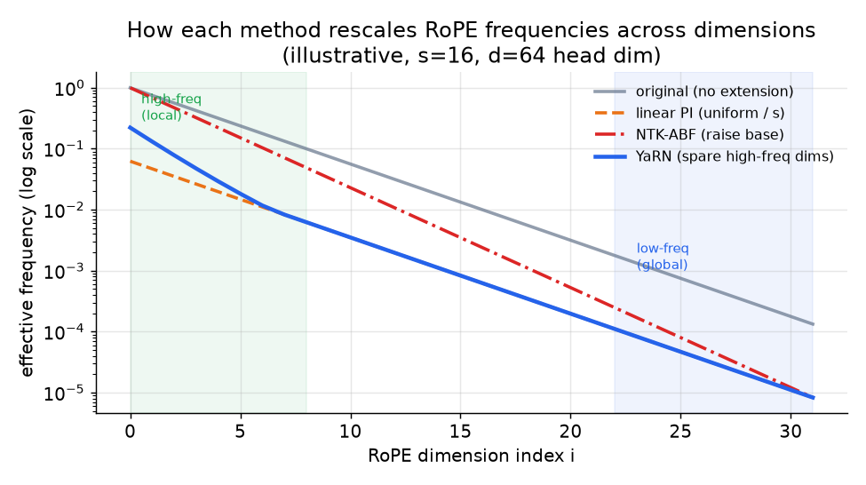

# 4. 上下文扩展

## 为什么 RoPE 是关键

现代基础模型用的是旋转位置编码（RoPE，把 query 和 key 向量旋转一个随位置
增大的角度，以此编码 token 的位置）。每个 head 里的第 $i$ 对维度，旋转的角度
正比于 token 位置乘以该维度的频率。这样 query 和 key 的点积只取决于两个位置
之间的相对偏移，而不是各自的绝对值，这正是上下文扩展便宜的原因：可以重缩放
这些频率，不用从零重训。学习得到的绝对位置表（GPT-2）没法这样扩展；那张表是
一个固定大小的查找表，对超出其长度的位置没有任何概念。

## 区分四种方法的数学

RoPE 给第 $i$ 对维度（每个 head 共 $d$ 维）分配的频率和每个位置的角度是：

$$\theta_i = b^{-2i/d}, \qquad \phi_i(m) = m \cdot \theta_i, \qquad i = 0, 1, \dots, \tfrac{d}{2} - 1$$

其中 base 为 $b$（通常是 10000）。记长度缩放比为
$s = L_{\text{new}} / L_{\text{orig}}$。

---

**线性位置插值（PI，Chen 等，2023）** 把每个频率都均匀除以 $s$，等价于压缩
位置索引，让位置 $L_{\text{new}}$ 映射回模型已经认识的范围：

$$\theta_i^{\text{PI}} = \frac{\theta_i}{s} \qquad \text{(same factor for all } i\text{)}$$

一小段继续训练（大约一千步）就能恢复质量。问题在于，所有频率都除以同一个
因子，会把编码局部顺序的高频维度挤在一起。相邻位置变得更难区分，短上下文
质量下降。

```python
def rope_freqs_pi(d, s, base=10000.0):        # d: per-head dim, s = L_new / L_orig
    theta = [base ** (-2 * i / d) for i in range(d // 2)]   # original per-dim RoPE freqs
    return [t / s for t in theta]             # linear PI divides every freq by the same s
# rope_freqs_pi(4, s=8)[0] -> 0.125  (theta_0 = 1.0, uniformly compressed by s=8)
```

---

**NTK-aware / 调整 base 频率（ABF，Code Llama）** 缩放的是 RoPE 的 base 而
不是位置。把 base 从 $b$ 提高到 $b'$，得到的是非均匀的重缩放：低频维度（$i$
大）动得多，高频维度（$i$ 小）动得少：

$$b' = b \cdot s^{d/(d-2)}, \qquad \theta_i^{\text{ABF}} = (b')^{-2i/d} = \theta_i \cdot s^{-2i/(d-2)}$$

```python
def rope_freqs_abf(d, s, base=10000.0):        # d: per-head dim, s = L_new / L_orig
    b2 = base * s ** (d / (d - 2))             # ABF raises the base instead of dividing positions
    return [b2 ** (-2 * i / d) for i in range(d // 2)]   # non-uniform: high-freq (small i) move least
# rope_freqs_abf(4, s=8)[0] -> 1.0  (i=0 high-freq dim preserved, unlike PI which gives 0.125)
```

Code Llama 把 base 从 10000 提高到 1000000。模型在 16K token 的序列上训练，
之后能可用地外推到 100K token 的输入，因为非均匀重缩放比均匀 PI 更好地保住了
局部分辨率。适度的扩展只需要很少甚至不需要微调。

---

**YaRN（Nous Research）** 把非均匀性明确化、原则化。它按每个 RoPE 维度的波长
在原上下文长度内完成多少圈完整旋转来分类：低频（长波长）维度做插值（除以
$s$），高频（短波长）维度几乎不缩放以保留局部顺序，中间频段用一个斜坡
$\gamma_i$ 混合：

$$\theta_i^{\text{YaRN}} = \gamma_i \cdot \theta_i + (1 - \gamma_i) \cdot \frac{\theta_i}{s}, \qquad \gamma_i \in [0,1]$$

```python
def rope_freq_yarn(theta_i, gamma_i, s):   # gamma=1 keep (high-freq), gamma=0 interpolate (low-freq)
    return gamma_i * theta_i + (1 - gamma_i) * (theta_i / s)   # per-dim blend of keep vs divide-by-s
# rope_freq_yarn(theta_i=1.0, gamma_i=0.0, s=8) -> 0.125  (low-freq dim fully interpolated)
```

其中 $\gamma_i = 1$ 表示该维度不缩放（高频），$\gamma_i = 0$ 表示完全插值
（低频）。YaRN 接着加了一个 softmax 温度修正（softmax 是把原始 attention 分数
变成概率的函数；它的温度是一个标量，用来把这个分布压平或者变尖），用来抵消
序列变长带来的熵增：

$$\text{Attn} = \text{softmax}\!\left(\frac{q^{\top} k}{t \sqrt{d}}\right), \qquad \frac{1}{\sqrt{t}} = 0.1 \ln s + 1$$

```python
import math
def yarn_logit_scale(s):          # softmax-temperature factor 1/sqrt(t) = 0.1 ln s + 1
    return 0.1 * math.log(s) + 1  # scales attention logits before softmax; 1.0 means no change
# yarn_logit_scale(s=1) -> 1.0  (no length increase -> no temperature correction)
```

收益：只用原预训练 token 量大约 0.1% 的数据，就能把上下文扩到 64K 和 128K，
而且短上下文的质量损失比均匀 PI 小得多。YaRN 成了激进扩展的默认配方。

---

**LongRoPE（Microsoft）** 把 YaRN 推广成一个完全靠搜索得到的、逐维度的重缩放
向量 $\{\lambda_i\}$，用进化搜索而不是闭式斜坡找出来：

$$\theta_i^{\text{LongRoPE}} = \frac{\theta_i}{\lambda_i}, \qquad \{\lambda_i\} = \arg\min_{\lambda}\; \text{PPL}\!\left(\text{model}_\lambda,\; \text{long text}\right)$$

扩展是渐进的（比如先 8 倍，微调，再扩一次，达到 2M+ token），另外还有一步
短上下文恢复：对短输入换回一个更小的缩放，让扩展后的模型在普通长度的文本上
不回退。教训是：最优的重缩放是非均匀的，而且和输入长度有关，所以最激进的
扩展是搜出来的，不是推导出来的。

---

**ALiBi（Train Short, Test Long）** 走的是完全不同的路：不重缩放 RoPE，而是
直接在 softmax 之前的 attention logits 上加一个线性距离惩罚 $-m \cdot |i - j|$，
其中 $m$ 是每个 head 各自的斜率。embedding 上不加任何位置编码。用 ALiBi 在短
上下文上训出来的模型，测试时不用微调就能外推到更长的输入。代价是 ALiBi 不是
RoPE 模型，所以对现有的 RoPE 基础模型不适用；它是预训练时做的架构选择，不是
事后改装。

---



*各方法如何按维度索引 $i$ 重缩放 RoPE 频率（对数坐标）。原始频率（灰色）
跨越很多个数量级：高频维度（$i$ 小，左侧）编码局部顺序；低频维度（$i$ 大，
右侧）承载全局位置。线性 PI（橙色）把所有维度都除以同一个 $s$，挤压了局部
维度。NTK-ABF（红色）通过改 base 天然就是非均匀的。YaRN（蓝色）明确地放过
高频端。示意图，$s = 16$，$d = 64$。*

## 长上下文数据：重缩放之后真正卡脖子的约束

重缩放 RoPE 告诉模型怎么表示长位置；在真正的长输入上继续训练，才教会它怎么
用这些位置。三条数据原则：

- **上采样长文档。** 网页以短页面为主。朴素的混合几乎不会给模型几千 token
  之外的任何梯度信号。把书籍、长代码文件、法律和科学文档、多文档拼接上采样，
  让每个 batch 里有实打实的一部分跨越目标长度。
- **要真实的长距离依赖，不要打包的短文档。** 把不相关的短文档拼起来填满一个
  128K 的窗口，教给模型的是"远处的 token 无关紧要"。训练里的长距离依赖必须
  是真实的（一整篇长文档），或者是有针对性的合成数据（事实放在前面、问题放在
  后面）。
- **分阶段增加长度。** Llama 3 分六步把上下文从 8K 扩到 128K。每一阶段先巩固
  再进入下一阶段。这样更便宜（早期序列短），也比一步到位的超长训练更稳定。

关于怎么测结果，有一条资深工程师才会提的提醒：通过大海捞针的检索探针，并不
能证明扩展后的模型真的会用它的新窗口。Liu 等（Stanford，2023）的 Lost in the
Middle 记录了一条 U 形的位置曲线：放在长上下文最开头或最结尾的事实，模型
回忆得远好于放在中间的同一个事实，即使它明明在训练长度之内。所以单针检索
可以看起来已经解决，而多跳推理、跨多段落的聚合，或者埋在上下文中部的事实
仍然失败。评估扩展后的模型，要用迫使它使用窗口中部、并且要求它把几个相距很
远的片段组合起来的任务，而不只是靠近边缘的一次查找，否则频率重缩放会报告
一个模型并不具备的成功。

## 什么场景用哪个

| 选择 | 适用场景 | 而不是 |
|---|---|---|
| 朴素外推（直接调大最大位置） | 永远不要。列出来只是为了否决它。 | 其他所有选项；这种做法在真实窗口之外产生的是垃圾 |
| 线性位置插值（PI） | 一个简单的基线，或者能容忍一些局部分辨率损失的微小扩展 | 把它当成和 YaRN 等价；它会模糊高频维度 |
| NTK-aware / ABF（提高 RoPE base） | 适度扩展（大约 8 倍以内），几乎不需要微调（Code Llama、Yi） | 均匀 PI，同样的收益却牺牲了局部分辨率 |
| YaRN（非均匀 + attention 温度） | 激进扩展到 128K+，只用大约 0.1% 的预训练 token，短上下文损失极小 | 需要 softmax 温度修正来保质量时，还用纯 NTK-ABF |
| LongRoPE（搜索出的逐维度重缩放） | 极端长度（2M+），逐维度搜索的重缩放值得搜索成本和短上下文恢复那一步 | 手工设定的斜坡频段，在那么远的长度上找不到最优的逐维度缩放 |
| ALiBi | 一个新架构，想要 train-short-test-long，不做任何微调或重缩放 | 一个已有的 RoPE 基础模型；ALiBi 不是 RoPE 模型，需要另一套预训练 |

**出处。** 这里每一种重缩放方法都是对 RoPE（RoFormer，Su 等，2021）的改装：线性 PI 是位置插值（Meta，2023），非均匀变体是 YaRN（2023）。ALiBi 是另一套相对偏置方案，来自 ALiBi（Press 等，2022），必须在预训练时选定，无法事后改装。

**工具。** RoPE 重缩放方法（线性 PI、NTK-aware/ABF、YaRN、LongRoPE）在 Hugging Face Transformers 的 RoPE-scaling 设置里作为配置项暴露出来，在模型加载或继续训练时在 PyTorch（Meta）上应用；继续训练本身用的是和领域适配同一套 DeepSpeed（Microsoft）或 Megatron-LM（NVIDIA）栈。YaRN 和 LongRoPE 也有作者提供的参考实现，可以直接放进 attention 层。用重缩放后的位置来服务扩展上下文模型由 vLLM 和 SGLang 负责，它们会读取 RoPE-scaling 配置。ALiBi 不是改装方案，必须在预训练时在模型架构本身里选定。

**实例。** 一个文档 AI 团队有一个很强的 RoPE 基础模型，需要把上下文从几千 token 推到 128K，以便吞下整份合同。朴素外推不在考虑之列，因为它在真实窗口之外产生垃圾；纯线性 PI 会模糊编码局部顺序的高频维度，损害短上下文质量。如果只是小幅跳跃，他们可能会用 NTK-aware ABF，几乎不用微调；但目标是 128K，他们选了 YaRN，因为它的非均匀重缩放加 softmax 温度修正，只用预训练 token 量的一个零头就能达到目标，短上下文损失极小。只有之后需要数百万 token 的极端窗口、搜索成本划得来时，他们才会去用 LongRoPE 的逐维度搜索重缩放。关键在于，他们把重缩放和在真正的长文档上继续训练配套起来（上采样、真实的长距离依赖、分阶段增加长度），而不是假设改一下频率就能让模型学会用新位置。ALiBi 在这里不是选项，因为基础模型已经是 RoPE 模型。
