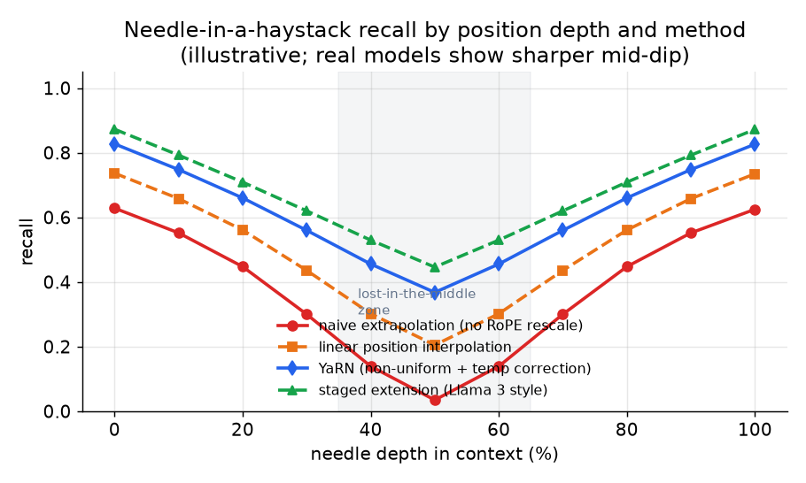

# 5. 评估

继续预训练和长上下文这两件事上，最常见的诚信问题是：拿一个弱评估宣布胜利。
一个模型可以在简单测试上过关，在任何真实任务上却是坏的。这一节把每种评估
点名，说清它到底测的是什么，以及它测不到什么。

## 遗忘检查：通用 benchmark 这道门槛

跑任何领域评估之前，先在适配后的基础模型上跑完整的通用 benchmark 套件，和
适配之前的基础模型对比。套件至少要包含一个通用推理 benchmark（MMLU）、一个
数学 benchmark（GSM8K），以及一个指令跟随任务（MT-Bench 或类似的）。第 1 节
定下的需求里写了两个百分点的回退预算，这道门槛就是用来兑现它的。

套件里每个 benchmark 都有自己特定的打分协议。

**MMLU（Massive Multitask Language Understanding）** 测的是横跨 57 个学科
（包括数学、法律、医学、历史）的多选题正确率。输入：一道题加四个带字母标号的
选项（A 到 D）。输出：选中的选项字母。分数：选对的比例；除非对比的基线用的是
0-shot，否则一律报 5-shot（同一组对比里 shot 数必须一致）。

**GSM8K** 测的是小学数学应用题的正确率，这些题需要多步算术推理。输入：一道
自然语言描述的应用题。输出：最终的数值答案，用正则从一段 chain-of-thought
回答里抽出来（prompt 要求模型一步步推理，并以一行最终答案结尾）。分数：在
1319 道题的测试集上按数值精确匹配。

**MT-Bench** 测的是多轮指令跟随的质量，由一个 LLM judge（GPT-4）打分。输入：
一个 80 题、两轮的 benchmark，覆盖写作、推理、编程和数学。judge 模型看到每道题
和回答，按一份结构化的评分标准给出 1 到 10 分。分数：80 道题的平均分（8 个
类别，每类 10 题）。不要在没有和原始 GPT-4 分数重新校准的前提下，换一个更便宜
的 judge 模型。

**它测的是什么。** 优化器有没有把基础模型原本就有的广泛知识和推理能力覆盖掉。

**它测不到什么。** 它只能抓到你去测的那部分遗忘。如果你因为觉得这个领域不会
影响某个 benchmark 就跳过它，那里的遗忘你就看不见。把整套跑完。

**常见错误。** 只跑领域 benchmark，然后汇报涨了多少。遗忘在领域这一片里是
悄无声息的，只有在领域之外才会显形。

## 大海捞针（NIAH）：冒烟测试

把一条事实（"针"）藏在一段很长的填充上下文（"草堆"）里的随机深度，让模型
把它找出来。这是长上下文声明的最低门槛。



*四种做法在上下文窗口各个深度上的召回率。朴素外推（红色）在所有位置都急剧
退化。线性 PI（橙色）好一些，但出现了"lost in the middle"的凹陷，在阴影区域
里能看到。YaRN（蓝色）和 Llama 3 式的分阶段扩展（绿色）在大多数深度上都维持
了高召回，不过上下文中部的缺口始终没有完全消失。示意图。*

**它测的是什么。** 对一条逐字事实的单跳检索，以及召回在窗口的哪个位置开始
崩掉。

**怎么打分。** 召回率是在一张（上下文长度，插入深度）的网格上逐格计算的。
每一格跑 $N$ 次独立试验，把针放在该长度上下文中的那个深度比例上（比如 10%、
50%、90%）。如果模型的回答里包含预先植入的字符串（精确匹配或归一化后匹配），
这次试验记为正确。

$$\text{NIAH recall}(L,\, d) = \frac{\text{correct retrievals at length } L \text{ and depth } d}{N}$$

```python
def niah_recall(correct, n):   # correct retrievals out of n trials at a fixed (length L, depth d) cell
    return correct / n         # fraction recalled in this grid cell
# e.g. niah_recall(correct=17, n=20) -> 0.85
```

结果要以二维热力图的形式汇报。一个平均出来的单一数字会盖掉上下文中部的凹陷，
而那正是主要的失败模式；任何省掉召回率随深度曲线的长上下文声明，都是在隐藏
分布。

**它测不到什么。** 多跳推理、跨整段的聚合，以及多针检索。一个模型可以通过
NIAH，但只要针不止一根，或者任务要求的是推理而不是查找，它照样会在任意深度上
漏掉事实。

**lost in the middle 问题。** 召回率在窗口里不是均匀的。模型对开头和结尾关注
得最好，对中间最差，所以放在 50% 深度的事实最难被找回。召回率要作为深度的
函数来报，不要报一个平均值。任何缺少召回率随深度曲线的长上下文声明都是在藏
分布。

## RULER：真正的长上下文门槛

NVIDIA 的 RULER 把 NIAH 扩展成了几类真正给长上下文施压的任务：

- **多根针。** 草堆里藏了好几条事实，模型必须全部取回。
- **多跳变量追踪。** 变量之间形成引用链，模型必须跨窗口顺着引用找到最终的值。
- **聚合。** 对散落在整段里的实体做计数、列举或者归纳。
- **长上下文问答。** 需要读完并整合全长度上多个段落才能回答的 QA。

RULER 的结论很直白：大多数声称支持 32K 以上的模型，远没到它们宣传的长度就已经
急剧退化了。有效上下文长度普遍远短于配置里写的那个。通过 NIAH 就宣布 128K，
是长上下文工作里最常见的弱评估错误。

**它测的是什么。** 模型能不能真的跨整个窗口做推理，而不只是找到一样东西。

**怎么打分。** 每一类（检索、追踪、聚合、QA）按期望输出做精确匹配或归一化
匹配来打分。RULER 的总分是所有类别和所有上下文长度上的平均正确率。**有效
上下文长度**是指总分仍高于某个固定阈值的最长窗口，这个阈值通常取一个较短参考
长度（比如 4k token）下正确率的 85%。一个声称 128K 但在 32k 就跌破该阈值的
模型，无论配置里的最大值写成多少，它的有效上下文就是 32k。

**它测不到什么。** 合成任务之外的开放域泛化。RULER 用的是受控的合成数据，
所以一个拟合了 RULER 分布的模型，在真实长文档任务上仍可能失败。先用 RULER
把门，上线前再补上真实任务的评估。

## 长文档 perplexity：只能当作连续的训练信号

在留出的长文档上算长上下文 perplexity，训练过程中计算起来很便宜，可以给出一个
有用的连续信号，用来发现明显的故障。perplexity 是每 token 平均负对数似然的
指数（粗略讲，就是模型对每个 token 有多意外；越低表示越不意外）：

$$\text{PPL} = \exp\!\left(-\frac{1}{N}\sum_{i=1}^{N}\log p(x_i \mid x_{\lt i})\right)$$

```python
from math import exp
def perplexity(nll_per_token):        # nll_per_token: list of -log p(x_i | x_<i), in nats
    mean_nll = sum(nll_per_token) / len(nll_per_token)
    return exp(mean_nll)              # exp of the mean negative log-likelihood
# e.g. perplexity([0.5, 1.0, 1.5]) -> 2.718281828459045  (mean nll = 1.0, so exp(1) = e)
```

输入：目标长度上的一段留出 token 序列。输出：每个 token 的对数概率。越低越好。
跨 tokenizer 对比要用 **bits-per-byte（BPB）**，它把以 bit 计的总 NLL 除以
UTF-8 字节数，因而与 tokenizer 无关：

$$\text{BPB} = \frac{1}{B}\sum_{i=1}^{N}\bigl(-\log_2 p(x_i \mid x_{\lt i})\bigr)$$

```python
def bits_per_byte(nll_bits, n_bytes):   # nll_bits: list of -log2 p(x_i | x_<i), one per token
    return sum(nll_bits) / n_bytes      # total bits of the sequence / its UTF-8 byte count
# e.g. bits_per_byte([2.0, 3.0, 3.0], n_bytes=4) -> 2.0
```

其中 $B$ 是这段序列的 UTF-8 总字节数。但它会饱和：一个模型的长上下文
perplexity 可以很漂亮，RULER 却照样过不了，因为 next-token loss 主要由局部
预测主导（给定上一句去预测下一个词，既容易又廉价）。perplexity 衡量的是长度
上的流畅度，不衡量模型有没有在用上下文。

用 perplexity 来把训练的关，做早停和稳定性判断。晋级到后训练那道关，要用
RULER 式的检索和聚合任务，再加上召回率随深度的测量。

## 什么场景用哪个

| 选择 | 适用场景 | 而不是 |
|---|---|---|
| 完整通用 benchmark 套件（MMLU、GSM8K、MT-Bench） | 每次 DAPT 跑完之后、把适配后的基础模型放行之前 | 跳过它然后声称没有遗忘；遗忘在领域这一片里是无声的 |
| 带召回率随深度曲线的 NIAH | 作为任何长上下文声明的最低冒烟测试 | 把召回率按深度平均掉，藏起上下文中部的凹陷 |
| RULER 的多跳和聚合任务 | 在宣布有效上下文长度之前；只有 RULER 能把真实长度和配置长度分开 | 只过 NIAH，那是单跳的，而且贴着两端 |
| 长上下文 perplexity | 作为连续的训练信号；便宜，适合做早停 | 拿它当放行的主门槛；它会饱和，抓不到已经坏掉的检索 |
| 领域 benchmark（留出的领域数据） | 用来衡量 DAPT 到底赚到了什么 | 把它当成 DAPT 之后唯一的评估；永远要和通用回归门槛配对 |

**出处。** 通用 benchmark 的运行框架是 lm-evaluation-harness（EleutherAI），多跳长上下文的门槛是 RULER（NVIDIA），详见下文。这些门槛探查的对象，是上一节里基于 RoPE（RoFormer，Su 等，2021）重缩放做出来的上下文扩展。

**工具。** 通用 benchmark 套件跑在 lm-evaluation-harness（EleutherAI）上，它把 MMLU 和 GSM8K 连同固定的 shot 数和打分方式一起打包好了；MT-Bench 用的是 LLM judge，所以重跑时要保持 judge 模型一致。长上下文的门槛用 RULER（NVIDIA）来做多针、多跳和聚合任务，用一套大海捞针的工具做召回率随深度的冒烟测试。perplexity 和 bits-per-byte 直接在 PyTorch（Meta）的训练循环里算出来，作为连续信号。以上这些模型都通过 Hugging Face Transformers 加载，评估时长上下文模型的服务由 vLLM 或 SGLang 负责。

**实例。** 一个文档 AI 团队刚做完继续预训练和上下文扩展，要决定适配后的基础模型能不能放行。他们先跑完整的通用 benchmark 套件（MMLU、GSM8K、MT-Bench），而不是只跑领域 benchmark，因为遗忘在领域这一片里是无声的，只有在领域之外才显形，并且他们按一个固定的回退预算来把关。对于长上下文的声明，他们只把大海捞针当冒烟测试，汇报召回率随深度的曲线来暴露 lost in the middle 的凹陷，而不是给一个平均出来的数字。接着他们用 RULER 的多跳和聚合任务来定真实的有效上下文长度，因为一个模型可以通过单跳 NIAH，却在远低于配置的 128K 处就退化了。长上下文 perplexity 只在训练期间当作连续的早停信号，绝不作为放行的门槛，因为它会在检索仍然坏掉的时候就已经饱和。
