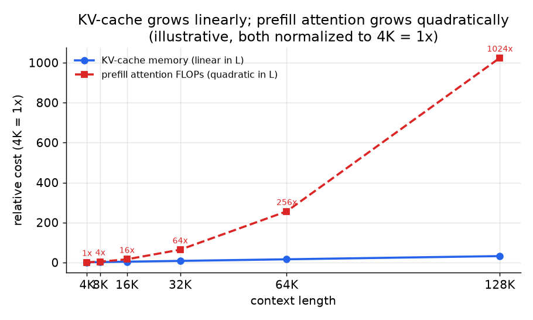

# 6. 服务与扩展

## 长上下文是个服务问题，不只是建模问题

一个能读 128K token 的基础模型，在能被服务起来之前都还不算产品。长上下文的两项
成本形状不同，一个完整的回答要把它们分开讲。



*KV cache 显存随上下文长度线性增长（蓝色）。prefill 阶段的 attention FLOPs
按平方增长（红色），所以从 8K 扩到 128K，attention 计算量翻了 256 倍。两者都以
4K = 1 倍归一化。示意图。*

**prefill 的 attention 是长度的平方。**（prefill 是指在生成任何输出 token
之前，并行处理整段输入提示的那一遍。）自注意力要算一个 $L \times L$ 的分数
矩阵，所以计算量，以及朴素实现下的显存，都按 $L^2$ 增长。FlashAttention 靠
不在 HBM 里完整物化这个矩阵，把显存降成了线性，但计算量仍是平方的。prefill
长度变成 8 倍，attention FLOPs 大约是 64 倍。长 prompt 在解码开始之前就已经受
prefill 限制了。

**KV cache 是长度的线性函数。**（KV cache 是为过往每个 token 存下来的 key 和
value，存着是为了不用在每个解码步重算。）解码时你要为过往每个 token 缓存 $K$
和 $V$，所以 KV cache 显存按下式增长：

$$M_{\text{kv}} = 2 \cdot n_{\text{layers}} \cdot n_{\text{kv}} \cdot d_{\text{head}} \cdot L \cdot b \cdot s_{\text{bytes}}$$

```python
def kv_cache_bytes(n_layers, n_kv, d_head, seq_len, batch, bytes_per_elem=2):
    # 2 tensors (K and V) cached per layer, per kv-head, per token
    return 2 * n_layers * n_kv * d_head * seq_len * batch * bytes_per_elem
# e.g. kv_cache_bytes(n_layers=32, n_kv=8, d_head=128, seq_len=128000, batch=1) -> 16777216000
```

其中 $b$ 是 batch size，$s_{\text{bytes}}$ 是每个元素占的字节数。在 128K token
下，这项显存开销会主导 VRAM，并把 batch size 卡死。分组查询注意力（GQA，
$n_{\text{kv}}$ 很小）、KV 量化和 paged attention，在长上下文下比在短上下文下
重要得多。

**这两项叠在一起很难受。** 一个 128K 上下文的产品，同时在长 prompt 上受 prefill
限制、在 batch size 上受 KV 限制。只解决其中一个，另一个照样卡着你。

## 长上下文下的架构手段

- **分组查询注意力（GQA）。** 让若干个 Q head 共享一组 K 和 V head，从而缩小
  $n_{\text{kv}}$。Llama 3 的 GQA 正是它能在真实 batch size 下服务 128K 的原因。
  多查询注意力（MQA）是极限情况：所有 Q head 共用一个 K/V head。
- **FlashAttention。** 融合的、IO 感知的 attention kernel，不物化完整的
  $L \times L$ 矩阵。它降的是 prefill 的显存带宽开销，不是 FLOPs 数量。
- **滑动窗口注意力（Mistral）。** 把每个 token 的注意力跨度限制在一个固定窗口
  $w$ 内，把平方开销压到 $O(L \cdot w)$ 而不是 $O(L^2)$。用一部分全局视野换一个
  有上界的服务成本。
- **Paged attention（vLLM）。** 把 KV cache 分页管理，而不是预先分配一整块连续
  缓冲区，从而允许细粒度的显存共享，并避免在 batch 内长度参差时 OOM。
- **KV 量化。** 把缓存的 K 和 V 张量量化到 8 bit 或 4 bit，以很小的质量代价
  换 KV 显存。

## 瓶颈表

| 瓶颈 | 最先出现的迹象 | 怎么解 | 代价 |
|---|---|---|---|
| 平方级 prefill（长 prompt） | prefill 延迟占大头；长请求把 batch 饿死 | FlashAttention、分块 prefill、滑动窗口注意力 | 滑动窗口用全局视野换成本 |
| KV cache OOM | 长上下文下 batch size 崩掉，或者高并发时 OOM | GQA / MQA（更小的 $n_{\text{kv}}$）、KV 量化、paged attention | 有一点质量损失；GQA 必须在预训练时就定下来 |
| 短上下文回退 | 扩展之后，用短 prompt 的用户感觉质量下降了 | 非均匀 RoPE 缩放（YaRN）、双缩放恢复（LongRoPE） | 调度更复杂，可能还要为短和长分开两条服务路径 |
| lost in the middle 式的检索失败 | 长度明明"支持"，文档中部的事实却找不到 | 中部深度的合成训练数据、位置感知的评估、对语料用 RAG | 没有彻底的解法；必须按深度测召回，并管理好用户预期 |
| 长上下文训练的成本 | 长序列主导了每个 batch 的时间和花销 | 分阶段增加长度（早期用短序列）、带 padding mask 的序列打包 | 早期阶段更便宜；每一阶段都必须验证过才能继续往上扩 |
| 领域语料的污染 | DAPT 之后领域 benchmark 虚高 | 训练前把领域语料和长上下文数据对所有评估集做去污染 | 多一份数据工程的活；为了让数字可信，值得 |

**更多细节。** 有两行的解法有清晰的出处。平方级 prefill 的解法 FlashAttention（Stanford，2022）从不在 HBM 里物化完整的 N 乘 N 分数矩阵；它把计算分块，让分块留在 SRAM 里，所以它砍的是显存流量而不是 FLOPs 数量，这也是它对长 prompt 的 prefill 延迟帮助最大的原因。KV cache OOM 那一行靠的是 GQA（Google，2023）和它的极端形态 MQA（Google，2019）来减少 KV head 的数量（因而缩小缓存），而 paged attention 出自 PagedAttention（vLLM，UC Berkeley，2023），它把缓存映射到固定大小的块上，于是一个长请求不再需要一整块连续缓冲区，碎片也不会再逼出过早的 OOM。

## 长上下文和检索是互补的，不是互相替代

长上下文对付的是一整份大文档，模型必须把它整体读进去做推理。它扩展不到一整个
语料库：平方级的 prefill 和线性的 KV 成本是每次查询、每个 token 都要付的，
召回率往中间衰减，而且模型每次请求都要把所有东西重新处理一遍。RAG 做的是从
语料库里检索出少数几个相关片段喂给模型。两者是组合关系：单份大文档用扩展，
整个语料库用检索。把上下文扩大来替代检索，是一个常见而且错误的回答。
