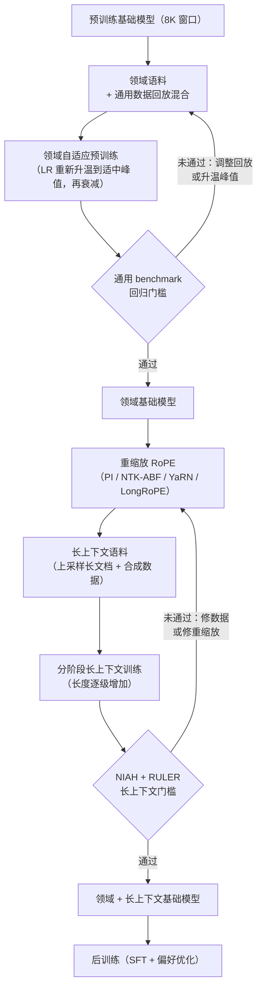

# 9. 小结

## 一页回顾

- **这个阶段叫中期训练，它有两种方言。** 实验室这一侧，你还在同一次训练途中：
  旋钮是数据混合比例和什么时候开始衰减，退火阶段是最好的数据该去的地方，一个
  稳定期 checkpoint 可以分叉出很多次短 microanneal。从业者这一侧，基础模型已经
  完全衰减过了，所以你的配方要多加一次学习率重新升温和一部分回放，实验室那一版
  不需要这些。把两套配方搞混是常见的错误。

- **动手设计之前先把两条轴线点名。** 领域适配（DAPT）和上下文扩展是两个独立
  问题，失败模式不同，工具也不同。拿其中一个的工具去解另一个，是回答浅的第一个
  迹象。

- **继续预训练是一次受控的重新进入，不是"接着训就完了"。** 基础模型是在完全
  衰减的状态下结束的。把学习率重新升温到一个适中的峰值，再衰减，并回放一部分
  通用数据。这三个选择挡掉的正是 DAPT 失败的两种方式：卡在衰减后的地板上停滞，
  以及在原始峰值上灾难性遗忘。

- **灾难性遗忘是无声的。** 它出现在领域这一片之外，所以唯一的检测办法是前后各跑
  一遍完整的通用评估套件，而不是只跑领域 benchmark。要用回归门槛来把关，不是靠嘴
  断言。

- **朴素外推行不通。** 不重缩放 RoPE 频率就把最大位置设成 128K，超出原窗口就是
  垃圾。扩展是一次重缩放，加上一次在真正的长文档上、按长度分阶段推进的训练。

- **均匀插值是基线，不是目标。** 每一种更好的方法（NTK-ABF、YaRN、LongRoPE）
  都是在想办法缩放低频（全局）维度、同时放过高频（局部）维度，因为模型在学着
  够到位置 $m+100000$ 的同时，还得分得清位置 $m$ 和位置 $m+1$。

- **NIAH 是冒烟测试，RULER 才是门槛。** 大海捞针是单跳检索，而且往往锚在边缘。
  RULER 的多跳、聚合和多针任务揭示的是有效上下文，而它几乎总比配置长度短。召回率
  要作为深度的函数来报，才能抓到 lost in the middle 的衰减。

- **长上下文是一笔服务系统的成本。** prefill 的 attention 是长度的平方，KV cache
  是线性。到了 128K，GQA、KV 量化、FlashAttention 和 paged attention 都是必需品。
  把长度发出去之前，这两笔都要算进预算。

- **长上下文和检索是组合关系。** 单份大文档用长上下文，语料库用 RAG。两者不是
  替代品。

## 整条流水线一页看完

## 自测

答案是折叠的。每题先自己答一遍再展开。

1. 一次 DAPT 把领域 benchmark 抬了八个点。在放行这个适配后的基础模型之前，你还
   必须检查什么？遗忘最可能藏在哪里？

   

答案

   在这次训练**前后各跑一遍完整的通用 benchmark 套件**，并按第
   [1](01-clarifying-requirements.md) 节定下的回退红线来决定放不放行：MMLU、GSM8K，
   以及一个像 MT-Bench 这样的指令跟随任务，任何一项都不能回退超过两个百分点。
   领域涨八个点、代价是 MMLU 掉五个点，对产品来说通常是净亏，而且只有测了才看得见。
   遗忘藏在**领域这一片之外**，集中在领域语料从不练到的能力上：数学推理、代码，
   还有通用指令跟随。这就是为什么一个平均出来的总分不够用；某项专门的技能可能已经
   塌了，均值却纹丝不动，所以要把那几套具体的套件跑起来（第
   [5](05-evaluation.md) 节）。如果某个 benchmark 真的回退了，第
   [3](03-the-mid-training-phase.md) 节给了排查顺序：先看混合里到底有没有回放，
   再看升温峰值是不是太高，最后看语料够不够大。没有前后对比的门槛就断言没有遗忘，
   是 DAPT 里那个安静致命的错误。

   

2. 一位同事在配置里把 `max_position_embeddings` 设成了 200000。在一条 150K 的 prompt
   上推理会发生什么？真正能做出一个可用的 150K 模型的是哪两步？

   

答案

   模型会接受这条 prompt，然后**在原来的 8K 窗口之外输出垃圾**。那个配置字段只是给
   位置嵌入表定尺寸，或者给允许的位置索引设上限，而一个 RoPE 模型压根就没有学出来的
   位置表：旋转角是由位置乘以逐维度频率现算的，所以把这个数字调大，只是给一堆从没
   见过那些角度的权重把护栏抬高了。坏掉的是低频那几对维度，因为它们在训练窗口内连
   一整圈都没转完，因此只被展示过一小段圆弧；第 [10](10-putting-it-together.md) 节
   里那个可运行的文件，正好把最慢的那三对维度在位置 65535 上标成了 UNSEEN。真正
   有效的两步是：**一，重缩放 RoPE 频率**（PI、NTK-ABF、YaRN 或 LongRoPE），
   **二，在真正的长文档上跑一小段继续训练**，这些文档要经过上采样、带有真实的
   长距离依赖，而不是拼起来的短文档，并且长度要像 Llama 3 那样分阶段推进，分六步
   从 8K 走到 128K（第 [4](04-context-extension.md) 节）。然后用 NIAH 的召回率随
   深度曲线加上 RULER 来给结果把关，因为配置长度不等于有效长度。

   

3. 各用一句话解释：为什么均匀位置插值会伤到短 prompt，为什么 NTK-ABF 有帮助，
   为什么 YaRN 还要更好。

   

答案

   **均匀 PI** 把每一个 RoPE 频率都除以同一个长度缩放比 $s$，包括编码相邻关系的
   高频那几对，于是相邻 token 落在几乎相同的角度上，局部顺序被模糊掉（在 $s = 8$ 时，
   最快那一对维度上相邻 token 的角度步长从 1.000 弧度掉到 0.125 弧度，被挤了 8 倍）。
   **NTK-ABF** 有帮助，是因为它提高的是 RoPE 的 base 而不是去除位置，
   $b' = b \cdot s^{d/(d-2)}$，这在构造上就是非均匀重缩放：低频维度动得多，高频维度
   几乎不动，Code Llama 正是靠这一点，把 base 从 10000 提到 1000000、在 16K 上训练，
   仍然能可用地外推到 100K。**YaRN** 还要更好，是因为它把这种非均匀性明确化、
   原则化：按每个维度的波长在原窗口内转完多少圈来分类，低频维度做插值，高频维度
   基本不缩放，中间频段用一个斜坡混合，再用一个 softmax 温度修正
   $1/\sqrt{t} = 0.1 \ln s + 1$ 去抵消序列变长带来的 attention 熵增。贯穿始终的一条
   线是：PI 之后的每一种方法，都是在拉长全局触及范围的同时想办法保住局部分辨率，
   这也是本章把均匀插值当成要超越的基线、而不是当成目标的原因（第
   [4](04-context-extension.md) 节）。

   

4. 你手上有一份 NIAH 结果，128K 下召回率 95%。一位工程师说"长上下文能用了"。
   在同意之前你还要跑什么评估？你在查的具体是哪种失效模式？

   

答案

   跑 **RULER**，并且坚持把那份 NIAH 数字做成召回率随深度的热力图，而不是一个平均值。
   NIAH 是对一条逐字事实的单跳检索，往往锚在窗口边缘附近，那里召回最高，所以 95% 的
   平均值完全可以和一个坏掉的模型并存。你要查的失效模式是**有效上下文比配置长度短**：
   RULER 的多根针、多跳变量追踪、聚合和长上下文问答，在能通过 NIAH 的模型上照样常常
   失败，而 NVIDIA 的结论是，大多数声称 32K 以上的模型远没到宣传长度就急剧退化。
   有效上下文长度的定义是：总正确率仍高于某个固定阈值的最长窗口，这个阈值通常取一个
   较短参考长度（比如 4K）下正确率的 85%，所以一个声称 128K 但在 32K 就跌破阈值的模型，
   有效上下文就是 32K。深度曲线暴露的第二种失效模式是 **lost in the middle**，那条
   U 形曲线：即便远在训练长度之内，放在 50% 深度的事实也是最难取回的。长文档上的
   perplexity 替代不了这两项检查中的任何一项；检索坏掉的时候它照样很低（第
   [5](05-evaluation.md) 节）。

   

5. 你的 128K 模型在解码时、batch 只有 64 个 token 就 OOM 了。说出两种不缩小上下文
   窗口就能解决这个问题的服务技术。

   

答案

   长上下文下解码 OOM 是 **KV cache** 的问题，因为 KV 显存对长度和 batch 都是线性
   增长的：
   $M_{\text{kv}} = 2 \cdot n_{\text{layers}} \cdot n_{\text{kv}} \cdot d_{\text{head}} \cdot L \cdot b \cdot s_{\text{bytes}}$。
   两种能保住窗口的技术：**KV 量化**，把缓存的 K 和 V 张量按 8 bit 或 4 bit 存，
   质量代价很小；以及 **paged attention**（vLLM），它把缓存映射到固定大小的块上，
   而不是一整块预分配的连续缓冲区，于是碎片和参差不齐的 batch 长度不会再逼出过早的
   OOM。分组查询注意力是第三个、也是最大的杠杆，它让若干 Q head 共享 K 和 V head 来
   缩小 $n_{\text{kv}}$，但它必须在预训练时就烙进去，所以对一个已经训好的模型不算解法。
   第 [10](10-putting-it-together.md) 节里的数量级说明了为什么这一项占主导：一个
   8B 级别的配置，32 层、GQA 下 8 个 KV head、head 维度 128、fp16，单条 64K 序列的
   KV cache 大约 8.6 GB，而同一个模型用完整多头注意力则是 34.4 GB，int8 量化又能把
   这 8.6 GB 再砍一半。注意 FlashAttention 和分块 prefill 在这里帮不上忙；它们对付的
   是平方级 prefill 那一侧，不是解码时卡住你的那份线性缓存（第
   [6](06-serving-and-scaling.md) 节）。

   

6. 一位用户问，一个 500 份文档的知识库该用长上下文还是 RAG。正确答案是什么？为什么？

   

答案

   **RAG。** 判断规则是语料库还是单份文档：长上下文是给一份必须整体读进去做推理的大
   文档用的，那种情况下检索会把推理切在分块边界上；而检索是给一个集合用的，你从里面
   取出少数几个相关片段。500 份文档的知识库是一个语料库，把它塞进窗口会同时在三件事上
   失败：prefill 的 attention 是长度的平方、KV cache 是线性的，两笔都是每次查询、每个
   token 都要付；召回率往窗口中部衰减；而且模型每一次请求都要把整个语料库重新处理一遍。
   两者不是替代关系而是组合关系：语料库用检索，而检索出来的答案里如果有一份必须整体
   推理的长文档，就为它扩窗口。第 [10](10-putting-it-together.md) 节把"为了不做语料库
   上的检索而把上下文扩到 1M"列为的正是这种情况下的典型过度设计答案。用长上下文替代
   检索是第 [8](08-interview-qa.md) 节里的陷阱之一，而这里真正的加分点是说出两者的
   组合关系，而不是选边站。

   

## 延伸阅读

- 收官那一节：[完整的方案](10-putting-it-together.md)，本章的每一个选择都在那里为
  这个场景拍板一次，算清成本，再在另外两组约束下重搭一遍，最后压缩成一个可运行的
  单文件 RoPE 缩放计算器。
- 包含全部机制、数学和案例研究的密集参考资料：
  [topics/15-continued-pretraining-and-long-context.md](../../topics/15-continued-pretraining-and-long-context.md)
- 逐家公司的拆解（Llama 3、Code Llama、YaRN、LongRoPE、Yi、Qwen2.5、Mila）：
  见 [tools/teardowns/15.md](../../tools/teardowns/15.md) 里的拆解条目
- 机制横向对比和象限图：
  [tools/comparisons/15.md](../../tools/comparisons/15.md)
