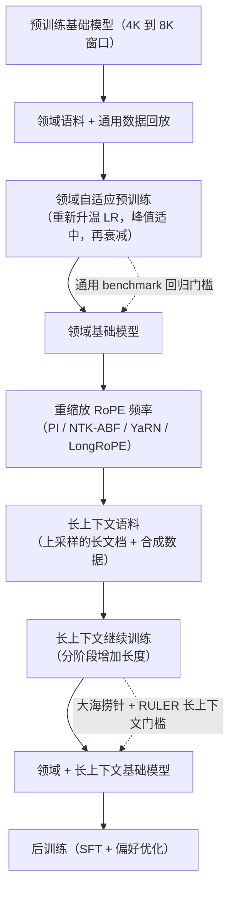

# 中期训练：继续预训练与长上下文

> 本章是英文原版的中文译本，原文见 [book/mid-training/](../../book/mid-training/)。译文和原文同步维护，发现问题请提 issue。

> **写法说明。** 本章以教学为先。它借用了结构化系统设计面试的思路（澄清需求、
> 搭出两条轴线、逐个机制深入、评估、上线服务，最后以面试问答收尾），但不照搬
> 任何固定格式。在此之上，它保留了这个仓库额外提供的东西：带一手来源链接的真实
> 生产案例、每组方法一张"什么场景用哪个"的表、画出来的图（mermaid 和
> matplotlib），以及面试问答。每个小节单独一个文件，避免任何一个文件太长。

面试官很少会说"实现一下 YaRN"。他们会说：**"你手上有一个很强的开源基础模型。
产品需要它掌握一个专门领域，还要能读比预训练时 8K 窗口长得多的文档。讲讲你
怎么在不毁掉它已有能力的前提下完成这个适配。"** 这就是继续预训练和长上下文
扩展：两项相互独立的适配，位于基础模型和对齐后的聊天模型之间那段便宜而高杠杆
的空隙里。本章把两者从头到尾搭一遍，并展示 Meta、Nous Research、Microsoft、
01.AI、Alibaba 和 Mila 团队实际是怎么做的。

**这个阶段就是各家实验室现在所说的中期训练（mid-training）。** 预训练和后训练
之间的这一段有自己的预算、自己的数据、自己的评估：混合比例重新加权、退火
（衰减）阶段、能力注入、长上下文扩展，以及为后训练做好准备。第 3 节先从实验室
视角讲这些，再走一遍大多数产品团队真正在跑的从业者视角配方（适配一个已发布的
开源基础模型）。如果关心的是模型本身的数据流水线，见[数据整理与预训练](../data-and-pretraining/)；
如果问的是完整的五阶段全景，见 [LLM 的生命周期](../llm-lifecycle/)。

## 各节

1. [澄清需求](01-clarifying-requirements.md)：把问题范围定下来的那段对话。
2. [两条轴线](02-two-axes.md)：适配轴（领域）和长度轴；输入和输出。
3. [中期训练阶段](03-the-mid-training-phase.md)：中期训练现在指什么，数据混合与 microanneal，退火阶段与稳定期分支，能力注入与 RL 就绪，然后是 DAPT、用回放对抗遗忘，以及 LR 调度。
4. [上下文扩展](04-context-extension.md)：PI、NTK-ABF、YaRN、LongRoPE、ALiBi；数学部分用 KaTeX。
5. [评估](05-evaluation.md)：大海捞针、RULER、遗忘检查；各自衡量什么。
6. [服务与扩展](06-serving-and-scaling.md)：长度带来的显存开销，瓶颈表。
7. [真实团队在生产环境里怎么做](07-how-teams-do-it-in-production.md)：Meta、Nous、Microsoft、01.AI、Alibaba、Mila。
8. [面试问答](08-interview-qa.md)：常问的、有陷阱的、常答错的。
9. [小结](09-summary.md)：一页回顾、mermaid 图、自测题、延伸阅读。
10. [把它们拼起来：完整的方案](10-putting-it-together.md)：一套默认技术栈，把场景从头到尾搭出来并算清 token 预算和成本，同一套配方在三组不同约束下的样子，以及最小可运行的上下文扩展。

## 一页看完整条流水线

第一次读请按顺序来，各节层层递进。每一节都从面试官真正会问的问题开头，
然后给出回答。
