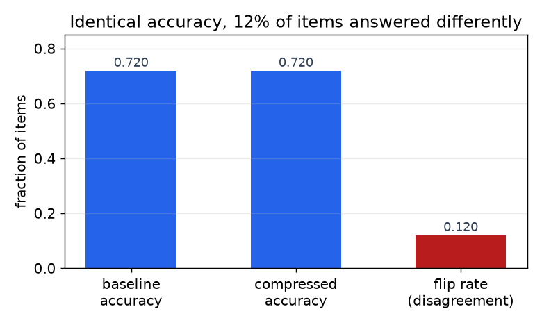

# 1. 澄清需求

压缩题的胜负在头两分钟就定了，因为"把它弄小一点"背后藏着四个不同的问题，
对应四种不同的答案。下面是那段对话。

**候选人：** 真正卡住的是什么：内存、延迟、吞吐成本，还是设备约束？

**面试官：** 它得跑在一张 80GB 的加速器上，而不是两张，首 token 延迟和每个 token
的延迟都不能变差。之后我们还想要一个能在端侧跑的版本。

**候选人：** 这是两个不同的项目。塞进一张卡是内存问题，通常只量化权重就能解决。
端侧是内存上限加上一颗固定的加速器，它只在特定格式上跑得快，这往往会逼你换一个
更小的模型，而不是压缩一个大模型。

**面试官：** 假设两个都要，告诉我你先做哪个。

**候选人：** 服务的形态是什么样的？batch size 为 1 的交互式，还是大 batch？这决定了
我们是受显存带宽限制还是受算力限制，两种情况对应的杠杆完全不同。

**面试官：** 交互式，小 batch，prompt 偏长。

**候选人：** 那 decode 受带宽限制，prefill 受算力限制，所以只量化权重能改善每个
token 的延迟，但改善不了首 token 延迟。上下文有多长？超过几千个 token 之后，KV cache
开始跟权重平起平坐，只压权重不管 KV，解决的是错的那一半。

**面试官：** 最多 32K，有时候更多。

**候选人：** 我们能重新训练吗，还是只能做后训练阶段的事？用校准集做量化要几个小时；
结构化剪枝之后的修复训练要几十亿 token；蒸馏则需要一笔真正的训练预算。

**面试官：** 我们有一些算力，但没有预训练级别的预算。

**候选人：** 质量线定在哪里，看哪些能力？"不能退化"不算一条线。我得知道哪些能力
一点都不能动，因为压缩造成的损伤从来不是均匀的。

**面试官：** 代码生成和工具调用是承重墙。长上下文检索对 RAG 这条路很重要。

**候选人：** 最后一个：目标硬件到底加速什么？int4 纯权重量化、fp8 计算、2:4 稀疏，
以及端侧 NPU 支持的格式，是四个不同的答案。kernel 不支持的杠杆，只能省内存，
换不来提速。

我们来总结一下。**任务是：把一个模型塞进一张加速器，不损害交互延迟，上下文偏长，
只能用后训练方法加一笔不大的修复训练预算，代码生成、工具调用和长上下文检索的
质量不能动，之后还要产出一个端侧版本。**

由此立刻能推出两个结论，早点把它们说出来，就是大半的信号。

**结论 1：压缩是一个穿着算法外衣的硬件问题。** 张量的大小和消费它的 kernel 的速度
是两件不同的事。50% 的非结构化稀疏在稠密矩阵乘单元上一分钱都省不下来。int4 权重
只有在存在 int4 kernel 的地方才快，而且在大 batch 下收益会缩水，因为瓶颈从读权重
挪到了做算术上。第一个该问的问题不是"我能压多少"，而是"这颗加速器把什么变便宜了"，
而且每条建议都应该点出格式和 kernel，不能只说位宽。

*决定"没有退化"是否成立的那个测量。赢和输在均值里互相抵消，所以一个压缩模型
可以打出和基线一模一样的分数，同时每八道题就有一道答得不一样。示意图。*

**结论 2：整体准确率不是正确的验收测试。** 两个模型可以在同一个 benchmark 上得分
相同，却在相当大比例的单个题目上意见相左，而这恰恰就是压缩干的事：它不太会拉低
平均值，更多是把行为打散在平均值周围，集中在长尾里。所以验收测试要按能力分开做
（代码、工具调用和 JSON 合法性、长上下文检索、多语言、安全拒答），逐题和未压缩的
基线配对比较，报告翻转率，而不是一个准确率差值。这个框架直接来自压缩评估的文献
（[Accuracy is Not All You Need](https://arxiv.org/abs/2407.09141)），也是面试官用来
区分"真上线过压缩模型"和"读过压缩模型文章"的那部分。

第三点也值得说出口，因为它把整个题目重新框了一遍：**压缩的竞争对手是不压缩。**
换一个更小的底座模型、用路由把简单请求送到别处、缩短 prompt，或者改进 KV 策略，
每一样都可能用更小的质量风险换来同样的资源。这些替代方案归
[成本优化](../cost-optimization/)和 [KV cache](../kv-cache/) 两章管，一个好的回答会先
把它们检查一遍，再去碰量化器。
