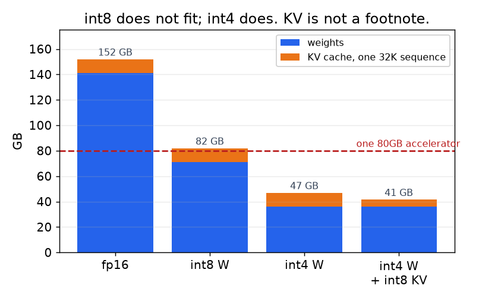
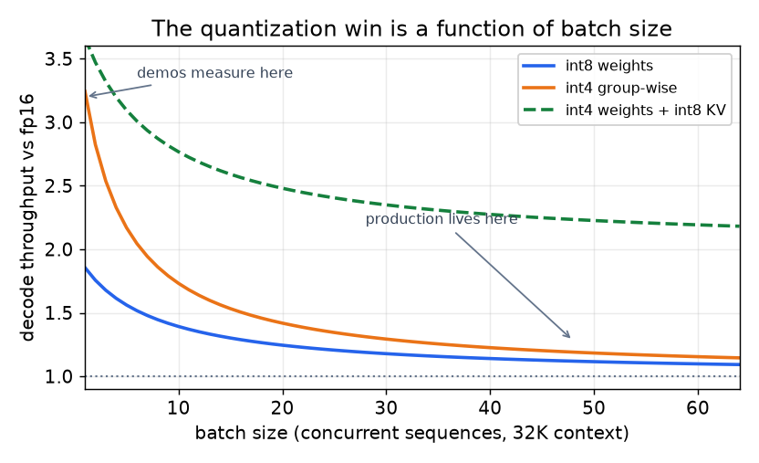

# 2. 搭出压缩的骨架

## 字节和微秒都花在了哪里

选杠杆之前，先把模型的开销写下来。有两笔账要算，而且它们不是同一笔账。

**内存**由三项主导：

$$\text{bytes} \approx \underbrace{N \cdot b_w}_{\text{weights}} + \underbrace{2 \cdot L \cdot h_{kv} \cdot d_{h} \cdot s \cdot B \cdot b_{kv}}_{\text{KV cache}} + \underbrace{\text{activations}}_{\text{transient}}$$

其中 $N$ 是参数量，$b_w$ 是每个权重占的字节数，$L$ 是层数，$h_{kv}$ 是 key-value
头数，$d_h$ 是每个头的维度，$s$ 是序列长度，$B$ 是 batch，$b_{kv}$ 是每个缓存元素
占的字节数。第一项是固定的；第二项随上下文和 batch 增长，是让人意外的那一项。

*同一个 70B 模型，32K 上下文。只要一条序列的 cache 驻留在显存里，int8 权重仍然
塞不进一张 80GB 的加速器，这才是逼着你用 int4 的原因，而不是偏好；而 KV 这一项
在只有一条序列时就已经占掉预算的五分之一。*

**时间**按阶段拆：

- **Prefill** 一次处理整段 prompt，每个加载进来的权重会被很多 token 复用。算术
  强度高，这个阶段**受算力限制**：时间跟着 FLOPs 走，大约是每个 prompt token
  $2 N$。
- **Decode** 一次只产出一个 token，所以每个权重被加载进来只服务极少几次乘加。
  这个阶段**受显存带宽限制**：每个 token 的时间约等于（权重字节数加上读取的 KV
  字节数）除以可达到的带宽。

这种不对称是本章最有用的一件事，因为它告诉你哪根杠杆有可能起作用：

$$t_{\text{decode}} \approx \frac{N b_w + \text{KV bytes read}}{\text{HBM bandwidth}} \quad\Longrightarrow\quad \text{halving } b_w \text{ nearly halves decode time}$$

同样也解释了，为什么同一个技巧对首 token 延迟几乎没用，以及为什么随着 batch
变大、阶段重新漂向受算力限制，这个收益会逐渐被侵蚀。

*按上面的带宽模型计算，70B 模型，32K 上下文。纯权重量化在 batch 为 1 时值 3 倍
以上，到 batch 64 时只剩约 1.15 倍，因为权重读取会摊到整个 batch 上，而 KV 那一项
不会。量化 KV cache 才是在生产 batch 规模下还能持续兑现的杠杆。*

## 四根杠杆

| 杠杆 | 改变什么 | 换来什么 | 付出什么 | 需要重训吗？ |
|---|---|---|---|---|
| 量化 | 每个权重、激活或 KV 元素用更少的比特 | 内存和 decode 带宽，立竿见影 | 长尾上的准确率；激活量化比纯权重量化难得多 | PTQ 不需要，QAT 需要 |
| 剪枝与稀疏 | 更少的权重，或者结构上更小的模型 | 内存一定省；速度只有在硬件加速那种形状时才省 | 质量，尤其是没有修复训练的时候 | 非结构化不需要，结构化需要 |
| 蒸馏 | 一个真正更小的模型，训练成模仿更大的模型 | 一次到位（内存、算力、延迟） | 一笔真正的训练预算，以及学生容量决定的上限 | 需要，定义如此 |
| 架构选择 | GQA/MLA、MoE、更小的底座、更短的有效上下文 | 最大的收益，根本不需要压缩这一步 | 换了一个模型，评估也得换 | 看情况 |

第四行是候选人最容易忘的。如果问题出在 KV cache，换成一个用分组查询注意力或
潜在注意力的模型，比给一个有 64 个 key-value 头的模型量化 KV cache 强得多。
压缩是架构定下来之后才做的事。

## 哪些不算压缩

有三样东西经常被混进来，应该单独点名，因为它们换来速度却不动质量，所以严格来说
更容易：**连续批处理**（把机器填满）、**投机解码**（花多余的算力跳过受带宽限制的
步骤）、**缓存**（共享前缀不重算）。它们在[推理服务](../inference-serving/)和
[成本优化](../cost-optimization/)两章里讲。在接受任何质量损失之前先用它们，并且在
面试里说明你已经这么做了。

## 对比：三个压缩家族

三者都"把模型变小"，都用百分比来报告，也都被随口叫作压缩，这掩盖了它们失败方式
的不同。

| 维度 | 量化 | 剪枝 | 蒸馏 |
|---|---|---|---|
| 去掉的单位 | 每个数值的精度 | 数值本身，或整个结构 | 参数，从构造上就更少 |
| 典型的后训练成本 | 几小时（校准集） | 一次性剪枝几小时；结构化剪枝的修复要几十亿 token | 一次完整的训练 |
| 不重训能否加速 | 能，对 decode，前提是有 kernel | 只有 2:4 或结构化形状才行 | 不适用 |
| 质量损伤模式 | 长尾和对离群值敏感的路径（长上下文、小语种、精确格式） | 集中在被拿掉容量的地方；深度剪枝伤多步行为 | 学生表示不了的那部分；三者中最平滑 |
| 可组合性 | 跟一切都能组合 | 能组合，通常在量化之前做 | 能组合；常常就是剪枝的修复步骤 |
| 陷阱 | "4-bit 快 4 倍" | "50% 稀疏快 2 倍" | "学生在 benchmark 上追平了老师" |

这些差异会改变设计，因为杠杆之间不可互换：约束是固定的内存上限，量化是最便宜的
路；约束是高 batch 下的延迟，那你需要更少的 FLOPs，也就是结构上更小的模型；两者
都要、外加一台只支持一种数值格式的设备，那你是在选另一个模型，然后往里面蒸馏。

## 从真正的约束出发选第一根杠杆

| 真正的约束 | 第一根杠杆 | 为什么不选别的 |
|---|---|---|
| 模型装不进内存 | 纯权重量化（先 int8，再分组 int4） | 每单位质量风险，剪枝省得更少；蒸馏要花一次训练 |
| 小 batch 下的 decode 延迟 | 纯权重量化加量化 KV | prefill 侧的技巧碰不到受带宽限制的阶段 |
| 长 prompt 的首 token 延迟 | 低精度计算（fp8）和注意力 kernel，而不是纯权重的招 | 纯权重量化不改变 FLOPs |
| 高 batch 下的吞吐成本 | 结构上更小的模型（剪枝加蒸馏）或 fp8 计算 | 阶段转向受算力限制后，纯权重量化的收益缩水 |
| 长上下文的服务成本 | KV：先从架构下手（GQA、MLA），再量化加分页 KV | 权重压缩碰不到随上下文增长的那一项 |
| 端侧内存上限加固定的 NPU 格式 | 针对任务蒸馏一个更小的模型，量化成 NPU 加速的格式，配任务 adapter | 压缩后的前沿模型很少能同时满足上限和格式 |

## 输入和输出

**输入：** 一个模型；一个目标（设备、内存上限、延迟预算、每百万 token 的成本）；
一个和线上分布一致的校准集；以及一套带分能力质量线的评估组合。

**输出：**一个压缩后的产物，加上让它能上线的两样东西：目标硬件上**实测**的延迟
和内存画像，以及和未压缩基线逐题配对的质量对比，报告翻转，而不只是准确率差值。

校准集值得单独说一句，因为静悄悄的失败就是从这里来的：后训练量化是按它看到的
激活来拟合缩放系数的，所以从通用网页文本里抽的校准集，会和一个服务代码、长文档
或非英语语言的模型对不上。校准数据要从线上分布里抽，并且把你关心的长上下文和
工具调用的形态也放进去。
