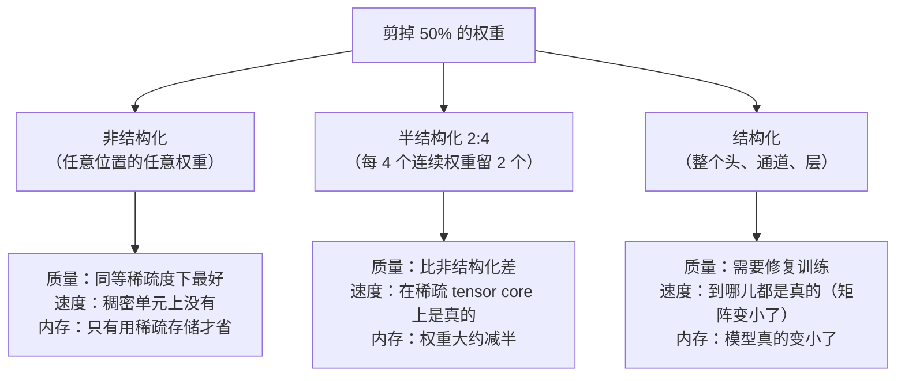
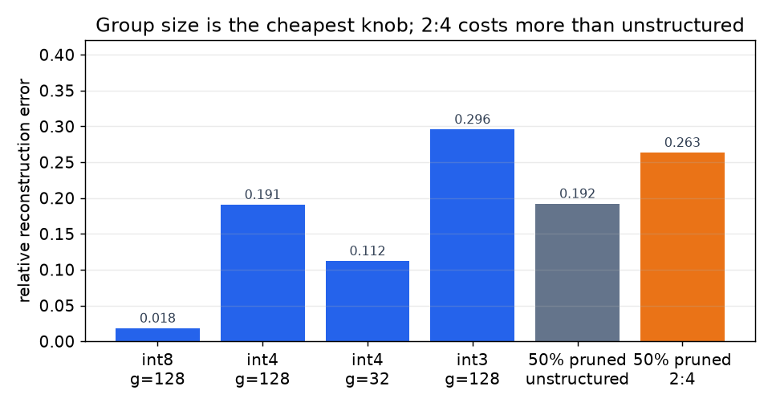

# 4. 剪枝与稀疏

剪枝就是去掉权重。去掉之后能不能换来点什么，完全取决于你去掉的东西是什么*形状*，
所以在所有杠杆里，这一根的论文数字和上线结果之间差距最大。

## 三种形状，三种截然不同的结果

*在一个带少数几个离群通道的合成权重块上测得（capstone 会对另一次采样打印同样的
对比）。两个读数：量化分组从 128 缩到 32，int4 误差几乎减半，这是本章最便宜的旋钮；
同样 50% 的稀疏度下，2:4 稀疏的误差比非结构化剪枝大，这就是换取一个硬件真能跳过
的模式所付的价钱。*

中间那一列就是全部的教训。非结构化稀疏最容易做到，也最难兑现：稠密矩阵乘单元
不管那些零在不在，干的活都一样多。2:4 模式（沿归约维度每四个里恰好两个非零）之所以
存在，是因为它是现代加速器真正能跳过计算的那个折中，而它牺牲质量，恰恰因为这个
约束是刚性的。

## 选择去掉什么

在 transformer 里，只看量级是个很弱的判据，因为一个小权重乘上一个大激活，比一个
大权重乘上一个死激活更重要。两篇参考文献框出了设计空间的两端。

**一次性剪枝加误差补偿。**SparseGPT 解一个逐层的重建问题：先剪，再用二阶信息调整
剩下的权重来补偿，这让超大模型不用重训就能做到 50% 的一次性稀疏
（[SparseGPT](https://arxiv.org/abs/2301.00774)）。

**一次性剪枝，不做重建，几乎免费。**Wanda 给每个权重打分：权重量级乘以对应输入激活
的范数，按输出行计算，然后直接去掉分数最低的那些：

$$S_{ij} = |W_{ij}| \cdot \lVert X_j \rVert_2$$

不更新权重，不用求解器，效果却能和重建方法打平
（[A Simple and Effective Pruning Approach for Large Language Models](https://arxiv.org/abs/2306.11695)）。
这个公式值得背下来：一行就把"为什么不能只看量级"说清楚了，而且它能推广（同样的
激活感知思路，在量化那一侧驱动着 AWQ）。

## 结构化剪枝：造一个真正更小的模型

结构化剪枝去掉的是架构的组成单元：注意力头、FFN 中间通道、embedding 维度，或者
整层。结果是一个更小的稠密模型，在任何硬件上都快；代价是质量掉得够多，必须做一轮
**修复**训练，也就是在几十亿 token 上继续预训练。

两条轴，损伤画像不同：

- **宽度**（头、通道、隐层大小）退化平缓，修复得也好。它是更安全的默认选择。
- **深度**（去掉层）每去掉一个单位换来的延迟收益更大，因为层是串行的，但对多步
  行为的伤害不成比例：长链条推理和长上下文聚合，恰恰就是被拿掉的那些深度在干的事。
  接受一个深度剪枝的模型之前，专门测这些能力。

两个生产级的配方：

- **从大底座剪起，然后继续预训练。**Sheared LLaMA 先定一个目标架构，剪到那个形状，
  再用动态数据加载继续预训练，用从头训练所需 token 的一小部分就得到了一个有竞争力的
  小模型（[Sheared LLaMA](https://arxiv.org/abs/2310.06694)）。
- **先剪枝，再以原模型为老师做蒸馏。**Minitron 配方把结构化剪枝和知识蒸馏结合起来
  作为修复阶段，比从头训练小模型便宜得多，也更接近父模型的质量
  （[Compact Language Models via Pruning and Knowledge Distillation](https://arxiv.org/abs/2407.14679)）。

面试官问"没有预训练预算，怎么造一个小模型"时，该点名的是第二条：**把大模型剪到
目标形状，再把大模型蒸馏进去。**

## 混合专家是另一回事

对 MoE 模型来说，有意思的稀疏性本来就在那里：每个 token 只有少数几个专家会跑。
压缩问题变成了针对某次部署可以丢掉或合并哪些专家，因为专家的使用高度偏斜，只服务
一个领域的部署可能永远路由不到其中大多数。这既是压缩决策，也同样是服务时的容量
决策，而且它和专家并行有交互（见[推理服务](../inference-serving/05-parallelism-and-quantization.md)）。

## 什么时候用哪个

| 用什么 | 什么时候 | 而不是 |
|---|---|---|
| Wanda 式一次性剪枝 | 想要一个快速、不用重训的基线，看看模型能容忍多少稀疏 | 照搬论文标题里的稀疏度 |
| SparseGPT | 更高稀疏度的一次性剪枝，而且负担得起重建那一遍 | 纯量级剪枝，它忽略了激活 |
| 2:4 半结构化 | 加速器有稀疏 tensor core，想要真正的矩阵乘提速 | 非结构化稀疏，它对稠密 kernel 没有加速 |
| 结构化宽度剪枝加修复 | 需要一个真正更小的模型，有一笔不大的 token 预算 | 把量化推过它还能保住质量的那个点 |
| 结构化深度剪枝 | 延迟卡住，而长链条推理不是承重墙 | 宽度剪枝，当串行层数才是真正的瓶颈时 |
| 剪枝加蒸馏（Minitron 式） | 没有预训练预算，要从一个大父模型造一个小模型家族 | 从头训练小模型 |
| 根本不剪 | 量化已经达标 | 叠杠杆，为一个约束花两份质量预算 |

**出处。**一次性重建剪枝是 SparseGPT（IST Austria 和 Neural Magic，2023）；激活感知的一次性剪枝是 Wanda（CMU、Meta AI 和 Bosch，2023）；定向结构化剪枝加继续预训练是 Sheared LLaMA（Princeton，2023）；剪枝加蒸馏是 Minitron 这条线（NVIDIA，2024）。2:4 模式是 NVIDIA 的稀疏 tensor core 格式。

**工具。**剪枝实现在 llm-compressor 以及 SparseGPT 和 Wanda 的参考仓库里；2:4 加速需要带稀疏 kernel 的运行时（TensorRT-LLM，或 PyTorch 的半结构化稀疏），跑在 Ampere 一代或更新的 NVIDIA 硬件上。结构化剪枝加修复就是一个普通的 PyTorch 训练任务，配 Megatron-LM 或 DeepSpeed，蒸馏那一半复用后训练的技术栈（TRL、Axolotl）。

**实例。**一个团队为一个受延迟限制的服务，需要一个大约只有父模型一半大小的模型，手上有几十亿 token 的修复预算，没有预训练预算。他们跳过非结构化剪枝，因为服务硬件跑的是稠密 kernel，那些零换不来任何东西；也跳过 2:4，因为在他们需要的稀疏度下，质量代价比替代方案更差。他们沿宽度（头和 FFN 通道）而不是深度做结构化剪枝，因为产品依赖多步工具使用，而这正是深度剪枝伤得最重的地方；然后用未剪枝父模型的知识蒸馏来修复，而不是普通的继续预训练，这是通往父模型质量更便宜的路。验收是在代码、工具调用合法性和长上下文检索上逐题和父模型配对比较，而不是看一个平均 benchmark 分数；延迟在目标加速器上实测，不从参数量推算。

## 实现上的坑

| 问题 | 症状 | 修法 |
|---|---|---|
| 在稠密硬件上用非结构化稀疏 | 50% 稀疏，提速为零 | 用 2:4 或结构化剪枝，或者把它当作只省内存的技术，配稀疏存储 |
| 只报稀疏度不报形状 | "剪掉 50%"，没人能把它复现成提速 | 永远说明模式（非结构化、2:4、结构化）和实测延迟 |
| 结构化剪枝后跳过修复训练 | 质量大跌，归咎于剪枝"不行" | 提前把修复用的 token 算进预算；结构化剪枝是两步法 |
| 对重推理的产品做深度剪枝 | benchmark 撑住了，多步任务和长上下文聚合崩了 | 先剪宽度；接受深度裁剪之前专门测长链条行为 |
| 各层一刀切地剪 | 前几层和后几层损伤不成比例 | 用逐层敏感度非均匀地分配稀疏度 |
| 剪完再量化，不重新测 | 每一步单独都过了；组合起来退化了 | 评估组合后的产物，而不是各根杠杆分开评；优先按剪枝、修复、量化的顺序 |
