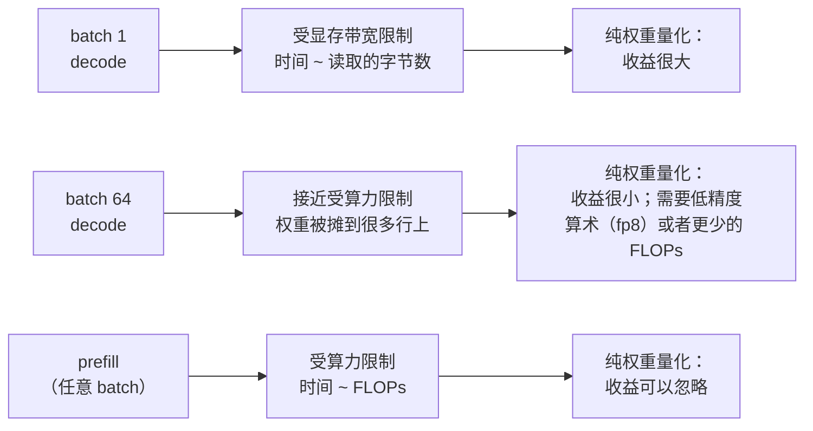

# 6. 部署压缩后的模型

一个压缩产物还不是一次部署。中间隔着 kernel、内存布局，还有一堆运维事实，它们
决定了理论上的收益能不能在生产环境里活下来。

## 收益取决于 batch 大小

压缩里最容易误导人的一个数字，就是在 batch 为 1 时测出来的提速。

面试时该说出来的那条规则：**纯权重量化买到的是带宽，不是算术。**机器在等权重、
闲着的时候（小 batch 的 decode），它收益巨大；机器正忙着做乘法的时候（prefill、
大 batch），它几乎什么都不是。如果目标是高 batch 下的每美元吞吐，你需要的是一种
计算单元能加速的格式（fp8，或者带融合 kernel 的 int8），或者真的更少的 FLOPs，
那就意味着一个更小的模型。

## kernel 支持才是真正的约束

| 你想要的 | 必须存在的东西 | 如果没有 |
|---|---|---|
| int4 纯权重的 decode 提速 | 对应你的形状和运行时的、融合了反量化和矩阵乘的 kernel | 你只省到了内存，还多交一笔反量化的税，有时候净变慢 |
| fp8 权重加激活 | fp8 tensor core，以及运行时对那套 scaling 配方的支持 | 某些技术栈会悄悄退回更高精度；去实测，别假定 |
| 2:4 稀疏提速 | 稀疏 tensor core，以及一个真会发出稀疏 kernel 的运行时 | 那些零和别的数一样被存下来、被乘一遍 |
| 量化 KV cache | 注意力 kernel 里的运行时支持，加上分页分配 | 每一步反量化的开销可能超过省下来的带宽 |
| 基于旋转的 4-bit 激活 | 导出时就把旋转融进相邻层 | 每次前向都要付一遍运行时的旋转开销 |

这张表就是为什么"哪种量化方法最好"的诚实答案是"你的运行时对哪一种有好 kernel"。
同样 bit 宽下方法之间的质量差异，通常比融合 kernel 和非融合 kernel 之间的差异要小。

## 按层混合精度是标准修法

压缩的损伤在网络里并不均匀，精度也就不该均匀。某项能力退化时，常规套路是：

- **embedding 和输出投影**保持较高精度（它们占参数的一小部分，却占损伤的一大部分）。
- **第一个和最后一个 transformer block** 保持较高精度，这经常能用很小的内存代价
  把退化找回来大半。
- **norm 参数和 bias** 永远放在高精度里；它们本来就小得可以忽略。
- 其余的用**逐层敏感度**来定（一次只量化一层，测一下），而不是一刀切的 bit 宽。

结果是一个带混合精度画像的产物，显存占用比名义 bit 宽稍高一点，这就是一个上线
模型正常的样子，不是什么妥协。

## 在压缩底座上挂 adapter

用一个压缩底座服务很多任务，是让端侧和多租户部署在经济上说得通的那个套路：
内存里只放一个量化好的底座，按请求或者按 app 换上小小的任务 adapter。两条运维上的
注意：adapter 通常保持在比底座更高的精度上；另外，针对全精度底座训出来的 adapter
不一定能干净地迁到量化底座上，所以要针对你实际会部署的那个产物来训 adapter，
至少也要在它上面验证一遍。

## 端侧是另一个问题

| 约束 | 服务端 | 端侧 |
|---|---|---|
| 内存 | 有弹性，按 GB-小时付费 | 一个硬上限，还得和操作系统及其他 app 分 |
| 格式 | 运行时支持什么就用什么 | NPU 加速什么才能用什么，名单通常很短 |
| Batch | 很多并发请求 | 几乎永远是 batch 1 |
| 成本 | 每百万 token 多少美元 | 电池、发热、安装包大小 |
| 更新路径 | 随时重新部署 | 跟着 app 一起发或者下载，按 OS 版本做版本管理 |

因为 batch 是 1，端侧正是纯权重量化回报最高的场景；又因为内存上限是硬的，端侧
也正是一个更小的蒸馏模型通常能赢过一个被重度压缩的大模型的场景。已公开的消费级
技术栈是这么做的：一个小的端侧基础模型配上激进的低 bit 权重压缩，再加任务专属的
adapter，同时留一个更大的服务端模型接住那些真的需要它的请求
（[Apple Intelligence Foundation Language Models](https://arxiv.org/abs/2407.21075)）。

## 怎么放量上线

把压缩后的模型当作**一个新的候选模型**，而不是一次配置变更：

1. **在目标硬件上实测。**生产环境的 batch 和上下文长度下的延迟、峰值内存、吞吐。
   预测出来的提速不算数。
2. **逐题配对跑验收测试**，对照未压缩的基线，分能力来看，带上翻转率
   （[给模型做 Benchmark，第 6 节](../benchmark-eval/06-statistics-and-leaderboards.md)）。
3. **先影子跑。**拿线上流量跑它但不把输出返回给用户，同样的请求和生产输出逐条对比；
   这能抓到离线集合抓不到的格式和工具调用退化。
4. **按切片做灰度**，盯着你声明为承重的那些能力。
5. **回滚产物保持热的。**量化和未量化的权重是两个不同的文件；除非你专门做成开关，
   否则回滚是一次部署，不是翻一个 flag。

## 瓶颈表

| 瓶颈 | 最早的迹象 | 修法 | 取舍 |
|---|---|---|---|
| 反量化开销 | 低 batch 下量化模型比预期还慢 | 用融合 kernel；确认运行时对这个形状真有一个 | 把你绑死在某个运行时和格式上 |
| 收益到生产 batch 就蒸发了 | benchmark 脚手架里很漂亮，生产环境里没动静 | 换到计算侧的格式（fp8），或者换更小的模型 | fp8 需要更新的硬件 |
| 长上下文下 KV 占主导 | 权重已经量化了，内存还是随流量涨 | 量化加分页的 KV，或者换 GQA / MLA 的模型 | 又多了一根要测的质量轴 |
| 某一项能力退化了 | 平均分没事；JSON 合法性或长上下文召回掉了 | 把敏感层的精度提上去，重新测 | 产物稍微大一点 |
| adapter 在量化底座上变差 | adapter 在 fp16 底座上好使，在 int4 上不行 | 针对实际部署的产物来训或验证 adapter | adapter 流水线从此依赖量化方案 |
| 端侧的内存上限 | 模型能加载，然后内存吃紧时被系统回收 | 换一个更小的蒸馏学生，而不是更激进的量化 | 多一个模型要维护 |
| 悄悄退回高精度 | 没有提速，也没有报错 | 启动时把实际的 kernel 和 dtype 打出来；断言走的是预期路径 | 多一段启动校验 |
