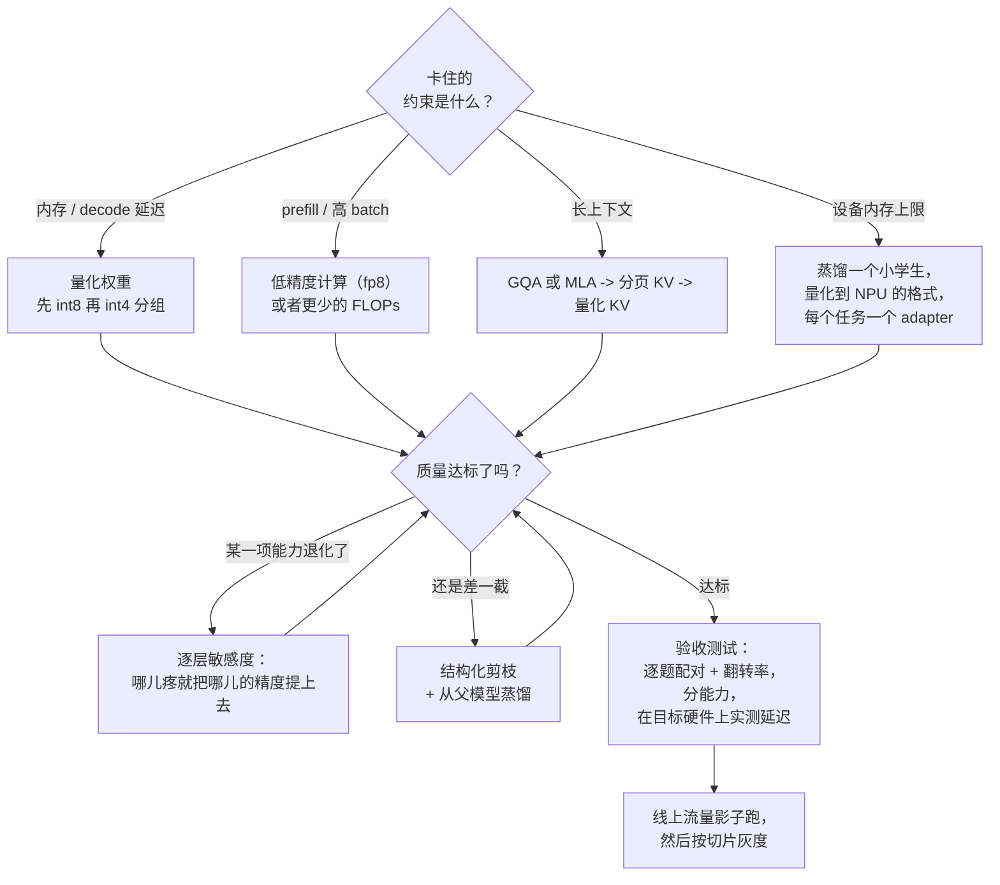

# 9. 小结

## 一页回顾

- **先找出被卡住的资源，再挑杠杆。** 内存上限、decode 延迟、prefill 或高 batch 吞吐、
  长上下文成本，是四个不同的问题。权重量化解决前两个，低精度计算或者更小的模型
  解决第三个，KV 那一摊活儿解决第四个。

- **decode 受带宽限制，prefill 受算力限制。** 每解码一个 token 的时间跟着读取的
  字节数走，所以小 batch 下权重字节减半，它差不多也减半。纯权重量化不改变 FLOPs，
  所以 prefill 几乎不动，而收益随着 batch 变大逐渐被侵蚀。

- **压缩是一个披着算法外衣的硬件问题。** 加速器不加速的格式，就是一项省内存的技术。
  非结构化稀疏加速不了稠密矩阵乘；2:4 在稀疏 tensor core 上可以；结构化剪枝什么
  都能加速，因为矩阵本身变小了。

- **量化的全部难点就是离群值。** 少数几个巨大的激活通道逼出一个 scale，把其余所有
  值都饿着。四种修法是：把它们留在高精度（LLM.int8）、把它们搬进权重（SmoothQuant）、
  保护显著的权重通道（AWQ）、或者把它们旋转掉（QuaRot、SpinQuant），而旋转正是
  解锁 4-bit 激活和 KV 的那一手。

- **没有预训练预算又要造小模型，路子就是结构化剪枝加蒸馏。** 把父模型剪到目标形状，
  再把父模型蒸馏进去。砍深度比砍宽度换来的延迟收益更大，但对多步行为的伤害也更大。

- **QLoRA 不是一种服务用的量化。** 它是一项微调时省显存的技术。产出产物的是 PTQ；
  4-bit 以下时你升级到的是 QAT 加一个蒸馏损失。

- **顺序是剪枝、修复或蒸馏、再量化**，而且要评估组合后的结果，因为剪枝和量化伤的
  是同一批对离群值敏感的通路，它们的代价并不独立。

- **准确率不是验收测试。** 压缩是把行为打散，不是把行为整体挪一下：同样的分数配上
  12% 的翻转率，那就是另一个模型。要逐题配对、分能力地测，并在目标硬件上按生产
  batch 实测延迟。

## 一页纸看整个系统

## 自测题

答案是折叠的。每题先自己想一遍再展开。

1. 某供应商的 demo 显示 int4 量化后 decode 快了 3.2 倍。你的生产服务只看到 1.3 倍。
   两个测量都很诚实。差距从哪来？

   

答案

   batch 大小（[2](02-frame-the-compression.md)、[6](06-serving-and-scaling.md)）。
   demo 跑的是 batch 1，那里 decode 纯粹受带宽限制，每 token 的时间跟着读取字节数走，
   所以权重字节砍到大约四分之一，延迟也差不多按同样的倍数下降。生产环境里 batch 32，
   权重读取被这一步里所有序列摊掉，而 KV 那一项随 batch 增长，于是这个阶段漂向受
   算力限制，同样的改动买到的就少得多。capstone 会用同一个公式把两个数字都算出来。
   值得主动补的追问是：如果目标是生产 batch 下的吞吐，杠杆是一个计算侧的格式（fp8）
   或者真的更少的 FLOPs，而不是从权重上再抠几个 bit。另外查一下 kernel：一条没融合
   的先反量化再矩阵乘的路径能把收益整个抹掉。

   

2. 你的 int4 模型守住了 benchmark 平均分，却把 JSON 工具调用弄坏了。按顺序说说
   你会怎么做。

   

答案

   先测量，再定位，然后外科手术式地修（[8](08-interview-qa.md)、
   [6](06-serving-and-scaling.md)）。结构化输出依赖模型把高概率压在少数几个确切的
   token 上，而低 bit 量化压平的恰恰是这些余量，所以格式先崩、语义后崩，这也是
   平均分会盖住它的原因。第一步，把平均分换成对的指标：工具调用合法率，对照未压缩
   基线逐题配对来测。第二步，跑逐层敏感度：一次量化一个 block，在一个工具调用集合
   上记录差值。第三步，把这个排序点名的那些层精度提上去，通常是输出投影、embedding，
   以及第一个和最后一个 block，然后重测。回滚整个量化是错的回应；拿一个受约束的
   decoder 去藏一个你还没量化过的退化同样是错的（它作为事后的补充倒是挺好）。

   

3. 你需要一个只有父模型一半大的模型，手上有几十亿 token 的预算，而且产品依赖多步
   工具使用。选哪种方法，沿哪根轴？

   

答案

   沿**宽度**（头和 FFN 通道）做结构化剪枝，用**从未剪枝的父模型蒸馏**来修复
   （[4](04-pruning-and-sparsity.md)、[5](05-distillation.md)）。选宽度不选深度，
   是因为深度剪枝每去掉一个单位换来的延迟更好，但对多步行为的伤害不成比例，而这
   恰恰是产品依赖的东西。修复步骤选蒸馏而不是普通的继续预训练，是因为父模型的
   分布每个 token 信号更密集，也能让子模型落得离父模型的行为更近，而这很要紧，
   因为 prompt 和评估都是照着父模型调的。不选非结构化剪枝，它加速不了稠密 kernel；
   也不选更激进的量化，那是为同一个约束再花一份质量预算。验收是在工具调用合法性
   和长上下文检索上和父模型配对比较，不看 benchmark 平均分；量化排在修复训练之后，
   不在之前。

   

4. 压缩部署有两个候选：你的 70B 父模型跑 int4，或者同家族的 8B 模型跑 int8。
   怎么定？

   

答案

   把两个都放进同一套验收测试，而不是从参数量出发讲道理（[8](08-interview-qa.md)）。
   原生的小模型容量分配是自洽的，也没有离群敏感性带来的损伤；压缩过的父模型保留了
   更多知识，还有父模型行为上的怪癖，而当你的 prompt 和评估是照着它调的时候，这一点
   很要紧。决胜的东西都是具体的：在目标硬件上、按生产 batch 和上下文实测的延迟与
   内存；在你声明为承重的那些能力上分能力的配对结果；以及和今天线上跑的那个东西
   之间的翻转率。搭测试的时候顺带可以说的经验法则：中等压缩下通常是压缩过的父模型
   赢，激进压缩或者硬件格式被钉死时小模型赢；如果质量和行为兼容都要，那就把父模型
   蒸馏进小模型，把这第三个候选也一起比。

   

5. 为什么"我们去掉了 50% 的权重"不是一句关于速度的话，以及最少要补上什么才算是？

   

答案

   因为速度取决于去掉的形状，不取决于去掉的数量（[4](04-pruning-and-sparsity.md)）。
   在稠密矩阵乘单元上，非结构化的零和别的值一样要乘一遍，所以一个 50% 非结构化的
   模型跑得和原来一样快，而且只有稀疏地存起来才省内存。最少要补上的是**模式**
   （非结构化、2:4 半结构化，还是结构化）和一个在目标硬件上、用你将要部署的运行时
   测出来的**实测延迟**。质量的排序和速度的排序恰好相反，这才是真正的取舍：同样的
   名义稀疏度下，非结构化最准也最没用，2:4 是一个刚性约束，更伤准确率，但它是稀疏
   tensor core 能跳过的那一个，而结构化剪枝前期代价最大，换来的却是一个到哪儿都快
   的更小的稠密模型，并且能靠一轮蒸馏修复回来。

   

6. 你压缩后的模型和基线得分一模一样。补上哪一个测量，就能判断这到底是不是好消息？

   

答案

   **配对翻转率**：在一个固定集合上，记录两个模型逐题的结果，报出不一致的比例
   （[1](01-clarifying-requirements.md)、[8](08-interview-qa.md)）。同样的准确率
   加上很低的翻转率，说明这次压缩确实保住了行为；同样的准确率加上很高的翻转率，
   说明赢的和输的在均值里抵消了，你正在用同一个数字掩护着上线另一个模型，而它会
   弄坏那些照着原模型调过的 prompt、few-shot 样例、护栏和下游评估。有输出概率的
   地方，再加一个到基线的分布距离。这就是[给模型做 Benchmark](../benchmark-eval/06-statistics-and-leaderboards.md)
   里那条通则在压缩场景下格外用力的原因：配对比、逐题比，并且哪怕平均分没变，也把
   和父模型的偏离当作一项成本。

   

## 延伸阅读

- capstone：[把它们拼起来：完整的方案](10-putting-it-together.md)，含内存和带宽的
  算术账、三组约束，以及一个能跑的规划器。
- 量化机制：[GPTQ](https://arxiv.org/abs/2210.17323)、[AWQ](https://arxiv.org/abs/2306.00978)、[SmoothQuant](https://arxiv.org/abs/2211.10438)、[QuaRot](https://arxiv.org/abs/2404.00456)、[SpinQuant](https://arxiv.org/abs/2405.16406)。
- 剪枝：[SparseGPT](https://arxiv.org/abs/2301.00774)、[Wanda](https://arxiv.org/abs/2306.11695)、[Sheared LLaMA](https://arxiv.org/abs/2310.06694)。
- 剪枝加蒸馏：[Compact Language Models via Pruning and Knowledge Distillation](https://arxiv.org/abs/2407.14679)。
- on-policy 蒸馏：[On-Policy Distillation of Language Models](https://arxiv.org/abs/2306.13649)。
- 评估压缩后的模型：[Accuracy is Not All You Need](https://arxiv.org/abs/2407.09141)。
- 服务侧的背景：[大规模 LLM 推理服务](../inference-serving/)、[长上下文推理与 KV Cache](../kv-cache/)、[成本优化与模型路由](../cost-optimization/)。
