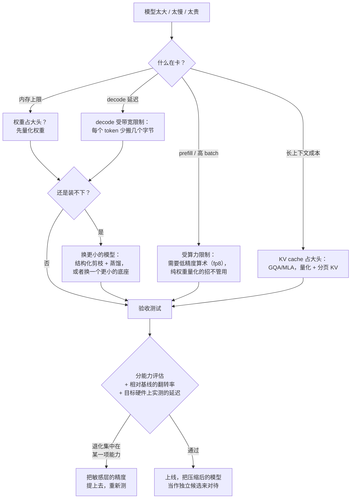

# 模型压缩：量化、剪枝与蒸馏

> 本章是英文原版的中文译本，原文见 [book/model-compression/](../../book/model-compression/)。译文和原文同步维护，发现问题请提 issue。

面试官很少会直接说"讲讲 GPTQ"。他们会说：**"这个模型对我们要跑它的地方来说
太大、太慢了。想办法让它装得下，并告诉我代价是什么。"** 约束有时候是 GPU 账单，
有时候是延迟预算，而且越来越多的时候是一台设备：固定的内存上限、散热包络，
以及一颗只在特定数值格式上才跑得快的加速器。

这个问题有一个听起来对、其实错的答案（"量化到 4-bit，基本没损失"），也有一个
多三句话的正确答案：到底是哪个资源卡住了，在*你的*硬件上哪根杠杆能撬动这个资源，
以及怎么证明你放弃的那部分质量是你付得起的。这些杠杆之间会互相影响，kernel 对
它们的支持程度也不一样，而验收测试正是大多数候选人跳过的那一步。

## 各节

1. [澄清需求](01-clarifying-requirements.md)：一段找出真正约束的对话，以及由此推出的两个结论。
2. [搭出压缩的骨架](02-frame-the-compression.md)：字节和微秒都花在了哪里；四根杠杆；受显存带宽限制的 decode 与受算力限制的 prefill。
3. [量化](03-quantization.md)：格式、粒度、离群值问题，GPTQ / AWQ / SmoothQuant / 旋转，KV cache 量化，PTQ 与 QAT。
4. [剪枝与稀疏](04-pruning-and-sparsity.md)：非结构化、2:4、结构化，各自真正加速的是什么，宽度与深度，修复训练。
5. [蒸馏](05-distillation.md)：软目标、序列级与 on-policy 蒸馏、先剪枝再蒸馏的配方，以及学生模型什么时候能赢过从头训练的小模型。
6. [部署压缩后的模型](06-serving-and-scaling.md)：kernel 支持、按层混合精度、量化底座上的 adapter、对 batch 大小的依赖、端侧约束。
7. [真实团队在生产环境里怎么做](07-how-teams-do-it-in-production.md)：真实压缩栈在哪里分道扬镳；点名对比，附一手链接。
8. [面试问答](08-interview-qa.md)：常考的、有坑的、常答错的。
9. [小结](09-summary.md)：一页回顾、mermaid 图、自测题、延伸阅读。
10. [把它们拼起来：完整的方案](10-putting-it-together.md)：一套默认技术栈，同一个模型在三组约束下的压缩方案，算术账，以及一个能跑的规划器加误差模拟器。

## 一页纸的决策

从验收测试往回绕的那条线，是压缩项目和压缩 demo 的分水岭：第一个配置几乎从来
不会一次通过，而修法通常是外科手术式的（几层提高精度），而不是整根杠杆放弃。

## 相关章节

- [大规模 LLM 推理服务](../inference-serving/)负责服务侧的算术账，以及部署时并行和量化的取舍。
- [长上下文推理与 KV Cache](../kv-cache/)负责 KV cache 的一切，包括架构层面的缩减（GQA、MLA），它们比事后压缩更有效。
- [成本优化与模型路由](../cost-optimization/)负责再往上一层的问题：也许这个请求根本不需要这个模型。
- [给模型做 Benchmark](../benchmark-eval/)负责验收测试：配对比较、分片回归，以及差距的误差范围。
