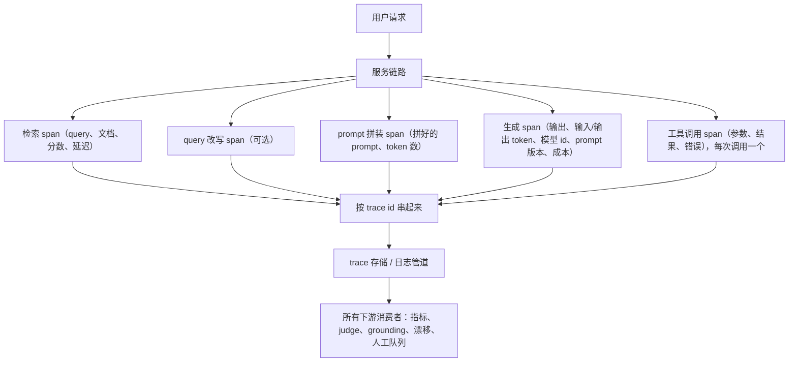
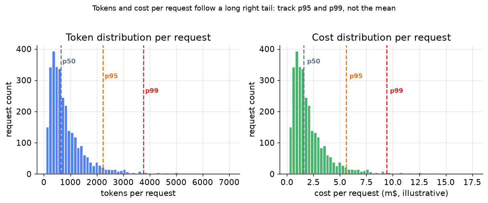

# 2. 观测什么

## 以 span 为先的思路

指标告诉你出了问题，trace 告诉你问题出在哪。LLM 可观测性的地基是**每个请求一条 trace**，按分布式追踪的方式组织，链路里每一步一个 span（每个操作一条带计时的记录）。聚合指标全部从 span 的属性里派生出来；看板、告警、judge 分数，都在这一个埋点的下游。trace 记错了或者记漏了，上面搭的一切都在撒谎。

套路是：在热路径上便宜地、同步地把 trace 发出去，绝不拖慢返回给用户的响应；然后把所有贵的下游工作从这条流上异步地扇出。



**它是怎么运转的。** 一个用户请求进入服务链路，链路里的每一步都产出自己的 span：检索、可选的 query 改写、prompt 拼装、生成，以及每次工具调用各一个。每个 span 都带着同一个 trace id，靠它才能把这些 span 重新拼回该请求的一条有序时间线，而不是散落成一堆互不相关的日志行。拼好的 trace 落进 trace 存储，存储就是唯一的扇出点：指标、LLM judge、grounding 检查、漂移监控、人工审核队列，全都从这里读，而不是各自去服务路径上再埋一遍点。因为 span 是便宜地同步发出的，而每个消费者都从存储里异步读取，所以这些下游工作没有一样压在用户的延迟路径上。这也是为什么 trace 是唯一必须做对的埋点：上面的一切都是派生的，一个不完整的 span 会让某个下游检查事后再也无法重建。

## span 字段的最小集合

链路里每个 span 都带一组核心字段。少了任何一个，都会有某项下游检查事后无法恢复。

| 字段 | 在哪里 | 为什么是承重的 |
|---|---|---|
| `trace_id` | 每个 span | 把一个请求的所有跳串成一条时间线 |
| `span_id`、`parent_span_id` | 每个 span | 重建调用树（嵌套的工具调用、并行检索） |
| `inputs` 原文 | 每一步 | 让你能复现一次失败，审计当时的确切上下文 |
| `retrieved_context` 原文 | 检索 span | 最关键的一个字段：没有它，grounding 检查事后就做不了 |
| `output` 原文 | 生成 span | 用户实际收到的东西；judge 和 grounding 打分都要用 |
| `latency_ms` | 每个 span | 构建 p50/p95/p99 和 TTFT 看板 |
| `prompt_tokens`、`completion_tokens` | 生成 span | 单请求成本、上下文长度上限的排查 |
| `cost_usd` | 生成 span | 一等公民看板；一个成本翻三倍的"更好的模型"就是回退 |
| `model_id` | 生成 span | 让你能在同一条 trace 流里对比两个模型版本 |
| `prompt_version` | 生成 span | 把一次质量变化钉到引起它的那次 prompt 修改上 |
| `error_class` | 每个 span | 区分 API 失败、解析错误和校验错误 |

检索到的上下文是唯一一个任何下游检查都离不开的字段。在检索 span 上把它原文记下来。以后要是想问"答案是不是基于系统实际检索到的内容"，这段上下文必须已经在 trace 存储里了。

## 把 span 串成时间线

用 OpenTelemetry 风格的 span，配上正在成形的 GenAI 语义约定，这样 trace 能自然地流进你已有的技术栈（Datadog、Honeycomb、Grafana Tempo）。trace id 是钥匙：一个请求会扇出到检索、重排、工具调用和生成，靠它才能拼回一条可读的时间线。对话式 copilot 还要加一个 `conversation_id`（跨轮次稳定），这样才能重建完整的多轮会话，检查用户在几轮交互之间的修改和重试行为。

## 每个请求的 token 和成本



*每个请求的 token 数和成本都是一条长长的右尾。均值会大幅低估典型的尾部成本；一定要跟踪 p95 和 p99（95% 和 99% 的请求落在其下的那个值）。示意数据，对数正态分布。*

这个分布对观测层本身的预算很重要：一次 judge 的开销和生成差不多，乘上右尾之后，尾部成本会远高于 judge 调用的平均成本。

上面的分位数看板（p50/p95/p99）直接从 span 的 `latency_ms` 和 `cost_usd` 属性算出来：

```python
import numpy as np
def percentiles(values, ps=(50, 95, 99)):
    # p50/p95/p99: the value below which that percent of requests fall
    return {p: float(np.percentile(values, p)) for p in ps}
# percentiles([100, 200, 300, 400, 500]) -> {50: 300.0, 95: 480.0, 99: 496.0}
```

## 隐私：脱敏与留存

原文记录的输入和输出就是未脱敏的用户数据。两条规则要一开始就定下来：

- **分级留存。** 被标记的请求（负面反馈、judge 判失败、护栏命中）保留全量 trace；未被标记的请求过了一个短窗口后只留截断版或摘要。存储成本和 trace 体量成正比，而 LLM 请求是很啰嗦的。
- **脱敏与访问控制。** prompt 里的 PII（姓名、账号、医疗信息）在长期存储之前必须脱敏，否则可观测存储会变成整个基础设施里最大的一个敏感数据池。原始 trace 的访问权限要和看板分开管。
