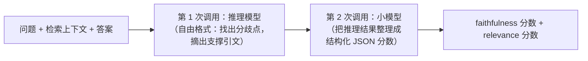
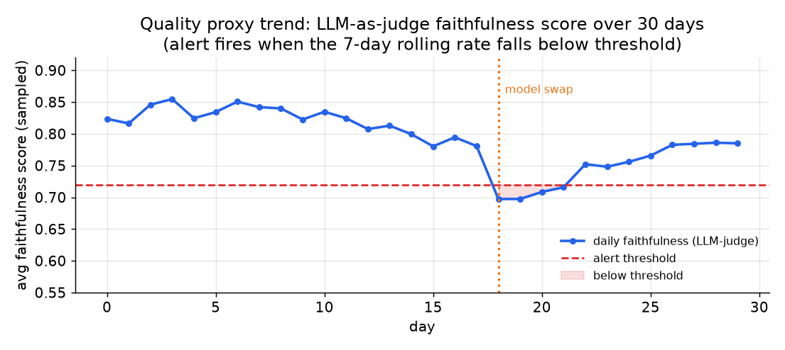

# 3. 没有标签的在线评估

## 没有标签的现实

上线前的评估有一份带标签的数据集：跑一遍模型，把答案和 ground truth 对一对。生产环境没有这个。每小时几千个请求，没人给它们打分。标准的准确率计算在线上不存在。

手上有的是三类代理信号，成本依次上升，体量依次下降：

1. **LLM-as-judge**，跑在抽样的一部分 trace 上：让一个模型给 faithfulness 和 relevance 打分，大概覆盖百分之五到十五的流量。
2. **grounding 检查**，把答案里的每条论断和记录下来的检索上下文做比对：如果问题就是"有没有无依据的论断"，它比完整的 judge 调用便宜。
3. **用户反馈**，既有显式的（点赞点踩、评分），也有隐式的（采纳、丢弃、修改、重试）：免费、量大，但偏差是系统性的，必须考虑进去。

这三样没有一个是准确率，它们都是估计。关键的纪律是：**在拿它告警之前，先用人工标签校准每一个信号**。一个没校验过的 judge，只是一个自信的猜测。

## LLM-as-judge

judge 模型拿到问题、检索到的上下文和生成的答案，然后在两个维度上打分：

- **Faithfulness：** 答案里的每条论断是否都有检索上下文支撑？这是 RAG 系统的首要检查。
- **Answer relevance：** 答案是否回应了用户真正问的东西？

Datadog 的两阶段做法值得了解：第一次调用自由推理（不限制格式），找出分歧点并摘出支撑引文；第二次用一个更小的模型，把推理结果重新整理成结构化输出。把推理和格式化分开，可以避免在推理过程中强制要求严格 JSON 结构带来的准确率损失。



这些偏差是真实存在的，必须点名：LLM judge 偏爱啰嗦的答案，偏爱自己的输出（自我偏好），偏爱在 prompt 里出现得靠前的答案（位置偏差）。judge 给出的数字在用人工标签校准之前都在撒谎。在拿 judge 分数叫醒任何人之前，先在真实流量上收几百条人工标签，量一下一致性：

$$\kappa = \frac{p_o - p_e}{1 - p_e}$$

其中 $p_o$ 是观测到的一致率，$p_e$ 是随机情况下的期望一致率。$\kappa = 1$ 是完全一致，$\kappa = 0$ 是随机水平。Datadog 用 GPT-4o 做 judge，在 HaluBench 和 RAGTruth 上报告 $F_1 = 0.810$；注意在人工标注的 RAGTruth 集上的分数才是老实的那个数，合成集上的不算。

```python
import numpy as np
def cohen_kappa(a, b):
    # chance-corrected agreement between two 0/1 label sets a (judge) and b (human)
    a, b = np.asarray(a), np.asarray(b)
    po = np.mean(a == b)                                    # observed agreement
    pe = np.mean(a) * np.mean(b) + np.mean(1 - a) * np.mean(1 - b)  # agreement expected by chance
    return float((po - pe) / (1 - pe))
# cohen_kappa([1,1,0,0], [1,1,0,1]) -> 0.5
```



*每日 faithfulness 分数（LLM-as-judge，抽样），带一条告警阈值线。第 18 天换了模型，分数下跌穿过阈值，触发告警。随后 prompt 调优补回了一部分，分数部分恢复。示意数据。*

**逐条打分还是成对比较，这个取舍要说出来。** 上面的 judge 给每条 trace 返回一个绝对（逐条）分数，这正是它可监控的原因：可以画趋势，可以设阈值。但逐条的绝对分数恰恰是使用 judge *最不*可靠的方式。关于 LLM judge 的研究（Zheng et al., 2023，就是 MT-Bench 和 Chatbot Arena 那篇）发现，让模型*比较*两个答案，比让它给一个答案打分要一致得多，因为单独一个答案给 judge 提供不了锚点，prompt 或版本上的小改动就会让整个量表漂移。这里的张力是实实在在的：成对比较更可信，但给出的是相对的胜者，不是一个能拿来告警的水位。标准的折中办法是参考锚定打分：把每个生产答案和该 query 的一个固定参考答案（或者一个冻结的旧模型的答案）做比较来打分，既保住了比较的可靠性，又能得到一个稳定、可画趋势的胜率。不管选哪种，都要把 judge 的模型和 prompt 版本钉死：服务商那边悄悄更新一下 judge，逐条打分的量表就会整体重标，凭空造出一个"回退"，其实只是 judge 变了。

## grounding 检查

grounding 检查比通用 judge 更有针对性：它问的是，答案里那些具体的论断，是否被 trace 上记录的检索文档所支撑。

把答案拆成原子论断，再把每条论断和检索上下文逐条比对。一个答案的 groundedness 分数是：

$$G(a) = \frac{1}{|C(a)|}\sum_{c \in C(a)} \mathbf{1}[\,\text{context} \models c\,]$$

其中 $C(a)$ 是答案 $a$ 里原子论断的集合，当检索上下文蕴含论断 $c$ 时指示函数为 1。每条响应的无依据率就是 $1 - G(a)$。按天画这个比率的趋势，任何检索或模型变更之后，都对它的变化量告警。

```python
import numpy as np
def groundedness(claim_supported):
    # fraction of one answer's atomic claims entailed by the retrieved context
    return float(np.mean(claim_supported))                 # claim_supported[i] = 1 if context entails claim i
# groundedness([1, 1, 0, 1]) -> 0.75  (ungrounded rate = 1 - 0.75 = 0.25)
```

有两类失败要区分开：**矛盾**（论断和上下文相悖）和**无支撑**（上下文里根本没有这条论断）。一个答案可以在事实上是对的，但依然无支撑，因为系统检索到的文档里并没有它的依据。两类分开打分，分开画趋势。

## 用户反馈

用户是免费、量大的信号，但带着系统性偏差，必须把这些偏差说清楚。

**显式反馈**（点赞点踩、评分、"报告问题"）收集起来便宜，但很稀疏。只有极小一撮自选的用户会去点，而且偏向特别生气和特别满意的两头。把它当方向性的信号，不要当百分比。绝不能把点踩率低读成"用户很满意"。对我们这个客服 copilot 来说，人工客服采纳了答案，比点赞按钮丰富得多。

**隐式信号**更密集，也更诚实：

- 不改动就直接采纳发送：正向的行为信号。
- 大幅修改后再发送：模型答对了一部分，但原样不能用。
- 立刻丢弃并换个说法重问：几乎一定是失败。
- 什么都没做就放弃：含义模糊，但值得抽样送进审核队列。

每个信号都通过 `trace_id` 挂到 trace 上，这样同一个请求的 judge 分数、grounding 分数和行为信号就能 join 到一起。被点踩或者被大改的响应，是人工审核队列和刷新冻结评估集的最高产出来源。

## 什么时候用哪个信号

| 用什么 | 什么时候 | 而不是 |
|---|---|---|
| LLM-as-judge（faithfulness + relevance） | 需要一个线上流量的通用质量代理，并且付得起抽样的额外调用 | 假设上线前的评估分数在线上照样适用，可线上并没有标签 |
| 两阶段 judge（先推理再格式化） | 领域需要细致的 grounding 检查，并且有两次调用的预算 | 单次限制输出格式的 prompt，它会拉低推理质量 |
| grounding 检查（论断 vs 上下文） | 答案本应基于检索文档，而且上下文已经记录下来 | 通用 judge，当你真正担心的失败就是无依据的论断时 |
| 对人工标签算 Cohen kappa 或 F1 | 在拿 judge 分数告警之前，校准它到底可不可信 | 原始 judge 分数，校准之前它只是一个自信的猜测 |
| 隐式用户行为（采纳 / 修改 / 重试率） | 想要一个密集、免费、比稀疏的点赞更诚实的信号 | 把点赞点踩单独当成准确率来用 |
| 人工审核队列 | 自动打分漏掉的细微失败，以及校准 judge | 全部人工审一遍，这没法规模化 |

**每种信号对应的工具。** 线上 trace 上抽样的 LLM-as-judge 和 grounding 检查可以跑在 Ragas、DeepEval 和 Arize Phoenix 上，它们的 faithfulness 和 answer-relevance 打分器会把答案拆成论断，对着记录的上下文逐条比对。带 trace_id、能把 judge 分数、grounding 分数和行为反馈 join 起来的 trace 采集，来自 LangSmith、Arize Phoenix、Langfuse、Helicone 这类 LLM 可观测平台，通常走 OpenTelemetry。对人工标签的 Cohen kappa 或 F1 用 scikit-learn 算，标注数据是拉进 Label Studio 这类标注工具里的几百条 trace，人工审核队列也由它支撑。显式和隐式反馈的采集在应用里埋点，转发到同一个可观测层。

**出处。** 把这些信号绑在一起的 trace_id join 建立在 OpenTelemetry（CNCF）之上，这是上述可观测平台共同输出的厂商中立追踪标准。judge 和 grounding 打分器是 LLM-as-judge 模式的常规应用，并非某个单一来源的方法，所以这里不再另外标注出处。

**一个实际例子。** 一个没有线上标签的企业 RAG 团队，先依赖隐式用户行为，也就是采纳、修改和重试率，因为它密集、免费，而且比那个只有特别生气或特别满意的人才会点的稀疏点赞按钮诚实得多。答案本应基于检索文档，而且他们在每条 trace 上都记了上下文，所以针对他们真正担心的那种失败，无依据的论断，加了一个有针对性的 grounding 检查而不是通用 judge，并把矛盾率和无支撑率分开画趋势。为了有一个更宽泛的质量代理，他们抽一部分流量过 LLM-as-judge，但在对几百条人工标签量过 Cohen kappa 之前，拒绝拿它的分数告警，因为没校准的 judge 就是一个自信的猜测。最高产出的那些被点踩和被大改的 trace 送进人工审核队列，而不是全部人工审一遍，那样规模化不了。
