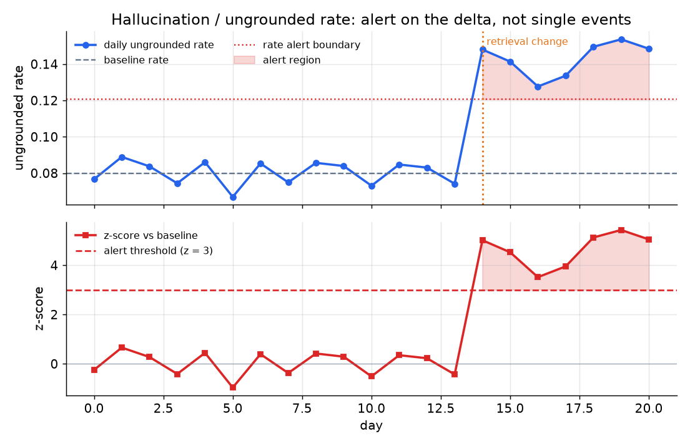
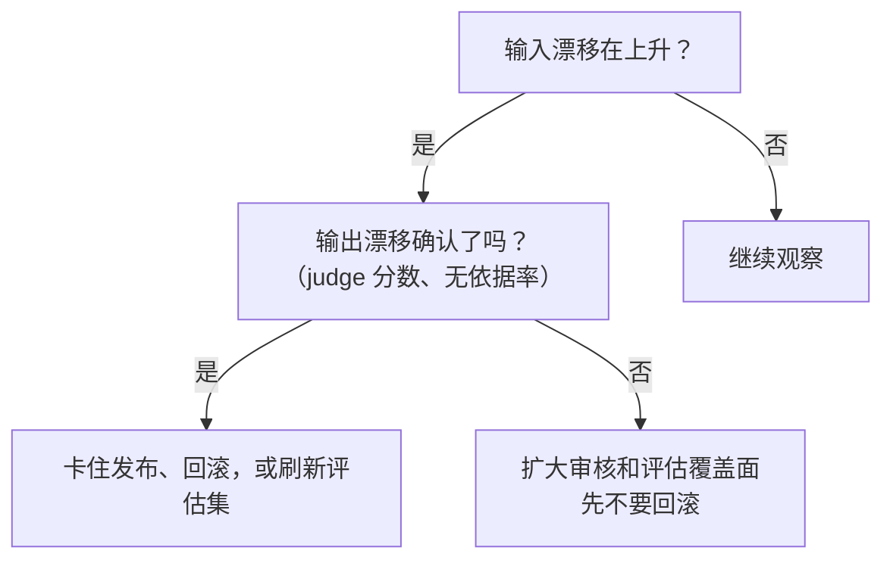

# 4. 检测漂移与回退

换模型或者改 prompt，恰恰就是质量悄悄变化的时刻。监控的目的就是赶在用户之前抓住它，而且不需要有人记得去看一眼。

## 两种漂移

漂移（数据分布随时间发生的偏移）分两种，它们先后出现，一个预告麻烦，一个证实麻烦：

**输入漂移**是流量在你脚下变了：新话题、新语言、更长的文档，或者训练分布里没见过的用户群。它预告麻烦，但不能证实质量已经下降。检查方法是算当前请求窗口的平均 embedding（一个刻画 query 语义的数值向量）和参考窗口之间的余弦距离：

$$d_t = 1 - \frac{\bar{e}_t \cdot \bar{e}_{\text{ref}}}{\lVert \bar{e}_t \rVert\, \lVert \bar{e}_{\text{ref}} \rVert}$$

```python
import numpy as np
def input_drift(cur, ref):
    # cur, ref: (n, d) arrays of query embeddings for the current and reference windows
    ec, er = cur.mean(0), ref.mean(0)                       # mean embedding of each window
    cos = ec @ er / (np.linalg.norm(ec) * np.linalg.norm(er))
    return 1 - cos                                          # 0 = identical, larger = more drift
# input_drift(np.array([[1.,0.],[1.,0.]]), np.array([[0.,1.],[0.,1.]])) -> 1.0 (orthogonal means)
```

$d_t$ 接近 0 表示没有漂移；$d_t$ 持续上升说明输入分布在移动。用一个便宜的编码器给用户 query 做 embedding（all-MiniLM-L6 的开销只是生成模型的零头），每次有意的模型或 prompt 变更之后都更新参考窗口，这样比较的基线才始终是对的。

**输出漂移**是输入大体不变、质量却在衰退：无依据率上升、judge 分数下降、重试变多、丢弃变多。它证实系统里有东西变了。两者的关系是：输入漂移是先行指标，盯着它就能预判输出漂移什么时候会来。

## 对比：输入漂移 vs 输出回退

两者都是分布偏移，检测方式也一样（拿一个窗口统计量对着参考窗口画趋势，对变化量告警），所以很多团队把它们接进同一个告警通道，当成可以互换的东西。其实不能：一个是预告麻烦，另一个是证明麻烦。

| 维度 | 输入漂移 | 输出回退 |
|---|---|---|
| 共同点 | 把当前窗口和参考窗口比较而发现的分布偏移 | 把当前窗口和参考窗口比较而发现的分布偏移 |
| 变的是什么 | 用户发来的 query | 系统返回内容的质量 |
| 能证明什么 | 模型可能已经跑出了它熟悉的分布；对质量还说明不了什么 | 用户确实在收到更差的输出 |
| 检测成本 | 便宜：用小编码器给 query 做 embedding，不需要标签也不需要 judge | 贵：需要一个质量代理（抽样 judge、grounding 分数或行为信号） |
| 单独可以行动吗 | 不行：无害的话题变化和有害的变化在 embedding 空间里长得一模一样 | 可以：确认了的质量下降足以卡住发布或回滚 |
| 典型诱因 | 季节性、市场活动上线、新的用户群 | 模型、prompt 或检索的变更；服务商那边换了模型；或者输入漂移终于咬到了 |

这个区别会改变告警的接线方式：输入漂移应该扩大评估覆盖面、提高警觉，但不叫醒任何人；而确认了的输出回退，才是允许叫 on-call、触发回滚的信号。

## 幻觉检测

RAG 系统里的幻觉，最好当成一个 grounding 问题来看：答案是否能从检索器实际取回的文档推出来？这是可以检查的，因为检索上下文已经记录下来了。

单条响应的 groundedness 在上一节定义过了。用于监控时，把它聚合成一个比率：

$$r_t = \frac{1}{n_t}\sum_{i=1}^{n_t} (1 - G(a_i))$$

其中 $n_t$ 是当前窗口里打过分的 trace 数量，$G(a_i)$ 是答案 $a_i$ 的 groundedness 分数。$r_t$ 就是无依据率：抽样答案里至少含一条检索上下文不支撑的论断的比例。

```python
import numpy as np
def ungrounded_rate(grounded_scores):
    # windowed hallucination rate: mean of (1 - G) over judged traces in the window
    return float(np.mean([1 - g for g in grounded_scores]))
# ungrounded_rate([1.0, 0.75, 1.0, 0.5]) -> 0.1875
```

对**这个比率的变化量**告警，不要对单个被标记的事件告警。单独一条无依据的答案，在任何规模下都是噪声。信号是模型或检索变更之后的比率偏移。z-score 的机制见告警那一节。



*上图：每日无依据率，带基线和告警边界。第 14 天的一次检索变更引发比率飙升，穿过阈值。下图：相对基线的 z-score；z 超过 3 时告警触发。示意数据。*

## 回退门禁：三种机制

回退是你有意做的一次变更引入的质量下降。三种机制在不同风险层级上抓回退：

**冻结评估集回放**是从上线前评估到线上监控的桥梁。把上次发布用来把关的那份带标签评估集留着，定时回放，每次模型或 prompt 变更也回放。如果冻结集上出现回退，那它会在触及大多数用户之前就浮出来。局限在于冻结集会过时。刷新办法是把 judge 或 grounding 分数差、被标记出来的生产 trace 提拔进带标签集。这就是随着产品演进，监控闭环保持诚实的方式。

**金丝雀部署**（全量发布之前，先在一小片真实流量上测试变更）把一小部分（百分之五到十）真实流量路由到候选模型或 prompt，实时把它的代理分数、反馈、延迟和成本与对照组比较。冻结集抓不到的回退（可能因为评估集过时了，或者失败只在特定输入分布上出现）在金丝雀规模上依然会浮出来。证据来自用户行为，不是合成的 benchmark。

**影子模式**在每个请求上都跑候选模型，但不把它的输出给用户看，然后对比候选和对照的答案。对用户的风险是零，但影子模式只能量出输出的差异，量不出用户的反应。用它在决定要不要上金丝雀之前，先量化新模型会把输出改变多少。

## 什么时候用哪种回退门禁

| 用什么 | 什么时候 | 而不是 |
|---|---|---|
| 冻结评估集回放（定时） | 每次模型或 prompt 变更，作为成本最低的第一道检查 | 只靠生产流量，它可能覆盖不到评估集里的失败模式 |
| 冻结评估集回放（按需） | 持续的后台监控，抓服务商那边悄悄发生的模型回退 | 定期人工审查，一忙起来就跳过了 |
| 金丝雀（一片真实流量） | 冻结评估通过之后，全量发布前想要真实用户的证据 | 全量发布再事后监控，这会让所有用户都暴露在回退之下 |
| 影子（零风险对比） | 想在承担任何金丝雀风险之前，先拿到输出层面的证据 | 跳过金丝雀前的对比，直接上金丝雀 |
| 输入 embedding 漂移监控 | 作为先行指标，提示输入分布正在脚下移动 | 等输出漂移指标事后证实麻烦 |

**每种门禁对应的工具。** 输入 embedding 和输出漂移监控由 Evidently、NannyML 和 whylogs 提供，用 sentence-transformers 库里的便宜编码器给 query 做 embedding，对参考窗口画余弦距离的趋势。冻结评估集回放复用上次发布把关时的那个离线 runner（OpenAI Evals、Promptfoo 或自研套件），通过 CI 或编排器定时跑，结果在 MLflow 里跟踪。金丝雀和影子路由跑在 feature flag 和实验层上（GrowthBook、Statsig、Unleash 或 LaunchDarkly），候选对对照的代理分数、延迟和成本，则在 Arize Phoenix、LangSmith 或 Langfuse 这类可观测平台里呈现。

**出处。** 这里提到的漂移监控工具里，Evidently（开源）的数据漂移和回退报告原语是被广泛复用的参考实现；金丝雀、影子和冻结回放门禁都是标准的部署模式，并非某个单一来源的方法，所以不再另外标注出处。

**一个实际例子。** 一个聊天产品要上一次直接替换式的模型切换。他们先跑冻结评估集回放，因为这是成本最低的检查，能在任何用户看到之前抓住回退；同时把被标记的生产 trace 提拔进评估集来刷新它，免得过时。评估集可能漏掉只在特定输入分布上出现的失败，所以接下来他们把百分之五到十的真实流量路由到金丝雀，实时对比代理分数、反馈、延迟和成本，而不是全量发布再事后监控，那会让所有人都暴露在回退里。当他们只想知道新模型会把输出改变多少、还不想承担任何金丝雀风险时，就跑影子模式，在零用户暴露的前提下对比候选和对照。在这一切旁边，他们还保留一个输入 embedding 漂移监控作为先行指标，这样 query 分布一开始移动就能预警，不用等输出漂移证实损失。

## 实现与训练中的坑

漂移和回退监控器失灵的方式很有规律：要么狼来了喊到所有人把它静音，要么真回退来了它在睡觉。下面这些失败，就是监控器反复失去团队信任的原因。

| 问题 | 症状 | 修法 |
|---|---|---|
| 对单个被标记事件告警 | 频道被零星的无依据答案刷屏，真正的告警反而被忽略 | 对窗口内的比率变化量或 z-score 告警，不对单条 trace 告警 |
| 冻结评估集过时 | 冻结回放通过了，线上质量却在回退，因为评估集已经不能代表流量 | 把被标记的生产 trace（judge 或 grounding 分数差的）提拔进带标签集来刷新 |
| 参考窗口从不重置 | 每次有意的模型或 prompt 切换，漂移监控都会报警 | 每次有意的变更之后重置参考窗口，确保对着正确的基线比较 |
| 窗口和阈值没调好 | 太短会被正常波动触发，太长会掩盖真正的漂移 | 按流量体量定窗口大小，用历史数据调 z 阈值 |
| 没验证过的 LLM judge | 所谓"漂移"其实是 judge 的噪声或 judge 版本变了，不是模型变了 | 用人工标签验证 judge，并钉死 judge 的模型和 prompt 版本 |
| 只凭输入漂移就行动 | 一个尚未证实任何损害的先行指标触发了回滚或扩容 | 把输入漂移当预测器；行动之前先用输出漂移指标确认 |
| 全量发布再监控 | 回退被发现之前，所有用户都已经暴露在其中 | 先用百分之五到十的流量做金丝雀，和对照组比代理分数 |
| 服务商悄悄换模型 | 你这边没有任何发布，质量却动了 | 定时跑冻结评估集回放，抓那些不是你触发的、服务商那边的回退 |

输入和输出的区分是多数团队最容易搞错的地方，值得画一张决策流程：



贯穿始终的一条线：对比率偏移告警而不是单个事件，保持参考窗口和评估集新鲜，让先行指标预警你，但别让它自己动手。
