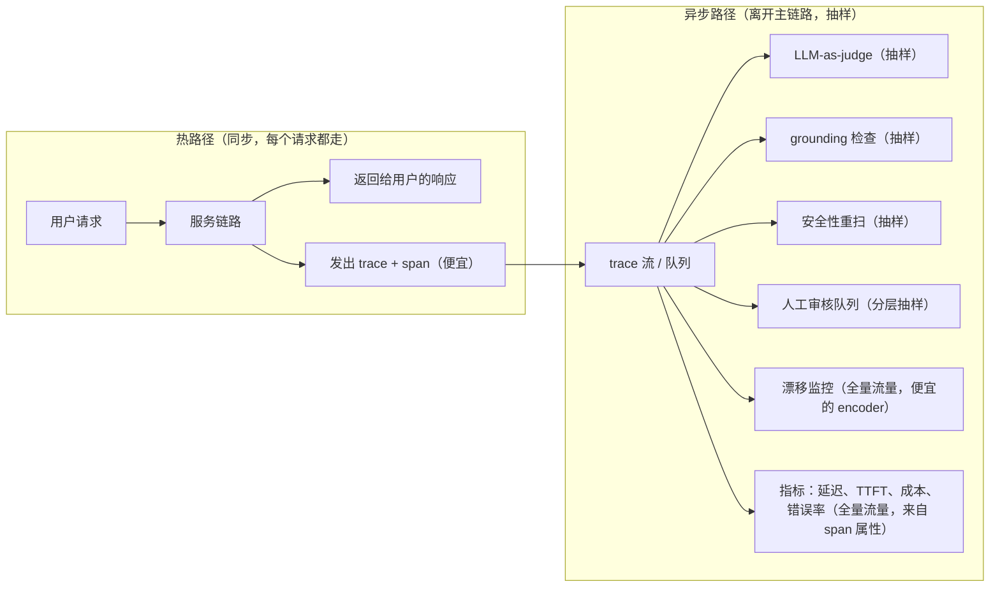
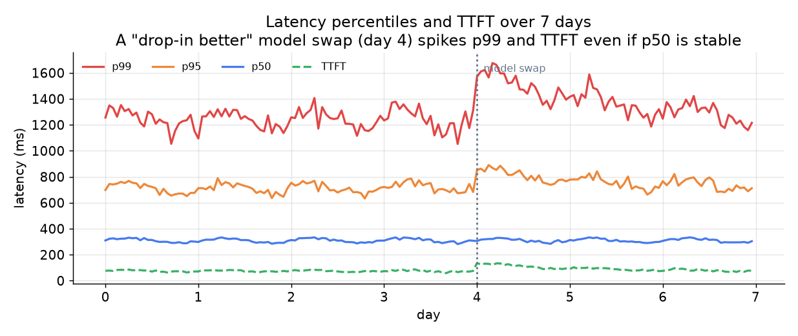

# 6. 服务与扩展

## 热路径必须保持便宜

服务链路（检索、prompt 拼装、生成、工具调用）本来就在用户请求的关键路径上。可观测层多加的每一毫秒开销，用户都感受得到。规则很硬：trace 同步发出去，重活全都异步做。

分界线是成本：指标和漂移监控跑在全量流量上，因为它们都是从 span 属性里便宜地算出来的，不需要额外的模型调用。judge、grounding 和安全性重扫每打一次分就要多一次模型调用，所以要抽样。人工审核最贵（花的是人的时间），分层也做得最狠。

## 采样的成本公式

观测成本随采样率线性增长，检测延迟则和它成反比。天下没有免费的午餐：

$$\mathbb{E}[\text{cost}_{\text{obs}}] = s \cdot \lambda \cdot c_{\text{judge}}$$

$$t_{\text{detect}} \approx \frac{k}{s \cdot \lambda \cdot r_{\text{fail}}}$$

其中 $s$ 是抽样比例，$\lambda$ 是请求速率，$c_{\text{judge}}$ 是单次 judge 调用的成本，$r_{\text{fail}}$ 是想检测的失败率，$k$ 是要达到统计置信度所需的失败样本数。把 $s$ 砍一半，观测账单也砍一半，但检出一次 $r_{\text{fail}}$ 量级回退的预期时间会翻倍。

落到实践上：如果刚做完一次高风险变更（比如在医疗类产品上换模型），需要快速拿到结论，那就在一个检测窗口内临时把 $s$ 调高，等确认没问题了再调回去。

## 延迟分位数：用户真正感受到的东西

*7 天内的 p50、p95、p99 和 TTFT。第 4 天换了一次模型，TTFT 翻倍，p99 冲到 SLO 之上，而 p50 几乎没动。看均值的话，这次回退会被完全漏掉。示意图。*

延迟要按分位数分布来看，不要看均值。对流式 UI 来说，用户感知到的"响应快不快"就是首 token 延迟（TTFT）。一个答案质量更好但 TTFT 翻倍的模型，在面向用户的指标上就是回退，哪怕它在 faithfulness 看板上赢了。

## 瓶颈与扩展

| 瓶颈 | 最早的征兆 | 解法 | 代价 |
|---|---|---|---|
| 埋点本身带来延迟 | 流量没变，服务 p50 延迟却涨了 | span 以 fire-and-forget 的方式写进队列，绝不阻塞响应路径 | 队列满时有小概率丢 trace |
| judge 成本吃掉整个观测预算 | 观测成本逼近服务成本 | 降采样率；一遍粗筛换成更便宜的微调 encoder，只把被标记的 trace 交给完整 judge | 检测变慢，或者尾部覆盖率下降 |
| 日志量和存储成本 | 存储账单涨得比流量快 | 分级保留（被标记的存全量，干净的存截断版），过了保留期就把原始 prompt 脱敏 | 以后做事后分析时可用的数据变少 |
| 人工审核队列被压垮 | 队列积压变长，审核延迟上升 | 收紧分层准则，抬高进队列的门槛 | 人工标签样本变小，judge 校准漂得更快 |
| judge 与人工的分歧变大 | 对着人工标签算的 kappa 或 F1 下降 | 重新标一批新样本，更新 judge 的评分细则和 prompt 版本，把新版本钉住 | 领域发生变化后会有一小段校准滞后 |
| 安全性重扫漏掉有害输出 | 定期红队测出护栏没拦住的输出 | 除了护栏的擦边样本，也从放行流量里抽样送进重扫队列 | 未被标记的流量上多花一笔重扫成本 |

前两行值得展开说说。"埋点带来延迟"那条解法之所以成立，是因为可观测栈写入的那套 tracing 标准 OpenTelemetry（CNCF）本身就是为异步导出 span 设计的：SDK 会把 span 攒成批，在请求路径之外冲刷出去，所以 fire-and-forget 是它设计上就期待的用法，不是什么歪招，唯一真实的风险是导出队列饱和时会丢 span。"judge 成本吃掉预算"那条本质上是道采样数学题：judge 成本随采样率线性增长，标准做法是先用一个便宜的粗筛模型给所有请求打分，只把可疑的尾部升级给完整 judge，这样覆盖率保得住，昂贵调用的量则按粗筛通过率成比例地降下来。两条解法都是拿一个有界的损失（丢几条 span，尾部检测慢一点）去换观测开销上一个很大的常数倍下降。
