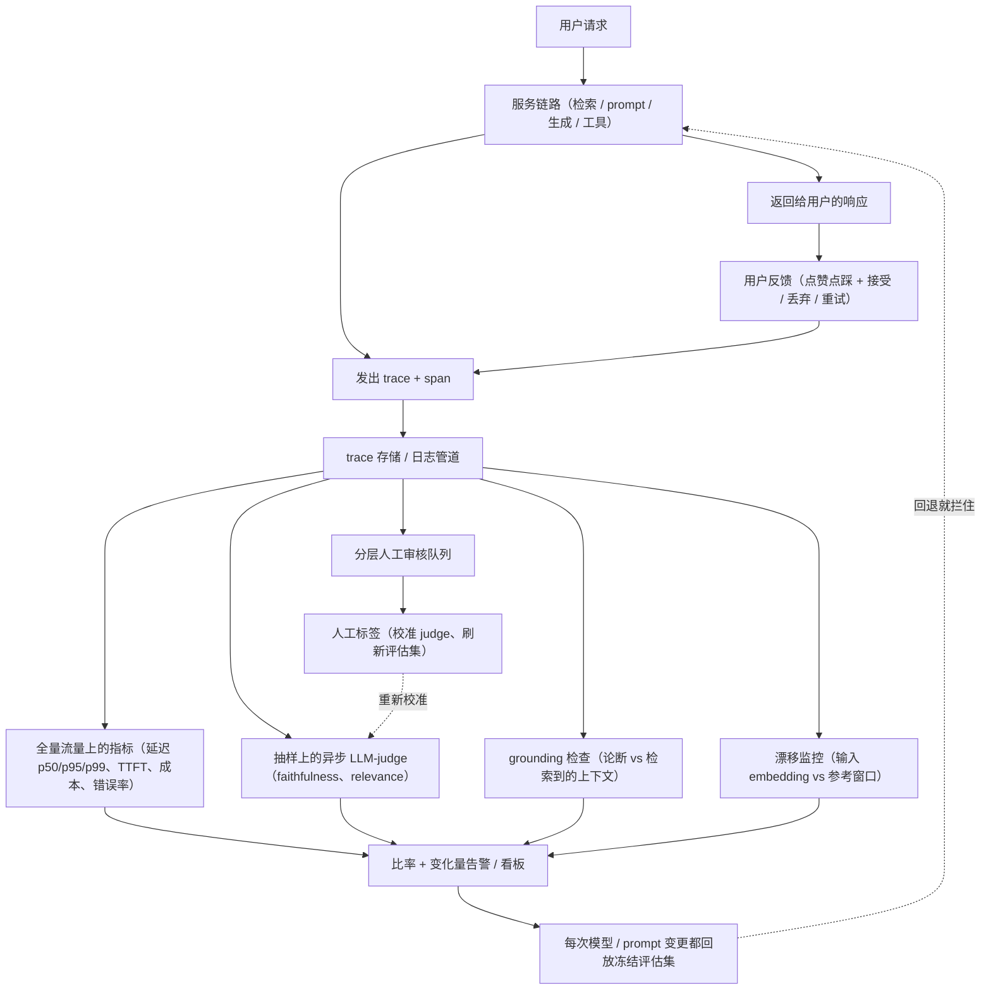

# 9. 小结

## 一页纸回顾

- **生产环境没有 ground truth，所以质量永远是估出来的，不是测出来的。** 离线的那套准确率在线上不存在。手里有的只是代理信号：抽样跑的 LLM judge、对着日志里检索上下文做的 grounding 检查，以及隐式用户行为（接受、丢弃、重试）。每一个代理指标在被人工标签校准之前，都是一个会骗人的数字。
- **trace 是地基。** 每个请求发一条 trace，每一步一个 span。记下输入、检索到的上下文、输出、延迟、token（prompt 和 completion 分开记）、成本、模型 id、prompt 版本。检索到的上下文是唯一那个承重的字段：没有它，事后就不可能再做 grounding 检查。
- **昂贵的检查一律异步 + 抽样。** trace 便宜地、同步地发出去；judge、grounding 打分、安全性重扫、人工审核队列都挂在这条流后面异步跑。只有那些从 span 便宜地推导出来的指标（延迟、成本、错误率）才跑全量流量。
- **对比率和变化量告警，不对单个事件告警。** 每个响应算一个 groundedness 分数，汇总成窗口内的无依据率，在模型或检索变更之后，z-score 相对基线超过阈值才叫人。单独一条被标记的答案是噪声。
- **冻结评估集是持续运行的部署关卡。** 按调度周期回放，每次模型或 prompt 变更也回放。要从被标记的生产 trace 里刷新它，否则它会过期，抓不到当前流量上的回退。
- **采样率是在成本和检测延迟之间做交换。** 采样砍一半，观测账单砍一半，但抓到一次回退的预期时间会翻倍。两者要一起调，而且要分层抽样，对可疑的尾部超额抽样。
- **盯住那些质量指标看不见的信号。** 拒答率或拦截率上升是一种无声的劣化（被拦掉的答案根本不会被打分）。一个"更好"但把 TTFT 翻倍、成本翻三倍的模型就是回退，哪怕 judge 分数变高了。护栏触发率、延迟分位数、每请求成本都要当一等指标来报。

## 一页看完整个系统

## 自测

答案是折叠的。每题先自己答一遍再展开。

1. judge 分数一个月比一个月高。你怎么判断是质量真的变好了，还是 judge 在漂？

   

答案

   光看分数判断不了，所以要把 **judge 与人工的一致性** 摆在它旁边一起报。校准是一个从 judge 分数到人类判断的映射，而这个映射只在它被测量的那个分布上成立：一月份 Cohen's kappa 0.82 的 judge，在领域、prompt 或流量构成变过之后，到三月份可能已经在系统性地往高里判，同时照样输出自信满满的数字。在真实流量上采几百个新的人工标签，重算 kappa 或 F1，把这一对放在一起读。如果分数在涨而 kappa 在跌，那是仪器在骗人，不是产品在变好。有两条卫生规则，缺了它们连诊断都做不了：**把 judge 的模型和 prompt 版本钉死**，因为供应商那边悄悄更新一次 judge 就会把一个 pointwise 指标整体重新缩放，凭空造出一条假趋势；以及拿隐式行为信号交叉验证，它覆盖全量流量，而且失效方式和 judge 相互独立。第 [3](03-online-eval-without-labels.md) 节和第 [8](08-interview-qa.md) 节把这件事讲透了。

   

2. 全量发布一次模型替换之前，该按什么顺序跑哪三步，每一步分别接住了前一步漏掉的什么？

   

答案

   按用户风险从低到高：**冻结评估集回放**，然后是**影子模式**，最后是**金丝雀**。冻结评估回放成本最低，所以第一个跑，它能在任何用户被暴露之前抓住已知失败模式上的回退；它的盲区是过期，因为这个集合是从一个移动的分布上取的固定样本，而且之前每一次改动都是调到它通过为止。影子模式让候选版本处理每一个线上请求但不展示输出，所以它能在真实的当前流量分布上抓住输出分歧，用户风险为零；它的盲区是没有用户见过那个答案，因此产生不了任何用户反应。金丝雀把百分之五到十的线上流量路由到候选版本，至少覆盖一个完整流量周期（二十四小时能覆盖一个昼夜模式），把代理分数、反馈、延迟和成本跟对照组比，三者里只有它能拿到接受、重试、修改这些行为数据，也就是生产环境里最接近 ground truth 的东西。在告警这一层有个要紧的区分：冻结评估上的回退是**拦住**发布，不是叫人。见第 [4](04-detecting-drift-and-regressions.md) 节和第 [5](05-alerting.md) 节。

   

3. 为什么检索到的上下文是 span 里最关键的那个字段，丢了它之后哪些事就做不成了？

   

答案

   因为每一个 grounding 检查都是**条件**检查，衡量的是"给定上下文，论断是否成立"，而当异步打分器在几分钟之后跑起来时，上下文必须已经在 trace 存储里躺着了。丢了它，单答案的 groundedness 分数 $G(a)$ 就压根算不出来，随之作废的还有窗口内的无依据率、建在这个比率上的 z-score 告警，以及"自相矛盾 vs 无依据"那个区分（它告诉定位问题的人，模型是在跟文档唱反调，还是在编一个文档里根本没有的东西）。LLM judge 挨的打一样重：faithfulness 是拿问题、检索到的上下文和答案三样一起打分的，没有上下文就只剩 relevance 了。你还会失去把检索故障和生成故障分开的能力，而那是任何 RAG 排查会话里的第一个岔路口。这是一条硬性的时序约束，不是偏好问题：昂贵的检查是事后离开主链路跑的，所以凡是没有在检索那个 span 上原样记下来的东西，就再也找不回来了。见第 [2](02-what-to-observe.md) 节和第 [4](04-detecting-drift-and-regressions.md) 节。

   

4. 你对百分之五的流量做 judge。现在出现了一次失败率为百分之二的回退。采样率的选择会怎样影响你多久能发现它？

   

答案

   观测成本随采样率**线性**增长，检测延迟则和它成**反比**，两者是对着干的：
   $\mathbb{E}[\text{cost}_{\text{obs}}] = s \cdot \lambda \cdot c_{\text{judge}}$，
   $t_{\text{detect}} \approx k / (s \cdot \lambda \cdot r_{\text{fail}})$。当 $s = 0.05$、$r_{\text{fail}} = 0.02$ 时，一千个请求里只有一个是"被判过分的失败"，所以如果统计置信度要求 $k = 30$ 条被标记的 trace，那就得等大约三万个请求。把采样砍半到百分之二点五，观测账单砍半，这个等待时间翻倍。同样的张力在告警本身里也出现：$n_t$ 坐在 z-score 标准误的分母上，样本更薄就意味着区间更宽，能检测到的最小比率偏移也被抬高，这正是采样率和窗口大小必须一起调、不能各调各的原因。两个实操动作：高风险变更之后，在一个检测窗口内临时把 $s$ 调高，确认没问题再调回去；以及做**分层**抽样，对可疑的尾部（反馈差、重试多、检索分数低、护栏擦边）超额抽样，别把预算花在那些一看就没问题的请求上。见第 [6](06-serving-and-scaling.md) 节和第 [5](05-alerting.md) 节。

   

5. 护栏更新之后，拒答率看板显示拦截率很稳。安全是不是就确认了？你还会加跑什么检查，为什么？

   

答案

   不是。拦截率稳，和有害输出正在一路没被抓住地流出去，这两件事完全可以同时成立，因为拦截率衡量的是护栏对着**它已经能识别的东西**的召回率，而不是对着真实的有害发生率。一族分类器从没被训练过的越狱手法，产生的是零次拦截和一条完全平的曲线，与此同时危险输出照发不误。要加的检查是**在放行流量上做抽样的安全性重扫**，也就是被护栏放过去的那些响应，最好换一个模型或者由人来扫，这是唯一能估出"主过滤器判为安全的那条流"上漏检率的办法；扩展那张表里写明的代价是：未被标记的流量上要多花一笔重扫成本。既然都在看这个比率了，两个方向都要看：拒答率或拦截率*上升*是一种无声的劣化，因为被拦掉的答案根本不会进入质量打分，于是质量看板一片健康，而正常流量正在被误杀。这也是唯一一个立刻叫人、而不是开工单的信号。见第 [8](08-interview-qa.md) 节、第 [6](06-serving-and-scaling.md) 节和第 [5](05-alerting.md) 节。

   

6. 隐式用户信号（重试率高、接受率低）和 judge 分数（faithfulness 在涨）打架了。这说明什么，你先去查哪个？

   

答案

   它说明两个量具里有一个是错的，而这件事之所以有信息量，恰恰在于它们**失效方式相互独立**：judge 打分的是一个受控样本，它会漂，也会被那种形式漂亮、话又多的输出捧高；行为信号单看每一次都很噪，但它来自全量流量，来自不为任何指标表演的用户。两者一致才算证据；背离则意味着现在还不能宣布质量变好了。先查 judge，因为它是更便宜就能证伪的那个：拿一批新的人工标签重算 kappa，确认 judge 的模型和 prompt 版本还钉着，再排查那几种已知偏好（偏爱长答案、偏爱自己、位置偏好）。如果 judge 站得住，那故障就落在 faithfulness 结构性看不见的地方，接着往那儿找：**检索错了上下文**（忠实于错的文档）、技术上有依据但跑题的答案、语气/格式/语域上的失败，以及半年前是准的、现在已经过期的上下文。然后把被丢弃的和被大改的 trace 拉进分层人工审核队列，它们既是诊断产出最高的一批用例，也是刷新冻结评估集最好的来源。见第 [3](03-online-eval-without-labels.md) 节、第 [8](08-interview-qa.md) 节和第 [5](05-alerting.md) 节。

   

## 延伸阅读

- 收官之作：[把它们拼起来：完整的方案](10-putting-it-together.md)，本章里的每一个选择都在那个场景下拍板一次、算清成本，再在另外两组约束下重搭一遍，最后压缩成一个可运行的单文件漂移检测器。
- 带全部对比、数学和生产案例研究的密集参考：[../../topics/12-production-monitoring-and-observability.md](../../topics/12-production-monitoring-and-observability.md)
- 逐家公司的拆解（Datadog、Honeycomb、Uber、Grafana、LangChain、Twilio Segment）：[../../tools/teardowns/12.md](../../tools/teardowns/12.md)
- 工具对比表、决策数学、象限图：[../../tools/comparisons/12.md](../../tools/comparisons/12.md)
