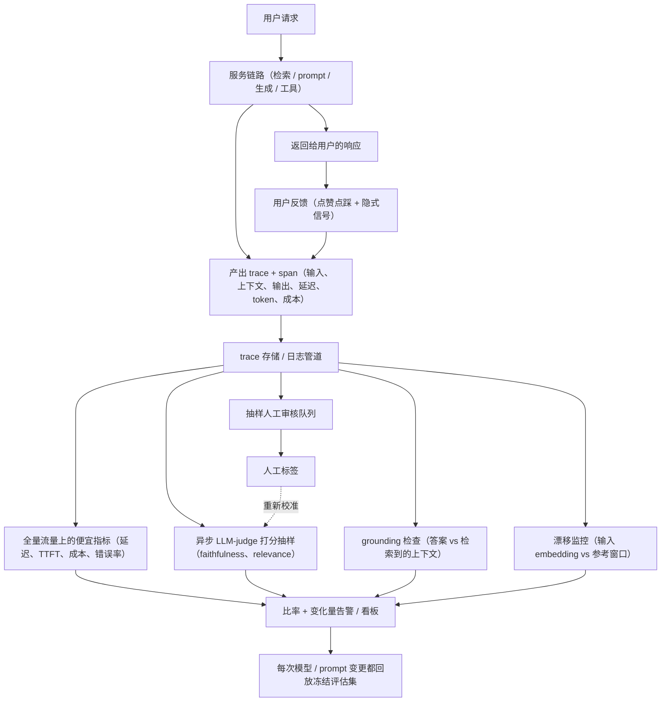

# 生产环境监控与可观测性

> 本章是英文原版的中文译本，原文见 [book/monitoring/](../../book/monitoring/)。译文和原文同步维护，发现问题请提 issue。

面试官很少会直接说"搭一套监控"。他们会说：**"你的 LLM 应用已经上线，接着真实流量。
生产请求没有标签，没人给答案打分，下周还有人要换模型、改 prompt。你怎么知道它今天
还在正常工作？怎么在用户发现之前，抓住一次幻觉飙升或者质量回退？"**

这道题的坑在于，大家平时练的那套离线肌肉，跑一遍测试集、看一个分数，线上根本不存在。
生产环境没有 ground truth，所以没法像上线前那样算准确率。能做的是：把每次调用都记成
结构化的 trace，用便宜的自动检查来近似质量，再从真实流量里抽样送进人工审核队列。
资深工程师的说法是：评估不会在部署关卡就结束。到了线上，它变成一件持续进行、基于抽样、
靠代理指标驱动的事，而不是一次性的通过或不通过。

## 各节内容

1. [澄清需求](01-clarifying-requirements.md)：通过对话把问题范围划清楚。
2. [观测什么](02-what-to-observe.md)：trace、span、token、成本、延迟，以及那个绝对不能丢的字段。
3. [没有标签的在线评估](03-online-eval-without-labels.md)：LLM-as-judge、grounding 检查、用户反馈和校准。
4. [检测漂移与回退](04-detecting-drift-and-regressions.md)：输入和输出漂移、幻觉检测、金丝雀和影子门禁。
5. [告警](05-alerting.md)：比率阈值、z-score 检测、on-call 分级，以及变更时回放。
6. [服务与扩展](06-serving-and-scaling.md)：trace 采样的成本、把重活挪出热路径，以及瓶颈在哪。
7. [真实团队在生产环境里怎么做](07-how-teams-do-it-in-production.md)：Datadog、Honeycomb、Uber、Grafana、LangChain、Twilio Segment，以及它们的分歧点。
8. [面试问答](08-interview-qa.md)：常问的、有陷阱的、以及大家常答错的。
9. [小结](09-summary.md)：一页纸回顾、mermaid 图和自测题。
10. [把它们拼起来：完整的方案](10-putting-it-together.md)：一套默认技术栈，把本章场景从头到尾搭起来（含采样和成本计算），同一个系统在三组不同约束下的样子，以及一个最小可运行的监控器。

## 一页看完整个系统

面试官会留意两件事：贵的检查都是**异步且抽样**的，所以不会拖累服务路径；人工标签会
回流去**校准代理指标**，而不是审计完就没了下文。

第一次读请按顺序来，各节是层层递进的。每一节都从面试官真正会问的那个问题开头，然后
用设计选择背后的推理来回答它。

## 姊妹章节

经典 ML 那本姊妹书从另一个角度讲了同样的内容：
[monitoring](https://github.com/neurarch-ai/awesome-ml-system-design/tree/main/book/monitoring/) 是同一件事的经典 ML 版本：特征漂移和预测漂移、PSI，以及表格模型上延迟到达的标签所带来的性能评估。
