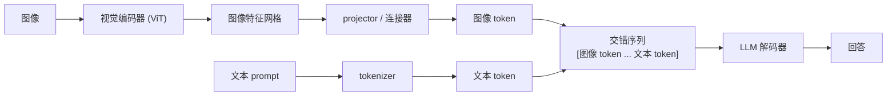

# 2. 搭出系统骨架

## 三段式流水线

一个视觉语言模型就是三个组件串起来。把它们清楚地叫出名字、说明各自做什么，是白板上要写的第一件事。

1. **视觉编码器。** 一个 ViT 风格的模型（Vision Transformer）把图片切成一个 patch 网格，每个 patch 输出一个特征向量。
   336px 的图片配 14 像素的 patch，就是 24x24 = 576 个向量的网格。编码器每张图只跑一次，不依赖文本。

2. **Projector（连接器）。** 把编码器输出的特征网格映射到 LLM 的 token embedding 空间，得到一块"图像 token"。
   各个系统在这里分歧最大：轻量 MLP、cross-attention 重采样器、Q-Former，三者在保留多少细节和产出多少 token 之间取舍各不相同。
   下一节会展开细讲。

3. **LLM 解码器。** 把图像 token 和文本 token 当成一条交错序列吃进去，自回归地生成回答。
   在解码器看来，一张图片就是一段 token，拼在输入里图像占位符所在的位置。解码器不知道也不关心这些 token 来自一张图片。

## 系统的输入和输出

**API 边界上的输入。** 一张图片（JPEG/PNG，不超过分辨率上限），加一段文本 prompt，多轮对话时再加可选的对话历史。
系统内部在编码之前会先做图片校验和缩放，这样一个畸形或者超大的上传不会把 token 预算撑爆。

**输出。** 流式的文本回复。流式很重要，因为第一个 token 等得最久（prefill 是大头）；
流式让用户看到进度，而不是干等完整的回复。

## 为什么要先说这个框架

这个框架讲清了三件事，它们会改变后面所有的设计。

**成本在 projector 和解码器里，不在编码器里。** 编码器是一次有界的、可以批处理的前向，每张图跑一次，还可以缓存。
解码器是自回归的，受显存带宽限制；每一个落进序列的图像 token 都会打到 prefill，也会打到每一层的 KV cache。
编码器很快，解码器才是瓶颈。

**纯文本路径完全跳过编码器和 projector。** 把纯文本请求直接路由到解码器，70% 的流量就不用为视觉基础设施买单。
这是服务架构层面的结构性收益，不是一个小优化。

**图像 token 是成本的计量单位。** 一旦知道一张高分辨率图片能产生几千个 token，而且落在最贵的那个阶段，
后面的设计就顺理成章了：选一个能控制 token 数的连接器，选一个和任务匹配的分辨率，让编码器和解码器独立扩容。
