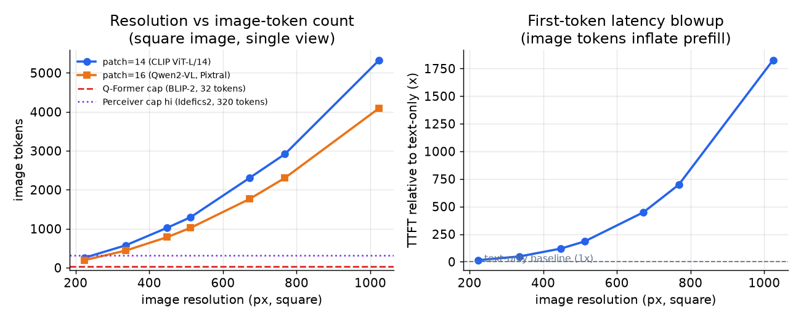
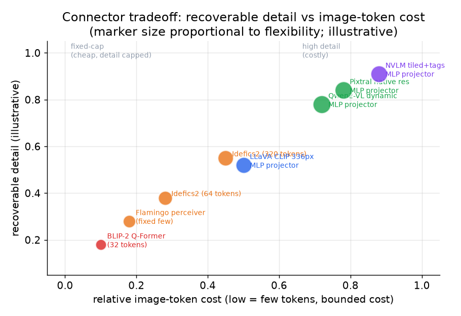

# 3. Projector 与 token

## 图像怎么变成 token

视觉编码器给每个图像 patch 输出一个特征向量。边长 $H$ 像素的正方形图片，patch 大小 $p$ 像素，patch 网格就是：

$$\text{image tokens} = \left\lfloor \frac{H}{p} \right\rfloor \times \left\lfloor \frac{W}{p} \right\rfloor$$

```python
def image_tokens(H, W, p):
    # H, W: image height/width in pixels; p: patch size in pixels
    return (H // p) * (W // p)          # one decoder token per patch in the grid

def prompt_tokens(n_text, images, p):
    # images: list of (H, W); image tokens stack linearly across k images
    n_img = sum(image_tokens(H, W, p) for (H, W) in images)
    return n_text + n_img
# image_tokens(336, 336, 14) -> 576   (CLIP ViT-L/14 in LLaVA)
# prompt_tokens(100, [(336, 336), (336, 336)], 14) -> 1252   (100 text + two 576-token images)
```

具体数字：336px 的图片配 patch 14（LLaVA 用的 CLIP ViT-L/14）是 $24 \times 24 = 576$ 个 token。
1024px 的图片配 patch 16（Pixtral 风格）是 $64 \times 64 = 4096$ 个 token。哪一个都不是"一个 token"。

这些 token 接着和文本一起落进 LLM 的输入序列。prefill 的计算量随序列长度平方增长，
所以一张高分辨率图片很快就会主导首 token 延迟：

$$\text{prefill compute} \approx O\!\left((n_\text{text} + n_\text{img})^2 \cdot d\right)$$

KV cache 的显存在每一层都随序列长度线性增长：

$$M_{\text{kv}} = 2 \cdot (n_{\text{text}} + n_{\text{img}}) \cdot L \cdot n_{\text{kv}} \cdot d_{\text{head}} \cdot p_{\text{bytes}}$$

其中 $L$ 是解码器层数，$n_{\text{kv}}$ 是 KV 头数（MQA 是 1，GQA 是 $h_q / g$），$d_{\text{head}}$ 是每个头的维度，
$p_{\text{bytes}}$ 是每个值占的字节数（fp16 是 2）。一张 4096 token 的图片，放进一个 32 层、$n_{\text{kv}} = 8$、
$d_{\text{head}} = 128$、fp16 的 GQA 模型，每个请求会给 KV cache 增加大约 512 MB
（单头 MQA 模型处理同一张图只需要 64 MB，这是它的 8 倍）。

一个请求带 $k$ 张图，成本线性叠加：

$$\text{multi-image image tokens} = \sum_{i=1}^{k} n_{\text{img},i}$$



*左图：patch-14（CLIP ViT-L/14 风格）和 patch-16（Qwen2-VL/Pixtral 风格）下图像 token 数随分辨率的变化，
并对比 BLIP-2（32 token）和 Idefics2 高分辨率模式（320 token）的固定上限。
右图：相对纯文本基线的首 token 延迟放大倍数（示意），可以看到高分辨率下图像 token 多快就主导了 prefill。*

## 高分辨率输入的切块（tiling）

为了在不用一个巨大 patch 网格的前提下恢复细节，好几个系统会把图片切块：拆成若干子图，各自独立编码，再把 token 序列拼接起来。
这能恢复到 OCR 级别的分辨率，但 token 数会乘以切块的数量。

$$\text{tiled token count} = T \cdot \frac{H_t \cdot W_t}{p^2} + \text{tile tags}$$

NVLM 给每个 patch 加上空间位置的 tile 标签，让解码器能重建布局。没有标签，解码器看到的就是一堆平铺的 tile token，
空间顺序丢了，图表和表格的理解能力也就毁了。

## 设计的关键在 projector

Projector 把编码器的 patch 特征映射到解码器的 embedding 空间。它同时也决定了图像 token 预算，而这正是控制成本的杠杆。

**MLP projector（LLaVA、Qwen2-VL、Pixtral）。** 用一个简单的线性层或者两层 MLP，把每个 patch 特征映射成一个解码器 token。
token 数等于 patch 数，细节随成本一起涨。这是最简单也最常见的选择。只训练 projector（编码器冻结）很便宜。

**Cross-attention 重采样器，也叫 Perceiver（Flamingo、Idefics2）。** 一小组可学习的 query 向量对编码器的 patch 特征做 attention，
不管输入分辨率多少，输出都是固定大小。Flamingo 和 Idefics2 压缩到几十个 token。成本有上限，但能恢复的细节也被封顶了。

**Q-Former（BLIP-2）。** cross-attention 的一个变体：32 个可学习的 query token 对编码器特征做 attention，
给解码器输出恰好 32 个 token。成本恒定且极小，但 32 个 token 是一道硬性的细节天花板。图表、OCR 这种密集内容就丢了。

**Projector 读编码器的哪一层（一个会改变结果的细节）。** Projector 不一定吃编码器最后一层的输出。
LLaVA-1.5 接的是 CLIP ViT-L/14 的*倒数第二层*，不是最后一层，原因是机制上的：
CLIP 的最后一层是为单个全局的图文对比匹配优化的，所以它的特征被池化成一个语义摘要，
丢掉了解码器推理具体区域、小物体或者文字时需要的局部空间细节。前一层还保留着每个 patch 的局部结构。
所以接哪一层是一个真正的设计旋钮：太靠后，特征被对比损失过度全局化；太靠前，还没在语义上对齐到语言。
这也是为什么换一个训练方式不同的编码器（SigLIP）不是即插即用的替换：合适的接入层和为它校准过的 projector 是一起变的。



*每个点是一种连接器，横轴是图像 token 成本，纵轴是能恢复的细节。MLP projector 在右上角：贵，但保留细节。
Q-Former 和 Perceiver 风格的重采样器在左下角：便宜，但细节封顶。位置是示意性的，基于各自报告的任务表现。*

## 什么时候用哪种连接器和分辨率

| 选它 | 什么时候 | 而不是 |
|---|---|---|
| MLP projector（LLaVA、Qwen2-VL、Pixtral） | 细节应该随成本一起涨；任务需要丰富的视觉理解 | 细节重要且付得起 token 时，不要用重采样器 |
| Perceiver / Q-Former 重采样器（Flamingo、BLIP-2、Idefics2） | 单请求成本和延迟必须有严格上限 | 图像 token 预算不能浮动时，不要用 MLP |
| 带 tile 标签的切块（NVLM、Idefics2 切分模式） | OCR、图表或密集文字需要亚词级别的细节 | 任务不依赖细节时，不要用单张固定分辨率裁剪 |
| 固定 336px 分辨率（LLaVA CLIP ViT-L/14） | 任务是通用视觉问答，而且对成本很敏感 | 任务不需要细小文字或小物体时，不要切块 |
| 动态原生分辨率（Qwen2-VL、Pixtral） | 图片尺寸和长宽比差异很大，或者需要高细节 | 不要用会裁掉或压扁异常长宽比的固定分辨率 |
| 上线前先算图像 token 公式 | 部署新模型之前给 prefill 和 KV 做容量规划 | 不要假设每张图都是固定的少量 token |

**工具。** 参考编码器是 CLIP（OpenAI），LLaVA、BLIP-2、Flamingo/Idefics2、Qwen2-VL、Pixtral 这些开源视觉语言栈分别带上面说的 MLP projector、Q-Former 和 Perceiver 重采样器连接器，全部基于 PyTorch（Meta）构建，通过 Hugging Face Transformers 分发。带空间标签的切块沿用 NVLM 的做法，实现在模型自己的预处理代码里。把图像 token 预算考虑进去来部署这些模型的是 vLLM 和 SGLang，它们在 prefill 和 KV cache 规划时会把图像 token 算进去。

**出处。** 对比学习的图像编码器是 CLIP（OpenAI，2021），SigLIP（Google，2023）是它用 sigmoid 损失的后继者，如今在较新的栈里很常见。Perceiver 风格的重采样器连接器起源于 Flamingo（DeepMind，2022）；Q-Former 来自 BLIP-2（Salesforce，2023）；简单的 MLP projector 来自 LLaVA（2023），它证明了当细节应该随 token 数一起涨时，一个线性/MLP 映射就够了。

**举个例子。** 一个视觉语言应用要读扫描的发票，小字号的行项目和合计金额都很重要。因为细节应该随 token 预算一起涨，它选了把每个 patch 映射成一个解码器 token 的 MLP projector，而不是压缩到固定几十个 token、会丢掉密集文字的 Q-Former 重采样器。它开启了带 tile 标签的切块，让亚词级别的 OCR 细节保留下来，解码器也还能重建表格布局，代价是接受细小文字所需要的更高 token 数。发票的尺寸和长宽比各不相同，所以它用动态原生分辨率来服务，而不是会把异常页面压扁的固定 336px 裁剪；部署前它先跑一遍图像 token 公式给 prefill 和 KV 做容量规划，而不是假设每张图成本固定。换一个只做粗粒度通用视觉问答、延迟又很紧的产品，选择就会反过来：用重采样器加固定低分辨率，把单请求预算锁死。

这些架构在 Model Zoo 里的页面：
[LLaVA-1.5 7B](https://www.neurarch.com/?import=https://raw.githubusercontent.com/neurarch-ai/awesome-llm-model-zoo/main/architectures/llava-1.5-7b/model.json)
和
[CLIP ViT-B/32](https://www.neurarch.com/?import=https://raw.githubusercontent.com/neurarch-ai/awesome-llm-model-zoo/main/architectures/clip-vit-b32/model.json)
可以按真实维度追踪编码器、projector，以及图像 token 在解码器里和文本 token 汇合的那个点。

## 视频：帧数就是 token 预算

一张图只付一次 token。一段视频是按采样到的每一帧付，本节开头那套算术要乘上你决定
去看多少帧，而让视频变贵的正是这个决定，不是模型。

$$
\text{video tokens} \approx F \cdot \left\lceil \frac{H}{p} \right\rceil \cdot \left\lceil \frac{W}{p} \right\rceil \cdot \frac{1}{r}
$$

其中 $F$ 是采样帧数，$p$ 是 patch 大小，$r$ 是空间合并倍数（2 乘 2 合并就是
$r = 4$）。把数字代进去，问题就很直白了：

```python
def video_tokens(seconds, fps, h, w, patch, merge=1):
    frames = int(seconds * fps)                       # 你决定去看多少帧
    per_frame = (h // patch) * (w // patch) // merge  # 每一帧的成本
    return frames * per_frame

# 10 分钟、1 fps、336x336、patch 14、不做合并
# video_tokens(600, 1.0, 336, 336, 14) -> 345600
# 同一段片子，0.5 fps 加 2x2 合并
# video_tokens(600, 0.5, 336, 336, 14, merge=4) -> 43200
```

345,600 个 token 不是长上下文问题，是一张账单。第二行那八倍的下降来自两个和模型
无关的决定，所以帧预算是要最先设计的东西。

**几个杠杆，按该先动哪个排序。**

| 杠杆 | 作用 | 代价 |
|---|---|---|
| 帧率 | token 数线性下降，单个最大的旋钮 | 短于采样间隔的事件会整个消失 |
| 关键帧或镜头切换采样 | 把帧花在画面真正变化的地方 | 链路里多一个检测器，静态画面上会失效 |
| 空间合并或池化 | 每帧 token 除以 4 或更多 | 小物体和画面上的文字会读不出来 |
| 相邻帧的时间合并 | 利用相邻帧几乎相同这个事实 | 快速运动会糊 |
| 按查询检索帧 | 帧只编码一次，只把相关的喂进去 | 每段视频要建索引，检索失败就直接变成错答案 |
| 用字幕或 ASR 代替帧 | 每秒视频的文本成本低几个数量级 | 视觉上发生但没被说出来的东西全丢了 |

最后一行是候选人最常漏掉的。对讲座、会议录像和大多数教学视频，转写文本加上少量几帧
每块钱能回答的问题比密集采样多，诚实的系统会把两条路都留着。

**评测里自带一个陷阱。** 如果一个基准的问题从单帧就能答，它会告诉你帧预算是免费的，
因为对它确实是。[Video-MME](https://arxiv.org/abs/2405.21075) 按时长分成短、中、长
三档，就是为了让长的那一档把这件事暴露出来；
[LongVideoBench](https://arxiv.org/abs/2407.15754) 整个是围绕单帧无法满足的指代推理
搭的。帧预算这个决定要在这两个上测，不要在字幕生成集上测。

**服务端是 prefill，不是 decode。** 一段长视频是一个非常大的 prompt 加一个很短的
回答，成本几乎全落在 prefill 和视频编码器上，投机解码这类针对 decode 的手段一点忙都
帮不上。两个后果：帧 embedding 按内容哈希编码一次并缓存，因为同一段视频会被很多请求
看；编码器放在自己的弹性伸缩组里，它的负载曲线和解码器毫无共同之处。

**出处。** 每帧 token 的这套形状就是 LLaVA 在图像上确立的那套，
[Video-LLaVA](https://arxiv.org/abs/2311.10122)（2023）和
[Video-ChatGPT](https://arxiv.org/abs/2306.05424)（2023）把它扩到了视频。动态分辨率
加空间与时间合并是 Qwen2-VL 这条线，按时长分档的评测来自 Video-MME（2024）。
