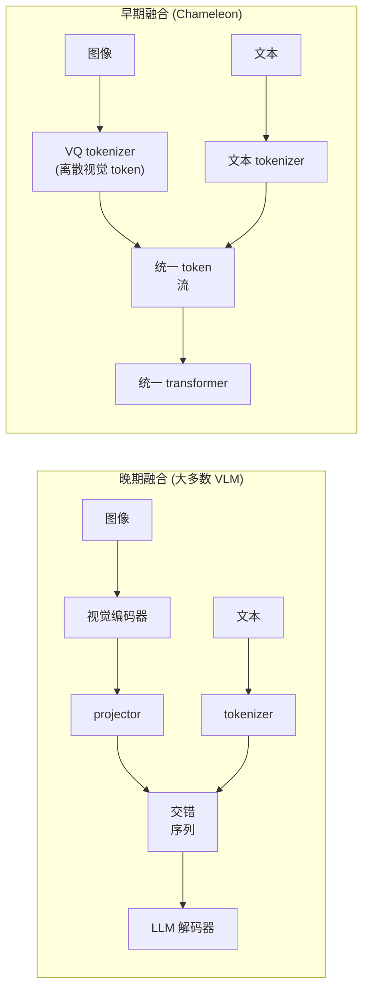

# 4. 模型选型

## 晚期融合与早期融合

前两节的框架默认的是**晚期融合**：图像和文本分别编码，只在进入 LLM 解码器、变成一条交错 token 序列的那一刻才汇合。
几乎所有已部署的视觉语言模型都是晚期融合。但还有一种替代方案值得了解。

**早期融合（Chameleon，图像 token 化）。** 把图像离散化成一个视觉 token 词表，和文本 tokenize 一样。
然后一个 transformer 从第一层开始就处理图像和文本混合的 token 流，没有单独的编码器和 projector。
这样的模型不只能读图，还能生成图像作为输出。

**它是怎么工作的。** 两个子图的区别在于图像在哪一步不再是连续的。晚期融合（上面那条路径）里，视觉编码器产出连续的 patch 特征，projector 把它们映射到解码器的 embedding 空间，这些图像 token 和 tokenizer 产出的文本 token 交错成一条序列，交给 LLM 解码器。图像从头到尾没有被离散化过：projector 的输出是一块实数向量，拼在文本 embedding 旁边。早期融合（下面那条路径）里，VQ tokenizer 把图像量化成从固定 codebook 里取出的离散视觉 token，图像和文本都成了同一个统一词表里的条目，流进同一个 transformer，没有单独的编码器和 projector。正是这条统一的流让早期融合模型既能读图也能生成图，代价是连续的视觉细节要挤过一个离散的 codebook，这就是下一段要说的训练难点。

早期融合在架构上更干净，但训练更难：在离散词表里保留连续的视觉细节本身就困难，跨模态混合训练还要仔细平衡数据。
晚期融合可以复用预训练好的视觉编码器（CLIP、SigLIP）和预训练好的 LLM，训练预算能省下一大截。

## 对比：晚期融合与早期融合

从外面看两者像是可以互换的：都以一个 transformer 吃一条图像文本交错的序列收尾，都能回答关于图片的问题。
混淆就来自这层共同的表面。往下看，一个是预训练部件的组装，另一个是从头联合训练的单一模型，这决定了各自能做什么。

| 维度 | 晚期融合（LLaVA 风格） | 早期融合（Chameleon 风格） |
|---|---|---|
| 解码器看到什么 | 一条图像和文本混合的交错 token 序列 | 一条图像和文本混合的交错 token 序列 |
| 图像怎么变成 token | 连续的 patch 特征投影到 embedding 空间；从不离散化 | 由 VQ tokenizer 量化成共享词表里的离散 codebook 条目 |
| 模型怎么搭出来 | 组装：预训练编码器加预训练 LLM，用一个训练过的小 projector 粘起来 | 从一开始就在统一词表上联合训练 |
| 训练成本 | 小；主要是 projector 或轻量适配器 | 一次完整的预训练，还要仔细平衡模态 |
| 能不能生成图像 | 不能；输出头只覆盖文本词表 | 能；可以采样视觉 token，再通过 codebook 解码出来 |
| 细节瓶颈 | projector 的 token 预算（MLP 还是重采样器） | codebook：连续细节被挤过离散量化 |

这个差别在一个问题上改变设计：模型必须产出图像或者混合模态的输出吗？如果是，只有早期融合行得通，预训练的账单也得认；
如果产品只需要读图，晚期融合用一小部分训练成本就能给到这个能力。

## 视觉编码器的几个家族

视觉编码器的选择决定了分辨率、token 数，以及什么样的视觉特征能到达解码器。

**CLIP ViT 系列（OpenAI）。** 复用最广的编码器。CLIP 在 4 亿图文对上用对比损失训练，所以它的特征对自然图像语义很丰富。
LLaVA-1.5 用的是 336px 的 CLIP ViT-L/14。主要限制是分辨率固定（336px），而且模型当初不是为 OCR 或者精细几何细节设计的。

**SigLIP（Google）。** CLIP 的后继者，用 sigmoid 对比损失取代了对全部负样本做 softmax。
SigLIP 能更稳定地用更大的 batch 训练，在相当的算力下往往能给出更强的图像特征。
好几个较新的开源 VLM（Idefics3、PaliGemma）用 SigLIP 做视觉骨干。

**从头训练的自定义 ViT（Pixtral）。** Pixtral 不复用 CLIP 或 SigLIP，而是从头训练自己的视觉编码器，
从而支持原生分辨率输入、灵活的 patch 处理和长宽比保持。代价是放弃了预训练 CLIP 骨干带来的起跑优势。

**音频编码器（Whisper 风格，Qwen2-Audio）。** 对音频模态来说，频谱图编码器扮演的角色和 ViT 一样：
产出一条特征序列，由 projector 映射到 LLM 的 embedding 空间。token 成本的算法完全相同；
长音频让帧 token 数膨胀，就像高分辨率让图像 token 数膨胀一样。

## 什么时候用哪种编码器和融合策略

| 选它 | 什么时候 | 而不是 |
|---|---|---|
| 冻结的 CLIP ViT-L/14（LLaVA） | 训练预算小；任务是自然图像问答 | 有强预训练编码器可用时，不要从头训练 |
| SigLIP 编码器（Idefics3、PaliGemma） | 想要更强的图像特征和更好的大 batch 训练稳定性 | 有 SigLIP 骨干可用、训练预算允许时，不要用 CLIP |
| 从头训练的自定义 ViT（Pixtral） | 原生分辨率和长宽比处理至关重要；训练预算充足 | 精细布局比训练成本更重要时，不要用冻结的 CLIP |
| 晚期融合（大多数 VLM） | 复用预训练组件；训练预算有限；任务是只读的 VQA | 模型还要生成图像或处理混合模态流时，不要用晚期融合，用早期融合 |
| 早期融合（Chameleon） | 需要一个模型统一生成文本和图像 | 只需要读图不需要生成时，不要用早期融合，用晚期融合 |
| 音频编码器加 projector（Qwen2-Audio） | 任务包含语音输入或音频理解 | 不要试图把原始音频波形直接 tokenize 进 LLM |

**工具。** 可复用的视觉骨干是 CLIP（OpenAI）和 SigLIP（Google），Whisper（OpenAI）是标准的音频编码器；它们都能通过 Hugging Face Transformers 获取，都基于 PyTorch（Meta）。LLaVA、Idefics3、PaliGemma、Pixtral 这些晚期融合 VLM 把其中一个编码器和 projector、预训练 LLM 组合起来，而 Chameleon 这样的早期融合模型用 VQ tokenizer 把图像折进单一的 token 流。在冻结编码器之上只训练 projector 或轻量适配器，用的是同一生态里的 PEFT/LoRA。

**出处。** "冻结编码器加 projector"的晚期融合配方由 LLaVA（2023）在 CLIP（OpenAI，2021）骨干上推广开来；SigLIP（Google，2023）是用 sigmoid 损失的编码器，在较新的栈里取代 CLIP 以获得更好的大 batch 稳定性。多模态 cross-attention 这一脉可以追溯到 Flamingo（DeepMind，2022），query token 桥接来自 BLIP-2（Salesforce，2023）。轻量适配器的训练路径用的是 LoRA（Microsoft，2021）。

**近期方向（2024-2025）。** 三个转变把前沿推过了"固定分辨率加冻结 CLIP"的配方。**动态分辨率**：Qwen2-VL 按图片的原生分辨率和长宽比处理，产出数量可变的视觉 token，并加入 M-RoPE 让文本、图像、视频共享位置编码（Qwen 团队，阿里巴巴，[arXiv:2409.12191](https://arxiv.org/abs/2409.12191)）。**原生多模态预训练**：不是把视觉编码器粘到一个训练完的 LLM 上，而是从头在图文交错数据上训练（InternVL 系列，[arXiv:2312.14238](https://arxiv.org/abs/2312.14238)）。**any-to-any 早期融合**：Chameleon 把图像和文本 tokenize 成一条流，既能读图也能生成图（Meta，[arXiv:2405.09818](https://arxiv.org/abs/2405.09818)）。本章的晚期融合配方仍然是便宜、样本高效的默认选项；当任务需要原生分辨率、图像生成，或者需要一个联合训练而非拼装的模型时，就该点出这几个方向。

**举个例子。** 一个文档 AI 团队要做一个读图助手，训练预算不多，而且只需要读图，不需要生成。这就指向晚期融合，可以复用预训练 LLM 和预训练视觉编码器，不必花钱去训练一个它根本不需要的统一早期融合 transformer。编码器方面它从冻结的 CLIP 骨干起步，因为任务主要是自然图像理解，从头训练没有道理；但如果 benchmark 上图像特征偏弱，它会先换成 SigLIP 骨干换取更好的大 batch 稳定性，然后才考虑自定义 ViT。只有当原生分辨率和长宽比的保真度重要到值得放弃预训练的起跑优势时，它才会像 Pixtral 那样从头训练 ViT。产品以后如果加了语音输入，它会接一个音频编码器加 projector，而不是试图把原始波形喂给 LLM。

**Model Zoo。** CLIP 和 LLaVA-1.5 按真实维度追踪：
[CLIP ViT-B/32](https://www.neurarch.com/?import=https://raw.githubusercontent.com/neurarch-ai/awesome-llm-model-zoo/main/architectures/clip-vit-b32/model.json)、
[LLaVA-1.5 7B](https://www.neurarch.com/?import=https://raw.githubusercontent.com/neurarch-ai/awesome-llm-model-zoo/main/architectures/llava-1.5-7b/model.json)。
SigLIP 和 Whisper-small 也在
[Model Zoo](https://github.com/neurarch-ai/awesome-llm-model-zoo) 里。

## 实现和训练里的坑

编码器和融合方案画在图上很干净，然后就在一个模态拼进解码器的那道接缝上出问题。下面这些是把视觉或音频栈接到 LLM 上时反复出现的故障。

| 问题 | 症状 | 修法 |
|---|---|---|
| 图像 token 预算爆炸 | 高分辨率或切块让视觉 token 淹没上下文，成本和延迟飙升，文本被截断 | 限制切块数和分辨率，对 patch token 做池化或重采样，把图像 token 和文本 token 的预算明确地算在一起 |
| Projector 和解码器维度不匹配 | projector 输出和解码器隐藏层大小对不上，加载报错或者生成乱码 | 把 projector 输出维度设成解码器隐藏层大小，训练前先校验 shape |
| 编码器分辨率对任务来说太低 | 冻结的 336px CLIP 读不了小字或精细布局 | 用原生分辨率编码器或切块，或者换 SigLIP；不要只是把图放大后塞进固定分辨率编码器 |
| 在差异很大的领域上冻结编码器 | 只训 projector 永远无法让特征适应文档、医学或卫星图像 | 目标领域离编码器的预训练分布很远时，解冻编码器或加 LoRA 适配器 |
| 模态数据不平衡 | 模型走纯文本捷径、无视图像，或者文本质量下降 | 平衡并交错混合模态的训练数据，盯住每个模态各自的 loss |
| 图像占位符模板漂移 | 训练和服务时图像 token 落在不同的位置，对齐失效 | 钉死图像占位符的 chat 模板，训练和服务用完全相同的一份 |
| 早期融合的 codebook 挤压 | 通过 VQ codebook 离散化图像会丢失精细视觉细节，训练也不稳定 | 除非需要图像生成，否则优先晚期融合；用早期融合时仔细平衡模态数据 |
| 音频帧 token 膨胀 | 长音频让帧 token 膨胀，和高分辨率让图像 token 膨胀一样，把上下文撑爆 | 对音频分段或降采样，限制每个请求的帧 token 数 |

贯穿始终的一条线：编码器和 projector 是和解码器之间的一份 shape 加预算的契约，所以多模态里大多数故障，
要么是维度不匹配，要么是没人给 token 预算设上限，要么是训练和服务的模板悄悄漂移了。
