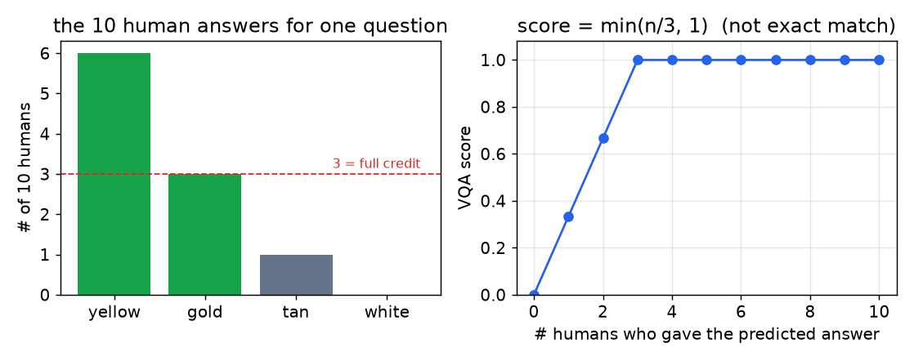
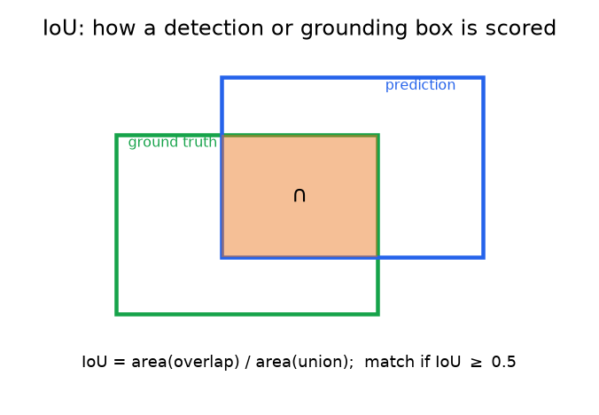
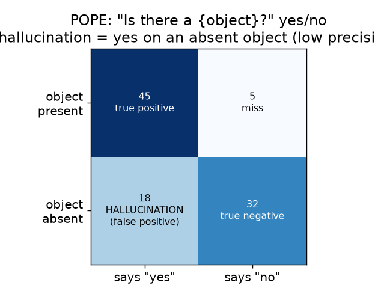
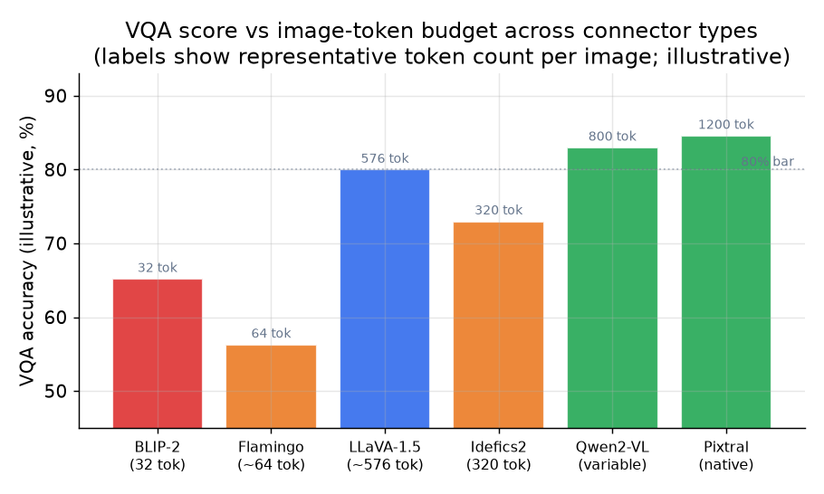

# 5. 评估

视觉语言模型没有一个能覆盖所有任务的单一指标；该用哪个评估取决于模型要做什么。
给对的任务点出对的 benchmark，并且准确知道它是怎么打分的，在面试里是一个实打实的信号。
下面每个指标，模型拿到的输入和必须给出的输出，决定了怎么给它打分。

## 按任务分的离线指标

**VQA 准确率（VQAv2，标准指标）。**
- **输入 / 输出。** 给模型一张图和一个自然语言问题（"公交车是什么颜色？"），
  它要输出一个简短的自由形式回答（一个词或一个短语）。不是选择题。
- **怎么算。** VQAv2 给每个问题收集了 **10 个人类答案**，所以这个指标是一种软共识，不是精确匹配。
  先把答案归一化（转小写、去标点和冠词、数字词统一写法），然后一个预测答案的得分是

$$\text{VQA-Acc}(\hat{a}) = \min\left(\frac{\lvert \lbrace \text{humans who gave } \hat{a} \rbrace \rvert}{3}, 1\right)$$

  也就是说，和 10 个人里至少 3 个人答案一致就得 1.0，少于 3 个按比例给分。报告的数字是这个分数在所有问题上的平均。
  （面试里一个常见错误是把 VQA 准确率说成精确匹配；它其实是 `min(n/3, 1)` 这种软投票指标。）

*得分的计算方式：数一下 10 个人里有几个给出了和模型一样的答案，再把这个数通过 min(n/3, 1) 映射。
三个或以上匹配就是满分；罕见但正确的答案拿部分分。示意图。*

**TextVQA。** 输入输出和软 VQA 准确率的打分方式都和 VQAv2 一样，但问题需要**读图片里的文字**（一块牌子、一个标签）。
它考的是 OCR，所以一个在 VQAv2 上很强的模型，如果输入分辨率粗到读不了小字，在这里的分数可能低得多。

**DocVQA 和 ChartQA（文档和图表理解）。**
- **输入 / 输出。** 一张文档或图表图片加一个问题；输出是一个简短的答案字符串（DocVQA）或一个数值（ChartQA）。
- **怎么算。** DocVQA 用的是 **ANLS（Average Normalized Levenshtein Similarity）**，不是精确匹配：
  它在预测答案和标准答案之间算 `1 - (edit distance / max length)`（低于阈值就记 0），所以轻微的 OCR 失误是容忍的。
  ChartQA 用的是**宽松准确率**：数值答案和标准答案的差距在一个小容差内（大约 5%）就算对。

**Grounding 和定位（RefCOCO）。**
- **输入 / 输出。** 一张图加一个指代表达（"左边那条狗"）；输出是一个**边界框**。
- **怎么算。** 在某个 IoU 阈值下的准确率：预测框和标准框的交并比至少 0.5 才算对。
  一个模型描述对了物体但框错了位置，VQA 能拿高分，grounding 却不及格，这就是为什么这两个指标要分开。

*IoU 是预测框和标准框重叠部分的面积除以两者并集的面积；IoU 至少 0.5 时预测算正确。
检测 mAP 背后的匹配规则用的也是同一个 IoU。*

**多学科推理（MMMU）。** 跨多个学科、带图片的大学水平选择题。因为是选择题，打分就是普通的**选项准确率**（选对选项的题目占比），
所以尽管都叫"准确率"，它和自由形式的 VQA 数字并不可比。

**幻觉率（POPE）。**
- **输入 / 输出。** POPE（Polling-based Object Probing Evaluation）把幻觉变成一个是非题测试：对一张图，
  它问一系列"图里有 {object} 吗？"这样的问题。一半的物体是真实存在的（来自图片标注），一半是不存在的，
  其中不存在的物体按三种难度递增的方式采样：**随机**、**高频**（常见物体）、**对抗**（经常和图中已有物体同时出现的物体）。
  模型回答是或否。
- **怎么算。** 把回答当成二分类，报告**准确率、精确率、召回率和 F1**。幻觉的信号是**假阳性率**，也就是对不存在的物体说"有"；
  一个自信地产生幻觉的模型召回率高但精确率低。F1 越高，尤其是对抗切分上的 F1 越高，幻觉越少。
  这就是为什么一个 VQA 分数更高的模型在实际中可能更差：VQA 奖励自信的回答，POPE 抓的正是那些自信但编出来的回答。

*POPE 可以读成一个是非回答的混淆矩阵。关键的格子在左下角：对一个不存在的物体说"有"就是幻觉（假阳性），
即使召回率看起来不错，它也会拖低精确率和 F1。*

*不同连接器设计的 VQA 分数（示意）和各自代表性的图像 token 数放在一起。固定上限的连接器（BLIP-2、Flamingo）最便宜，
但在细节密集的任务上得分较低。带动态分辨率的 MLP projector 分数更高，token 成本也按比例更高。
分数是根据公开 benchmark 拼出来的示意值。*

## 延迟和成本指标

**首 token 延迟（TTFT）。** 交互式使用下，TTFT 是最要紧的用户可感知延迟。它从收到请求量到生成第一个 token，
由整条"图像加文本"序列的 prefill 主导，所以随图像 token 数增长。每个分辨率档位的 TTFT 要分开跟踪。

**单请求成本。** 图像 token 爆炸很容易在不知不觉中上线，离线评估又很难察觉，所以要明确跟踪每个请求的计算成本
（大致和图像 token 数乘以模型每 token 成本成正比）。一个模型在 VQAv2 上高 3 分，但服务成本贵 4 倍，不见得是一笔好买卖。

**负载下的吞吐。** 图像请求的大小天然参差不齐；动态分辨率模型让每个请求的长度都不一样。
要测 p50 和 p99 的每秒 token 数，不能只测一个短请求。

## 在线指标

**用户参与度。** 在一个展示 VLM 回答的产品里，用户觉得回答有帮助吗？他们会追问，还是直接走掉？
benchmark 上的离线准确率并不能完美预测用户满意度。

**生产环境里的拒答率和幻觉率。** 记录模型拒绝回答、或者用户标记回答错误的案例。
幻觉在这里露头的时间，远早于它在离线 POPE 分数里露头的时间。

## 什么时候用哪个指标

| 选它 | 什么时候 | 而不是 |
|---|---|---|
| VQAv2 软准确率 | 通用的自然图像问答 | 任务不对路时，不要用 TextVQA 或 DocVQA 来压测 |
| TextVQA | 答案需要读自然图像里的文字（牌子、标签） | 不要只用 VQAv2，它不强制 OCR |
| DocVQA（ANLS）或 ChartQA（宽松准确率） | 文档和图表，精确匹配对 OCR 失误太苛刻 | 不要用普通精确匹配，它会惩罚无关紧要的字符串差异 |
| RefCOCO（IoU 0.5 下的准确率） | 模型必须定位或指代特定区域 | 不要用描述质量，它不考空间指代 |
| POPE F1（对抗切分） | 需要量化模型编造物体的频率 | 不要只看 VQA 准确率，它奖励幻觉但自信的回答 |
| 目标分辨率下的 TTFT | 有延迟约束的交互式服务 | 不要只看离线准确率，它忽略了服务成本 |
| 单请求成本和准确率一起看 | 任何部署决策 | 不要只看准确率，图像 token 爆炸很容易做出一个正确但用不起的东西 |

**工具。** lmms-eval、VLMEvalKit 这类 VLM 评估框架打包了 VQAv2、TextVQA、DocVQA、ChartQA、RefCOCO、MMMU、POPE 这些 benchmark 和它们精确的打分规则（软投票、ANLS、宽松准确率、IoU、F1），不用自己重新实现，底层数据集通过 Hugging Face Datasets 分发。服务侧的指标（TTFT、p50 和 p99 吞吐、单请求成本）来自对 vLLM 或 SGLang 上真实部署的压测，而不是来自准确率框架。在线参与度和生产环境的幻觉信号通过自己的日志和分析系统采集。

**出处。** 这些是社区的 benchmark 数据集，各有各的来源，不是某一个可归属的方法，所以这里不做白名单归属。只需注意一点：物体幻觉指标（POPE）之所以存在，是因为基于 CLIP（OpenAI，2021）对比编码器的 VLM 倾向于对不存在的物体自信地回答"有"，它就是为了暴露这个故障而设计的。

**举个例子。** 一个文档 AI 团队要评估一个读发票和图表的 VLM，从 ANLS 打分的 DocVQA 和宽松准确率的 ChartQA 起步，因为精确匹配会惩罚不改变答案的轻微 OCR 失误和小数位舍入。它加上 TextVQA 来强制走普通 VQAv2 从不压测的 OCR 路径，再在对抗切分上跑 POPE 来量化模型编造物体的频率，因为高 VQA 分奖励自信的回答，恰好会掩盖这类幻觉。有一个候选模型只是靠把图像 token 预算翻倍才高了几分，所以团队在目标分辨率下测 TTFT，把单请求成本和准确率数字放在一起看，而不是只凭离线准确率就上线。只有同时通过准确率和服务成本两道检查的方案才进生产。

要大声说出来的那条护栏：一个把图像 token 预算翻倍换来的离线 VQA 提升，上线前必须扛得住成本分析和线上 TTFT 检查。
准确率和成本都得过关；只优化一个、无视另一个，是最经典的错误。
