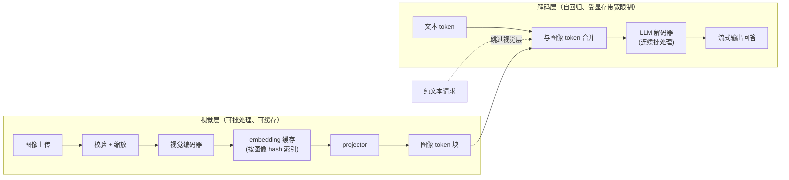
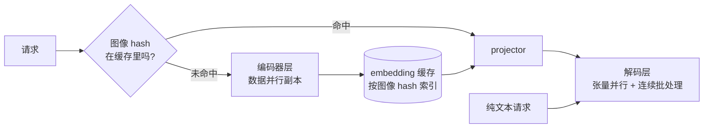
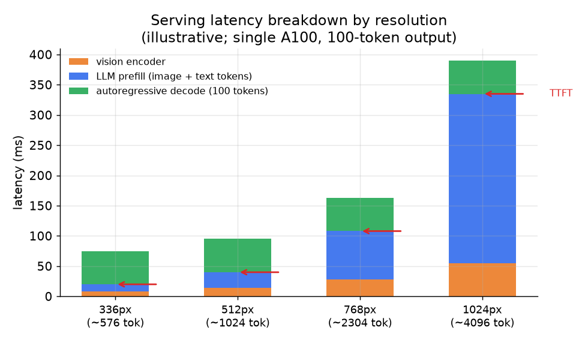

# 6. 服务与扩展

## 是两种负载，不是一种

一套多模态服务栈里有两种本质不同的负载，它们不该挤在同一个 server 上。

**视觉编码器层。** 编码器吃进一张图，吐出一块固定的特征网格。每张图只跑一次，一个 batch 里的多张图之间是完全并行的，
输出还能按图像 hash 缓存。它的计算量有上界，也和对话历史无关。这一层应该单独扩容，可以跑在独立的 pod 上。

**LLM 解码层。** 解码器是那个自回归、受显存带宽限制的生成循环，负责每套 LLM 服务栈本来就要做的连续批处理和 KV cache 管理。
视觉层送过来的图像 token 以前缀的形式到达，等它们进到解码器时，已经和文本 token 没有任何区别了。

纯文本请求完全绕开视觉层。如果一个负载里有七成请求不带图，这样就能在大部分流量上省掉视觉编码器的开销。

## 缓存图像 embedding

同一张图经常反复出现：从商品库里被查到的同一张商品图、多轮对话里被重复上传的同一份文档、某个常驻问答组件背后的一张静态图。
把视觉编码器的输出按图像 hash 缓存下来，重复的图就能完全跳过编码这一步，直接落到 projector。

这笔账很干净，因为给定图像，编码器的输出是确定的，而编码器这一趟正是那笔昂贵的批量 GPU 计算。
vLLM V1 同时做了编码器输出缓存和前缀缓存（把图像 hash 折进 KV 前缀的 key 里），把多轮对话里跨轮的重复计算省了回来。

## 并行策略

在多 GPU 部署里，视觉编码器和 LLM 解码器对并行方式的需求并不一样。

**对编码器做张量并行是浪费。** 视觉编码器一般只占整个模型参数量的 0.2% 到 2.3%。
用 TP 把它切到多张卡上，会多出 58 到 126 次逐层 all-reduce，省下的计算却几乎为零。
AMD 的 ROCm 团队实测：把编码器换成数据并行（每张 GPU 各留一份完整的编码器副本，各处理一批不同的图），
解码器那边继续用张量并行，吞吐最多提升 44%。末尾一次 all-gather，就替掉了编码器中间那几十次同步。

**解码器上的连续批处理。** 解码器对交错后的 token 序列跑标准的连续批处理。带图请求的前缀更长，长度还随分辨率变化；
调度器必须能处理长度不定的视觉块，同时不把纯文本请求饿死。

*两级服务：编码器靠数据并行扩容，hash 命中就整个跳过；解码器跑张量并行加连续批处理，纯文本请求则完全绕开视觉层。*

## 处理超大和损坏的图片

一次超大上传就能把编码器所在的 GPU 打爆显存。在 API 网关就校验尺寸和文件大小，在图片进编码器之前先降采样到分辨率上限。
一次损坏的上传不该影响同一个 batch 里的其他请求。

## 瓶颈

| 瓶颈 | 成因 | 怎么解 | 代价 |
|---|---|---|---|
| TTFT 太高 | 大块图像 token 的 prefill 主导了首 token 延迟 | 降分辨率；换成固定上限的连接器（resampler）；缓存编码器输出 | 每张图能保留的细节变少 |
| KV cache 显存吃紧 | 图像 token 在每一层都把 cache 撑大 | 限制分辨率；量化 KV cache（fp8 或 int4） | 牺牲细节或数值精度 |
| 视觉编码器吞吐不够 | 每张没见过的图都在解码器 GPU 上就地编码 | 拆出独立的编码器层，用数据并行批处理；按图像 hash 缓存 | 基础设施变复杂；冷图沾不到缓存的光 |
| 混合流量的队头阻塞 | 大的带图请求在同一个队列里堵住纯文本请求 | 分开队列或分层；把纯文本流量绕过视觉层 | 多了路由逻辑和两级运维 |
| 变长 batch 的低效 | 动态分辨率模型让每张图的 token 数都不一样 | 限制单请求的最大图像 token 数；对 batch 做 padding 或分桶 | padding 上浪费算力 |
| 多图 token 爆炸 | k 张图把 token 成本线性地堆进 prefill 和 KV | 限制单请求的图片数；多出来的图用 resampler 压缩 | 能力上的硬限制 |

有两点把上面这几行串了起来。几乎每一条都能追到同一个根因：一张图会膨胀成几百上千个解码器 token，
而这些 token 同时压在 prefill 计算（TTFT 高）和 KV cache（显存吃紧）上，因为 token 一旦进了解码器就只是 token，
不管它来自像素还是文字。这也是为什么"固定上限的连接器"这条解法出现了两次：resampler 在源头就把 token 数框住了，
两个瓶颈都还没看到它。让这个上界成立的 resampler，正是 Flamingo（DeepMind，2022）里 Perceiver 风格的设计，
以及 BLIP-2（Salesforce，2023）的 query token 桥接，它们把任意大小的 patch 网格压成固定的一小撮 token。
第二点是，视觉编码器这一层可以缓存，而文本 prefill 做不到：因为给定一张图，编码器输出是确定的，
把图 hash 一下、把它的 token 序列缓存起来，重复上传就变成一次零编码、零 prefill 的命中，
所以编码器吞吐那一行写的是"按图像 hash 缓存"，而不是加机器。

*单张 A100 上四档分辨率的延迟堆叠示意，输出长度 100 个 token。336px 时 prefill 和 decode 大致持平。
1024px 时，图像 token 的 LLM prefill 占了大头；视觉编码器和 decode 几乎是常数。TTFT 箭头标出用户看到第一个 token 的位置。*
