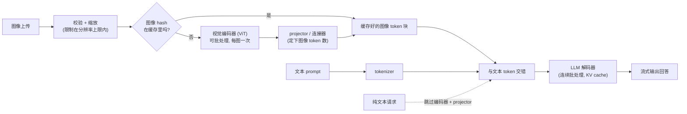

# 9. 小结

## 一页纸回顾

- **图像 token 预算就是成本故事的全部。** 一张图不是一个 token，而是几百上千个，而且它们落在整条流水线里最贵的那一段。
  1024x1024 的图按 patch-16 切是 4096 个 token。prefill 的计算量随序列长度平方增长，
  所以在高分辨率下，图像 token 主导了首 token 延迟。
- **三段式流水线：编码器、projector、解码器。** 视觉编码器每张图只跑一次，可以缓存也可以批处理。
  projector 定下图像 token 数。LLM 解码器是自回归的、受显存带宽限制，要和编码器分开扩容。
- **projector 才是那个设计决策。** MLP projector 每个 patch 过一个 token（细节随成本一起涨）。
  resampler 或 Q-Former 压成固定的少量 token（成本有界，细节封顶）。
  选 projector 就是在为每一个请求选定那个质量与成本的工作点。
- **分辨率是一个质量与成本的旋钮，不是一个默认值。** 通用视觉问答用低分辨率服务；
  只有任务真的需要精细细节时（比如文档 OCR 或读图表）才接受更高的 token 数。永远不要默认拉满分辨率。
- **服务拆分是结构性的，不是一项优化。** 把视觉编码器跑成独立的、可批处理的一层；按图像内容 hash 缓存编码器输出；
  让纯文本请求整个绕过编码器。这三招就能把一个天真的单 server 部署里大部分不必要的成本收回来。
- **准确率和成本要一起评。** 离线 VQA 准确率抓不到 token 预算的爆炸。
  要在每个分辨率档位上跟踪 TTFT 和单请求成本，和 benchmark 分数放在一起看。
  一个模型在 VQAv2 上高 3 分但服务成本贵 4 倍，不见得总是一笔好买卖。

## 一页看懂整个系统

## 自测

答案是折叠的。每题先自己答一遍再展开。

1. 为什么一张 1024x1024、patch 为 16 像素的图会产出 4096 个 token 而不是一个 token，
   这些 token 在服务流水线里究竟落在哪？

   

答案

   视觉编码器看到的不是一张图，而是一张 **patch 网格**：每个 patch 产出一个特征向量，数量是
   $\lfloor H/p \rfloor \times \lfloor W/p \rfloor$，1024 除以 16 每边是 64，$64 \times 64 = 4096$。
   MLP projector 再把每个 patch 特征映射成恰好一个解码器 token，这就是为什么 token 数等于 patch 数。
   这些 token 落在 **LLM 解码器的输入序列**里，拼接在图像占位符的位置上，
   也就意味着它们既要过 prefill（计算量随序列长度平方增长），又要在每一层占 KV cache。
   在 [第 3 节](03-the-projector-and-tokens.md) 那个作为参照的 32 层 GQA 解码器上（8 个 KV head、head 维度 128、fp16），
   这 4096 个 token 每个请求大约要多占 512 MB 的 KV cache。
   一个 token 不可能够用，因为单个 embedding 向量的容量远不足以把一个场景表达到能回答问题的细节程度，
   而每个 patch 一个 token 才保住了注意力可以利用的那种空间对应关系（[第 8 节](08-interview-qa.md)）。
   把一张图当成一个 token，正是让成本估算错三个数量级的那个错误：
   一个 30 token 的文本问题再挂一张高分辨率的图，在 prefill 上就贵了 130 倍以上（[第 1 节](01-clarifying-requirements.md)）。

   

2. 就图像 token 数和能恢复的细节而言，MLP projector 和 Q-Former resampler 的区别是什么？各自什么时候选？

   

答案

   **MLP projector** 每个编码器 patch 产出一个解码器 token，所以 token 数随分辨率浮动
   （336px、patch 14 是 576 个，1024px、patch 16 是 4096 个），细节随成本一起涨。
   **Q-Former**（BLIP-2）则是让 32 个学出来的 query token 去 cross-attend patch 网格，
   不管输入多大，输出恰好 32 个 token，所以成本恒定而且极小，但 32 个 token 就是一道细节的硬天花板。
   机制解释了这道天花板：解码器将来能知道的关于这张图的一切，都得从那个固定宽度的瓶颈挤过去，
   4096 个 patch 的网格被总结成几十个向量，保不住每一个字形和边缘，于是这些 query 留下全局语义，丢掉密集文字
   （[第 8 节](08-interview-qa.md)）。
   当细节应该随成本一起涨、而且你承受得起可变 token 数时选 MLP：丰富的视觉理解、发票、小号印刷的条目。
   当每个请求的成本和延迟必须被严格框住、不管用户传上来什么时，选 resampler（Q-Former，
   或者 Flamingo 和 Idefics2 里那种 Perceiver 风格的）。
   capstone 里两头都有：面向消费者的照片问答那套用 MLP、576 个 token，
   而商品库批量生成描述那套用 resampler、固定 32 到 64 个 token，因为描述要的是大意，不是字形
   （[第 3 节](03-the-projector-and-tokens.md) 和 [第 10 节](10-putting-it-together.md)）。

   

3. 一个对文本 prompt 完美工作的前缀缓存，在带图请求上开始返回错误答案。为什么，怎么修？

   

答案

   文本前缀缓存的 key 是 **token ID**，而在多模态模型里，图像占位符是一组固定的特殊 token，不管插进去的是哪张图都长得一样。
   于是两张不同的图产生同一串占位 token，key 匹配上了，缓存不声不响地把从*另一张*图算出来的 KV 条目还了回来。
   这是**撞 key，不是未命中**，而撞 key 是危险的那个方向：未命中只是多编码一次，
   撞 key 却让解码器自信地回答一张错误的图，整条流水线里没有任何地方报错。
   修法是把**图像内容 hash** 折进前缀缓存的 key，vLLM V1 就是这么做的，
   这样围绕同一张图的多轮对话仍然能复用 KV，又绝不会串到别的图上
   （[第 6 节](06-serving-and-scaling.md) 和 [第 7 节](07-how-teams-do-it-in-production.md)）。
   背后的通则是：缓存 key 必须从被缓存的值真正依赖的一切推出来，对编码器输出而言那就是像素，
   而不是文件名或 URL（[第 8 节](08-interview-qa.md)）。

   

4. 带图请求的 TTFT 是 3 秒，纯文本请求是 0.5 秒。第一件该查的事是什么，最便宜的修法是什么？

   

答案

   先查**每个请求的图像 token 数**：在动任何东西之前，先用实际服务的分辨率和 patch 大小把 token 公式算一遍。
   这个差距几乎从来不在编码器身上，那是一趟几十毫秒、有上界的计算；差距在图像 token 上的 LLM prefill，
   [第 6 节](06-serving-and-scaling.md) 那张延迟构成图画的正是这个形状：
   336px 时 prefill 和 decode 大致持平，1024px 时 prefill 占绝对大头，而编码器和 decode 几乎是常数。
   最便宜的修法是**降低服务分辨率，并在网关就降采样**：1024px、patch 16 是 4096 个 token，
   对上 336px、patch 14 的 576 个，砍掉 7 倍，而且因为 prefill 计算量随序列长度平方增长，延迟降的幅度还不止 7 倍。
   次便宜的依次是：按图像内容 hash 缓存编码器输出，让重复的图完全跳过编码；
   如果预算必须彻底不再浮动，再换成固定上限的连接器。
   把分辨率做成按请求或按任务可调的旋钮，而不是一个全局常量，这样通用问答跑得便宜，只有 OCR 那类请求才为细节买单
   （[第 8 节](08-interview-qa.md)）。
   *不*会有帮助的是给解码器那台机器加显存：带图的 prefill 是受算力限制的，显存多买到的是更多并发会话，不是更低的 TTFT。

   

5. 数据并行（DP）的视觉编码和张量并行（TP）的视觉编码有什么区别，
   对一个只占模型参数量 1% 的组件，为什么是 DP 赢？

   

答案

   **DP 让每张 GPU 各存一份完整的编码器副本**，各拿一批不同的图，所以唯一的同步就是末尾一次 all-gather。
   **TP 则把编码器的权重切到多张卡上**，这会强制逐层 all-reduce，一个典型的编码器上是 58 到 126 次。
   TP 的同步开销要在一个组件大到装不下、或慢到单卡跑不动的时候才划得来，而视觉编码器两样都不占：
   它通常只占整个模型参数量的 0.2% 到 2.3%，切分几乎省不下计算和显存，通信的账却是全额付的。
   AMD 的 ROCm 团队实测：把编码器换成数据并行、解码器继续用张量并行，吞吐**最多提升 44%**
   （[第 6 节](06-serving-and-scaling.md) 和 [第 7 节](07-how-teams-do-it-in-production.md)）。
   编码器在结构上也适合 DP：它是一趟无状态的前馈计算，跨图像完全并行，
   吞吐几乎随副本数线性增长，任何副本都能服务任何请求；而解码器持有按会话的 KV 状态，把一条序列钉死在一张 GPU 上。
   这种不对称才是两层要各自用一套并行策略、而不是共用一个设置的真正原因。

   

6. 什么时候该用带 tile 标签的分块，而不是单张固定分辨率的裁剪图？加上 tile 标签到底起了什么作用？

   

答案

   任务需要**小于一个词的细节**时用分块：OCR、密集的文档文字、图表和表格，
   这些场景里固定的 336px 裁剪根本分辨不出小号字，而把图放大后喂给固定分辨率的编码器也补不回来。
   分块把图切成子图，各自独立编码，再把 token 序列拼起来，所以账是
   $T \cdot \frac{H_t \cdot W_t}{p^2} + \text{tile tags}$：成本只随块数线性增长，而且不用重训编码器
   （[第 3 节](03-the-projector-and-tokens.md)）。
   **tile 标签告诉解码器每一块原本坐在版面的哪个位置。** 没有它，解码器看到的是一袋没有空间顺序的块 token，
   图表和表格的理解会被彻底破坏。它是必需的，因为每一块都是单独编码的，一个块里的 patch 永远关注不到另一个块里的 patch，
   任何跨边界的结构（表格的一行、示意图里的一根箭头）到达时都是碎的，必须由解码器重新缝起来，
   通常靠这些标签加一张低分辨率缩略图当全局地图（[第 8 节](08-interview-qa.md)）。
   任务不受细节约束时，优先用单张固定分辨率的裁剪，因为分块会把 token 数乘上块数，还会把成本量化成阶梯：
   一张 672px 的上传可能和整页 1024px 一样落进同样的四个补齐后的块里，付一模一样的账，
   这就是为什么分辨率上限该定在块的边界上（[第 10 节](10-putting-it-together.md)）。
   如果要的是整页范围内的跨区域几何关系，原生高分辨率（或者非常小心的标签设计）胜过分块，
   因为原生编码器是在整张网格上跑 self-attention 的。

   

## 延伸阅读

- capstone：[完整的方案](10-putting-it-together.md)，本章的每一个选择都会在那个场景里落定一次、算清成本、
  在另外两组约束下重搭一遍，最后压缩成一个可运行的单文件 token 预算计算器。
- 带数学推导、全部案例和逐家公司拆解的密集参考：
  [topics/09-multimodal-serving.md](../../topics/09-multimodal-serving.md)。
- 对比表和连接器的数学：[tools/comparisons/09.md](../../tools/comparisons/09.md)。
- 逐家公司的拆解：[tools/teardowns/09.md](../../tools/teardowns/09.md)。
- 在线追踪一个真实的 VLM 计算图：
  [LLaVA-1.5 7B](https://www.neurarch.com/?import=https://raw.githubusercontent.com/neurarch-ai/awesome-llm-model-zoo/main/architectures/llava-1.5-7b/model.json)
  和
  [CLIP ViT-B/32](https://www.neurarch.com/?import=https://raw.githubusercontent.com/neurarch-ai/awesome-llm-model-zoo/main/architectures/clip-vit-b32/model.json)，
  都在 [Model Zoo](https://github.com/neurarch-ai/awesome-llm-model-zoo) 里。
