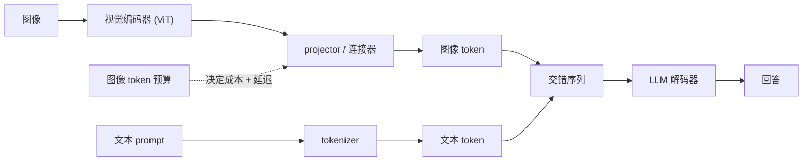

# 多模态服务（视觉语言模型）

> 本章是英文原版的中文译本，原文见 [book/multimodal/](../../book/multimodal/)。译文和原文同步维护，发现问题请提 issue。

> **写法说明。** 本章和候选召回那一章的样例一样，先教后练，按书的节奏写：
> 先用一段对话把需求问清楚，然后按"搭骨架、选架构、连接器、评估、上线服务"这条线一路走下去，
> 每个想法配一张小图，穿插真实的生产案例，每组方法给一张"什么时候用哪个"的表，
> 有算出来的图（mermaid 和 matplotlib），最后是面试问答。每一节拆成单独的文件，避免哪个文件写得太长。

面试官很少会直接说"设计一个视觉语言模型"。他们会说：**"设计一个能回答图片相关问题的服务。"**
听起来很简单，直到意识到一张图片不是一个 token，而是几百上千个 token，
而且这些 token 落在整条流水线里最贵的那一段。本章把这个系统从头到尾搭一遍，
并且展示 LLaVA、BLIP-2、Flamingo、Qwen2-VL、Pixtral、NVLM，
以及 Red Hat、AMD、Dropbox、NVIDIA、Hugging Face 的生产部署实际是怎么上线的。

## 各节内容

1. [澄清需求](01-clarifying-requirements.md)：一段对话，把图像 token 预算圈定下来。
2. [搭出系统骨架](02-frame-the-system.md)：视觉编码器、projector 和 LLM 解码器；输入和输出。
3. [Projector 与 token](03-the-projector-and-tokens.md)：图像怎么变成 token，分辨率和 token 数的关系，以及"什么时候用哪个"。
4. [模型选型](04-model-choices.md)：早期融合对比晚期融合、图像编码器的几个家族，以及"什么时候用哪个"。
5. [评估](05-evaluation.md)：VQA 准确率、grounding、幻觉，以及"什么时候用哪个"。
6. [服务与扩展](06-serving-and-scaling.md)：图像 token 的成本、缓存、两级服务，以及瓶颈。
7. [真实团队在生产环境里怎么做](07-how-teams-do-it-in-production.md)：各家公司的分歧点表格，附一手资料链接。
8. [面试问答](08-interview-qa.md)：常问的、有坑的、常答错的问题，给出清楚的答案。
9. [小结](09-summary.md)：一页纸回顾、mermaid 图和自测题。
10. [把它们拼起来：完整的方案](10-putting-it-together.md)：一套默认技术栈，把场景从头到尾搭起来并算清 token 和成本，同一个系统在三组不同约束下的样子，以及一个最小的可运行 token 预算。

## 一页看懂整个系统

核心洞察：从解码器的角度看，一张图片就是一块 token，和文本一起拼进序列里。
所以图像的成本就是 token 的成本，服务设计的关键落在 projector 上，而不是编码器上。

第一次读请按顺序读，每一节都建立在前一节之上。每一节开头都是面试官真正会问的那个问题，然后给出回答。

## 姊妹章节

经典 ML 那本姊妹书从另一侧覆盖了同一块内容：
[computer-vision](https://github.com/neurarch-ai/awesome-ml-system-design/tree/main/book/computer-vision/) 讲的是编码器底下的视觉栈：标注、数据增强、检测头和 mAP。
