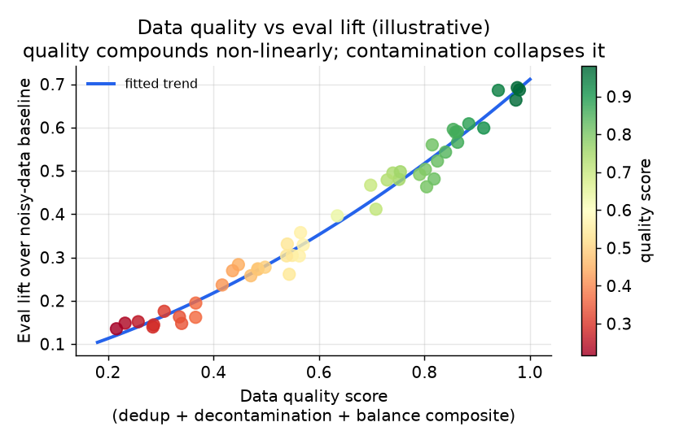
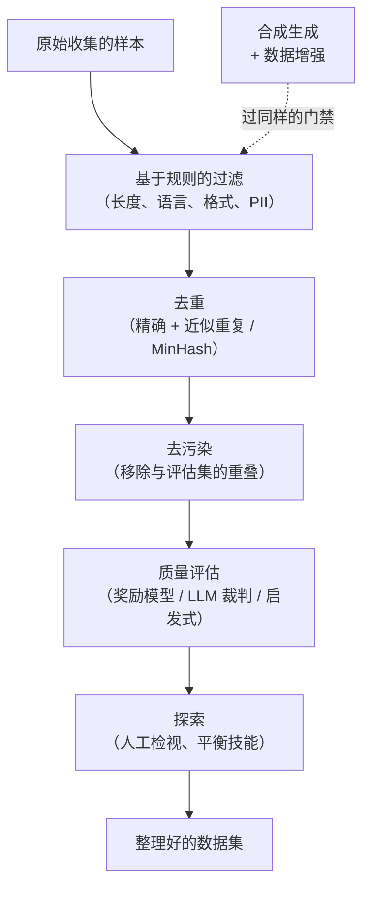
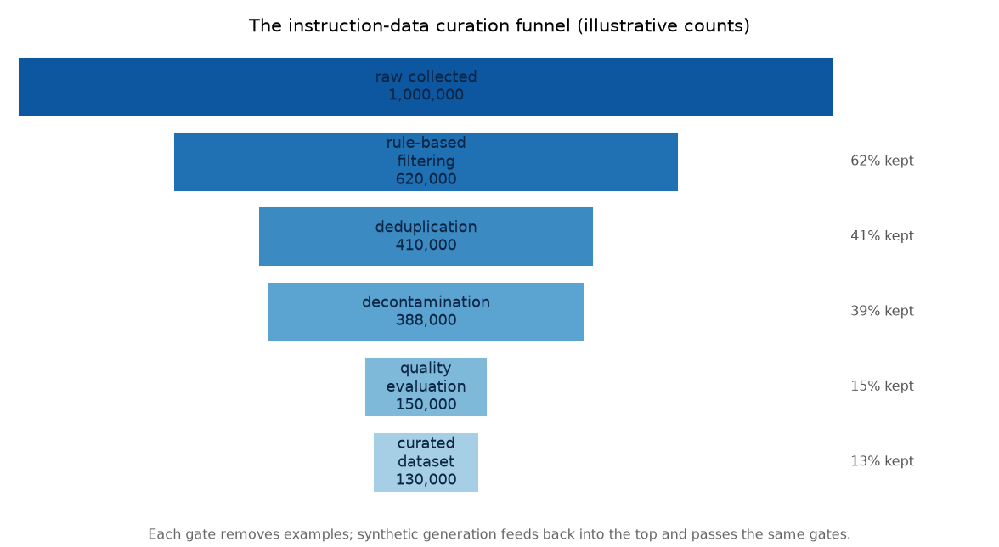

# 3. 数据整理

微调本质上是一个披着算力外衣的数据问题。模型会原封不动地模仿你给它看的东西，错误也一起学进去。
小而干净的数据集赢过大而嘈杂的数据集，而且差距很大。这是整条流水线里最被低估的环节，
却决定了下游的一切。

*示意性散点图，横跨不同质量水平的多次训练。评估提升随质量非线性地叠加：质量分从 0.4 到 0.8
带来的提升，大约是从 0.0 到 0.4 的两倍。一旦发生污染，整条曲线直接塌掉。*

## 标签从哪里来

动手整理之前，先弄清每一条标签的来源，因为每种来源都带着不同的偏差，而这些偏差会一路留到模型里。
对后训练来说，标签就是目标回复或偏好判断；下面是它们的来源。

| 来源 | 能给你什么 | 偏差 / 成本 |
| --- | --- | --- |
| 隐式的生产信号（点赞点踩、接受/拒绝、编辑、下游任务成功与否） | 量大、便宜、持续更新的 (prompt, chosen, rejected) 对 | 受当前模型和自选用户群的偏差影响；只覆盖模型已经会输出的行为 |
| 人工标注 / 专家标签（黄金 SFT 目标、偏好对、安全标签） | 在最关键的轴上质量很高 | 量少、贵、慢；标注员之间会有分歧，所以需要清晰的评分标准和仲裁 |
| 合成 / 模型生成（更强的教师模型、self-instruct、数据增强） | 可规模化，能快速补上薄弱技能 | 会传播生成模型的偏差，还有裁判循环的风险，所以必须和人工数据过同样的质量和去重门禁 |

三种来源都必须遵守的铁律：评估数据绝不能泄漏进训练集，也不能进入任何模型看得到的检索索引。
一旦泄漏，指标衡量的就是记忆而不是能力，后面每一个决策都建立在谎言之上。

## SFT 数据：五条规则

**质量优先于数量。**经典的开源指令微调结果表明，激进地过滤到一个小而高质量的集合才是真正有效的：
几千条精心整理的样本，常常胜过几万条爬来的。具体多少条是任务相关的，要在自己的任务上把这个数字挣出来。
不要为了让数据集看起来更大而往里填充。

**去重和平衡。**近似重复浪费模型容量，还会把输出偏向那些被过度代表的内容。
一万条样本里三千条讲同一个技能、另一个技能只有一百条，这个数据集实际上只有一千条有效样本，
外加一个隐藏的盲区。要在你关心的技能和边界情况上显式地做平衡。

**去污染。**确保评估集没有泄漏进训练集。这是团队自欺欺人最常见的方式：评估数字漂亮，模型上线，
生产表现让人失望，因为模型背下了测试题。每次训练之前都要检查不相交，而不是只在建数据集时查一次。

**格式一致。**一个 prompt 模板，一种回复形态。模型学模板和学内容一样用力。
一个混着五种 prompt 风格的数据集，训出来的是五种互相竞争的行为；它还会虚增表面上的多样性，
掩盖模型其实没有泛化的事实。把模板钉死，训练和服务用同一个。

**合成数据，小心使用。**更强的模型可以生成或增强样本，真实日志不够的时候，这往往是冷启动的办法。
风险在于：(a) 生成模型的偏差会传播过来，(b) 分布向生成模型的众数收敛，多样性坍缩，
(c) 如果同一个模型既生成又打分，就出现裁判循环。解法是：合成数据要过和人工数据一样的质量和去重门禁，
保留一个人工标注的核心集，并且定期用人类偏好分数校准任何自动裁判。

## 整理漏斗：各道门禁的执行顺序

一旦把**顺序**定下来，五条规则就变成了一条流水线。*LLM Engineer's Handbook* 把数据整理描述成一个漏斗：
便宜的确定性过滤器在前，昂贵的基于模型的判断在后，这样就永远不会让奖励模型
（一个专门训练来给回复质量打分的模型）去给一行正则就能丢掉的样本打分。

两个性质让这个顺序没得商量。**成本从左到右递增：**长度或语言过滤只要微秒，MinHash 去重很便宜，
但奖励模型或 LLM 裁判的质量检查是每条样本一次前向计算。先跑便宜的门禁，昂贵的那道只会看到一小部分数据。
**去污染必须在质量门禁之前，**因为泄漏的评估样本往往质量*很高*；先打分的话，
留下来的恰恰就是那些会毒害 benchmark 的样本。合成生成不是一条独立的轨道：它回流到漏斗顶端，
过完全相同的门禁，正是这一点挡住了生成模型的偏差和裁判循环的渗入。

*示意性数字。每道门禁都会移除一些样本；最陡的下降通常发生在质量门禁，所以它最后在幸存的最小集合上运行。
每个阶段的具体留存率取决于任务和来源，要自己把数字挣出来。*

## 偏好数据：构造比较对

偏好数据是 DPO 和 RLHF 的燃料。SFT 数据是 (prompt, 理想回复)，偏好数据则是
(prompt, chosen 回复, rejected 回复)：同一个 prompt 的两条回复，其中一条在某个轴上被判定为更好。

**比较对的来源：**

- **人工成对标注。**黄金标准；贵而且慢。在核心的安全和有用性轴上值得花这个钱，因为这些地方出错代价最大。
- **生产日志加人工修正。**用户给一条回复点了踩，或者人工编辑改写了模型的输出，就是一条免费的
  (prompt, rejected, chosen) 对。把它挖出来。修正后的是 chosen，原始输出是 rejected。
- **LLM 当裁判。**用一个更强的模型给多条候选回复打分或排序。Anyscale 的整条偏好流水线就是这么搭的：
  每篇文章采样十条摘要，让一个 70B 的裁判通过选择题给它们打分，再套一条偏好规则
  （"如果两条都答对三道以上，选更短的那条"）。风险是循环：如果用裁判的分数训练，又用同一个裁判评估，
  优化的就是裁判而不是真实质量。要在留出集上用人类偏好校准裁判。
- **拒绝采样 SFT。**每个 prompt 生成很多候选，用一个真实信号打分（比如 Spotify 那种下游检索排名），
  然后在最好的那条上训练。这是 DPO 之前很有用的热身，能给出一个稳定的起始策略。

## 版本化

像管代码一样管数据集的版本。每一个模型产物都必须写明它来自哪个确切的数据快照，
否则既没法复现，没法调试，也没法证明它和评估集不相交。没有数据版本的模型版本就是一笔负债。

最小的标签格式：`{task}-{date}-{size}-{split_hash}`。把它和基座模型名、超参数一起存进模型卡。
有了这条记录，才能斩钉截铁地回答"这次训练看到过评估数据吗？"。
