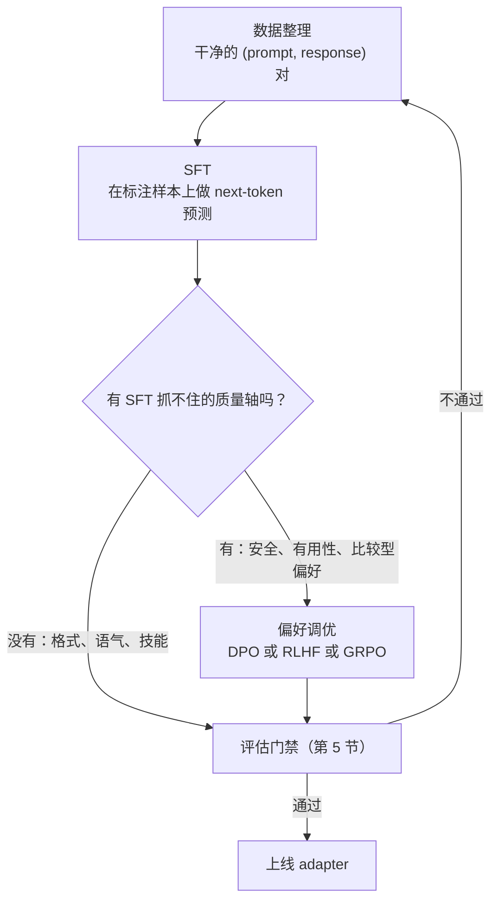
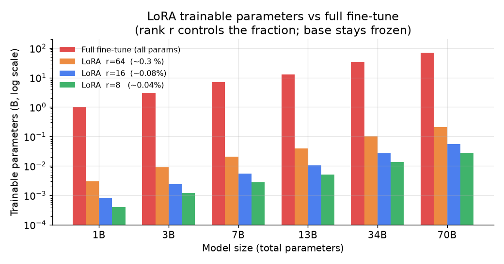
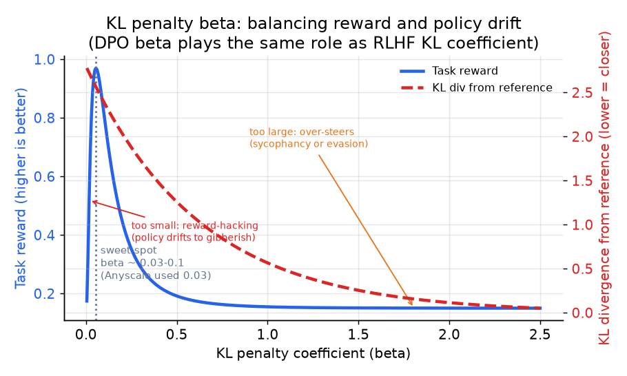
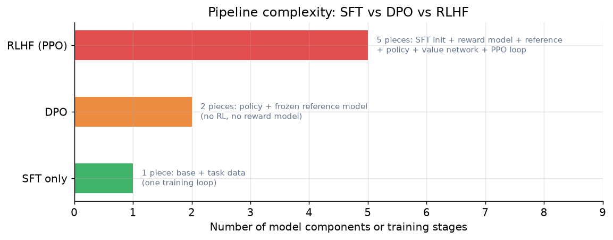

# 4. 方法

## 从 SFT 到偏好调优的流水线



**它是怎么运转的。**训练从整理好的 (prompt, response) 对开始，先跑 SFT，也就是在这些标注样本上做普通的
next-token 预测，通常这也是唯一需要的步骤。分岔点在于目标质量轴是不是 SFT 能直接教会的：
格式、语气和技能都能从样本里学到，所以这些情况直接进评估门禁。而那些依赖比较两条候选回复的轴，
安全、有用性和其他比较型偏好，没法表达成一个唯一的标准答案，所以要先经过一个偏好调优阶段
（DPO、RLHF 或 GRPO）再到门禁。评估门禁（第 5 节讲）是唯一的裁决者：通过就把训好的 adapter 推上线，
不通过就回到数据整理，而不是回到更多训练，因为门禁没过的常规解法是更好或更干净的数据，
而不是在同一份数据上再跑一个 epoch。这个循环把一件事说明白了：后训练是迭代的，
数据质量而不是方法选择才是主导杠杆。

## 监督微调（SFT）

SFT 就是在 `(prompt, ideal response)` 对上做普通的 next-token 预测。把想要的输入和输出展示给模型，
在回复 token 上最小化负对数似然：

$$L_{\text{SFT}} = -\frac{1}{T}\sum_{t=1}^{T} \log p_\theta\!\left(y_t \,\middle|\, x,\, y_{\lt t}\right)$$

其中 $x$ 是 prompt，$y_1, \ldots, y_T$ 是理想回复，$\theta$ 是模型参数。
损失只在回复 token 上计算，prompt token 被 mask 掉。

SFT 是主力，通常也是唯一需要的训练步骤。它直接教格式、语气和任务相关的行为。要点名的两种失败模式：

**灾难性遗忘。**在一个窄集合上训过头会损伤通用能力。学习率保持温和（常见在 2e-5 到 1e-4 之间），
epoch 少（一到三个），如果在意广度就混入一小部分通用数据。LoRA adapter 天然更能避免这个问题，
因为基座权重是冻结的。

**评估污染。**训练样本和评估集有重叠，指标就会虚高。每次都要去污染，不是只做一次。

## 参数高效微调：LoRA 和 QLoRA

全量微调更新模型里的每一个权重。对一个 7B 或 70B 参数的模型来说，这意味着优化器状态
（Adam 通常要存两份梯度大小的量）、激活值，以及每个任务一份全尺寸的新 checkpoint。你很少真的需要它。

**LoRA（low-rank adaptation）**冻结基座权重，为每个目标权重矩阵学习一小对低秩矩阵：

$$W = W_0 + \frac{\alpha}{r}\, B A,\qquad B \in \mathbb{R}^{d \times r},\ A \in \mathbb{R}^{r \times k},\ r \ll \min(d, k)$$

$W_0$ 冻结；只有 $B$ 和 $A$ 参与训练。可训练参数从 $dk$ 降到 $r(d + k)$。
在一个 7B 模型的 attention 和 FFN 投影上取 $r = 16$，大约是总参数量的 0.08%，
而在大多数行为和格式类任务上，任务质量和全量微调几乎分不出来。

作为一个层，它就是一个冻结的 `nn.Linear`，在输出上加了一条可训练的低秩旁路，
$B$ 初始化为零，所以训练一开始恰好就是基座模型：

```python
class LoRALinear(nn.Module):
    def __init__(self, base: nn.Linear, r=16, alpha=16):
        super().__init__()
        self.base = base.requires_grad_(False)          # W0 frozen
        d, k = base.out_features, base.in_features
        self.A = nn.Parameter(torch.randn(r, k) * 0.01) # down-project k -> r
        self.B = nn.Parameter(torch.zeros(d, r))        # up-project r -> d, starts at 0
        self.scale = alpha / r
    def forward(self, x):
        return self.base(x) + self.scale * (x @ self.A.T @ self.B.T)
```

因为 $B$ 从零开始，旁路在第一步不贡献任何东西，所以 adapter 只可能在冻结基座的基础上变好，
初始化时绝不会把它弄坏。服务时 $\frac{\alpha}{r}BA$ 可以折叠回 $W_0$，推理开销为零（第 6 节讲）。

**QLoRA** 把冻结的基座量化到 4-bit，大幅削减显存占用，然后在上面用 BFloat16 训练 LoRA adapter。
大致的显存预算是：

$$M \approx \underbrace{4\text{-bit}\cdot N_{\text{base}}}_{\approx 0.5\ \text{byte/param, frozen}} \;+\; \underbrace{16\text{-bit}\cdot 2\,r(d+k)\,L}_{\text{trainable adapter, tiny}}$$

正是它让你能在一张普通 GPU 上微调 7B（或更大）的模型。Mercari 用 QLoRA 在一张 A100 上微调了一个 2B 模型，
在他们的任务上打败了 GPT-3.5，推理成本大约低 14 倍。



*三种 rank 的 LoRA 与全量微调的可训练参数量（对数刻度），模型规模从 1B 到 70B。
LoRA r=16 只训练大约 0.08% 的权重；QLoRA 能把整个冻结基座加 adapter 塞进一张 GPU。*

什么时候全量微调才说得过去？数据集很大、相对基座的行为偏移很大，或者高 rank 的 LoRA adapter
仍然漂出分布之外（Anyscale 在他们的 DPO 任务上恰好碰到了这个）。对于标准的"把基座模型适配到我们的领域"这类题，
LoRA 或 QLoRA 几乎总是正确答案，把这一点直白地说出来，就是资深工程师的回答。

## 偏好优化：DPO、RLHF 和 GRPO

SFT 教模型模仿好答案。它教不了模型在两个可接受的答案之间*偏向*一个，教不了它避开一种诱人但错误的风格，
也教不了它在两条回复都说得通时选更安全的那条。这些是偏好训练做的事，靠的是在比较上训练，而不是在模仿上训练。

### DPO（direct preference optimization）

DPO 完全跳过了独立的奖励模型和 RL 循环。它直接在 `(prompt, chosen response, rejected response)`
三元组上用一个分类式的损失优化策略：

$$\mathcal{L}_{\text{DPO}} = -\mathbb{E}_{(x,\, y_w,\, y_l)} \!\left[\log \sigma\!\left(\beta \log \frac{\pi_\theta(y_w \mid x)}{\pi_{\text{ref}}(y_w \mid x)} - \beta \log \frac{\pi_\theta(y_l \mid x)}{\pi_{\text{ref}}(y_l \mid x)}\right)\right]$$

$y_w$ 是 chosen（胜出）回复；$y_l$ 是 rejected（落败）回复；$\pi_{\text{ref}}$ 是冻结的参考模型
（SFT checkpoint）；$\beta$ 是 KL 惩罚系数，控制策略最多能离参考模型多远。
小的 $\beta$（Anyscale 用了 0.03）能让策略贴近参考、保持稳定。

参考模型是承重的那一块。没有它，策略可以坍缩成某种退化文本，让 $y_w$ 拿到任意高的对数概率，
从而轻松地让 $y_w$ 的分数高过 $y_l$。$\pi_{\text{ref}}$ 这个锚就是用来防止这一点的。

损失本身只有几行：取 chosen 和 rejected 回复在策略和冻结参考下的序列对数概率，
然后对它们的差做一个 log-sigmoid。

```python
import torch.nn.functional as F
# each arg: summed log-prob of that response under that model, shape (batch,)
def dpo_loss(pol_chosen, pol_rejected, ref_chosen, ref_rejected, beta=0.1):
    pol_logratio = pol_chosen - pol_rejected   # how much the policy prefers chosen
    ref_logratio = ref_chosen - ref_rejected   # the reference's built-in preference
    return -F.logsigmoid(beta * (pol_logratio - ref_logratio)).mean()
```

**资深工程师会盯的边界情况：DPO 可能把 chosen 的概率压低。**这个损失只约束 chosen 和 rejected
对数比之间的*间隔*，不单独约束任何一项，所以梯度下降可以靠把 rejected 的对数概率压得比 chosen 更快来满足它，
同时把首选回复的绝对对数概率也一起拖下去。这种似然位移（Razin 等人 2024 年研究过）表现为
chosen 的 reward 曲线在训练损失持续改善的同时反而下降，最糟的情况下，概率质量跑到了第三条意料之外的回复上，
而不是跑到 $y_w$ 上。当 chosen 和 rejected 文本几乎重复、共享大部分 token 时问题最严重，
因为它们的梯度大部分相互抵消，只剩下那一点小差别可以用来引导。标准的补救是 DPO-Positive
（Pal 等人，2024），它加了一项来惩罚 chosen 的对数概率跌破参考模型，这样间隔是靠把 rejected 压下去拉开的，
而不是靠牺牲你真正想要的那条回复。

### RLHF（reinforcement learning from human feedback）

RLHF 先在人类偏好比较上训练一个独立的奖励模型 $r_\phi$，然后用强化学习（常见是 PPO）
在 KL 惩罚的约束下针对这个奖励优化策略：

$$\max_{\pi_\theta}\;\mathbb{E}_{x,\, y \sim \pi_\theta}\!\left[r_\phi(x, y)\right] - \beta\;\text{KL}\!\left[\pi_\theta(y \mid x)\;\Vert\;\pi_{\text{ref}}(y \mid x)\right]$$

KL 项和 DPO 里的 $\beta$ 扮演同样的锚定角色：去掉它，策略就会把 $r_\phi$ 黑掉，产出退化的输出。
当你需要一个可复用的奖励信号时，RLHF 更强大，但它是一条复杂的多模型流水线
（SFT 模型、奖励模型、参考模型、价值网络、策略），比 DPO 更难稳住。

### GRPO（group relative policy optimization）

GRPO 用在 DeepSeek R1 及其变体里，它通过在同一个 prompt 采样出的一*组*回复内部计算优势，
省掉了价值网络。对每个查询 $q$ 的一组 $G$ 个输出 $\{o_1, \ldots, o_G\}$，组内归一化的优势是：

$$\hat{A}_i = \frac{r_i - \text{mean}(r_{1:G})}{\text{std}(r_{1:G})}$$

训练目标是最大化新旧策略之间裁剪过的比值，用这些优势加权，再减去同样的针对参考模型的 KL 惩罚：

$$\mathcal{L}_{\text{GRPO}} = -\mathbb{E}\!\left[\sum_{i=1}^{G} \min\!\left(\frac{\pi_\theta(o_i \mid q)}{\pi_{\text{old}}(o_i \mid q)}\hat{A}_i,\; \text{clip}\!\left(\cdot,\, 1-\epsilon,\, 1+\epsilon\right)\hat{A}_i\right) - \beta\;\text{KL}[\pi_\theta \Vert \pi_{\text{ref}}]\right]$$

它的吸引力在于不需要学一个价值函数：组均值就充当基线。当你能对每个 prompt 跑模型很多次，
并用一个可验证的奖励（数学正确性、代码测试通过等）给输出打分时，GRPO 表现很好。
对于没有这种真值信号的开放式生成，它就不那么合适。

### 三种方法里共同的 KL 缰绳

三种方法背后是同一个张力：你想把策略推向更好的行为，但不能让它漂得太远，
以至于丢掉基础能力或者退化成靠奖励作弊的胡言乱语。$\beta$ 系数（或等价的 KL 系数）就是那根缰绳。



*示意图：任务奖励在 beta 约 0.03 到 0.1 附近达到峰值，然后随着缰绳把策略拉回 SFT 参考而下降。
beta 太小，策略靠奖励作弊退化成垃圾文本；太大，则过度转向谄媚或回避。
DPO 的 beta 和 RLHF 的 KL 系数扮演完全相同的锚定角色。*



*DPO 训练两个模型（策略 + 冻结参考），没有 RL 循环。RLHF 需要五个组件。
DPO 的简单，正是需要偏好调优时它常被当作首选的原因。*

### 对比：DPO 和 RLHF

两者都是偏好对齐：同样的人类比较数据，同样的目标（把策略推向偏好的行为），
同样一根拴在冻结参考模型上的 KL 缰绳。常见的误解是把 DPO 当成"更便宜的 RLHF"。
两者的机制差别在于奖励住在哪里，以及策略从什么数据里学。

| 维度 | DPO | RLHF（PPO） |
|---|---|---|
| 训练信号 | 人类偏好对 (chosen, rejected) | 同样的人类偏好对 |
| 抗漂移的锚 | 对冻结参考的 KL，通过闭式损失里的 beta 表达 | 对冻结参考的 KL，作为显式的惩罚项 |
| 奖励模型 | 隐式：策略相对参考的对数比就是奖励 | 显式的 $r_\phi$，在 RL 步骤之前单独训练 |
| 策略从什么数据里学 | 离线：只有固定的标注对，重新加权 | 在线：从当前策略新采样的样本，由 $r_\phi$ 打分 |
| 训练时驻留的模型数 | 2（策略 + 参考） | 4 到 5（策略、参考、奖励模型、价值网络） |
| 奖励的可复用性 | 无：偏好信号烤进了损失里 | 奖励模型是独立产物，可复用于数据过滤、拒绝采样和以后的训练 |

当策略必须远离标注对所在的位置时，这个差别会改变设计：RLHF 的奖励模型给策略自己的新样本打分，
所以训练信号会跟着策略一起移动，而 DPO 只能给固定的对重新加权。长周期的对齐战役和想要可复用奖励基础设施的团队偏爱 RLHF，
一次性的偏好微调偏爱 DPO。

## 什么时候用哪个

| 选择 | 时机 | 而不是 |
|---|---|---|
| 只做 SFT | 格式、语气或技能差距，有干净的标注样本；行为稳定 | 偏好调优，对一个 SFT 已经解决的问题只是增加成本 |
| LoRA adapter（r=8 到 64） | 小到中等的行为偏移；多个租户共享一个基座；快速回滚很重要 | 全量微调，成本更高，还堵死了热切换 adapter 的路 |
| QLoRA | 和 LoRA 一样，但冻结的基座必须塞进一张消费级 GPU | 16-bit 全量权重，显存预算装不下 |
| 全量微调 | 数据集大、行为偏移大，或者 LoRA 漂出了分布 | 随意拉高 LoRA rank，这很少能修好 OOD 的结果 |
| DPO | SFT 抓不住的偏好轴；不想要独立的奖励模型；简单稳定的流水线 | 完整的 RLHF，当 (chosen, rejected) 上的分类式损失已经够用时 |
| RLHF | 需要可复用的奖励信号，或者需要通过学到的奖励模型做更精细的控制 | DPO，当你不需要在线 RL 或独立奖励模型时 |
| GRPO | 存在可验证的奖励（数学、代码、检索排名）；没有价值函数可用 | RLHF，当奖励没法对每个样本便宜地验证时 |
| 小 beta（0.03 到 0.1） | 第一次跑；稳定性优先；Anyscale 和 Spotify 都用了这个区间 | 大 beta，会把策略过度拉回 SFT 参考 |

**出处。**LoRA 来自 Microsoft（2021），QLoRA 来自 University of Washington（2023）。
RLHF 由 OpenAI 的 InstructGPT（2022）推广开来，其 RL 步骤用的是 PPO（OpenAI，2017）；
DPO 来自 Stanford（2023），是免奖励模型的替代方案；GRPO 来自 DeepSeek（2024），
是面向可验证奖励、免价值函数的变体。

**每种方法的工具。**Hugging Face TRL 通过 SFTTrainer、DPOTrainer 和 GRPOTrainer 实现了 SFT、DPO 和 GRPO，
PEFT 提供 LoRA 和 QLoRA adapter（QLoRA 是 PEFT 搭配 bitsandbytes 的 4-bit 量化）。
Axolotl 和 Unsloth 把同一套 TRL 加 PEFT 栈包在声明式配置后面，Unsloth 专注于单 GPU 的速度和显存。
大规模的全量微调和 RLHF 依赖 DeepSpeed（Microsoft）的 ZeRO 在多张 GPU 之间切分优化器状态和梯度。
带可验证奖励的 GRPO 用的还是 TRL 的 GRPOTrainer，再加一个你自己写的代码或数学检查打分函数。

**一个完整的例子。**一个领域 LLM 团队要把 7B 基座适配到他们的文档风格，手上有几千条干净的样本对，
没有空闲的 GPU 集群，所以他们选 QLoRA 而不是全量微调，因为冻结的 4-bit 基座加一个 rank 16 的 adapter
能塞进一张消费级 GPU，而且行为偏移是中等的。既然差距在格式和语气、样本又稳定，他们就停在 SFT，
跳过偏好调优，后者只会给一个 SFT 已经解决的问题增加成本。后来他们发现模型有时会挑一个自信但错误的说法，
而不是更稳妥的那个，这是 SFT 表达不了的比较型偏好，于是加了 DPO，beta 取 0.05 左右的小值，
而不是把整套 RLHF 流水线立起来，因为在 chosen 和 rejected 对上的分类式损失就够了，不需要独立的奖励模型。
只有当奖励能对每个样本便宜地验证时，他们才会升级到 GRPO，而对开放式的语气来说，做不到这一点。

> **打开图看看。**LoRA 只适配这些堆栈里很小的一部分，而"很小的一部分"在看到真实维度之前都是抽象的。
> attention 的 query、key、value、output 投影，加上 FFN 的 up 和 down 矩阵，就是学到的低秩更新所在的位置；
> 其余全部冻结。打开
> [Llama-3 8B 实时图](https://www.neurarch.com/?import=https://raw.githubusercontent.com/neurarch-ai/awesome-llm-model-zoo/main/architectures/llama3-8b/model.json)，
> 找到这些权重矩阵，看看一个 adapter 实际上只动了网络的多小一块。所有参考图都在
> [Model Zoo](https://github.com/neurarch-ai/awesome-llm-model-zoo)。

## 实现与训练中的坑

大多数微调失败并不稀奇，就是那么几个反复出现的问题。第一个诊断手段永远是损失曲线，所以要学会读它。


*一次训练会呈现的四种形态。健康：训练和验证损失一起下降并保持接近。过拟合：验证损失触底后回升，
训练损失却还在降，那就在转折点停下（早停）。学习率太高：损失震荡或上升而不是收敛，
那就降低学习率或加 warmup。欠拟合：损失一直高而平，说明模型、数据或学习率太小。示意曲线。*

| 问题 | 症状 | 修法 |
|---|---|---|
| 学习率太高 | 损失尖峰、震荡或发散（上图左下） | 降 LR，加线性 warmup，梯度裁剪到 norm 1.0 |
| 小 SFT 集上过拟合 | 训练损失持续下降，验证损失上升 | 在验证损失最低点早停，减少 epoch（1 到 3），加留出评估集 |
| 损失看着正常，模型却变差了 | 损失很低但评估退步 | 检查训练/评估污染，以及训练和服务之间的格式漂移 |
| 灾难性遗忘 | 微调后的模型丢了通用能力 | 混入一部分通用数据，优先用 LoRA 而不是全量微调，降 LR |
| DPO 奖励作弊 / 退化 | 输出变短或重复，奖励上升但质量下降 | 提高 beta（让策略贴近参考），限制长度，重新检查偏好数据 |
| DPO/RLHF 不稳定 | 奖励或 KL 在训练中途爆掉 | 更小的 LR，更大的 beta 或 KL 系数，确认参考模型是冻结的 |
| chat 模板不匹配 | 模型忽略 system prompt 或把对话轮次解析错 | 训练和服务用一模一样的 chat 模板；钉死它 |
| QLoRA 显存不足 | 加载时或第一步就 OOM | NF4 的 4-bit 基座，梯度 checkpointing，更小的 batch 配合梯度累积 |

贯穿始终的一条线：一次只改一样东西，损失旁边永远盯着一个留出评估（损失很低而评估在跌是经典陷阱），
并且让训练和服务的格式逐字节一致。
