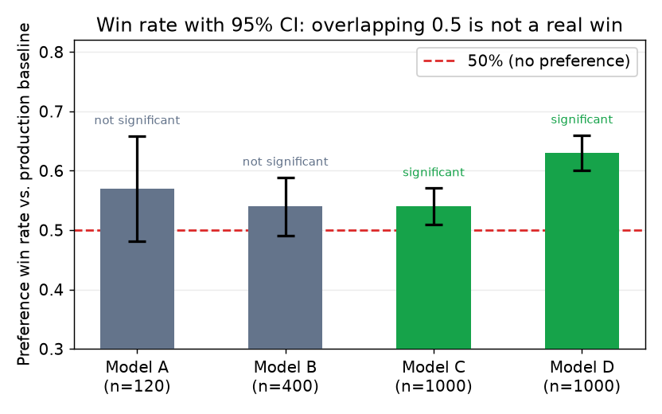

# 5. 评估与门禁

评估门禁是整条流水线的承重结构。候选模型在通过一组针对当前线上模型的检查之前，不会碰到任何用户。
没有门禁，"更新"就会悄悄上线成"更差"。而如果只有绝对指标线、没有跟*当前线上模型*的对比，
一个在次要能力上退步的模型，主指标看上去照样漂亮。

## 必过的几道门禁

**留出集上的任务质量。**在模型训练时从没见过的标注集上测主指标（exact match、BLEU、
任务相关的准确率、LLM-as-judge 打分）。这个集合必须：

- **按时间切分，或者从训练数据里随机留出**，而不是训练完之后再从同一个池子里捞。
- **做过去污染**：确认它和训练样本没有交集。在小评估集上，一条重叠样本就能把指标抬高到让人吃惊的程度。
- **大到足以测出你在乎的效果量**：如果一个点的准确率提升就是上线门槛，
  那样本量必须多到能在统计意义上把这一个点识别出来。

这道门禁里用到的几个主指标，各自度量的东西并不一样。

**Exact match** 只有在预测的归一化形式和归一化后的真值完全相等时才算对（转小写、去标点和空白），
否则就算错。输入是一条 prompt，输出是一个预测字符串，得分是整个集合上完全正确的比例。
结构化输出用 exact match：抽取标签、分类码、算术答案，这些地方给部分分没有意义。

**BLEU** 度量生成序列和一条或多条参考序列之间的 n-gram 精确率重合度，
再乘上一个惩罚过短输出的 brevity penalty：

$$\text{BLEU} = \text{BP} \cdot \exp\!\left(\sum_{n=1}^{4} \tfrac{1}{4}\log p_n\right), \qquad
\text{BP} = \min\!\left(1,\, \exp\!\left(1 - \frac{|r|}{|c|}\right)\right)$$

其中 $p_n$ 是 $n$ 阶的裁剪 n-gram 精确率（候选中出现在参考里的 n-gram 比例，
且做了截断，同一个参考 n-gram 不会被重复匹配），$|c|$ 是候选序列的 token 长度，$|r|$ 是参考长度。
BLEU 奖励的是照抄 n-gram，对语义正确性给的分不够；它适合翻译，
但用在摘要或指令遵循上时，必须搭配一个语义层面的裁判。

**LLM-as-judge 打分**拿一个能力够强的模型（比如 GPT-4 或校准程度类似的评估器）当自动打分器。
裁判拿到原始 prompt、候选回复，可选地再加一条参考答案，输出一个标量评分（常见是 1 到 10）
或者一个二选一的偏好。上报的指标是整个评估集上的平均分。要定期在随机样本上拿人工标注去校准裁判；
LLM 裁判有系统性的偏好，更长、格式更花的回复会被它打高分。

**相对当前线上模型的回归检查。**新模型必须在*同一个*评估集上打赢当前正在服务用户的模型。
一个把目标指标提了两个点、却把某个次要能力拉低五个点的新模型，应该被门禁拦下。
要跑一整套测试，而不是只跑主任务。

**偏好调优之后的安全与拒答评估。**DPO 和 RLHF 会改变模型愿意说什么，
而这种变化很难只从任务指标上预判出来。偏好调优过的模型可能变得谄媚、闪烁其词，或者过度拒答。
任何对齐步骤之后都要重跑安全评估；不要假设 DPO 之前过了安全评估的模型，DPO 之后还能过。

**没有污染。**在下结论之前，确认评估集和所有训练数据（包括合成扩增出来的那部分）没有交集。
这项检查应该是自动化的、强制的，而不是人工抽查。

## 偏好胜率

有些任务的质量，用比较来判断比用绝对打分容易（写作、摘要、语气对齐），这时候用**成对胜率**：
把两条回复（新模型 vs 当前模型，顺序随机）交给人类或 LLM 裁判，报告新模型被选中的比例：

$$\text{win rate} = \frac{\text{prompts where model A is preferred}}{\text{total evaluated prompts}}$$

报告时带上 95% 置信区间（Wilson 或 Clopper-Pearson）。100 条 prompt 上 0.55 的胜率，
置信区间是压着 0.50 的；同样的胜率放到 1000 条 prompt 上才有统计意义。

胜率高于 50% 说明新模型平均而言更受偏好。门槛定在哪取决于应用场景，
但作为"确实有改进"的最低标准，55% 是个合理的线，70% 及以上就是明显的胜利。
展示顺序要随机化，并且时不时塞进两条一模一样的回复，用来查裁判有没有认真在判。

当裁判是 LLM 时：定期在随机抽样的子集上拿人工标注做校准。LLM 裁判会高估格式和长度，
人类往往更偏爱简洁。一个偏爱长回复的裁判，会给学会了灌水的模型虚高的胜率。

*胜率该怎么读：柱子的高度是新模型胜出的比较占比，误差棒是 95% 置信区间（正态近似）。
置信区间下界越过 0.50（虚线）的柱子才是统计显著的胜利；区间跨过虚线的就不是，
点估计再好看也不算。增大 n 会收窄区间。示意图。*

## 分层评估：速度和覆盖度的取舍

每个训练 checkpoint 都跑完整评估套件，又慢又贵。分层结构让你能快速迭代，
只有在候选模型看起来有戏的时候才付全额成本。

| 层级 | 什么时候跑 | 检查什么 | 成本 |
|---|---|---|---|
| 冒烟集（50 到 200 条） | 每个 checkpoint 之后 | 主任务准确率；抓明显的回归 | 秒级 |
| 核心门禁（1k 到 5k 条） | 候选模型进入晋升考察之前 | 主任务 + 次要任务 + 安全；真正的门槛 | 分钟级 |
| 完整评估（10k 条以上，含线上切片） | 全量上线之前 | 以上全部 + 胜率 + 一小片流量上的线上 A/B | 小时到天级 |

Shopify 第一次做 1% 流量部署时，发现离线 benchmark 分数和线上激活率之间差了 35%。
这里的教训是：离线指标会高估上线准备度，扩大流量之前一定要先过一道线上切片的门禁。

## 什么时候用哪种评估方式

| 选择 | 时机 | 而不是 |
|---|---|---|
| Exact match 或任务准确率 | 输出是结构化的（JSON、代码、属性抽取） | 只用 BLEU 或 LLM 裁判，它们在结构化输出上不够精确 |
| LLM-as-judge 成对胜率 | 输出是自然语言散文，质量是比较出来的 | 绝对 BLEU 值，它对流畅度给分不足，对 n-gram 重合给分过多 |
| 相对当前线上模型的回归检查 | 每一次晋升决策 | 只跟绝对指标线比，会漏掉次要能力的回归 |
| 1% 线上流量切片 | 扩量之前的最后一道晋升门禁 | 只看离线数字，它抓不住生产环境的真实分布 |
| 重跑安全评估 | 任何偏好调优步骤之后 | 假设 DPO 之前的安全评估结论还成立 |
| 按时间切分或随机留出的划分 | 任何离线评估 | 用和训练同一套采样方式切出来的随机划分，会泄漏 |

**每种方式的工具。**结构化的 exact match 和任务准确率测试跑在 lm-evaluation-harness（EleutherAI）上，
它把很多 benchmark 包在同一个 runner 后面。LLM-as-judge 的胜率和 rubric 打分由 Ragas、DeepEval
和 OpenAI Evals 提供，裁判模型通过 API 调用。实验跟踪、以及跟当前线上 checkpoint 的门禁对比，
放在 MLflow 或 Weights and Biases 里，线上流量切片则由 feature flag 和实验平台来决定，
而不是靠某一个库。BLEU 和类似的 n-gram 指标来自 sacrebleu 或 Hugging Face 的 evaluate 包。

**出处。**"任何偏好调优之后重跑安全评估"这一行之所以存在，
是因为偏好调优（RLHF/InstructGPT，OpenAI，2022；DPO，Stanford，2023）可能悄无声息地
把模型从早先那次对齐结果上带偏，所以门禁选择重新测量，而不是假设调优前的结论仍然成立。

**一个完整的例子。**一家做编程助手的公司，只有在新 checkpoint 过了整套测试之后才让它晋升。
因为补全出来的是结构化代码、测试非过即败，他们用 exact match 和单元测试通过率做门禁，
而不是 BLEU 或裁判模型，后两者在结构化输出上不够精确。至于随代码附带的自然语言解释，
质量是比较出来的，所以他们加了一项相对当前线上模型的 LLM-as-judge 成对胜率，
并且带置信区间上报，而不是给一个绝对的 BLEU 分数。每次晋升都会跑相对线上模型的回归检查，
这样一个藏着次要回归的两点提升就会被门禁拦下；只有离线测试全过之后，
他们才开一条 1% 的线上流量切片，因为光靠离线数字抓不住生产环境的分布。
如果这次改动碰了对齐步骤，他们会重跑安全评估，而不是假设之前那次通过还算数。
