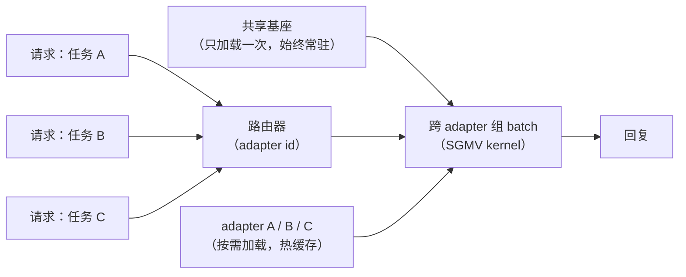

# 6. 服务端的 adapter

## 多 LoRA 服务：一个基座，多个任务

选 LoRA 的回报在服务阶段兑现，而全量微调拿不到这份回报。因为每个任务的 adapter 共享同一个冻结基座，
基座只需要装进显存一次，然后一堆小 adapter 常驻在它旁边。请求进来时路由到对应的 adapter，
跑基座加 adapter。这就是**多 LoRA 服务**。

算笔账：N 个任务或 N 个客户，不再需要 N 份完整模型副本，只要一个基座加 N 个极小的 adapter。
用*不同* adapter 的请求还能凑成一个 batch 打在共享基座上（Punica 的 SGMV kernel 干的正是这件事）。
对比全量微调：每个任务都是一份独立的、好几个 GB 的模型，各自要占显存和服务槽位。
对一个领域很多或者客户很多的产品来说，多 LoRA 就是"付得起"和"付不起"的分界线。

切换 adapter 同时也是你的快速回滚手段和 A/B 机制：上一个新 adapter，把一小片流量路由过去，
要撤就把路由指回原来的。基座完全不用重新部署。Cloudflare 的 Workers AI 就是这么在边缘上跑的：
基座模型始终热在 GPU 上，客户的 LoRA 矩阵按需从对象存储加载，adapter 切换是毫秒级的。

## 数据飞轮

这条流水线是个循环，不是一条直线。生产环境是最富矿的训练数据来源，因为那是真实分布，不是猜出来的分布：

1. 记录生产环境的输入和输出（要有用户同意，要处理好隐私；第一件事就是把 PII 洗掉）。
2. 从里面挖失败案例：点踩、转人工、人工修正、重试、低置信度、命中兜底逻辑。
3. 让人来标注或修正那些难的样本。它们就是金标准 SFT 样本，而"模型输出 vs 人工修正"这些成对数据，
   等于白送的偏好数据。
4. 并进下一个版本的数据集，重新训练。
5. 过门禁，晋升，再来一轮。

这个循环每转一圈，打的都正好是当前模型最弱的地方，所以一个平庸的初版模型配上一个转得很紧的飞轮，
会赢过一个没有反馈通路的优秀初版模型。Shopify 的每周重训周期（两个 H200 节点上跑 12 小时的 FSDP），
在头几圈飞轮里就抹平了合成 benchmark 分数和线上激活率之间那 35 个点的差距。

**模型坍缩的风险。**拿模型自己没经过滤的输出去训练，多样性会随时间越收越窄。
生成器的偏好被不断强化，真实世界里的边角案例逐渐消失。解法是：每一轮训练都保留一块人工标注的核心数据，
让生产数据先过一个校准过的裁判，把低质量样本隔离掉，并且每个数据集固定留一定比例是人写的。

## 瓶颈

| 瓶颈 | 最早的征兆 | 修法 | 代价 |
|---|---|---|---|
| 数据质量 | 数据加了，评估门禁通过率反而在跌 | 整理、去重、去污染；样本少一点但好一点 | 标注成本 |
| 训练显存或成本 | 微调时 OOM；迭代很慢 | LoRA 或 QLoRA；把冻结基座量化 | 在偏移非常大的场景下，相比全量微调有轻微精度损失 |
| 灾难性遗忘 | 目标任务变好，次要指标退步 | 减少 epoch（1 到 3）；温和的 LR；混入通用数据；改用 LoRA adapter | 该任务需要更长的调优时间或更多数据 |
| 评估门禁太慢 | 候选模型排队；迭代节奏掉下来 | 分层评估：每个 checkpoint 跑冒烟集，晋升前跑完整门禁 | 冒烟集可能漏掉回归 |
| 领域变体太多 | N 个完整模型，N 个服务槽位，N 份显存预算 | 多 LoRA：一个热基座加 N 个小 adapter | adapter rank 上限和 SGMV kernel 的约束 |
| 权重里的知识过期 | 调进去的事实过时，每周都得重训 | 把事实挪到检索里（RAG）；只调行为 | 多了一条检索通路 |
| 飞轮漂移或模型坍缩 | 多样性变窄；长尾案例消失 | 保留人工标注的核心数据；隔离未过滤的合成数据 | 每一轮都有标注开销 |
| 无声的晋升回归 | "更好"的模型在次要任务上上线成了更差 | 相对当前线上模型做回归检查（而不是只比绝对指标线） | 每个候选模型要跑更大的评估套件 |

**细节。**训练显存那一行靠的是 LoRA（Microsoft，2021）和 QLoRA（University of Washington，2023）：
LoRA 冻结基座，只在投影矩阵上学一个 rank-r 的更新，所以优化器状态里只存这一小份 delta；
QLoRA 更进一步，把冻结基座以 4-bit NF4 保存，于是一张消费级 GPU 就够了。
多 LoRA 服务那一行让一个热基座常驻，按请求切换 adapter，所以 N 个租户的成本是一个基座加 N 个小 adapter 张量，
而不是 N 份完整 checkpoint；此时吞吐取决于能不能用分组 GEMM（SGMV）kernel 把不同 adapter 的请求批在一起，
而代价那一列里的 rank 上限，限制的正是有多少个不同 rank 的 adapter 能共享一个 batch。
知识过期那一行把事实路由到检索（RAG，Meta FAIR，2020），
这样行为调优和知识新鲜度就按两套各自独立的时钟来演进。
