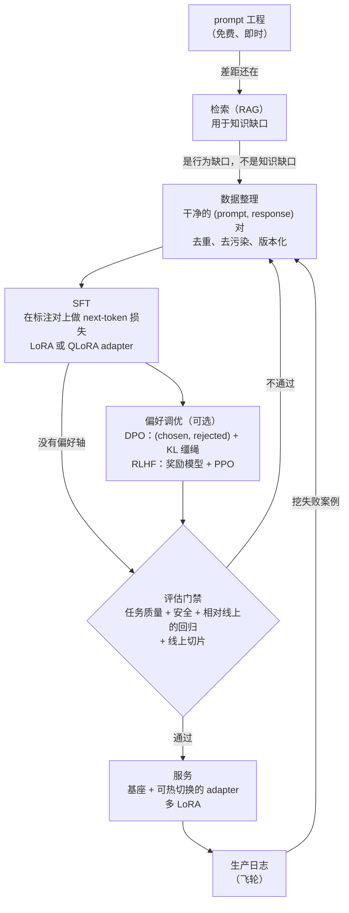

# 9. 小结

## 一页纸回顾

- **微调是最后一根杠杆，不是第一根。**按顺序走这个阶梯：prompt 工程、检索（RAG）、
  监督微调（SFT）、偏好调优。在第一个能过质量线的台阶上停下。
  面试里最强的回答，会先论证不该先微调，然后照样把流水线设计出来。
- **问题类型决定用什么工具。**知识缺口要的是检索，不是训练（烤进权重的事实会过期，还会编造）。
  行为、格式和技能上的缺口才要微调。两者可以组合：在同一个基座上，调风格，检索事实。
- **数据质量压倒数据量。**几千条整理过的样本胜过几万条噪声样本。去重、平衡、去污染、做版本。
  你给模型看什么它就模仿什么，包括里面的错误。
- **LoRA 和 QLoRA 是默认选项。**冻结基座，训一个极小的低秩 adapter，一个基座挂很多 adapter。
  QLoRA 能把一个几十亿参数的模型连同它的 adapter 塞进单张 GPU。
  只有在行为偏移很大、或者 LoRA 漂出分布的时候，全量微调才说得过去。
- **先 DPO 再考虑 RLHF。**如果（在 SFT 之后）确实需要偏好调优，从 DPO 开始：
  没有独立的奖励模型，没有 RL 循环，一个冻结的参考模型，一个分类式的损失。
  beta 是那根 KL 缰绳，往哪个方向调错，模型不是奖励作弊就是被带偏。
  完整的 RLHF 留给那些需要可复用奖励信号或者更精细控制的场景。
- **评估门禁是晋升的唯一裁决者。**候选模型必须在留出的、去过污染的集合上打赢当前线上模型，
  通过安全评估，并且在一小片线上流量上活下来，才能碰到用户。
  离线指标会高估上线准备度，这道门禁不是可选项。
- **多 LoRA 服务是服务端的终局。**一个热基座，很多小 adapter，毫秒级切换。
  这笔账只有在基座冻结时才算得过来；全量微调每个任务产出一份全新的完整模型，等于把这条路堵死。
- **飞轮才是会复利的优势。**挖生产环境的失败案例，把难的标出来，并进下一版数据集，过门禁，晋升，再来一轮。
  一个转得紧的循环配上平庸的初版模型，会赢过一个没有反馈通路的优秀初版模型。

## 一页纸看完整个系统

## 自测

答案是折叠起来的。每题先自己答一遍再打开。

1. 基座模型写出来的语气不符合你们的品牌调性。走一遍阶梯：第一步、第二步、第三步分别试什么，
   什么情况下会让你在微调之前就停下来？

   

答案

   **第一步，prompt 工程**：重写 system prompt，加上目标语气的 few-shot 样例，钉死输出 schema。
   它免费、迭代即时，而且它就是那条基线，没有它你没法声称训练带来了任何改进。
   **第二步，分清是知识问题还是行为问题**，对语气来说这一步直接排除了 RAG 那一级：
   检索教的是模型不知道的东西，而这个模型本来就懂这个领域，
   所以真正的下一级是**在 LoRA 或 QLoRA adapter 上做监督微调**，
   数据是几千条整理过的 (prompt, ideal response) 对。
   **第三步，用 DPO 做偏好调优**，而且只在残留的失败模式属于"说得通但更差"时才做
   （某个诱人的措辞，SFT 那种只有正面样本的训练排除不掉它）。
   什么时候在微调之前就停下：调好的 prompt 已经过了质量线；
   你手上没有干净的标注样本，也没有拿到它们的路径；
   或者想要的行为变动太频繁，烤进权重就成了一台跑步机。
   阶梯和它的停止规则在[第 2 节](02-decide-prompt-rag-or-train.md)；
   产出这个诊断的圈定问题在[第 1 节](01-clarifying-requirements.md)。

   

2. LoRA 的 rank $r$ 到底控制什么，为什么提高它并不总能补平质量差距？什么时候该改用全量微调？

   

答案

   rank 决定的是**权重更新被允许张成多少个独立方向**：LoRA 冻结 $W_0$ 只学 $BA$，
   所以每个被适配矩阵的可训练参数从 $dk$ 降到 $r(d+k)$。
   在一个 7B 模型的 attention 和 FFN 投影上取 $r = 16$，大约是权重的 0.08%，
   一份大约 12 MB 的 bf16 产物，而在大多数格式和语气类任务上，它和全量微调几乎分不出来。
   提高 $r$ 并不总能补平差距，因为 rank 是**对子空间的硬上限，不是一个调努力程度的旋钮**：
   一次大的行为偏移会把能量摊到很多方向上，尾巴衰减得很慢，
   所以每多加一阶 rank 只买到下一个很小的增量，而那条尾巴始终够不到，
   于是 adapter 找对了方向却达不到正确的幅度。
   症状是损失收敛了，但下游准确率卡在平台上不动，或者 token 的对数似然漂出了分布，
   Anyscale 在他们的 DPO 任务上取 $r = 64$ 时碰到的正是这个。
   什么时候改用全量微调：数据集很大、相对基座的行为偏移很大，或者高 rank 的 adapter 仍然漂出分布。
   这个切换的代价是实打实的：每个任务一份好几个 GB 的全新 checkpoint，
   还有可热切换的多 LoRA 服务从此没了（[第 4 节](04-methods.md)、[第 6 节](06-serving-adapters.md)）。

   

3. DPO 和 RLHF 都用了参考模型和 KL 惩罚。这个参考模型起什么作用，去掉 KL 项会发生什么？

   

答案

   冻结的参考模型 $\pi_{\text{ref}}$（通常就是 SFT checkpoint）
   是**让偏好目标有意义的那个锚**。DPO 的损失只约束 chosen 和 rejected 对数比之间的*间隔*，
   RLHF 的 PPO 步骤也只是最大化一个学出来的奖励，
   所以两种情况下策略都可以靠坍缩成某种恰好得分很高的退化文本来满足目标。
   $\beta$ 系数就是缰绳的长度：两种方法里它是同一个 KL 惩罚，
   在 DPO 的损失里以闭式表达，在 RLHF 的目标里是一个显式项。
   去掉它，策略就会**靠奖励作弊**：输出变短、重复或者谄媚，训练奖励却一路上涨，
   因为任何能把间隔拉大的模式都算改进，哪怕没有一个标注员比较过它。
   把它设得太大，那就是多记了一堆账、重跑了一遍 SFT。
   本章给出的可用区间大致是 0.03 到 0.1，Anyscale 用 0.03，Spotify 也在同一区间。
   还有一个值得点名的相关边界情况：即便有缰绳，
   DPO 仍然可能把 chosen 回复的绝对对数概率拖下去（似然位移），
   这正是 DPO-Positive 要解决的问题（[第 4 节](04-methods.md)、[第 8 节](08-interview-qa.md)）。

   

4. 一个候选模型在离线评估集上比当前线上模型高三个点。它可以上线了吗？扩量之前你还会检查什么？

   

答案

   不能。单个主指标的胜出是门禁里最弱的信号，而离线数字会系统性地高估上线准备度。
   还要检查的东西，按顺序：**评估集有没有去过污染**，
   跟所有训练来源（包括合成扩增的部分）没有交集，而且是针对这一次训练重新查过的，
   不是建数据集时查过一次就算；
   **在同一个集合上跑相对当前线上模型的整套回归测试**，
   因为一个主指标涨两点、次要能力掉五点的模型应该被拦下；
   **统计显著性**，因为 100 条 prompt 上 0.55 的胜率置信区间压着 0.50，
   而同样的胜率放到 1000 条 prompt 上就不压了，
   所以要报 95% 区间，并且按你在乎的效果量来定样本规模；
   如果流程里有任何偏好调优步骤，**重跑安全和拒答评估**，
   因为 DPO 和 RLHF 改变模型愿意说什么的方式，任务指标看不见；
   最后，扩量之前先开**1% 的线上流量切片**。
   Shopify 正是在这第一片切片上发现离线 benchmark 和线上激活率差了 35 个点，
   这是最经典的提醒：离线门禁量错的是人群，不是模型（[第 5 节](05-evaluation-and-gates.md)）。

   

5. 你要服务十个领域变体，每个都需要不同的微调行为。应该跑十次独立微调、维护十份模型副本吗？
   替代方案是什么，它需要什么前提？

   

答案

   不应该。十次全量微调意味着十份好几个 GB 的 checkpoint、十个服务槽位、十份显存预算，
   这正是瓶颈表里那一行"领域变体太多"说的失败。
   替代方案是**多 LoRA 服务**：一个冻结基座只加载一次并保持常驻，
   十个小 adapter 挂在它旁边，再加一个按请求挑 adapter 的路由器。
   它需要四个前提。十个变体必须共享**同一个冻结基座**，而这恰恰是全量微调扔掉的东西。
   adapter 必须落在服务栈的 **rank 上限**之内（Cloudflare 把客户 adapter 限制在 rank 8 和 100 MB）。
   你需要一个 **分组 GEMM kernel**，比如 Punica SGMV，
   这样用不同 adapter 的请求才能批在同一个共享基座上，
   因为贵的那些矩阵乘在各个 adapter 之间是一样的，不同的只是一条又瘦又低秩的旁路。
   而且每个行为偏移都得真的能被一个低秩更新装下；
   一个在高 rank 下仍然漂出分布的变体需要全量微调，也就退出了共享基座这笔账。
   除了成本之外的回报是运维上的：晋升、A/B 和回滚全都变成改一条路由，基座不用重新部署
   （[第 6 节](06-serving-adapters.md)、[第 7 节](07-how-teams-do-it-in-production.md)）。

   

6. 一个每周重训的飞轮把生产日志喂回训练。时间一长会出什么问题，有哪些防护措施？

   

答案

   最主要的风险是**模型坍缩**：拿模型自己没经过滤的输出去训练，多样性一轮比一轮窄，
   生成器的偏好自我强化，真实的长尾案例逐渐消失。还有两个失败模式伴随着它。
   **裁判循环论证**，LLM 裁判给模型自己生成的东西打分，你最后优化的是裁判而不是真实质量。
   以及**缓慢渗入的污染**，回收来的生产数据悄悄和评估集重叠，
   门禁开始度量的是记忆，此后每一次晋升决策都建立在谎言上。
   防护措施是具体的：每一轮训练都保留一块**人工标注的核心数据**，并固定留一定比例是人写的；
   让生产数据先过一个**会隔离低质量样本的、校准过的裁判**；
   定期在留出样本上，拿人工标注和一个真实的产品信号（Shopify 用的是线上激活率）重新校准这个裁判，
   因为关键就在于那个把它拉回地面的信号必须来自模型-裁判循环之外；
   第一件事就是把 PII 洗掉；**每次训练之前重新查一遍去污染**；
   并且把每个数据集版本命名成 `{task}-{date}-{size}-{split_hash}`，
   这样任何产物都能追溯到它见过的那个确切快照
   （[第 6 节](06-serving-adapters.md)、[第 3 节](03-data-curation.md)）。

   

## 延伸阅读

- 本章的收官：[完整的方案](10-putting-it-together.md)，
  把本章的每一个选择针对那个场景一次性定下来，算清成本，
  在另外两组约束下重搭一遍，最后压缩成一个可运行的单文件偏好调优器。
- 密度更高的参考资料（对比表、全部数学推导、全部案例研究）：
  [topics/05-post-training-pipeline.md](../../topics/05-post-training-pipeline.md)。
- 评估系统的深入讲解：
  [topics/06-evaluation-system.md](../../topics/06-evaluation-system.md)。
- 按公司拆解：
  [tools/teardowns/05.md](../../tools/teardowns/05.md)。
- 微调作用的目标就在 [Model Zoo](https://github.com/neurarch-ai/awesome-llm-model-zoo) 的图里：
  打开 Llama-3 8B 或者 Mistral 7B 的图，找到 attention 投影和 FFN 矩阵，
  一个 LoRA adapter 的低秩更新实际就住在那里。
