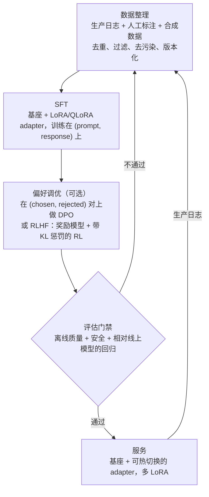

# 微调与后训练

> 本章是英文原版的中文译本，原文见 [book/post-training/](../../book/post-training/)。译文和原文同步维护，发现问题请提 issue。

面试官很少会直接说"设计一个微调系统"。他们会说：**"我们的基座模型在自己领域的任务上不够好，
设计一条流水线把它适配过来，安全地推到生产环境，并且让它持续变好。"**
这就是后训练流水线：一连串的决策、训练步骤、评估门禁和服务端选择，
把一个通用基座模型变成一个可靠、成本可控的领域专家。本章从头到尾把它搭一遍，
并且展示 Grammarly、Anyscale、Shopify、Mercari、Grab、LinkedIn、Cloudflare 和 Spotify
实际是怎么上线的。

面试里最强的回答，会先花一分钟论证"现在大概率还*不该*微调"，然后照样把流水线设计出来。
听到第一句话就伸手去跑训练的候选人，会把整场面试带偏。

## 各节内容

1. [澄清需求](01-clarifying-requirements.md)：一段对话把问题圈定下来，并点出两个直接后果。
2. [决策：prompt、RAG 还是训练](02-decide-prompt-rag-or-train.md)：按成本排序的决策阶梯，每一级的输入和输出。
3. [数据整理](03-data-curation.md)：SFT 数据质量、偏好对，以及为什么质量比数量重要。
4. [方法](04-methods.md)：SFT、LoRA/QLoRA、DPO、RLHF、GRPO；用 KaTeX 写出的损失函数；一张"什么时候用哪个"的表。
5. [评估与门禁](05-evaluation-and-gates.md)：候选模型触达用户之前必须通过的门禁；偏好胜率。
6. [服务端的 adapter](06-serving-adapters.md)：多 LoRA 服务、数据飞轮，以及瓶颈表。
7. [真实团队在生产环境里怎么做](07-how-teams-do-it-in-production.md)：各家公司在哪些地方分道扬镳，附一手资料。
8. [面试问答](08-interview-qa.md)：常问的、有陷阱的、常答错的问题，附清晰的答案。
9. [小结](09-summary.md)：一页纸回顾、mermaid 图和自测。
10. [把它们拼起来：完整的方案](10-putting-it-together.md)：一套默认技术栈，把场景从头到尾搭起来并算清数据和训练的账，同一套配方在三种不同约束下怎么变，以及一个最小可运行的偏好调优器。

## 一页纸看完整个系统

第一次读请按顺序来，各节层层递进。每一节都从面试官真正会问的那个问题开始，然后给出回答。
