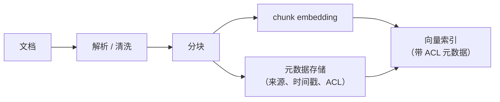
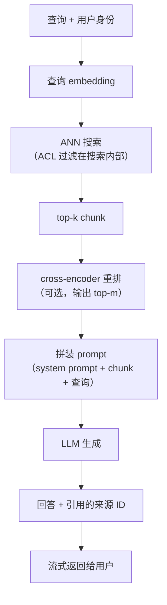

# 2. 搭出系统骨架

## 输入和输出

系统的输入是**一条自然语言查询，加上提问用户的身份**，输出是**一段有依据的自然语言回答，
附带引用的来源 ID**；如果检索结果太弱、撑不起一个有把握的回答，就明确拒答。

用户身份要贯穿整条流水线，因为 ACL 的执行是检索阶段的约束，不是后处理步骤。

## 两条路径：严格分开

RAG 有一条离线（写）路径和一条在线（读）路径。把它们分开是最关键的架构承诺：
离线路径为每次文档变更付一次昂贵的 embedding 成本；在线路径每个请求只付一次查询 embedding
加一次快速的索引查找。

### 写路径（离线）

文档从知识库进来，要么走批量导入，要么走由变更驱动的新鲜度循环。
每篇文档经过解析、分块、embedding，然后带着元数据（ACL、来源 URL、时间戳）upsert 进向量索引。

文档更新时只对变更的那一篇重新分块、重新 embedding，再把新 chunk upsert 进索引
（按文档 ID 删掉旧的）。正是这一点让"一小时内新鲜"不需要全量重建就能做到。

### 读路径（在线）

查询进来，先做 embedding，然后带着 ACL 过滤条件去索引里比对。取到的 top-k chunk 可以选做重排，
再和原始查询、来源 ID 一起拼成 prompt，送给 LLM 生成。回答以流式返回，带内联引用。

## 先检索再生成：两个阶段之间的契约

两个阶段的任务不同，成本结构也不同。

**检索**便宜，优化目标是召回。它在几十毫秒内跑完。它的失败模式是漏掉相关 chunk（假阴性），
因为一个从未被检索到的 chunk，下游任何阶段都无法找回。

**生成**昂贵，优化目标是在检索给定的材料上把回答做好。它的失败模式是：检索到的上下文太弱或者根本没有时，产生幻觉。

两者之间的契约很简单：检索必须把相关 chunk 送进上下文窗口；生成不得编造上下文之外的事实。
回答错了的时候，永远先问"相关 chunk 检索到了吗？"，再问"生成器是不是弱了？"。

## 为什么这个骨架在面试里很重要

画一个写着"RAG"的方框就往下走的候选人，等于什么都没说。
把写路径和读路径分开、指出 ACL 约束是检索问题而不是后处理问题、
并点明检索召回是质量上限的候选人，还没碰任何一个组件，就已经答完了这道题最难的部分。

## 对比：RAG 与长上下文硬塞

两种做法在最后一步解决的是同一个问题，方式也一样：把相关文档放进 prompt，让模型根据它们回答，
而不是根据自己的权重。容易混淆的地方在于，把百万 token 的上下文窗口当成检索的替代品。
两者的机制差别在于：谁来挑选证据，以及成本什么时候付。

| 维度 | RAG | 长上下文硬塞 |
|---|---|---|
| 证据最终在哪 | 在 prompt 里，以检索到的 chunk 形式 | 在 prompt 里，以原始文档形式 |
| grounding 的故事 | 一样：模型根据给定文本回答，并能引用 | 一样：模型根据给定文本回答，并能引用 |
| 谁挑选相关证据 | 检索栈，在 LLM 看到任何东西之前 | 模型的注意力，在生成过程中 |
| 挑选的成本什么时候付 | 主要在建索引时，摊到所有查询上 | 每次查询都付，表现为对整个塞进去的上下文做 prefill 计算 |
| 扩展行为 | 语料增长时单次查询成本大致不变 | 单次查询的成本和延迟随塞进去的所有内容一起增长 |
| 失败模式 | 相关 chunk 从未被检索到（可度量的召回缺失） | 相关片段在场，却淹没在干扰内容里（注意力缺失，任何检索指标都看不见） |

差别在语料规模和查询量上会改变设计：只读一次的几篇文档，硬塞更简单，整条索引流水线都可以省掉；
但语料一旦超出窗口，或者同一份语料要服务大量查询，挑选证据这件事就必须从模型里挪出来，
放进一个只付一次成本的索引。

## RAG 范式阶梯

朴素的"embed、检索 top-k、塞进 prompt"是最底层的一级。它到顶之后（检索到错误的 chunk、多跳问题、语料噪声大），
团队会沿着一条范式阶梯往上爬。能叫出每一级的名字，并且知道它各自修的是哪种失败，是很强的资深级信号。

| 范式 | 比朴素 RAG 多了什么 | 什么时候用 |
|---|---|---|
| 朴素 RAG | embed、检索 top-k、生成 | 语料干净、问题是单一事实 |
| 进阶 RAG | 检索前（查询改写 / 扩展）加检索后（重排、压缩） | 检索的召回或精度是瓶颈 |
| 模块化 RAG | 可插拔的模块（路由、记忆、融合），按查询组合 | 不同类型的查询需要不同的流水线 |
| Self-RAG | 模型输出反思 token，自己决定何时检索、某段落是否相关且有支撑 | 希望模型只在需要时检索，并自查 grounding |
| Corrective RAG（CRAG） | 一个轻量的检索评估器给命中结果打分；低置信度触发兜底搜索 | 语料参差不齐，错误检索必须在生成之前被拦下 |
| GraphRAG | 由 LLM 构建的实体图加社区摘要，作为上下文 | 全语料层面的理解，以及扁平向量搜索漏掉的多跳问题 |
| Agentic RAG | 检索变成 agent 循环调用的工具，反复改写查询、反复检索 | 需要迭代检索的复杂多步问题 |

**出处。** 朴素、进阶、模块化这套划分来自 RAG 综述（Gao et al., 2023）。
Self-RAG 的反思 token 做法来自 Asai et al.（华盛顿大学和 Allen AI，2023）；
Corrective RAG（CRAG）来自 Yan et al.（2024）；GraphRAG 来自 Microsoft Research（2024）。
Agentic RAG 是由 [agent 循环](../agents/)驱动检索的模式，比如 Uber 的客服聊天机器人就部署了它（第 7 节）。

只爬到失败模式要求的那一级就够了：阶梯上每高一级都多加延迟、成本和活动部件，
所以一个干净的单一事实 FAQ 应该留在底部，而一个噪声大的多跳知识库才配得上图或 agent 那几级。
