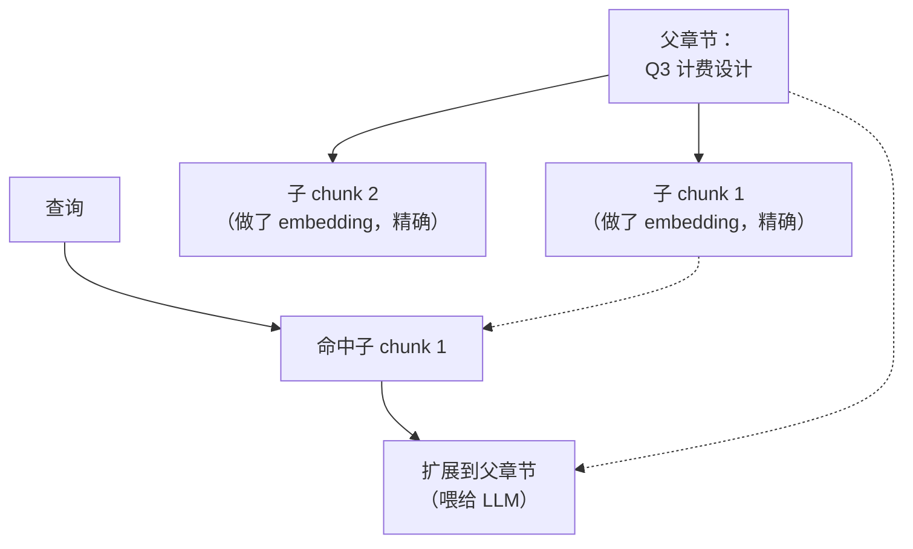
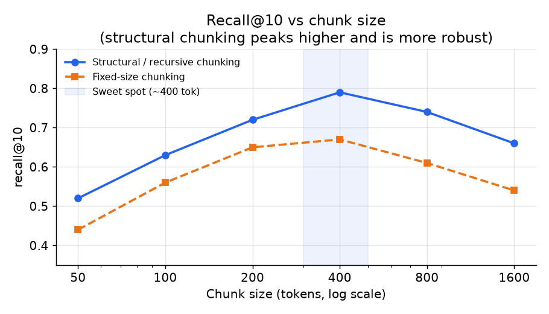
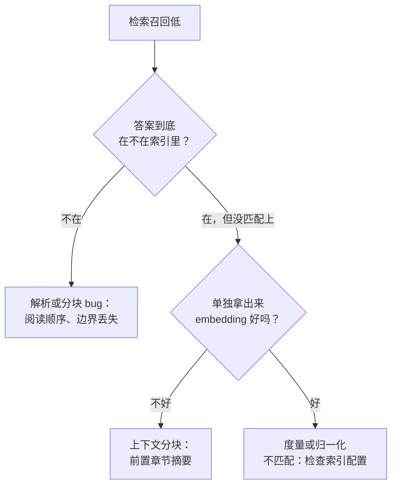

# 3. 索引与分块

## 解析：从原始文件到干净文本（分块之前）

分块默认你手里已经是干净的文本，但真实语料到手时是 PDF、HTML、扫描图片、幻灯片和电子表格。
解析（把这些原始文件变成忠实的文本）是一个不起眼的阶段，却决定了后面所有环节的上限：
抽取出来的是垃圾，再好的 embedding 模型或重排器也修不回来。反复出现的坑：

- **阅读顺序。** 多栏 PDF 和报纸如果从上往下读，各栏会交错在一起；解析器必须还原真实的阅读顺序，
  否则文本就成了乱码。
- **表格。** 表格被压平成一串数字之后，行列含义就没了，针对某个单元格的问题永远答不上来。
  要保留表格结构（用 markdown 或 HTML），不要压平。
- **模板内容。** 页眉、页脚、页码、导航栏会污染每一个 chunk；不剥掉的话它们会主导 embedding。
- **扫描文档。** 纯图片的 PDF 得先做 OCR（光学字符识别，把文字像素变成字符），上面那些才谈得上。

**工具。** 版面感知的 PDF 解析可以用 PyMuPDF、pdfplumber、Unstructured、Docling 这类库；
表格抽取用 Camelot 或者一个视觉模型；OCR 用 Tesseract 或云端的文档 AI 服务。
实际的规则是：在这里认真投入精力，因为生产环境里大多数 RAG 失败，答案根本就不可能被检索到，
它早在解析时就被弄坏了。

## 分块是一个真正的设计决策

朴素的固定大小分块（比如每 512 个 token 切一刀）会从句子中间、表格中间、代码块中间切开。
切出来的 chunk 语义不完整，embedding 效果差，靠它生成的回答在边界处经常出错。
分块不是可以往后推的细节；它是杠杆最大的两个地方之一（另一个是重排的难度）。

选项按复杂程度递增：

**递归结构化分块。** 先按文档结构切：标题、段落、代码块、表格边界。然后再限制大小。
尊重结构的 chunk embedding 更好，回答也更精确。对于 wiki、设计文档、工单混在一起的异构语料，
这是推荐的默认做法。

**重叠窗口。** 滑动窗口，重叠部分占 chunk 大小的 10% 到 15%，这样跨越边界的答案至少能完整地落在一个 chunk 里。
重叠会按重叠比例撑大索引，所以要设上限。

**上下文分块。** 在每个 chunk 做 embedding 之前，前面加一句机器生成的父文档或父章节摘要：
"这段来自 Q3 计费设计文档的退款章节。"一个含有代词和指代（"这个系统"、"上面的设计"）的独立 chunk，
脱离上下文被检索出来时，意思就丢了。

**父子检索。** 对小 chunk（一两段）做 embedding 以求精度，但在读取时把检索到的 chunk 扩展到它所在的整个章节，
以获得更丰富的上下文。这把检索单元和上下文单元分开了。



*小的子 chunk 靠精度赢得匹配，但 LLM 读的是整个父章节：检索和上下文是两个不同的单元。*



*结构化 / 递归分块的 recall@10 峰值比固定大小分块更高，对 chunk 大小也更不敏感；
固定大小分块更敏感，峰值更低。结构化分块的最佳点在 400 token 左右。示意图。*

一篇长度为 $L$ 个 token 的文档，chunk 大小 $s$、重叠 $o$，会产生多少个 chunk，公式是：

$$n_{\text{chunks}} = \left\lceil \frac{L}{s - o} \right\rceil$$

5,000 万篇平均 300 token 的文档，取 $s = 400$、$o = 50$，索引大约有 4,000 万到 5,000 万个 chunk。
维度乘以四字节再乘以 chunk 数量，就直接定下了索引的内存预算。

产生这些 chunk 的"固定大小加重叠"切分器，就是一个按净步长 $s - o$ 前进的滑动窗口：

```python
def chunk_with_overlap(tokens, size, overlap):   # tokens: list of token ids; size, overlap in tokens
    step = size - overlap                          # net advance per chunk; must be > 0
    # slide a window of `size` forward by `step`, so consecutive chunks share `overlap` tokens
    chunks = [tokens[i:i + size] for i in range(0, len(tokens), step)]
    return chunks
# chunk count matches ceil(L / (s - o)); chunk_with_overlap(list(range(10)), 4, 1) -> 4 chunks (ceil(10/3))
```

**分块策略：什么时候用哪个。**

| 选用 | 什么时候 | 而不是 |
|---|---|---|
| 递归结构化分块 | 文档带有标题、表格或代码块，固定窗口会把它们切开 | 固定大小分块，它会破坏结构、污染 chunk 的 embedding |
| 重叠窗口 | 答案经常横跨 chunk 边界（长篇文字） | 短 chunk 配高重叠，索引膨胀而收益很小 |
| 上下文分块（前置摘要） | chunk 单独拿出来会丢意思（代词指代、章节标题） | 光秃秃的 chunk，在原文里 embedding 得很好，单独检索却很差 |
| 延迟分块（整篇文档做 embedding，再按 chunk 池化） | 希望每个 chunk 的 embedding 携带文档级上下文，又不想每个 chunk 都调一次 LLM | 上下文分块，当每 chunk 的 LLM 成本太高时；但它需要一个长上下文的 embedding 模型 |
| 父子检索 | 检索要高精度，生成时又要更丰富的上下文 | 强迫一个 chunk 同时扮演两个角色，顾此失彼 |
| 固定大小加重叠（基线） | 简单的无结构文本语料、快速原型 | 文档有清晰章节可以利用时，应该用结构化分块 |

**近期方法（2024）。** 2024 年有两个技术从相反的两端攻克"chunk 丢失文档上下文"这个问题。
**Contextual Retrieval**（Anthropic，2024，见第 7 节）在每个 chunk 做 embedding 之前，
前置一句由 LLM 生成的上下文句子。**延迟分块（late chunking）**（Jina AI，2024）则反过来，
先用长上下文 embedding 模型跑完整篇文档，再对每个 chunk 跨度内的 token embedding 做平均池化，
这样每个 chunk 向量天然携带全局上下文，不需要按 chunk 调用 LLM。
Contextual Retrieval 单个 chunk 的效果更强，但每个 chunk 要付一次 LLM 调用；
延迟分块便宜得多，但需要一个长上下文的 embedding 模型。

## 标签从哪来

RAG 系统的训练和评估都依赖相关性标签：哪个 chunk 真正回答了某个查询，以及有依据的回答是否忠实于材料。
每一个 embedding 模型、重排器和检索评估都依赖这些标签，而每一种标签来源都带着不同的偏差。

| 来源 | 给你什么 | 偏差 / 成本 |
| --- | --- | --- |
| 隐式生产信号（点击的结果、用户保留的引用、点赞点踩、下游任务的成功） | 直接来自真实使用、数量充足的"查询到 chunk"相关性信号 | 受当前检索器和自选用户的偏差影响；只能看到系统已经展示过的 chunk 的相关性 |
| 人工标注 / 专家标签（查询与文档的相关性判断、黄金答案集、忠实度标签） | 质量高；是检索和 grounding 评估的锚点 | 量少、贵、慢；标注者对"部分相关"看法不一，需要清晰的标注规范和仲裁 |
| 合成 / 模型生成（用自己的语料让 LLM 生成问答对、难负例挖掘） | 不用等流量就能规模化拿到带标签的样本对和难负例 | 会传播生成器的偏差，有裁判循环论证的风险，所以在用它训练或评估任何东西之前，必须过同样的质量和去重关卡 |

支配这三者的规则只有一条：检索评估集（它的查询和标注答案）绝不能漏进训练数据，
也不能漏进系统在线检索的索引，否则召回率和忠实度测的是记忆，不是真实的检索质量。
把评估查询挡在索引外面。

## Embedding 服务

每一个 chunk 和每一条查询都要经过一个**文本 embedding 模型**：一个 transformer encoder，
把变长文本映射成固定维度的稠密向量。这里的关键决策：

**模型选择。** Embedding 维度从 384（MiniLM-L6）到 1536（OpenAI text-embedding-3-large）不等。
维度越大召回略有提升，但索引内存和搜索时间会直接成倍增长。
5,000 万 chunk 的语料，768 维 float32 向量，量化之前的原始向量存储就要 150 GB 左右。
领域微调过的模型（法律、金融、代码）即使更小，也常常胜过通用模型。

在 Model Zoo 里打开经过验证的 MiniLM-L6 encoder 图，看看句子编码器如何把隐状态池化成单个向量，
以及 embedding 维度如何贯穿整个网络：
[在线打开 MiniLM-L6](https://www.neurarch.com/?import=https://raw.githubusercontent.com/neurarch-ai/awesome-llm-model-zoo/main/architectures/all-minilm-l6/model.json)。


*MiniLM-L6：6 层 encoder，池化输出 384 维。这里的 embedding 维度决定了每个 chunk 的索引内存预算。
完整的 embedding 模型目录见 [Model Zoo](https://github.com/neurarch-ai/awesome-llm-model-zoo)。*

**它是一个独立的服务。** Embedding 模型既跑在写路径上（导入时批量 embedding 几百万个 chunk），
也跑在读路径上（每个请求一条查询，对延迟敏感）。两者的批处理需求和 SLA 都不一样。
把它们分开，独立自动扩缩容。

**缓存查询 embedding。** 内部查询重复率很高。按归一化后的查询字符串做 key 的缓存，
能以很低的基础设施成本省掉相当一部分 embedding 延迟和计算。

## 向量索引

在 5,000 万个 chunk 上做精确最近邻搜索，对 1.5 秒的首 token 预算来说太慢了。
要用**近似最近邻（ANN）** 索引（不扫描每个向量，用一点精度换取巨大的加速）。

**HNSW（Hierarchical Navigable Small World）。** 基于图的索引（向量是节点，连向各自的最近邻，
搜索时贪心地在图上游走），召回和延迟都很出色。内存占用更高：每个向量除了原始向量，
还要保存一份图邻居列表。语料稳定时效果很好。

**IVF-PQ（倒排文件加乘积量化）。** 把向量聚成 $n_{\text{list}}$ 个桶（倒排文件），
再用乘积量化压缩每个向量。内存占用低得多（二值量化可以低到 1/32），代价是损失一些召回。
当 5,000 万个向量放不进 HNSW 所需的内存时，这是正确的选择。

**ACL 过滤必须在搜索内部进行，不能放在之后。** 把按用户的权限过滤条件推进 ANN 查询本身，
返回的结果就已经是授权过的。对 top-k 做后过滤，在用户可见集合很小时会把结果清空，
还可能通过拒答泄露文档的存在。

## 新鲜度

新鲜度要求（一小时）意味着新 chunk 必须能 upsert 进在线索引，而不是全量重建。
收到文档变更事件（webhook 或轮询）后：

1. 解析并分块变更的文档。
2. 对新 chunk 做 embedding。
3. 按文档 ID 从索引中删掉旧 chunk。
4. 插入新 chunk。

增量 upsert 增加了写路径的复杂度，但对于变动频繁的内部知识库，这是避免过期回答的唯一办法。
对已删除文档立即打墓碑（tombstone），可以防止检索到失效的内容。

## 实现和训练中的坑

大多数 RAG 质量 bug 不是模型 bug，而是索引 bug：它们让正确答案早在重排器或 LLM 看到之前就变得不可检索。
写路径上反复出现的失败：

| 问题 | 症状 | 修法 |
|---|---|---|
| chunk 边界丢失 | 答案被切到两个 chunk 里，每个匹配都不完整，LLM 要么含糊其辞要么答错 | 按标题和段落做递归结构化分块，再加一个小的重叠窗口，让跨边界的答案至少在一个 chunk 里保持完整 |
| 阅读顺序错乱 | 多栏 PDF 和表格检索出来是乱码，永远匹配不上任何查询 | 分块之前用版面感知的解析还原真实阅读顺序，并保留表格结构 |
| 模板内容污染 | 跑题的 chunk 排名很高，因为页眉、页脚和导航栏主导了 embedding | 解析时剥掉模板内容，让 embedding 只反映正文 |
| 独立 chunk 丢上下文 | 满是代词（"这个系统"、"上面的"）的 chunk 在原文里 embedding 很好，单独检索却很差 | embedding 之前给每个 chunk 前置一段简短的章节或文档摘要（上下文分块） |
| embedding 与索引的度量不匹配 | 换索引或换模型之后召回悄无声息地崩掉 | 让索引的距离度量和 embedding 的训练目标一致，用余弦时对向量做 L2 归一化 |
| 换模型后维度不匹配 | 切换 embedding 模型后 upsert 失败，或者新向量搜不到 | 给索引打版本号，换 embedding 模型就全量重建索引；一个索引里绝不混用不同维度 |
| 编辑后索引过期 | 用户得到的回答来自已删除或已被替代的文档 | 按文档 ID upsert，并立即给旧 chunk 打墓碑，让失效内容无法被检索 |
| 重叠膨胀 | 近似重复的 chunk 占满 top-k，索引内存暴涨 | 重叠上限设在 10% 到 15%，读取时对重叠的相邻 chunk 去重 |



先修写路径：解析弄坏、分块切成两半的答案，再好的 embedding 模型或重排器也找不回来。
