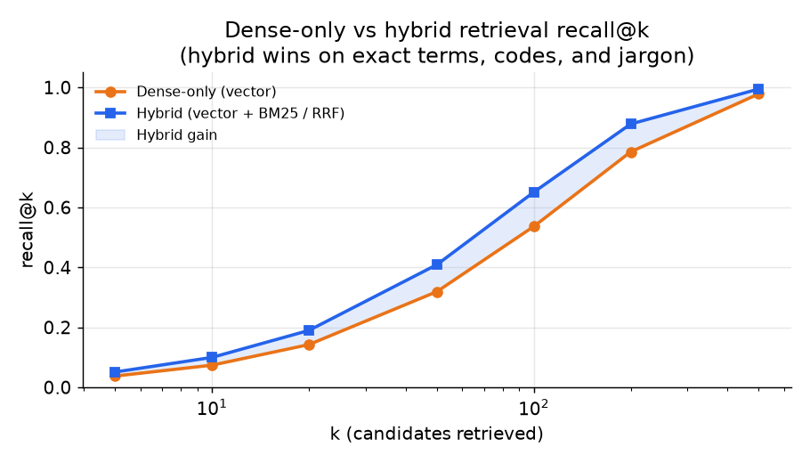
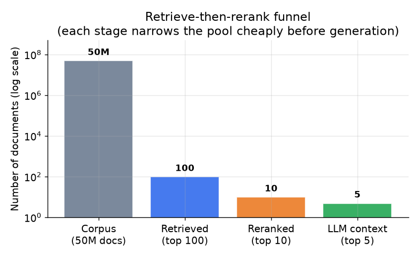

# 4. 检索与重排

## 稠密检索：基线

**稠密检索**把查询 embedding 到和索引 chunk 相同的向量空间里，然后按余弦或点积相似度做近似最近邻搜索，
找出最接近的 chunk。

$$\text{sim}(q, d) = \frac{\langle e_q, e_d \rangle}{\|e_q\| \cdot \|e_d\|}$$

其中 $e_q$ 和 $e_d$ 分别是查询和文档 chunk 的 embedding。按这个分数取 top-k（得分最高的 k 个 chunk），
就是送往下游的候选。

```python
import numpy as np
def cosine_sim(e_q, e_d):              # e_q, e_d: 1-D embedding vectors (query, doc chunk)
    e_q, e_d = np.asarray(e_q, float), np.asarray(e_d, float)
    # dot product divided by the product of the two vector lengths (L2 norms)
    return float(e_q @ e_d / (np.linalg.norm(e_q) * np.linalg.norm(e_d)))
# cosine_sim([1, 0, 1], [1, 0, 0]) -> 0.7071067811865475
```

稠密检索抓的是语义相似，对改写很鲁棒："how do I reset my password"这条查询能召回标题为
"Account credential recovery"的 chunk，即使这些词从来没一起出现过。它的弱点在精确词项上：
产品代号、生僻行话、版本号、专有名词，embedding 模型见得不够多，没法把它们和变体在向量空间里放到一起。

## 稀疏检索：BM25 补上稠密漏掉的

**BM25** 是经典的词频打分函数，奖励包含查询原始 token 的 chunk，并按这些 token 在语料中的稀有程度加权
（逆文档频率，idf：只出现在少数文档里的词比常见词权重更高）。

"incident-2847"或"gophermod v3.1.2"这类字符串，如果在 embedding 模型的预训练数据里很少见，
稠密检索就会漏掉。BM25 一抓一个准。对于满是工单 ID、系统名和内部代号的内部知识库，
词法检索（按字面精确匹配，而非按语义）填补的是一个真实存在的缺口。

打分把 idf、一个会饱和的词频项和一个长度归一化项结合起来，所以重复出现有帮助但收益递减，
长文档也不能光靠篇幅取胜：

```python
import math
def bm25_score(query_terms, doc_terms, corpus, k1=1.5, b=0.75):
    N = len(corpus)                                   # number of docs in the corpus
    avgdl = sum(len(d) for d in corpus) / N           # average document length
    score = 0.0
    for t in query_terms:
        n_t = sum(1 for d in corpus if t in d)        # docs containing term t
        idf = math.log((N - n_t + 0.5) / (n_t + 0.5) + 1)   # rarer term -> higher idf
        tf = doc_terms.count(t)                        # term frequency in this doc
        denom = tf + k1 * (1 - b + b * len(doc_terms) / avgdl)
        score += idf * (tf * (k1 + 1)) / denom
    return score
# bm25_score(["incident"], ["incident", "2847"], [["incident","2847"],["refund","policy"],["login"]]) -> 0.8998433513869051
```

## 混合检索：用 RRF 融合两路信号

**混合检索**（把语义的稠密检索和精确词项的稀疏检索结合起来）并行跑稠密和稀疏两路，再合并它们的排序列表。
标准的融合方法是 **Reciprocal Rank Fusion（RRF）**：

$$\text{RRF}(d) = \sum_{r \in \{\text{bm25},\,\text{vec}\}} \frac{1}{k_{\text{rrf}} + \text{rank}_r(d)}$$

其中 $k_{\text{rrf}}$（通常取 60）用来压低极靠前名次的影响。RRF 不需要在两套系统之间做分数归一化：
它融合的是名次，不是原始分数。在许多语料上的研究一致发现，混合检索比纯稠密检索多出 3 到 5 个百分点的召回，
尤其在 k 较小时。

```python
def rrf(rank_lists, k0=60):        # rank_lists: one ranked list of doc ids per channel
    scores = {}
    for lst in rank_lists:
        for rank, doc in enumerate(lst, start=1):     # rank is 1-based
            scores[doc] = scores.get(doc, 0.0) + 1.0 / (k0 + rank)
    return sorted(scores, key=scores.get, reverse=True)   # fuses ranks, never raw scores
# rrf([["a", "b", "c"], ["a", "c"]]) -> ['a', 'c', 'b']
```



*混合检索（稠密 + BM25）在所有 k 值上都稳定优于纯稠密检索。差距在 k 较小时最大，
此时精确词项匹配对行话密集的内部语料最为关键。示意图。*

## 召回是质量上限

端到端的回答质量受检索召回率（相关 chunk 真正进入 top-k 的比例）限制：

$$Q_{\text{e2e}} \leq \text{recall@}k \times Q_{\text{gen} \mid \text{retrieved}}$$

```python
def recall_at_k(retrieved, relevant, k):   # retrieved: ranked doc ids; relevant: set of gold ids
    top_k = retrieved[:k]                    # keep only the first k retrieved
    hits = sum(1 for d in top_k if d in relevant)
    return hits / len(relevant)              # fraction of gold docs found in the top k
# recall_at_k(["a", "x", "b", "y"], {"a", "b", "c"}, 3) -> 0.6666666666666666
```

正确的 chunk 从来没被检索到，任何生成器都修不了。这个不等式是 RAG 系统设计里最重要的一条事实。
把检索召回和回答质量分开度量。如果召回是瓶颈，先修分块和 embedding 模型，再碰生成器。

## Cross-encoder 重排：精度杠杆

向量搜索优化的是廉价的召回。取回 top-n 候选（n 通常是 50 到 100）之后，
一个 **cross-encoder 重排器**（把查询和一个 chunk 放在一起一次读完、输出一个相关性分数的模型）
对每个（查询，chunk）对联合打分，返回 top-m（m 通常是 5 到 10）。这里的重排就是按这个新分数给候选名单重新排序。
Cross-encoder 同时看到两段文本，所以能捕捉查询和段落之间精确的交互，
而 bi-encoder 的 embedding 模型（分别 embedding 查询和 chunk，再比较两个向量）做不到这一点。

成本和 n 成正比，但每次 cross-encoder 调用大约比一次生成调用便宜 75 倍：

$$C_{\text{rerank}} \approx \frac{1}{75} \cdot C_{\text{gen}}$$

所以重排 50 个候选的花费还不到一次生成调用，而只保留 top 5 又大幅缩短了 prompt，
减轻了"lost in the middle"效应（相关段落明明在上下文里，却因为埋得太深拉低了回答质量）。



*从 5,000 万语料 chunk 到 100 个检索候选，到 10 个重排结果，再到 5 个进入 LLM 上下文的漏斗。
按每篇文档的打分成本算，每一级都比上一级便宜得多。数量为示意。*

**重排器继承了检索器的召回上限。** Cross-encoder 只能给递到手上的 n 个候选重新排序，
所以如果黄金 chunk 从来没进过 top-n 候选名单，再怎么重排也找不回来：
上面的 recall@k 上限，对喂给重排器的候选深度 n 同样严格适用。这让 n 成了一个真正的质量旋钮，
而不是成本细节，也是为什么加深候选集（比如 50 到 100）有时比换一个更强的重排器收益更大。
资深工程师还会留意第二个细节：cross-encoder 的相关性分数不是校准过的概率，
它的尺度在不同查询之间会漂移，所以固定的绝对阈值（"保留 0.5 以上的所有结果"）在某些查询上放进噪声，
在另一些查询上丢掉好 chunk。优先用相对规则（保留 top-m，或者保留和最高分差距在一定范围内的），
而不是全局阈值。

**检索和重排策略：什么时候用哪个。**

| 选用 | 什么时候 | 而不是 |
|---|---|---|
| 纯稠密检索 | 纯语义匹配；查询和文档词汇一致；没有生僻代号 | 混合检索，当语料干净、关键词重叠已经很高时 |
| 向量 + BM25 经 RRF 融合的混合检索 | 语料里有精确 ID、产品代号、行话或版本号，稠密向量会把它们糊掉 | 纯稠密检索，它会漏掉生僻或词表外 token 的字面匹配 |
| 单独 BM25 | 在小型结构化语料（分类体系、代码索引）上做精确匹配搜索 | 稠密检索，当语义变化才是难点时 |
| HNSW 索引 | 语料稳定；内存预算宽裕；每毫秒的最高召回是首要目标 | IVF，当频繁更新或地理式过滤让 HNSW 的重建成本过高时 |
| IVF-PQ 索引 | 5,000 万以上 chunk，索引内存是主要约束 | HNSW，当量化带来的召回损失不可接受且内存充足时 |
| Cross-encoder 重排（NVIDIA、Dropbox） | 第一阶段召回没问题，但 top-5 精度是质量上限 | 把所有 top-n 全部送给 LLM，这会抬高 prompt 成本并埋掉相关段落 |
| 不用重排器 | 首 token 延迟预算很硬，没有余量；第一阶段召回已经很高 | Cross-encoder，当延迟代价比精度收益更重要时 |

**出处。** 稠密检索可以追溯到 DPR（Meta FAIR，2020）；词法一侧是 BM25（Robertson and Walker，1994），
通过 Reciprocal Rank Fusion（Cormack et al., 2009）与稠密分数融合。两种索引分别是 HNSW（Malkov and Yashunin，2016）
和 IVF-PQ（Jegou et al.；Meta 的 FAISS）。Cross-encoder 重排源自 Sentence-BERT（UKP Darmstadt，2019）；
一种 late-interaction 的替代方案是 ColBERT（Stanford，2020），Cohere Rerank（Cohere）则是托管选项。

## 查询变换（检索前）

检索质量既受索引限制，也同样受查询限制。用户的措辞如果和答案的写法对不上，任何重排器都救不回来。
所以在检索之前，团队经常会先改写查询。下面是常见的变换
（给新手的说明：这里的"embedding"指的是查询被转换成的、用于搜索的数值向量）。

| 变换 | 做什么 | 什么时候用 |
|---|---|---|
| 改写 | 清理原始查询、消除歧义（解析"它"指什么，去掉闲聊） | 对话式或杂乱的用户输入 |
| 扩展 | 补上同义词或相关词，让词法和稠密搜索都放宽 | 查询太简短导致召回低 |
| HyDE | 让模型先起草一个假想的答案，再用它做 embedding 去搜索 | 查询和答案用的词汇差别很大 |
| 分解 | 把多部分的问题拆成子查询，分别检索再合并 | 没有任何一个段落能单独回答的多跳问题 |
| Step-back | 先问一个更泛的版本取回背景，再问具体的查询 | 需要先有宏观上下文再看细节的问题 |
| 路由 | 给查询分类，送到正确的索引或工具 | 语料分散在多个来源，各自用不同的检索器 |

**出处。** HyDE（假想文档 embedding）来自 Gao et al.（2022）；step-back prompting 来自 Google DeepMind（2023）。
查询改写、扩展和分解是信息检索的标准技术，移植到了 RAG 上；路由则是模块化 RAG 范式的入口（第 2 节）。

## 最大边际相关性：让候选名单多样化

只按相关性取 top-k，经常会返回近似重复的 chunk（同一段话被复制到多篇文档里），
既浪费上下文窗口预算，又埋掉了回答需要的互补信息。**最大边际相关性（MMR）** 每次挑下一个 chunk 时，
最大化"与查询的相关性*减去*与已选内容的冗余度"，用一点相关性换取覆盖面。

```python
import numpy as np
def mmr(query, docs, k, lam=0.5):
    # query, docs: L2-normalized vectors. lam trades relevance (1.0) vs diversity (0.0).
    sel, cand = [], list(range(len(docs)))
    while cand and len(sel) < k:
        best, best_s = None, -1e9
        for i in cand:
            rel = float(query @ docs[i])                                  # relevance to the query
            red = max((float(docs[i] @ docs[j]) for j in sel), default=0.0)  # redundancy vs picked
            s = lam * rel - (1 - lam) * red
            if s > best_s: best_s, best = s, i
        sel.append(best); cand.remove(best)
    return sel
# with one query-relevant doc and a near-duplicate of it, mmr(lam=0.5) skips the duplicate
# and picks the diverse doc instead; mmr(lam=1.0) reduces to plain top-k by relevance.
```

MMR 由 Carbonell and Goldstein（1998）提出。另一种检索后的处理步骤是**上下文压缩**
（比如 Microsoft 的 LLMLingua），在检索到的段落送到生成器之前，把它们裁剪到只剩真正重要的 token。
